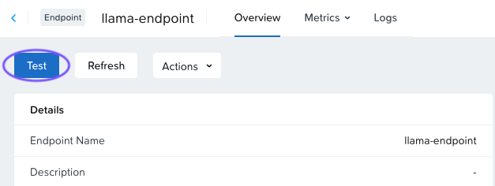
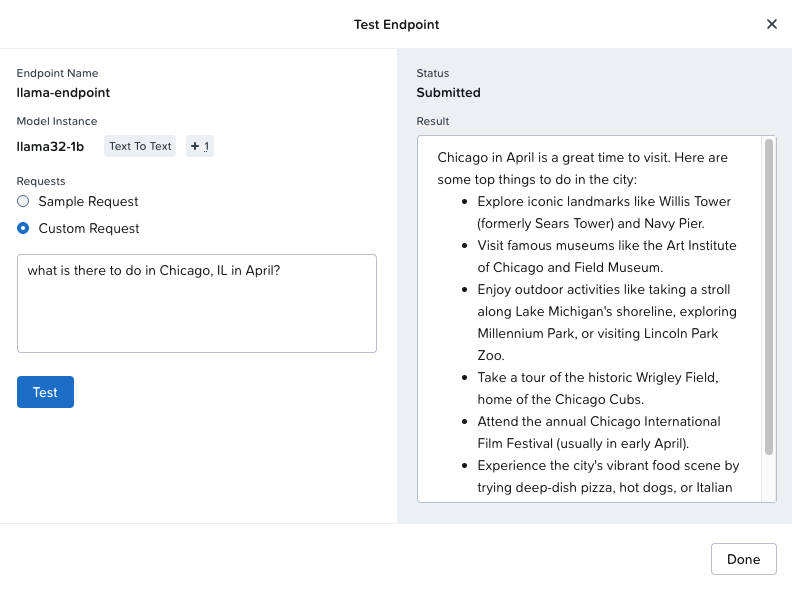

# Test the Endpoint

เมื่อสร้าง endpoint แล้ว IT Admin สามารถทดสอบ endpoint ก่อนส่งมอบให้นักพัฒนาสำหรับสร้างหรือ deploy แอปพลิเคชัน AI ได้

1.  เมื่อ endpoint ของคุณแสดงสถานะ **Active** ให้คลิกชื่อ endpoint เพื่อดู endpoint dashboard
    
2.  คลิกปุ่ม **Test** สีน้ำเงินที่มุมบนซ้าย
    
    
    
3.  ใช้ sample query ตัวใดตัวหนึ่ง หรือสร้าง query เองแบบ custom แล้วคลิก **Test** output จะเริ่มแสดงแบบ streaming อาจใช้เวลาประมาณ 1 นาทีกว่า output จะแสดงครบถ้วน
    
    
    
4.  คลิก **Done**

---

[← Back: Create an Endpoint and API Key](nai-fundamentals-endpoint-create.md) | [Home](nai-welcome.md) | [Next: View The Endpoint Details →](nai-fundamentals-endpoint-view.md)