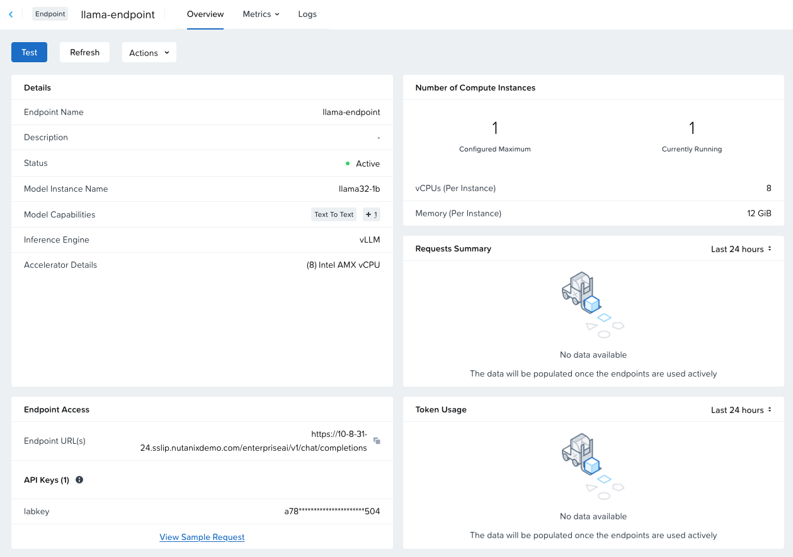
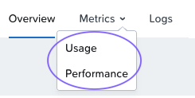
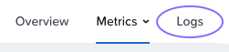
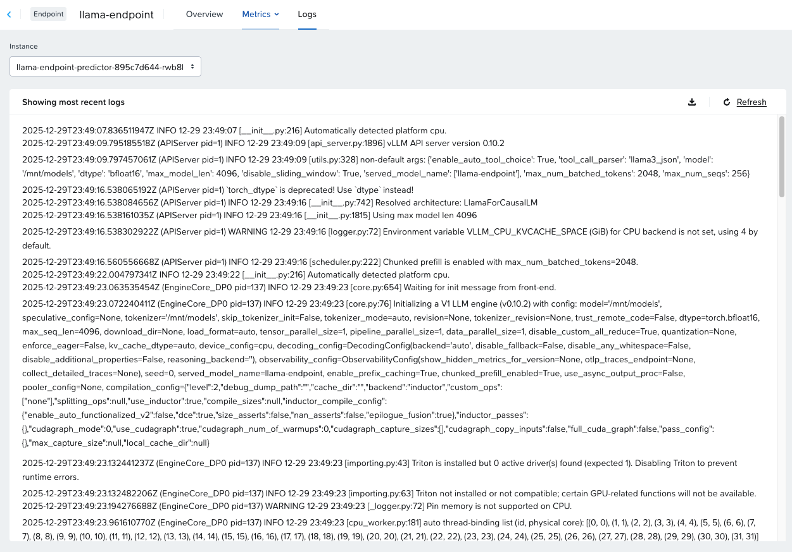

# View the Endpoint Details

Besides enabling you to test the endpoint, the endpoint dashboard also shows useful information about our endpoint, including:

-   Endpoint Details
-   Endpoint URL and API keys
-   Compute instances running
-   API Requests Summary
-   Token Usage

1.  Once the endpoint is actively used, you can also view more detailed metrics on the Metrics pages. Click on **Metrics > Usage** and **Metrics > Performance** to see what types of metrics are available.

    

2.  Click on **Logs** to view the endpoint logs. These are the Kubernetes pod logs, and can help with basic troubleshooting without requiring direct access to the Kubernetes environment.
    
    
    
    