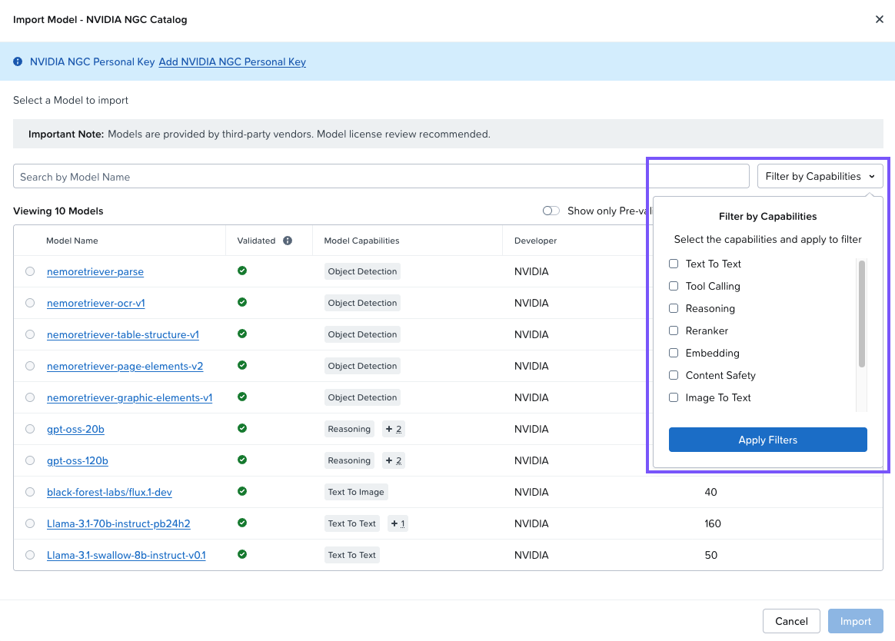
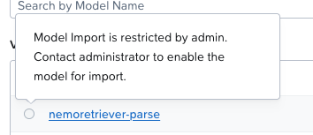
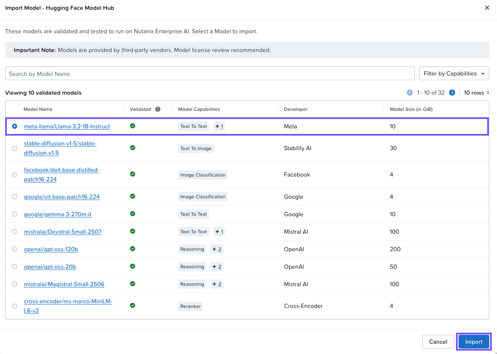
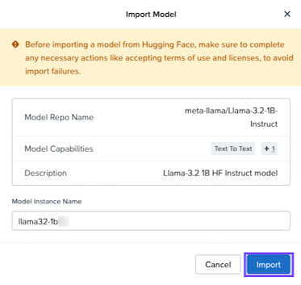
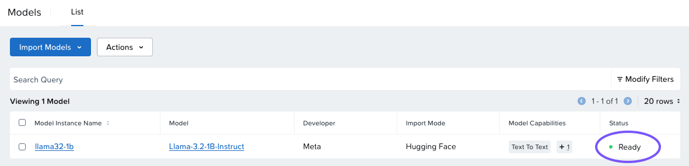

# Import Your First Model

## View Available Models

1.  จาก Nutanix Enterprise AI console คลิก **Models**
    
2.  คลิก **Import from NVIDIA NGC Catalog**
    
    !!! info
    
        Model Import Options
        
        คุณสามารถ import โมเดลได้โดยตรงจาก Hugging Face หรือ NVIDIA NGC Catalog นอกจากนี้ยังสามารถอัปโหลดไฟล์โมเดล custom หรือโมเดลที่ผ่านการ validate แล้วจาก local NFS, SMB หรือ S3 store ได้อีกด้วย
    
3.  ดูรายการและประเภทของโมเดลที่มีให้เลือก คลิก **Filter by Capabilities** เพื่อดูประเภทของโมเดล ใน RAG application ของเราจะใช้ทั้งโมเดล **Text to Text** และ **Embedding**
    
    
    
    !!! tip    

        ประเภทของโมเดลมีคำอธิบายใน [appendix](nai-appendix-typellm.md)
    
4.  Admin user สามารถควบคุมว่าโมเดลใดที่ผู้ใช้สามารถเข้าถึงได้ ลองวางเมาส์เหนือ radio button ตัวใดตัวหนึ่ง จะเห็นว่า admin ได้จำกัดการ import โมเดลบางตัว
    
    
    
5.  คลิก **Cancel**

## Import Hugging Face Model

1.  คลิก **Import from Hugging Face Model Hub**
    
2.  คลิก radio button ข้างๆ `meta-llama/Llama-3.2-1B-Instruct`
    
    !!! note    
        โมเดลนี้สามารถเลือกได้เพราะ admin ได้เปิดการเข้าถึงโมเดลนี้ โปรดทราบว่าคุณไม่สามารถเลือกโมเดลอื่นได้
    
3.  คลิก **Import**
    

1.  ตั้งชื่อโมเดลว่า `llama32-1b##` โดยที่ `##` ตรงกับ username ของคุณ แล้วคลิก **Import**

เนื่องจากโมเดลมีขนาดเล็ก การดาวน์โหลดจึงค่อนข้างรวดเร็ว โมเดลขนาดใหญ่จะใช้เวลาดาวน์โหลดนานกว่า

!!! info
    ขั้นตอนการดาวน์โหลดโมเดล

    -   **Pending** - ตรวจสอบ token และตั้งค่า storage โดยการสร้าง PVC และจัดเตรียม share บน file server (ในกรณีนี้คือ Nutanix Files)
    -   **Processing** - เชื่อมต่อกับ HuggingFace และดาวน์โหลดไฟล์โมเดล
    -   **Ready** - โมเดลพร้อมใช้งาน

เมื่อโมเดลแสดงสถานะ **Ready** แสดงว่าพร้อมใช้งานแล้ว รอจนกว่าโมเดลจะแสดงสถานะ ready ก่อนไปขั้นตอนถัดไป

!!! info
    NAI เชื่อมต่อกับ Nutanix Files อย่างไร?

    เพื่อเปิดใช้งาน persistent storage Nutanix Enterprise AI instance ใช้ storage class ที่กำหนดค่าด้วย Nutanix CSI driver เพื่อเชื่อมต่อกับ Nutanix Files

---

[← Back: Import an LLM](nai-fundamentals-import-llm.md) | [Home](nai-welcome.md) | [Next: Create an Endpoint Overview →](nai-fundamentals-endpoint.md)