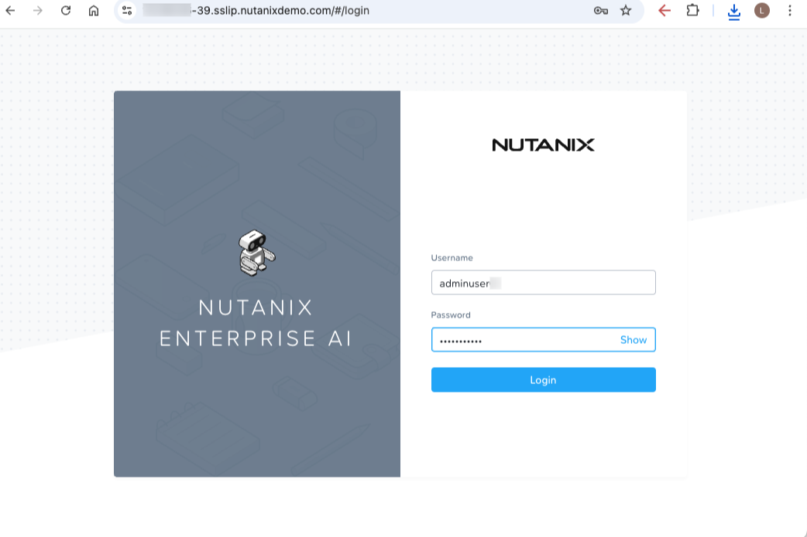

# Log in to Nutanix Enterprise AI

## Accessing the shared Nutanix Enterprise AI instance

Starting from this lab you'll be using the staged Nutanix Enterprise AI instance shared with other users. You have been designated with the `AI/ML User` role.

1.  Access the shared Nutanix Enterprise AI console on a new tab.
    
    !!! tip    
        You can find the connection details for the shared instance on the [Setup](/nai/introduction/setup#environment-and-authentication-details) page of this lab guide.
    
2.  Login with your assigned credentials.
    
    
    
    !!! info
        AI/ML User
        
        Logging in as the `AI/ML user` role has a more limited view than the `AI/ML Admin` role.
    
3.  Click on **Settings**
    
4.  Notice that a Hugging Face credential has already been pre-configured for you. A valid Hugging Face token is required for downloading models from Hugging Face.
    
    !!! info
        Third Party Credentials
        
        Third Party Credentials are specific to each logged in user.
    
    !!! info
        NVIDIA NGC Personal Key
        
        The **NVIDIA NGC Personal Key** is required for downloading NVIDIA NIM models. However, we won't be using it in this lab.