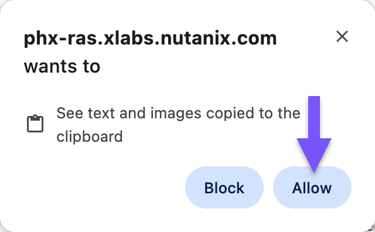

# Navigating the labs

เพื่อประสบการณ์ที่ดียิ่งขึ้น จำเป็นต้องทำความคุ้นเคยกับโครงสร้างของ bootcamp ก่อน

#### Tips

VS Code ได้รับการติดตั้งไว้ใน VDI terminal แล้ว ใช้เพื่อวางข้อมูลที่ต้องการเข้าถึงในภายหลัง เช่น API keys, URLs เป็นต้น

#### Structure

เนื้อหาของ bootcamp นี้ประกอบด้วย:

1.  แบบฝึกหัด lab แต่ละรายการ
2.  เนื้อหาสนับสนุนที่อธิบาย concept ที่เกี่ยวข้องกับ lab

แบบฝึกหัด lab ได้รับการออกแบบให้ทำตามลำดับที่กำหนด แต่ละส่วนต่อเนื่องกันและไม่สามารถทำแยกกันได้

เพื่อประสบการณ์ที่ดียิ่งขึ้น ให้เปิด lab guide ภายใน VDI terminal หาก VDI หรือ VS Code แสดงคำเตือนเกี่ยวกับ clipboard ให้คลิก Allow

#### Notes

คุณจะพบ note สามประเภทตลอด bootcamp:

-   Informative (สีม่วง): ให้คำแนะนำและข้อมูลเพิ่มเติม
-   Warning (สีเหลือง): ควรระมัดระวังเป็นพิเศษในงานนั้น
-   Danger (สีแดง): การกระทำที่ทำลายข้อมูลหากทำผิดพลาด

#### Moving through the content

-   แนะนำให้ใช้ลิงก์ previous และ next ที่ท้ายแต่ละหน้าเพื่อเลื่อนไปหน้าก่อนหน้าหรือถัดไป
-   หากคลิกลิงก์ที่พาไปยังหน้าอื่นใน bootcamp ให้ใช้ปุ่ม back ของเบราว์เซอร์เพื่อกลับไปหน้าก่อนหน้า
-   sidebar แสดงตำแหน่งปัจจุบันของคุณใน bootcamp

---

[← Back: Setup](nai-intro-setup.md) | [Home](nai-welcome.md) | [Next: Fundamentals Overview →](nai-fundamentals-overview.md)