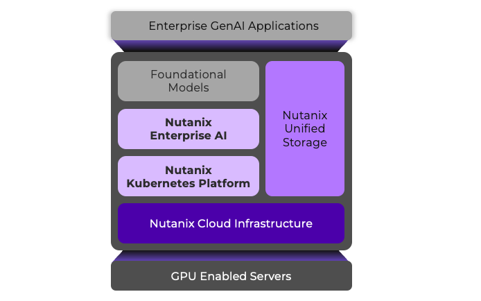

# Introduction

In this lab, you'll be leveraging a shared 4-node Nutanix Cloud Platform cluster running Nutanix Kubernetes Platform, Nutanix Unified Storage and Nutanix Enterprise AI.

You'll leverage Nutanix Enterprise AI to see how easy it is to connect to different model repositories to download LLMs, create a secure endpoint, and connect a GenAI application to that endpoint. You'll build your own chatbot and then connect it with a database to augment your chatbot with private documents.

!!! note

    Due to the shared nature of the lab, you will be working with your own Llama3-1B model on a shared Nutanix Enterprise AI **instance** with CPU only.

    When building your RAG application (in the Application section), you will be leveraging a shared Nutanix Enterprise AI **inference endpoint** running the Llama3-8B model, backed by NVIDIA L40S GPUs.