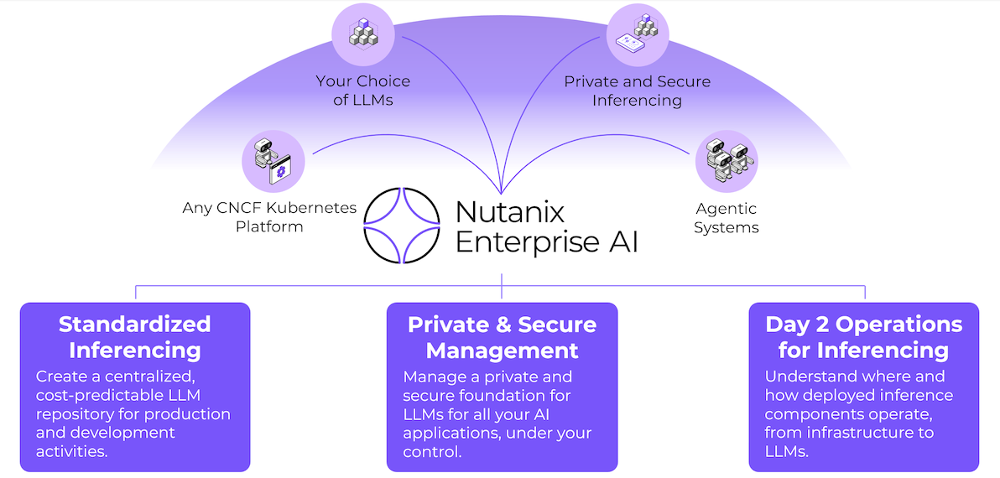

# Nutanix Enterprise AI

## ✨ Welcome to the Nutanix Enterprise AI Hands-On Lab!

Getting started with Enterprise AI can be challenging for many organizations. Generative AI is a technology that can deliver tangible business outcomes, including productivity gains, revenue growth, and value creation. Executives are seeing the potential in implementing GenAI, and GenAI applications are becoming the newest business critical application that IT teams need to support and deliver with the same enterprise value that they deliver today.

Nutanix Enterprise AI provides a simple to use interface that connects to external model repositories, creates secure endpoints, and delivers day 2 operations. It also enables you to upload your own models, making it easy to provide your own centralized model repository from various sources. This enables IT teams to simplify the management and control over what models their organization is using, while providing simple access to LLMs for their AI application owners and developers to build or deploy AI workflows against, all with your own sovereign data.

**In this hands-on lab, you will learn how to:**

-   Leverage Nutanix Enterprise AI to import an LLM locally
-   Create an inference endpoint to leverage the model
-   Build a RAG pipeline to chat with your own documents

All on the Nutanix Cloud Platform with Nutanix Enterprise AI.
