# Deploying Workloads

## Overview

ถึงตอนนี้เราได้เรียนรู้ storage และ network provisioning แล้ว มาดูกันว่า workload สามารถ deploy ได้อย่างไร การสร้าง VM การจัดการ และการตรวจสอบสามารถทำได้สำหรับ Nutanix AHV โดยตรงผ่าน Prism Central Prism ทั้งยังรองรับการดำเนินการ VM CRUD (create, read, update, delete) สำหรับ Nutanix Cluster ที่รัน ESXi ได้ด้วยเช่นกัน

ในแล็บนี้ เราจะสร้าง VM จาก source media และ disk image ที่มีอยู่

## Creating a Windows VM

ตอนนี้เราจะสร้าง Windows Server VM จาก Windows installation ISO image

AHV มีฟีเจอร์ Image Service เพื่อสร้าง store ของไฟล์ ISO หรือ disk image ที่นำเข้าจาก Image Service รองรับรูปแบบ disk ได้แก่ raw, vhd, vhdx, vmdk, vdi, iso, และ qcow2 มาดู image repository กัน

1.  จากเมนูด้านข้าง เลือก **Compute** จากนั้นคลิก **Images**
    
    
    
2.  คุณจะเห็นรายการ image ที่อัปโหลดแล้วไปยังคลัสเตอร์นี้ เราจะใช้บาง image เพื่อ deploy VM ในขั้นตอนถัดไป
    
    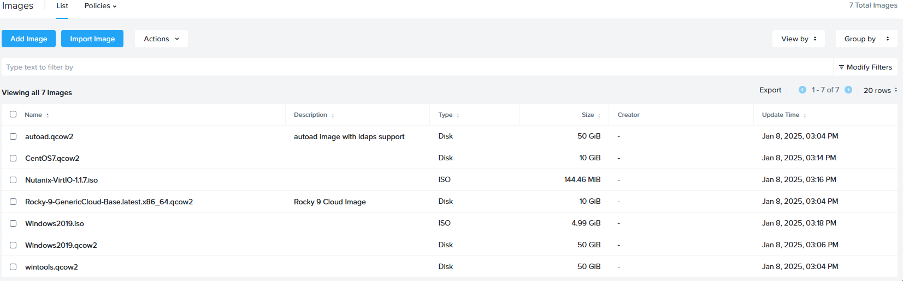
    

    !!! note
        คุณสามารถมาที่หน้านี้ได้โดยค้นหา **Images** ในช่องค้นหา

เพื่อให้ได้ IO ประสิทธิภาพสูง VM AHV ต้องติดตั้ง paravirtualized driver เข้าไปใน guest (คล้ายกับ VMware Tools) และ driver ของ Windows guest จะต้องถูกโหลดระหว่างการติดตั้งเพื่อให้ Windows installer เข้าถึง disk ของ VM ได้

Nutanix ตรวจสอบและให้บริการ driver ผ่านทาง [Nutanix Portal](http://portal.nutanix.com) ทั้งนี้ ISO image ที่มี driver ถูกอัปโหลดไปยัง Image Service สำหรับ bootcamp นี้แล้ว

1.  จากเมนูด้านข้าง เลือก **Compute** จากนั้นคลิก **VMs**
    
    
    
2.  คลิกปุ่ม **Create VM** เพื่อเปิด wizard สร้าง VM
    
    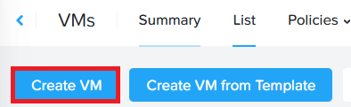
    
3.  กรอกข้อมูลในช่องต่อไปนี้ในหน้า configuration และคลิก **Next**:
    
    คงค่าที่เหลือเป็นค่าเริ่มต้น
    
    -   **Name** - `Initials`\-winvm
    -   **vCPU(s)** - `2`
    -   **Cores per CPU** - `1`
    -   **Memory** - `4` GiB
    
    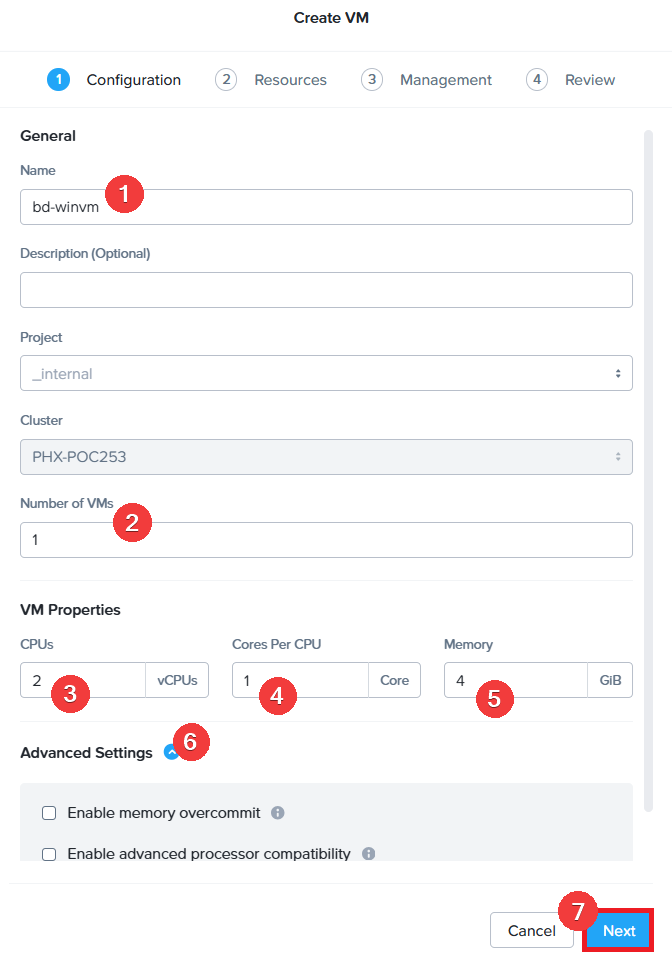
    
    !!! note
        ภายใต้ Advanced Settings คุณจะเห็นตัวเลือกสำหรับการเปิดใช้งาน Memory Overcommit และการเปิดใช้งาน advanced processor compatibility (APC) ซึ่งช่วยให้ VM สามารถย้ายระหว่างโฮสต์ที่มี CPU generation ต่างกันได้ตามตัวอย่างด้านล่าง เมื่อคุณต้องการเปิดใช้งาน APC จะพบ CPU generation พื้นฐานที่ mapping ไว้แล้ว สามารถเลือก generation ตามต้องการได้
    
    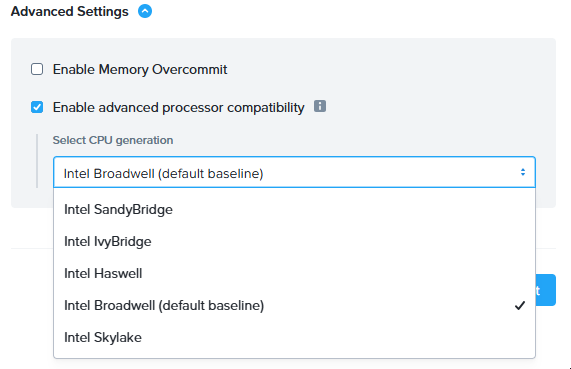
    
4.  คลิกปุ่ม **Attach Disk**
    
    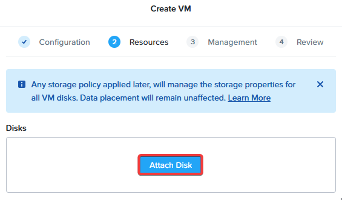
    
5.  เลือกตัวเลือกต่อไปนี้และคลิก **Save**
    
    -   **Type** - CD-ROM
    -   **Operation** - Clone from Image
    -   **Image** - Windows2019.iso
    -   **Bus Type** - SATA
    
    การดำเนินการนี้จะ mount Windows Server ISO จาก Image Service เพื่อ boot/ติดตั้ง
    
    !!! note
        AHV รองรับทั้ง SATA และ IDE bus type สำหรับกรณีการใช้งานทั่วไปควรใช้ SATA เป็น bus type สำหรับ CD-ROM และควรเลือก IDE เมื่อต้องการความเข้ากันได้ในกรณีเช่น OS เก่าที่ IDE CD-ROM ไม่รองรับ UEFI boot
    
    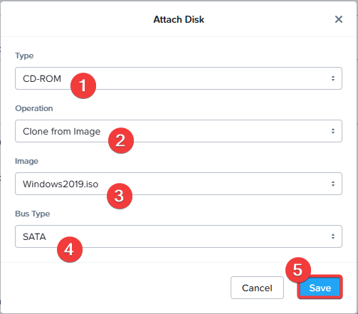
    
6.  คลิก **Attach Disk**
    
    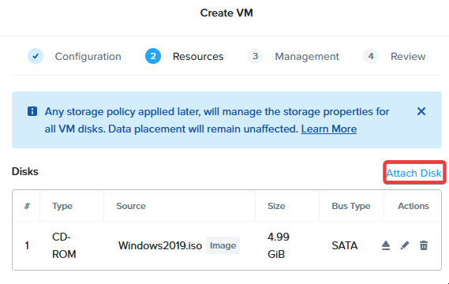
    
7.  เลือกตัวเลือกต่อไปนี้และคลิก **Save**
    
    -   **Type** - Disk
    -   **Operation** - Allocate on Storage Container
    -   **Storage Container** - `Initials`\-Container
    -   **Capacity** - 50 GiB
    -   **Bus Type** - SCSI
    
    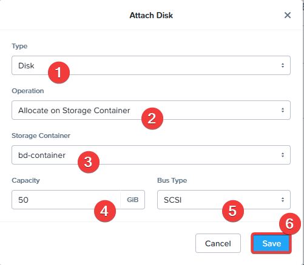
    
    การดำเนินการนี้จะสร้าง vDisk เนื้อที่ 50GiB บน Storage Container ที่เลือกสำหรับติดตั้ง OS
    
8.  คลิก **Attach Disk** อีกครั้ง
    
9.  เลือกตัวเลือกต่อไปนี้และคลิก **Save**
    
    -   **Type** - CD-ROM
    -   **Operation** - Clone from Image
    -   **Image** - Nutanix-VirtIO-x.x.x.iso
    -   **Bus Type** - SATA
    
    ดำเนินการ attach VirtIO iso ซึ่งจะติดตั้ง VirtIO driver ที่จำเป็นสำหรับ VM
    
    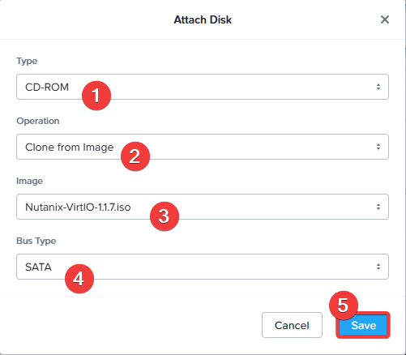
    
10.  ต่อไปทำการสร้าง vNIC สำหรับ VM คลิก **Attach to Subnet** เพื่อเชื่อมต่อ VM กับเครือข่าย
    

    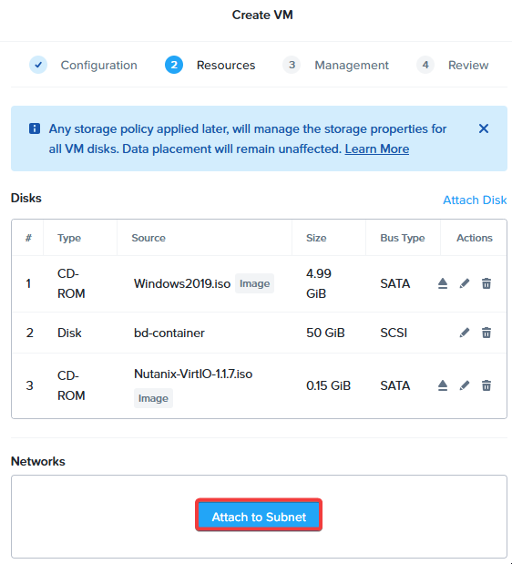

11.  เลือกตัวเลือกต่อไปนี้และคลิก **Save**

    -   **Subnet** - `Initials`\-net
    -   **Network Connection State** - Connected
    -   **Attachment Type** - Access

    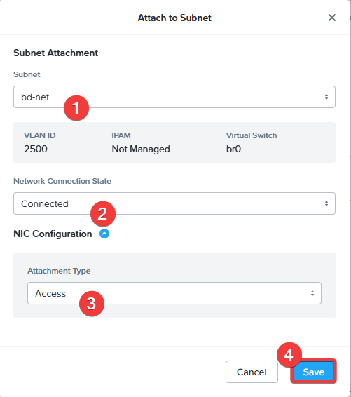

    การดำเนินการนี้จะเพิ่ม virtual NIC ให้กับ VM บน Virtual Network ที่เลือก

12.  สำหรับการกำหนดค่า boot เลือก **Legacy BIOS Mode** และคลิก **Next** หาก pop-up ปรากฏขึ้นให้ยืนยัน yes

    !!! note
        AHV รองรับ UEFI BIOS mode ซึ่งช่วยให้คุณใช้ Secure Boot กับ Windows Credential Guard รวมถึง vTPM

    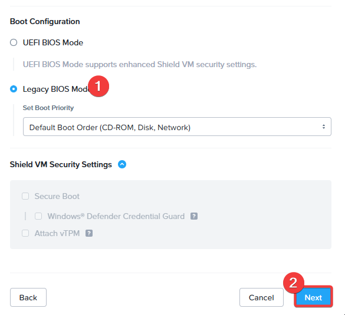

13.  ในหน้า Management เราสามารถ customize VM โดยเราจะใช้ **Default Storage Policy** กับ VM นี้ซึ่งจะกำหนด category ที่เกี่ยวข้องให้โดยอัตโนมัติ ผู้ดูแลระบบยังสามารถกำหนด custom category และกำหนดค่าให้กับ VM ที่สร้างขึ้นตาม policy ที่เกี่ยวข้องได้ ตัวอย่างเช่น protection policy หรือ security policy ที่ถูกใช้กับ VM ตาม category ที่กำหนด

    -   สลับปุ่ม Enable Default Storage Policy เพื่อใช้งาน
    -   เปลี่ยน Timezone เป็น Local Timezone
    -   คงค่าที่เหลือเป็นค่าเริ่มต้น
    -   คลิก **Next**

    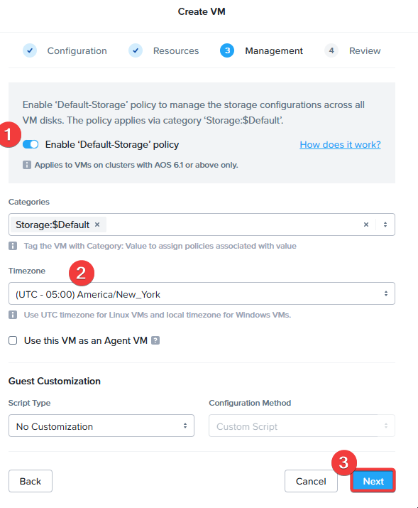

14.  ในหน้า **Review** คุณสามารถตรวจสอบการตั้งค่าและการกำหนดค่าที่เลือกสำหรับ VM และแก้ไขหากจำเป็น คลิก **Create VM** เพื่อสร้าง VM

    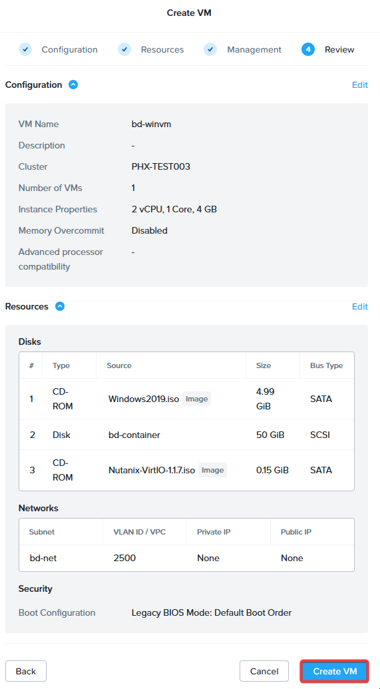

15.  เมื่อ VM ปรากฏในรายการ คลิกขวาที่ VM และคลิก **Power On** เพื่อเปิดเครื่อง VM

    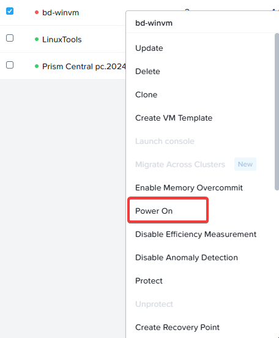

16.  เมื่อ VM มีจุดสีเขียวถัดจากชื่อ คุณสามารถคลิกขวาอีกครั้งและคลิก **Launch Console** เพื่อติดตั้ง OS บน VM

    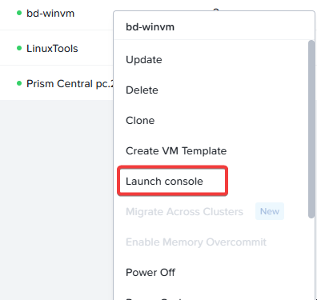

17.  ดำเนินการตามขึ้นตอนจนถึงติดตั้ง Windows โดยใช้ข้อมูลดังนี้

    -   **I don't have a product key**
    -   **Windows Server 2019 Datacenter (Desktop Experience)**
    -   **Custom : Install Windows Only** เมื่อได้รับตัวเลือก

18.  เนื่องจาก VM ไม่มี driver จึงไม่สามารถเห็น vdisk ที่ attach ได้ ดังนั้นก่อนอื่นเราจะโหลดและติดตั้ง driver คลิก **Load Driver** และไปที่ CD ที่ Nutanix VirtIO ISO ถูก mount ไว้แล้วและค้นหาไปยังโฟลเดอร์ที่สอดคล้องกับ OS

    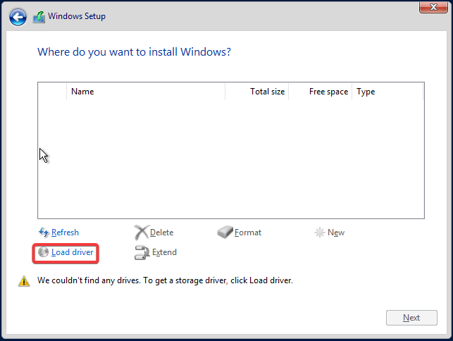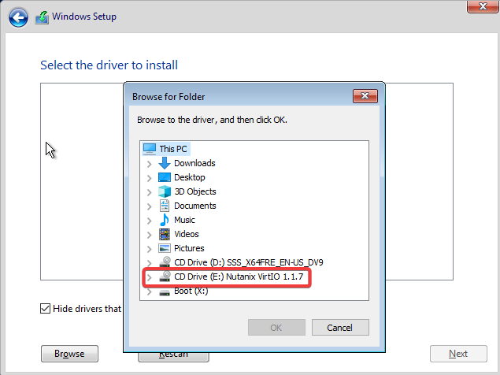  
    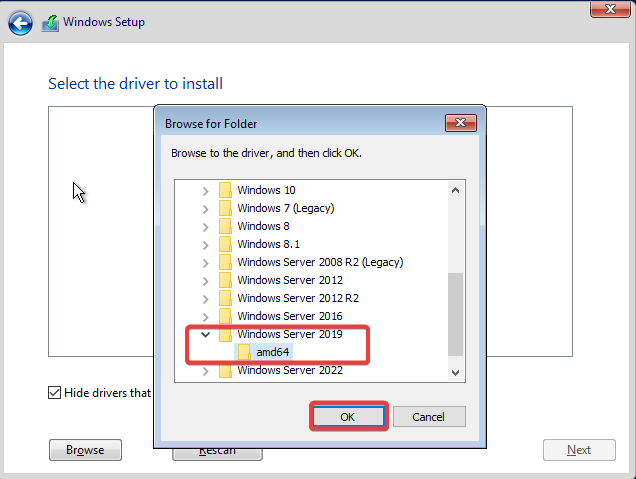

19.  เลือก Nutanix driver ทั้งหมดที่แสดง กด **Ctrl+a** เพื่อเลือก driver ทั้งหมดและคลิก **Next**

    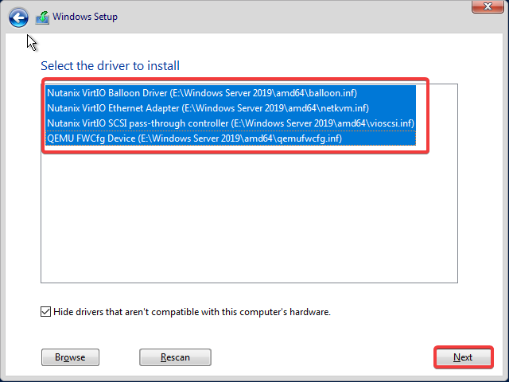

20.  หลังจากโหลด driver แล้วจะเห็น vdisk ที่สร้างจากขั้นตอนข้างต้น ทำการเลือกและคลิก **Next** เพื่อเสร็จสิ้นการติดตั้ง OS

    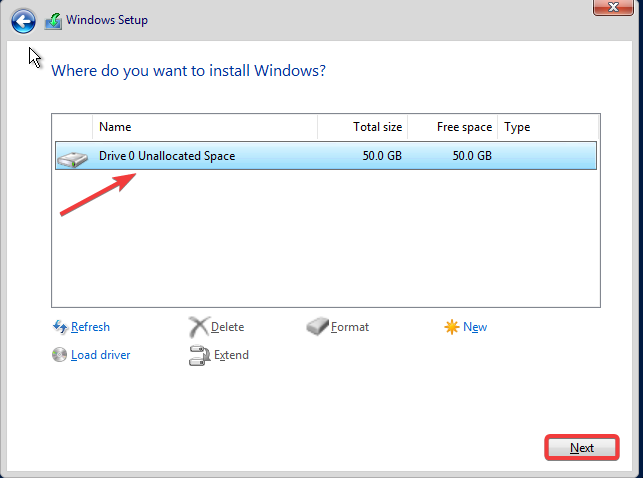

    !!! note
        ถึงเวลาดื่มกาแฟ ☕ หรือเครื่องดื่มที่คุณชื่นชอบ คุณสามารถใช้เวลานี้สำรวจ Prism Central หากต้องการ

21.  เมื่อการติดตั้งเสร็จสิ้น คุณสามารถ unmount ISO โดยใช้ปุ่ม **Unmount ISO** ใน console

### Installing Nutanix Guest Tools (NGT)

Nutanix Guest Tools เป็นเครื่องมือช่วย backup ที่จำเป็นสำหรับบาง 3rd party และการ replication ของ Nutanix เอง ด้วยการใช้ประโยชน์จาก VSS และการดำเนินอื่นๆ เช่นการเปลี่ยน IP address ระหว่าง failover ทั้งนี้ไม่ใช่ข้อบังคับสำหรับทุก VM แต่แนะนำควรติดตั้งไว้เพื่อให้ได้ความสามารถเพิ่มเติมสำหรับการ Backup ต่อไปเราจะทำการติดตั้ง NGT บน VM นี้

ก่อนหน้านี้คุณต้อง mount ISO สำหรับการติดตั้ง Driver แต่สำหรับ NGT สามารถ deploy ได้โดยตรงจาก Prism Central หรือสามารถดาวน์โหลด MSI installer เพื่อ deploy ได้เช่นกัน

1.  ในการติดตั้ง NGT จาก Prism Central คลิกขวาที่ VM และวางเมาส์เหนือ **Guest Tools** แล้วเลือก **Set Up NGT** คลิก **Next** ในหน้า **Choose Preferences**
    
    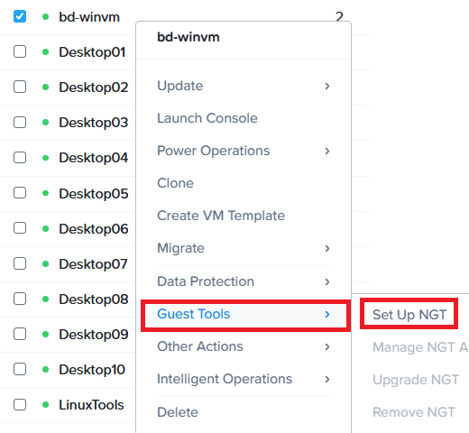
    
2.  เลือกกล่องสำหรับทั้ง **Volume Shadow Copy Services** และ **Self Service Restore** และคลิก **Next**
    
    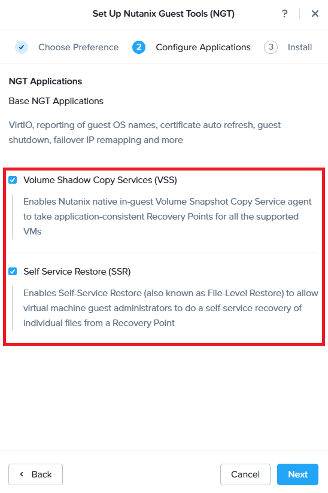
    
3.  หากเราเลือกเครือข่ายที่สามารถ route ไปยัง VM ได้ ณ จุดนี้เราสามารถให้ชื่อผู้ใช้และรหัสผ่านสำหรับ VM และ Prism Central จะติดตั้ง NGT โดยอัตโนมัติ เนื่องจากเครือข่ายของเราไม่สามารถ route ได้ เราจะติดตั้งด้วยตนเอง คลิก **Mount Installer** เพื่อ mount NGT CD-ROM และเสร็จสิ้นการตั้งค่า
    
    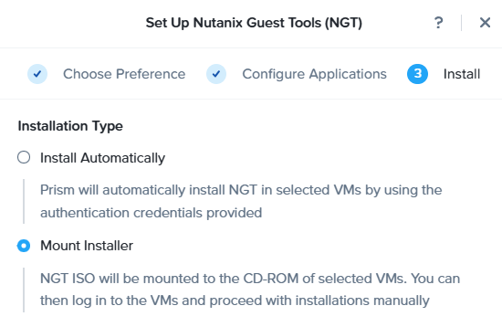
    
4.  จาก VM console รัน NGT installer เพื่อติดตั้ง NGT
    
    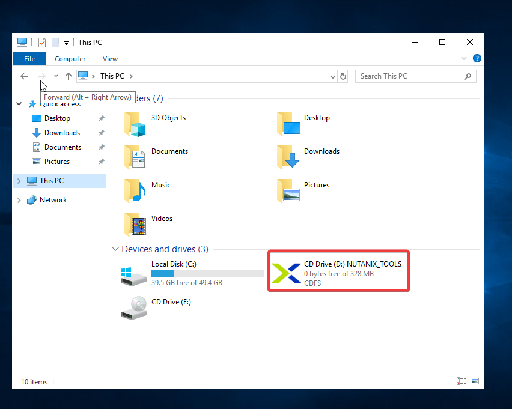
    
5.  เมื่อติดตั้ง NGT แล้ว ในหน้า VM จะแสดง OS ของ VM และเวอร์ชันของ NGT ที่ติดตั้ง ตอนนี้คุณมี VM ที่ทำงานและ deploy แล้วตัวแรกบน AHV 🎉 🎊
    
    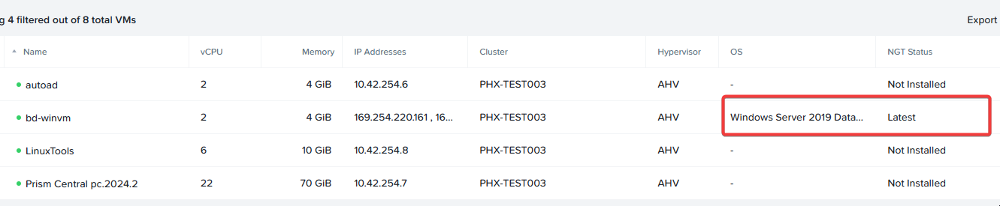
    

## Creating a Linux VM

ต่อไปเราจะสร้าง Linux VM จาก disk image แบบ pre-installed ที่มีอยู่ใน Image Service เป็นเรื่องปกติในหลายสภาพแวดล้อมที่มี template-style image ของระบบปฏิบัติการที่ติดตั้งไว้ล่วงหน้า คล้ายกับแบบฝึกหัดก่อนหน้า disk image ถูกอัปโหลดไปยัง Image Service แล้ว

1.  คลิกปุ่ม **Create VM** เพื่อเปิด wizard สร้าง VM
    
    
    
2.  กรอกข้อมูลในช่องต่อไปนี้และคลิก **Next**:
    
    ตั้งค่าอื่นๆ ตามค่าเริ่มต้น
    
    -   **Name** - `Initials`\-linuxvm
    -   **vCPU(s)** - `2`
    -   **Cores per CPU** - `1`
    -   **Memory** - `4` GiB
    
    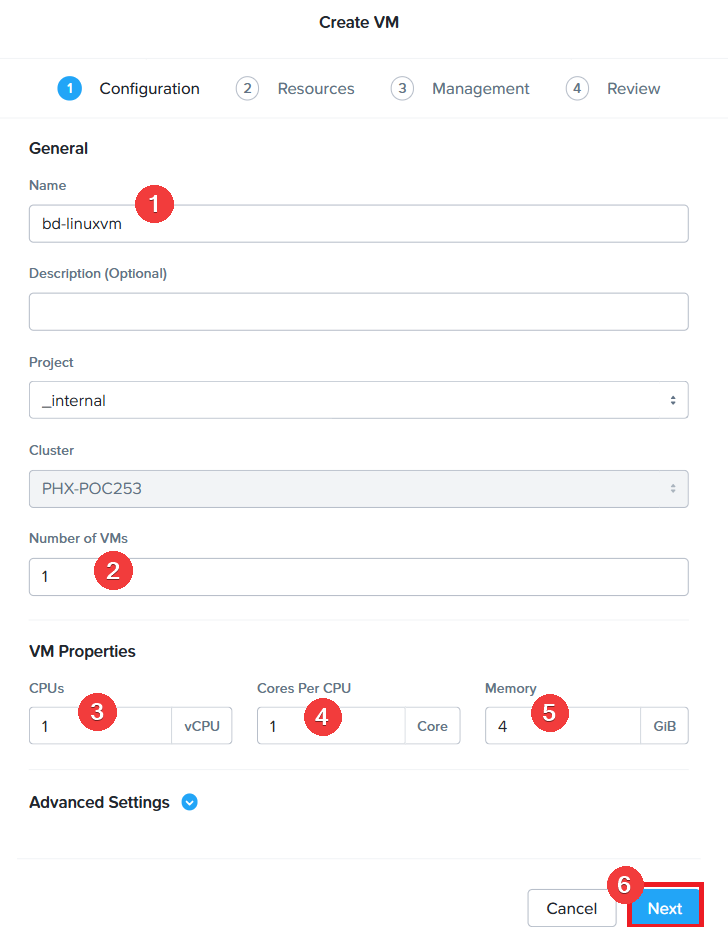
    
3.  คลิกปุ่ม **Attach Disk**
    
    
    
4.  เลือกตัวเลือกต่อไปนี้และคลิก **Save**
    
    -   **Type** - Disk
    -   **Operation** - Clone from Image
    -   **Image** - CentOS7.qcow2
    -   **Capacity** - 20 GiB
    -   **Bus Type** - SCSI
    
    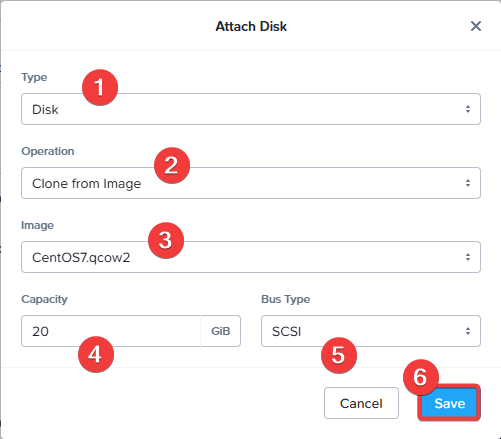
    
5.  ต่อไปสร้าง vNIC สำหรับ VM คลิก **Attach to Subnet** เพื่อเชื่อมต่อ VM กับเครือข่าย
    
    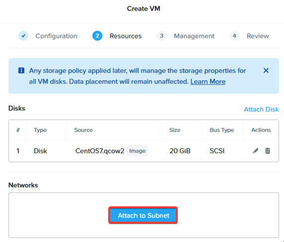
    
6.  เลือกตัวเลือกต่อไปนี้และคลิก **Save**
    
    -   **Subnet** - `Initials`\-net
    -   **Network Connection State** - Connected
    -   **Attachment Type** - Access
    
    
    
    การดำเนินการนี้จะเพิ่ม virtual NIC เดียวให้กับ VM บน Virtual Network ที่เลือก
    
7.  สำหรับการกำหนดค่า boot เลือก **Legacy BIOS Mode** และคลิก **Next** หาก pop-up ปรากฏขึ้นให้ยืนยัน yes
    
    !!! note
        AHV รองรับ UEFI BIOS mode ซึ่งช่วยให้คุณใช้ Secure Boot กับ Windows Credential Guard รวมถึง vTPM
    
    
    
8.  ในหน้า Management สำหรับ VM เราจะไม่ใช้ default storage policy คงค่าเริ่มต้นและคลิก **Next**
    
    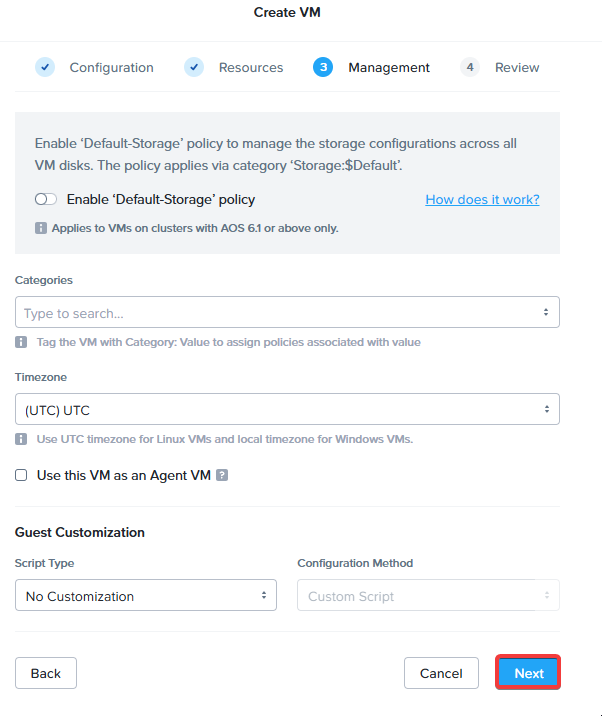
    
9. Guest Customization ให้เลือก Script Type เป็น Cloud-init (Linux) และ Configuration Method เป็น Custom Script ในส่วนของ Startup Script ให้ใส่ข้อมูลดังนี้

    ```
    #cloud-config
    fqdn: user## # <-- อัปเดตด้วยหมายเลขผู้ใช้ของคุณ
    ssh_pwauth: true
    users:
      - name: nutanix
        primary_group: nutanix
        groups: [wheel, docker]
        shell: /bin/bash
        sudo: ALL=(ALL) NOPASSWD:ALL
        lock_passwd: false
    chpasswd:
      expire: false
      users:
      - name: nutanix
        password: nutanix/4u
        type: text
    ```    

    ตัวอย่าง

    ```
    #cloud-config
    fqdn: user01 # <-- อัปเดตด้วยหมายเลขผู้ใช้ของคุณ
    ssh_pwauth: true
    users:
      - name: nutanix
        primary_group: nutanix
        groups: [wheel, docker]
        shell: /bin/bash
        sudo: ALL=(ALL) NOPASSWD:ALL
        lock_passwd: false
    chpasswd:
      expire: false
      users:
      - name: nutanix
        password: nutanix/4u
        type: text
    ```

    คำอธิบาย Cloud-config
        
    -   **2** อัปเดตค่าด้วยผู้ใช้ของคุณ ตัวอย่าง: user**01**
    -   **3-16** สร้างผู้ใช้ใหม่ `nutanix` และเปิดใช้งานการรองรับรหัสผ่าน เป็นเรื่องปกติที่ cloud images จะไม่มีรหัสผ่านมาให้ตั้งแต่ต้น
    -   **15** รหัสผ่านเริ่มต้นที่ตั้งไว้คือ `nutanix/4u` ในระดับ production คุณควรใช้ SSH public key และไม่ใช้การตรวจสอบสิทธิ์ด้วยรหัสผ่าน    

    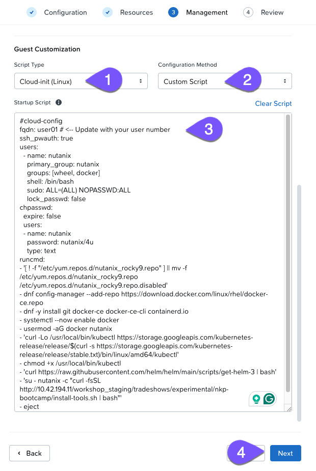

10.  ในหน้า review ตรวจสอบการเลือกและคลิก **Create VM** เพื่อสร้าง Linux VM ของเรา
    

    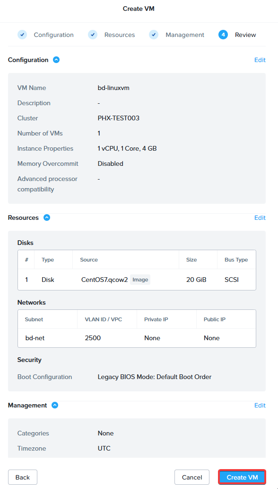

11.  ทำการเปิดเครื่อง VM ที่สร้างและเชื่อมต่อกับ Console เพื่อดู Linux Virtual Machine ใหม่

## Takeaways

-   ในแล็บนี้ คุณจะเห็นว่าการ deploy ทั้ง Windows และ Linux VM เป็นเรื่องง่ายเพียงใด
-   เครื่องมือ Image Configuration ช่วยให้คุณจัดการ image ที่มีอยู่ สำหรับ VM deployment ตามต้องการและครอบคลุมรูปแบบที่หลากหลายรวมถึง raw, vhd, vhdx, vmdk, vdi, iso, และ qcow2


---

[← Back: Network Configuration](ncp1-networkconfiguration.md) | [Home](ncp1-whatisncp.md) | [Next: Managing Workloads →](ncp1-managingworkloads.md)
