# Managing Workloads

## Overview

ตอนนี้คุณมี VM ที่ deploy แล้วสองตัว มาสนุกและสำรวจวิธีการจัดการ VM ด้วย AHV กัน

## Workload Management

### Power Actions and Console Access

สำรวจการ power on VM และการเข้าถึง console

1.  จากเมนูด้านข้าง เลือก **Compute** และคลิก **Images**
    
    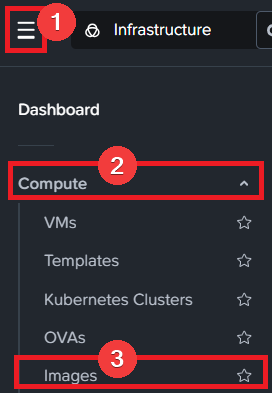
    
2.  ค้นหา Linux VM ที่คุณสร้างในขั้นตอนที่ผ่านมาและเปิดเครื่อง VM หากคุณยังไม่ได้เปิด โดยคลิกขวาที่ VM วางเมาส์เหนือ **Power Operations** และเลือก **Power On**
    
    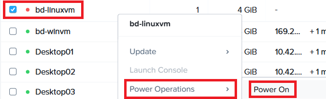
    
3.  เมื่อ VM เปิดเครื่องแล้ว จากตัวเลือกคลิกขวา เลือก **Launch Console** หน้าต่าง console มีตัวเลือกดังต่อไปนี้:
    
    -   Mount ISO
    -   Unmount ISO
    -   Ctrl+Alt+Del
    -   Take Screenshot
    -   Power Control
    
    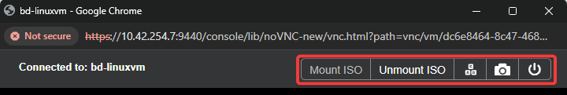
    

### Cloning VMs

Nutanix ทำให้การสร้างโคลนของ VM เป็นเรื่องง่ายดาย การโคลน VM มีประโยชน์สำหรับการสร้างสำเนา VM เดียวกันหลายชุดอย่างรวดเร็ว Nutanix clones และ Nutanix snapshots ใช้อัลกอริทึม [redirect-on-write](https://www.nutanixbible.com/4c-book-of-aos-storage.html#snapshots-and-clones) เพื่อสร้างสำเนา VM ที่มีการใช้พื้นที่อย่างมีประสิทธิภาพ และระยะเวลาการสำเนาที่รวดเร็ว

1.  จากหน้า VM คลิกขวาที่ `Initials`\-Linux VM ของคุณ และเลือก **Clone**
    
    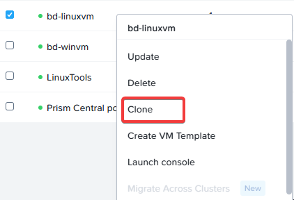
    
2.  กรอกข้อมูลในช่องต่อไปนี้ จากนั้นคลิก **Next**:
    
    !!! note
        การกำหนดค่าขั้นสูงช่วยให้คุณแก้ไขเปลี่ยนแปลงค่า เช่น CPU, memory, networking
    
    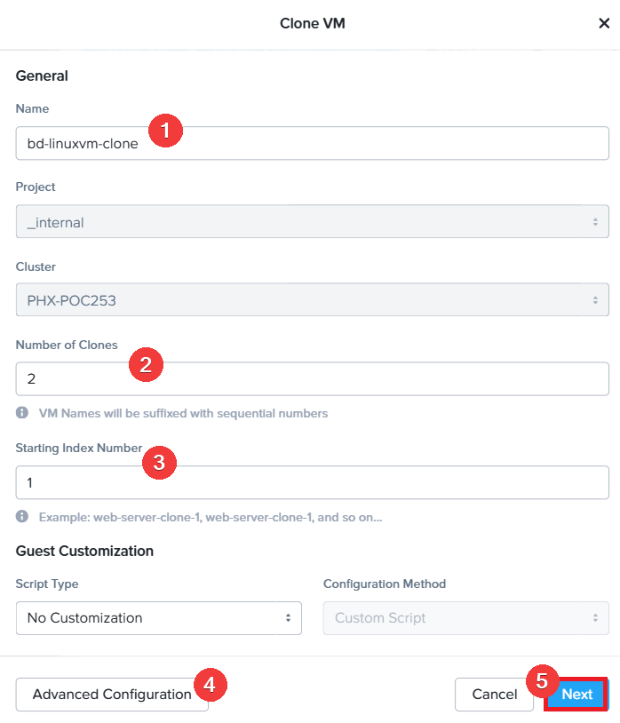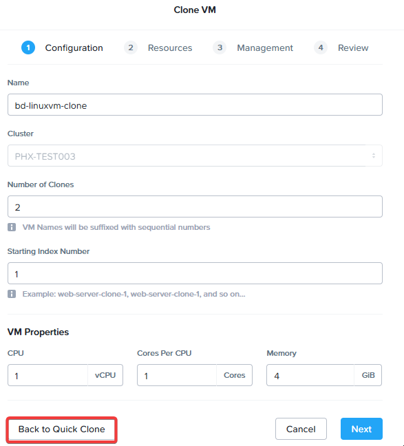
    
    -   **Name** - `Initials`\-LinuxVM-clone
    -   **Number of Clones** - `2`
    -   **Starting Index Number** - `1`

3.  ตรวจสอบรายละเอียดการกำหนดค่าซึ่งควรเหมือนกับตัวอย่างเว้นแต่มีการเปลี่ยนแปลงใน **Advanced Configuration** และคลิก **Clone VM**
    
    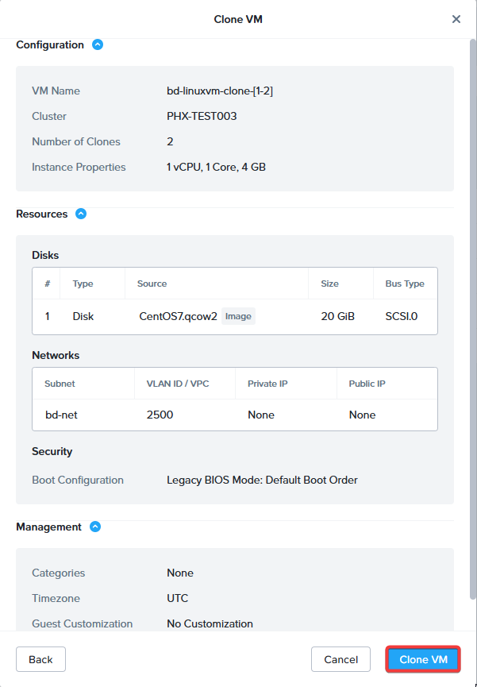
    
4.  VM ที่โคลน 2 ตัวจะพร้อมใช้งานทันทีในรายการ VM ที่ผู้ใช้สามารถแก้ไขและใช้งานได้ตามต้องการ
    

### Creating Templates

Template เป็นวิธีง่ายๆ ในการทำให้การสร้าง virtual machine เป็นมาตรฐานเดียวกันของหลายคลัสเตอร์จาก Prism Central เดียว โดยทั่วไปคุณจะใช้เครื่องมือเช่น sysprep สำหรับ Windows หรือ Cloud-Init สำหรับ Linux เพื่อเตรียม VM ก่อนสร้าง template

Template ยังมีการกำหนดเวอร์ชันในตัว ซึ่งช่วยให้ผู้ดูแลระบบเก็บเวอร์ชันก่อนหน้าหรือมีเวอร์ชันทดสอบเมื่อมีการเปลี่ยนแปลง image มาดูวิธีสร้างและใช้ template กับ AHV และ Prism Central กัน

1.  ปิด Windows VM ของคุณโดยคลิกขวา วางเมาส์เหนือ **Power Operations** และเลือก **Power off**
    
    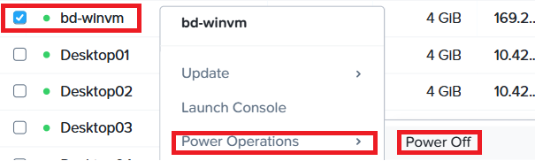
    
2.  หลังจากปิดเครื่องแล้ว คลิกขวาอีกครั้งและคลิก **Create VM Template**
    
    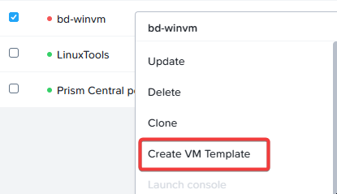
    
3.  กรอกรายละเอียดต่อไปนี้และคลิก **Next**
    
    -   **Name** - `Initial`\-winvm-Gold
    -   **Description** - Gold template of Windows
    -   **Guest Customization** - คงค่าเริ่มต้น
    
    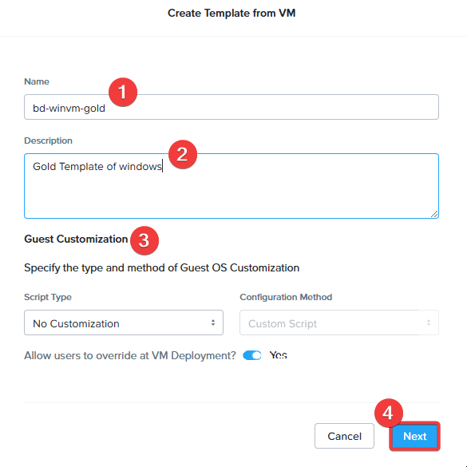
    
    !!! note
        AHV template รองรับ guest customization ทั้ง Windows และ Linux VM สำหรับ Windows คุณสามารถทำได้โดยใช้ไฟล์ unattended.xml และสำหรับ Linux ผ่าน Cloud-Init script
    
4.  ตรวจสอบการกำหนดค่าและคลิก **Save** เพื่อสร้าง template
    
    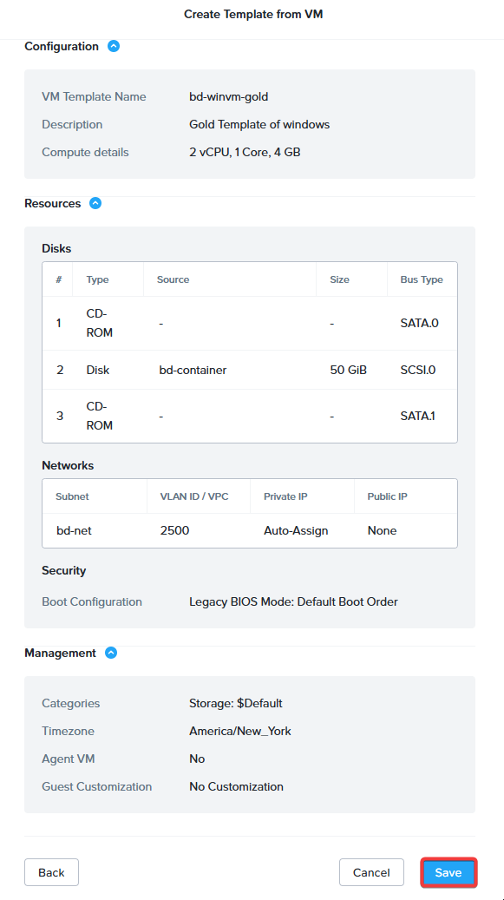
    
    เมื่อสร้าง template AOS จะทำ **Recovery Point** ซึ่งโดยพื้นฐานแล้วคือ snapshot ของ VM ทำให้สามารถ deploy บนคลัสเตอร์ใดก็ได้ที่จัดการผ่าน Prism Central นี้
    

### Working with Templates

1.  จากเมนูด้านข้าง เลือก **Compute** และทำการคลิก **Templates**
    
    
    
2.  ที่นี่คุณจะเห็น template ที่คุณเพิ่งสร้าง ที่มีข้อมูลเกี่ยวกับทรัพยากรที่จำเป็นสำหรับ VM ที่จะ deploy เวลาอัปเดตล่าสุดสำหรับ template และ Active Version ปัจจุบัน
    
    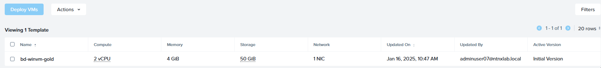
    
3.  คลิกที่ชื่อ template ของคุณเพื่อดูข้อมูลและรายละเอียดเพิ่มเติมเกี่ยวกับ template
    
    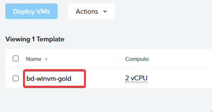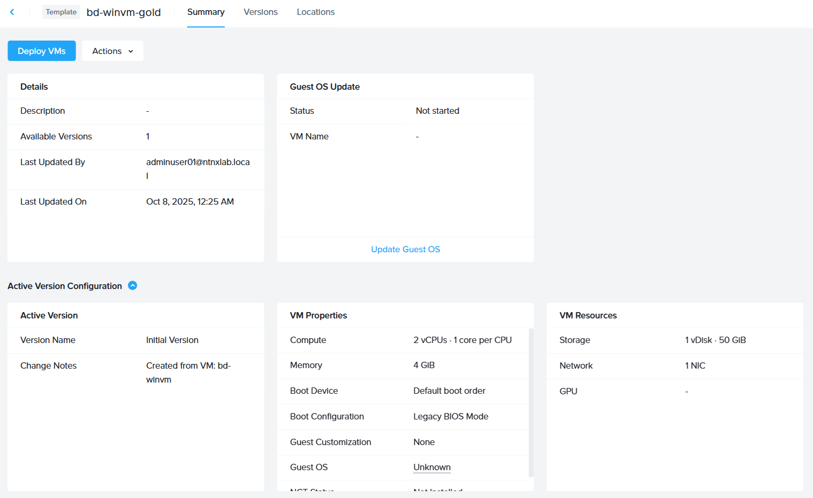
    
4.  ต่อไป ทำการอัปเดตการกำหนดค่าให้กับ template นี้ เราจะแก้ไข template นี้เพื่อสร้าง template ที่มี memory มากขึ้นซึ่งจะกลายเป็นเวอร์ชันใหม่ของ template
    
5.  คลิก **Actions** แล้วคลิก **Update Configuration**
    
    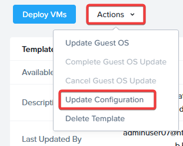
    
6.  เรามีเพียงเวอร์ชันเดียวของ template ซึ่งเป็นเวอร์ชัน active คลิก **Proceed**
    
    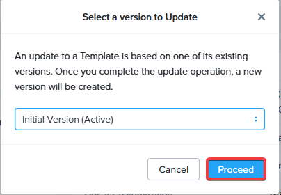
    
7.  ในหน้าการกำหนดค่า อัปเดต memory เป็น 12 GiB และคลิก **Next** คุณสามารถคลิก **Next** สำหรับหน้า resources และ configuration เนื่องจากเราคงไว้เหมือนเดิม
    
    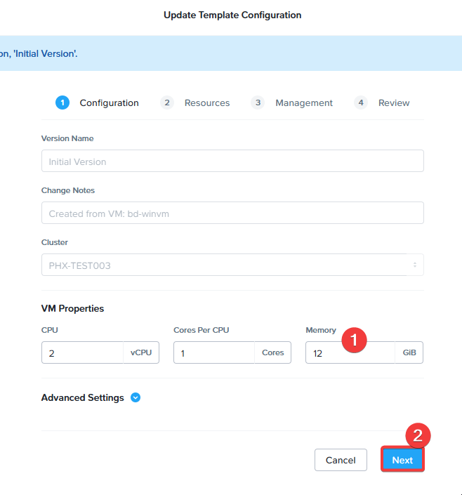
    
8.  ในหน้า Review กรอกรายละเอียดต่อไปนี้และคลิก **Save**
    
    -   **New Version Name** : `Initial`\-winvm-12g
    -   **Change Notes** : Gold Windows image with 12G memory
    -   เลือกกล่องถัดจาก **Yes, set this new version as active**
    
    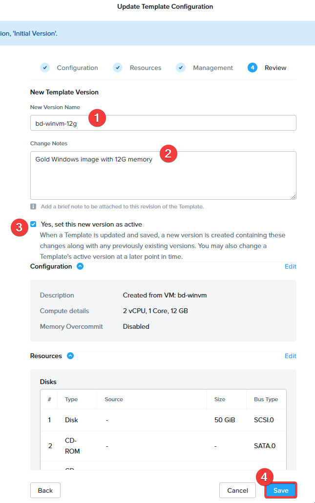
    
9.  หลังจากบันทึก ตอนนี้คุณจะเห็นว่า template มี 2 เวอร์ชันโดยเวอร์ชัน Active เป็นเวอร์ชันที่เราเพิ่งสร้าง หากเราทำ **Deploy VM** ระบบจะ deploy เวอร์ชัน active ของ template
    
    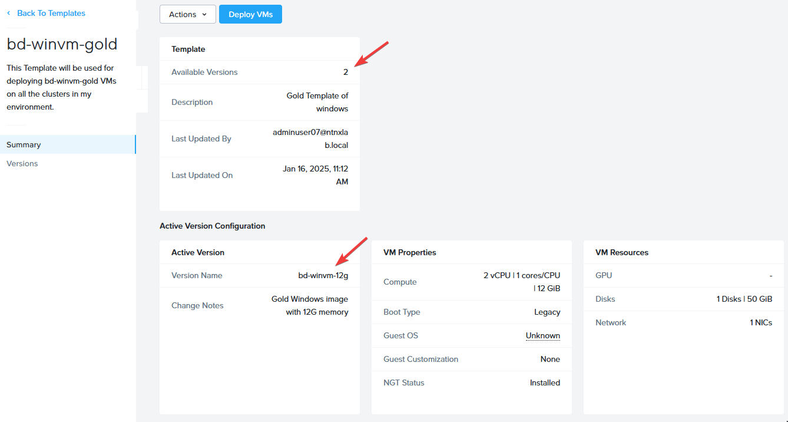
    
10.  คลิก **Versions** ด้านบน ซึ่งแสดงเวอร์ชันทั้งหมดของ template และให้ผู้ดูแลระบบเลือก template ที่จะใช้ deploy VM
    
    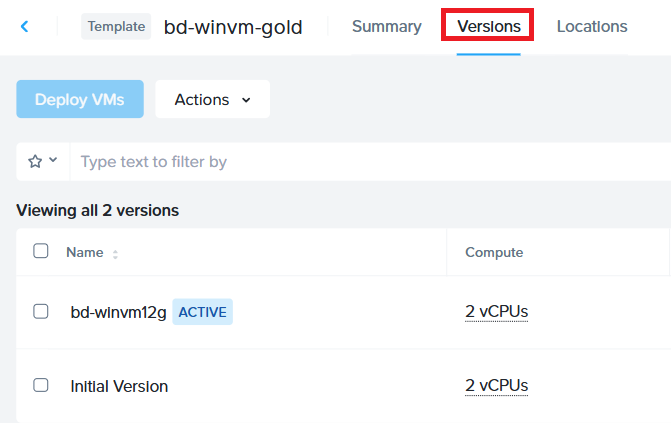
    
11.  นอกจากการเปลี่ยนแปลงการกำหนดค่า คุณยังสามารถอัปเดต image เองใน template เช่นเพิ่มซอฟต์แวร์หรือ patch OS และสร้าง template ใหม่ มาดูวิธีทำ เริ่มจาก Summary tab ทางซ้าย คลิก **Actions** แล้วคลิก **Update Guest OS**
    
    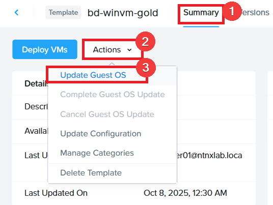
    
12.  เช่นเดิม ระบบจะถามว่าจะอัปเดตเวอร์ชันไหน และคราวนี้คุณจะเห็นว่าคุณสามารถเลือกระหว่าง 2 template ที่เรามี เราจะคงเลือก Active template ซึ่งเป็นค่าเริ่มต้นและคลิก **Proceed**
    
    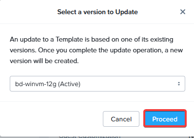
    
13.  หน้าต่างถัดไปแสดงกระบวนการที่จะเกิดขึ้น VM จะถูก deploy จาก template ที่คุณสามารถทำการเปลี่ยนแปลงและทำกระบวนการให้เสร็จสิ้นในหน้า template คลิก **Proceed**
    
    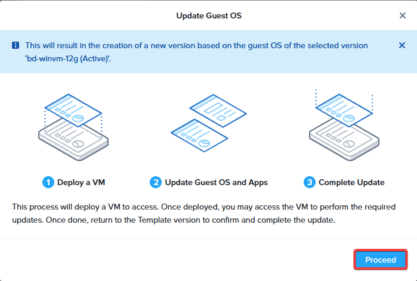
    
14.  เมื่อ VM ถูก deploy แล้ว คลิกที่ **VM name**
    
    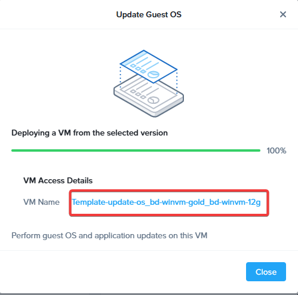
    
15.  เปิด VM โดยคลิก **Power Operations** แล้วคลิก **Power On** ในหน้า VM Summary
    
    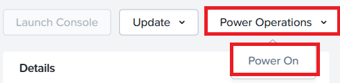
    
16.  เมื่อ VM เปิดเครื่องแล้ว เปิด console และทำการเปลี่ยนแปลงบางอย่างเพื่อจำลองการเปลี่ยนแปลง OS รหัสผ่านสำหรับเข้าสู่ระบบบัญชี `Administrator` จะเป็นรหัสผ่านที่กำหนดให้คุณหรือ `nutanix/4u`
    
    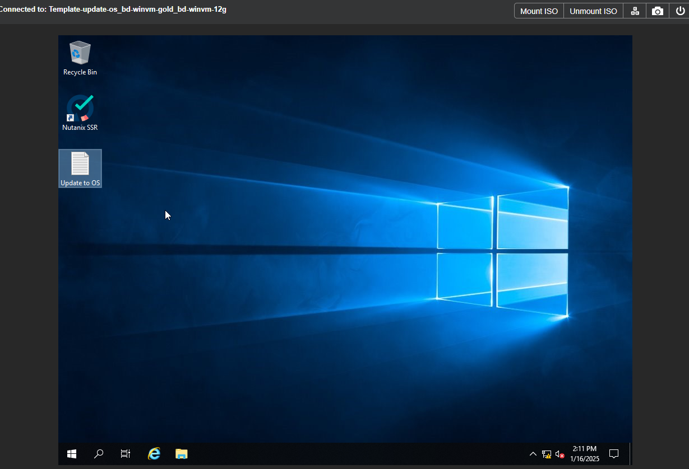
    
17.  เมื่อทำการอัปเดตแล้ว ต่อไปเราต้องอัปเดตกระบวนการแก้ไข template เพื่อแจ้งว่าการเปลี่ยนแปลงเสร็จสิ้น จากเมนูด้านข้าง คลิก **Templates** แล้วคลิก **Update Initiated**
    
    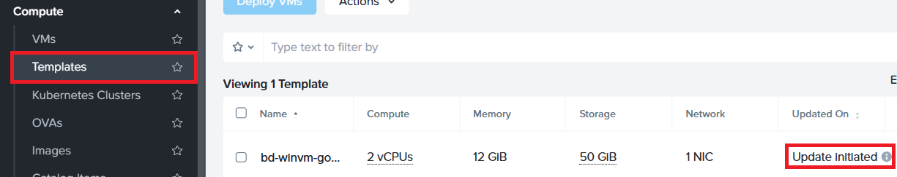
    
18.  คลิก **Complete Update**
    
    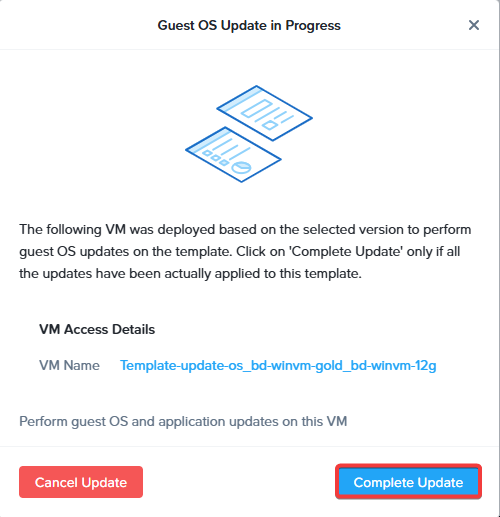
    
19.  ในหน้าถัดไป ระบุรายละเอียดต่อไปนี้และคลิก **Complete Update**
    
    -   **New Version Name** - `Initial`\-winvm-updateOS
    -   **Change Notes** - Updates to OS
    -   เลือกกล่องที่ระบุ **Yes, set this new version as active**
    
    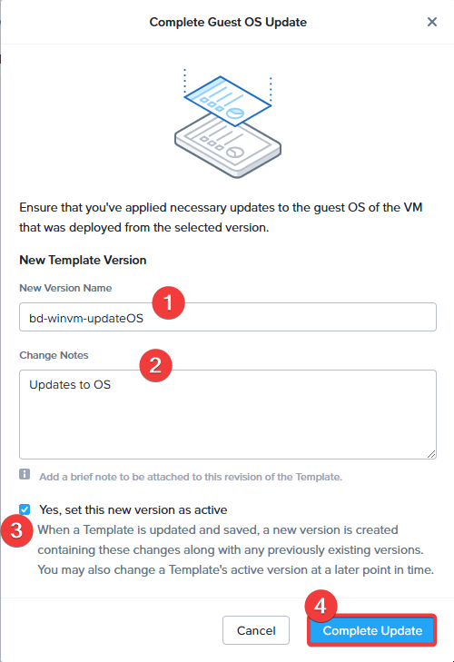
    
20.  คลิกที่ชื่อ template และคลิก **Versions** ตอนนี้คุณจะเห็นเวอร์ชัน template ล่าสุดพร้อมกับอีก 2 เวอร์ชัน
    
    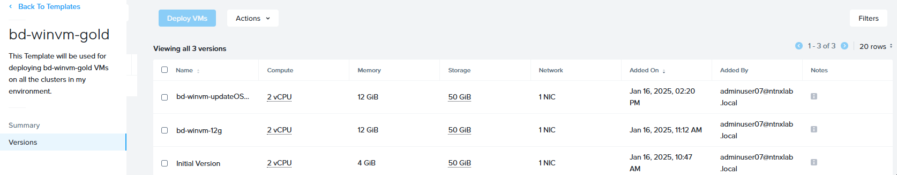
    

### Deploying VM from template

ตอนนี้เรารู้วิธีสร้าง template และสร้างเวอร์ชันแล้ว ต่อไปมาเริ่ม deploy VM จาก template กัน คุณสามารถ deploy VM โดยตรงจากหน้า template และยังสามารถทำได้จากหน้า VM

1.  จากเมนูด้านข้าง เลือก **Compute** และคลิก **VMs**
    
    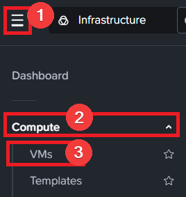
    
2.  คลิก **Create VM from Template**
    
    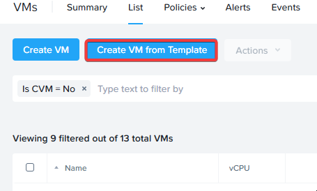
    
3.  เลือก Windows template ใน dropdown และคลิก **Begin**
    
    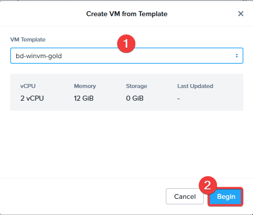
    
    !!! note
        ในกรณีนี้ไม่มีตัวเลือกสำหรับเวอร์ชันที่จะ deploy ระบบจะ deploy VM จากเวอร์ชัน active ของ template นี้ หากต้องการเวอร์ชันเก่า สามารถทำได้จากหน้า template
    
4.  กรอกรายละเอียดต่อไปนี้และคลิก **Next**
    
    -   **Name** - `Initial`\-winvm-fromtemplate
    -   **Number of VMs** - 2
    -   **Starting Index Number** - 0
    -   คงค่าที่เหลือเป็นค่าเริ่มต้น
    
    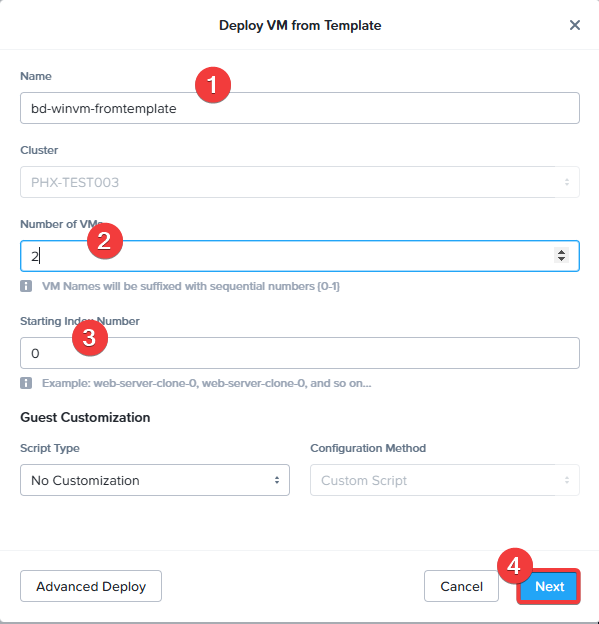
    
5.  ตรวจสอบการตั้งค่าและคลิก **Deploy**
    
    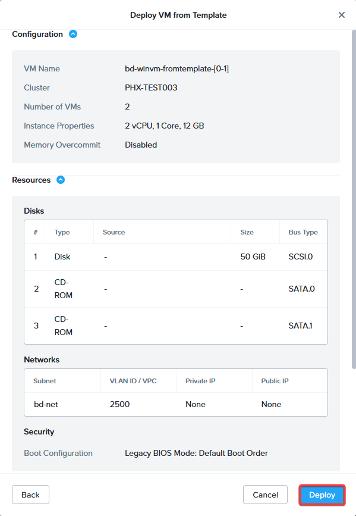
    
6.  ในหน้า VM คุณจะเห็น VM เมื่อถูก deploy แล้ว คุณสามารถเปิดเครื่องและตรวจสอบว่าเป็น VM ที่ถูกต้องที่ deploy จาก active template
    
    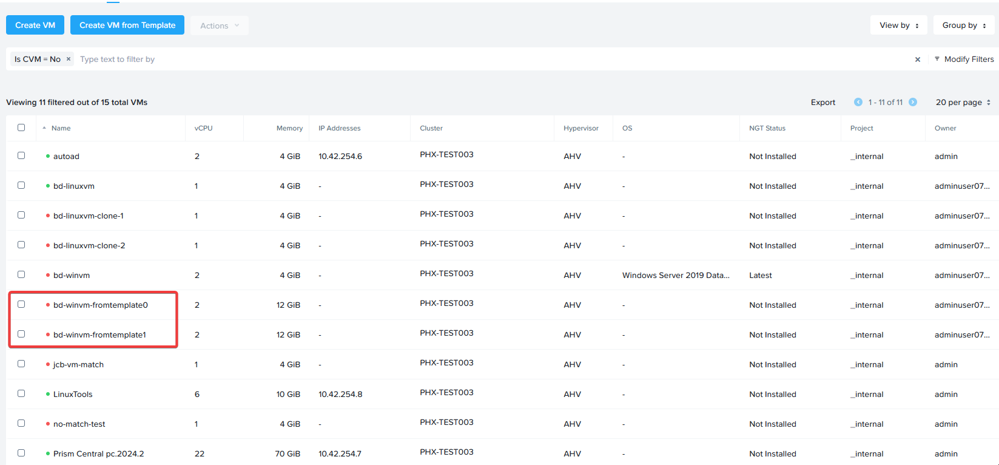
    

### Migrating a VM Between Hosts

VM live migration เป็นฟีเจอร์สำคัญช่วยให้ VM สามารถย้ายได้อย่างราบรื่นข้ามโฮสต์ภายในคลัสเตอร์ ในขณะบำรุงรักษา infrastructure หรือการปรับสมดุลการใช้ทรัพยากรณ์ของระบบ มาดูวิธีทำด้วย AHV และ Prism Central

1.  ในหน้ารายการ VM คลิกที่ Linux VM `Initial`\-linuxvm ที่คุณสร้างก่อนหน้า
    
    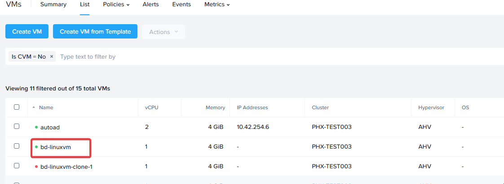
    
2.  จดชื่อโฮสต์ที่ VM กำลังรันอยู่ แล้วคลิกขวาที่ VM วางเมาส์เหนือ **Migrate** และคลิก **Migrate within Cluster**
    
    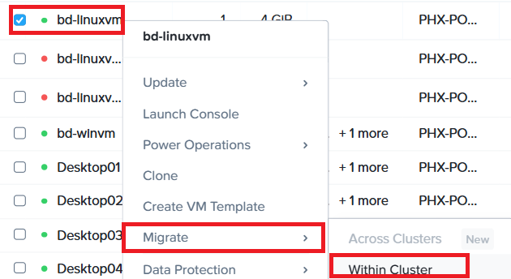
    
3.  คุณสามารถเลือกโฮสต์อื่นๆ ในคลัสเตอร์เป็นเป้าหมายการ migrate สำหรับ VM หรือรับค่าเริ่มต้นและให้ AHV เลือกตำแหน่งโดยอัตโนมัติ เราจะให้ AHV ตัดสินใจแทน คลิก **Migrate**
    
    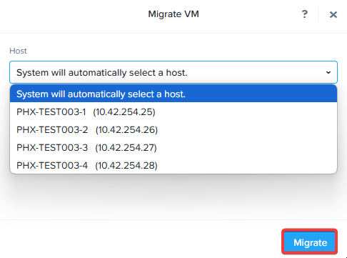
    
4.  เมื่องานเสร็จสมบูรณ์ ตรวจสอบว่าตำแหน่งโฮสต์ VM ของคุณเปลี่ยนจากโฮสต์ที่บันทึกไว้ข้างต้นเป็นตำแหน่งใหม่
    
    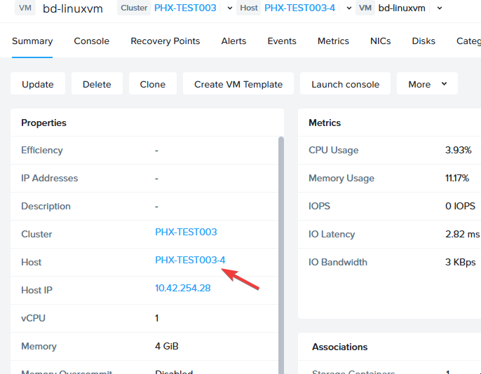
    

ด้วย Prism Central และ AHV การ live migrate VM ภายในคลัสเตอร์เป็นเรื่องง่ายและตรงไปตรงมา ต่อไป มาดูวิธีกำหนดค่า affinity policy สำหรับ VM เพื่อให้รันบนโฮสต์บางตัวเท่านั้น

### Affinity Policies

VM-to-Host affinity rules มักใช้เพื่อกำหนดค่า VM ให้รันบนโฮสต์เฉพาะเท่านั้น Affinity มักทำเพื่อเหตุผลด้านประสิทธิภาพหรือการอนุญาตใช้งาน AHV ยังสามารถสร้าง VM-to-VM anti-affinity rules ใน Prism Central (เริ่มต้นด้วย AOS 7.0 และ PC 2024.3) ซึ่งมักใช้สำหรับแอปพลิเคชันที่มีความพร้อมใช้งานสูง หรือเมื่อคุณต้องการให้แน่ใจว่า instance หลายตัวของแอปพลิเคชันไม่รันบนโหนดเดียวกัน

ในการสร้าง Affinity Policy ใน Prism Central ก่อนอื่นต้องสร้าง category ที่เราจะกำหนดให้กับ VM และโฮสต์ที่เชื่อมต่อกันใน affinity policy ดังที่กล่าวไว้ก่อนหน้า categories เป็นคู่ key:value ที่ Prism Central ใช้เพื่อเชื่อมโยงกับ entity และกำหนด policy ตาม category

1.  จากเมนูด้านข้าง เลือก **Administration** และคลิก **Categories**
    
    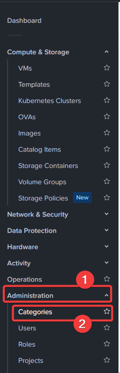
    
2.  ที่นี่คุณจะเห็น category ที่กำหนดโดยระบบที่มีอยู่แล้ว ทำการสร้าง custom category เพื่อใช้สำหรับ affinity policy คลิก **New Category**
    
    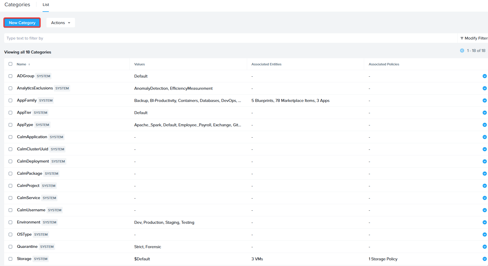
    
3.  กรอกรายละเอียดต่อไปนี้และคลิก **Save**
    
    -   **Name** - `Initial`\-affinity
    -   **Purpose** - VM-Host affinity
    -   **Values** - vm
    -   **Values** - host
    
    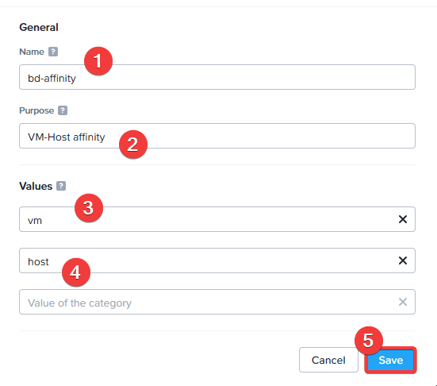
    
4.  ต่อไปกำหนด category ให้กับ entity ก่อนอื่นทำการกำหนดให้กับโฮสต์ จาก App Switcher เลือก _Infrastructure_\* แล้วในแผงเมนูคลิก **Hardware** และคลิก **Hosts**
    
    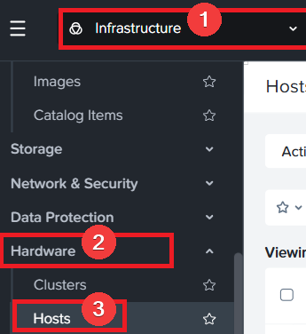
    
5.  ในหน้าโฮสต์ เลือกกล่องถัดจากโฮสต์ 2 ตัวแรก คลิก **Actions** แล้วคลิก **Manage Categories**
    
    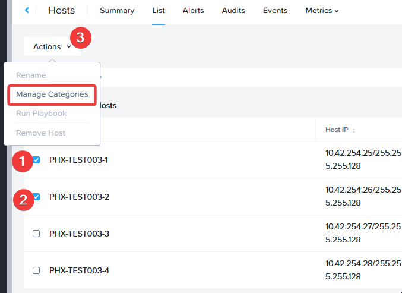
    
    !!! note
        เราสามารถเลือกได้มากกว่าหนึ่งโฮสต์ เพื่อให้ VM มีที่ migrate ไปในกรณีที่บางโฮสต์ไม่พร้อมใช้งาน
    
6.  ค้นหา category ที่คุณสร้างและกำหนดค่า `initial`\-affinity:host ให้กับโฮสต์และคลิก **Save**
    
    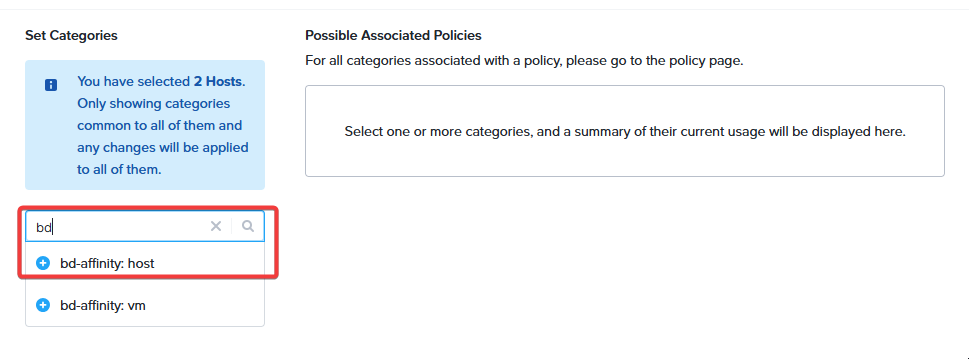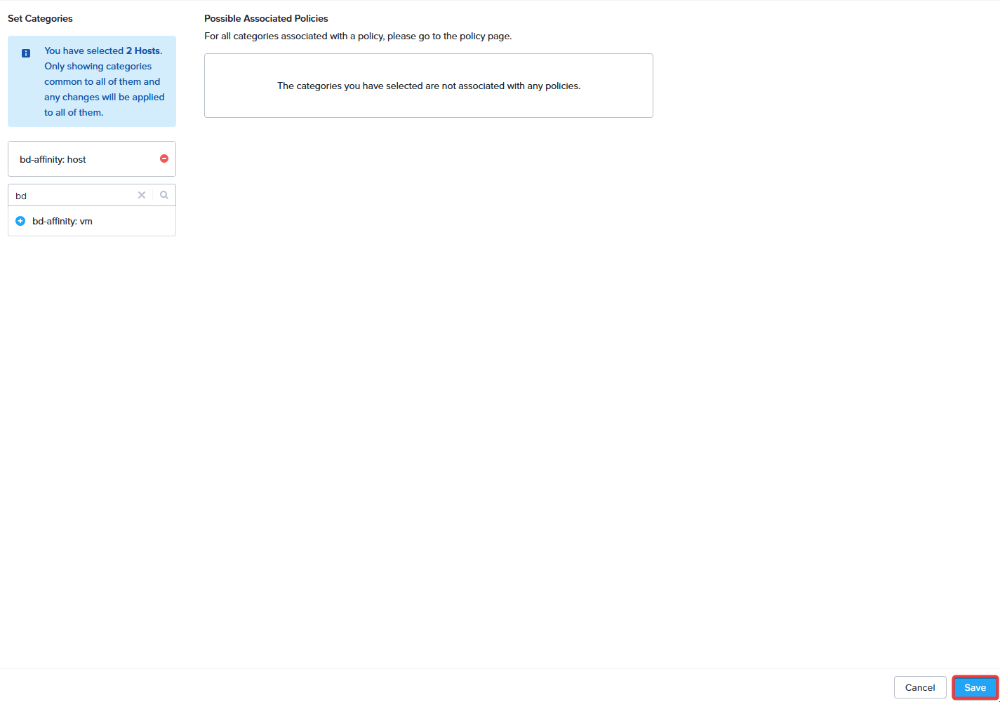
    
7.  ต่อไป ทำสิ่งเดียวกันกับ VM ของเรา จากเมนูด้านข้าง ไปที่หน้า **VMs**
    
8.  ในหน้า VM เลือกกล่องถัดจาก Linux clone VM 2 ตัวที่คุณสร้าง (`Initial`\-linuxvm-clone-#) คลิกขวาที่ VM และวางเมาส์เหนือ **Other Actions** จากนั้นคลิก **Manage Categories**
    
    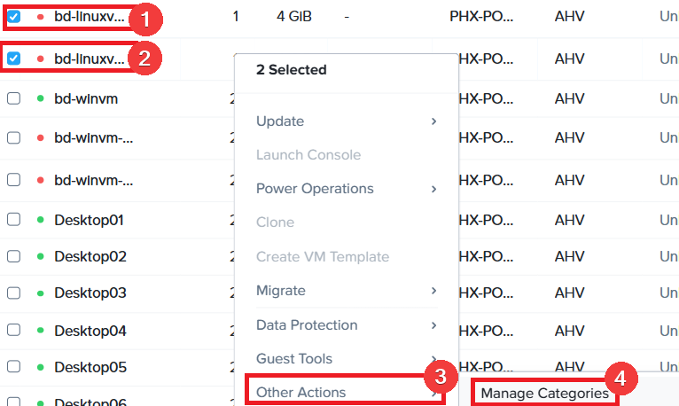
    
9.  ในหน้าถัดไป ทำเหมือนข้างต้นแต่คราวนี้ค้นหาและกำหนดค่า `initial`\-affinity:vm ให้กับ VM และคลิก **Save**
    
    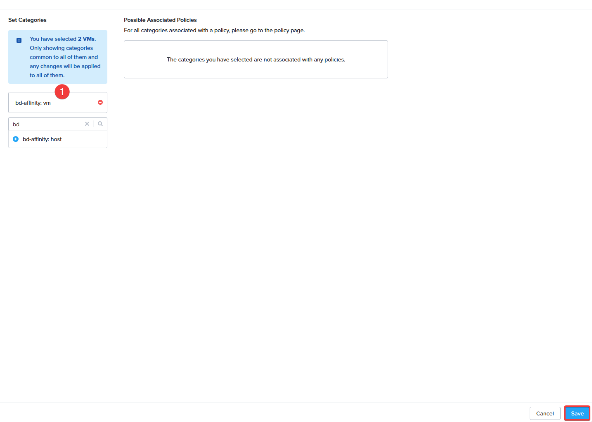
    
10.  ต่อไป สร้าง affinity policy จากหน้ารายการ VM คลิก **Policies** แล้วคลิก **VM-Host Affinity Policies**
    
    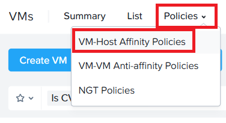
    
11.  คลิก **Create VM-Host Affinity Policies**
    
    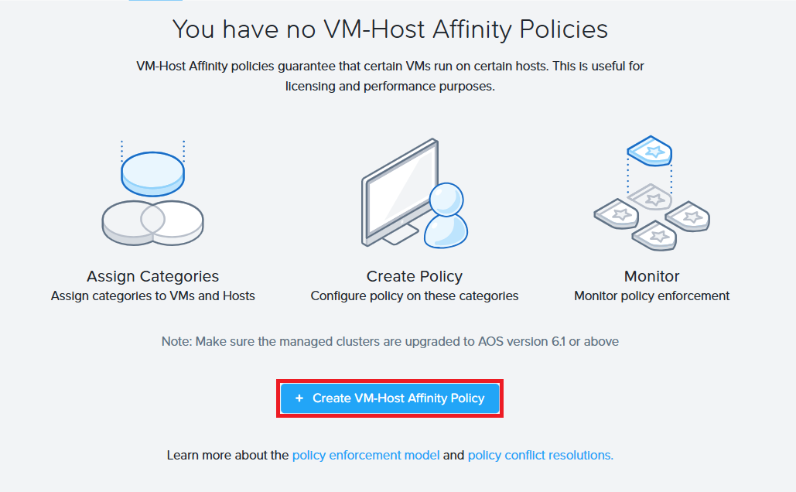
    
12.  กรอกรายละเอียดต่อไปนี้และคลิก **Create**
    
    -   **Name** - `Initial`\-vm-host-affinity
    -   **Description** - VM to Host Affinity
    -   **VM category** - `Initial`\-affinity-vm (จะแสดงว่า 2 VMs)
    -   **Host category** - `Initial`\-affinity-host (จะแสดงว่า 2 hosts)
    
    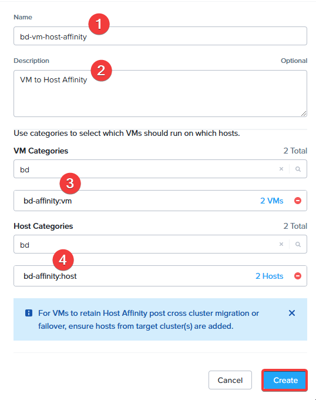
    
    !!! note
        ในส่วนนี้ หากคุณมีคลัสเตอร์หลายตัวที่กำลังจัดการ และต้องการให้แน่ใจว่า affinity สามารถที่จะข้ามคลัสเตอร์หลังจาก cross-cluster live migration คุณสามารถกำหนดโฮสต์จากคลัสเตอร์หลายตัวให้เป็นส่วนหนึ่งของ host category ได้
    
13.  เมื่อสร้าง policy แล้ว คุณจะเห็น entity ที่กำหนดไว้ และตรวจสอบว่า compliant หรือไม่
    
    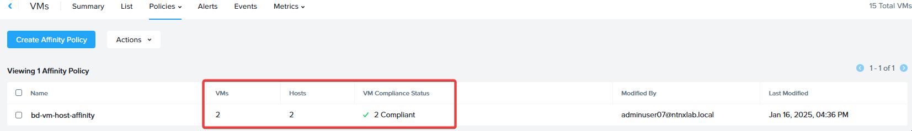
    
14.  เปิด VM และตรวจสอบว่ารันบนโฮสต์ affinity ที่ระบุภายใน affinity policy คลิก **List** ตรวจสอบให้แน่ใจว่าเลือก 2 VM แล้ว คลิก **Actions** และวางเมาส์เหนือ **Power Operations** แล้วคลิก **Power On**
    
    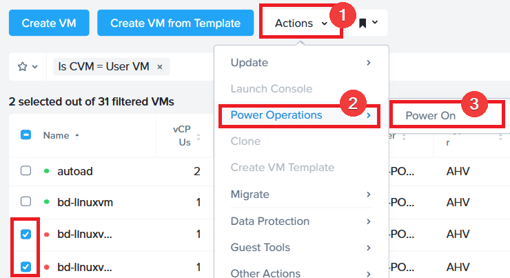
    
15.  คลิกที่ชื่อ VM และตรวจสอบว่าถูกเปิดบนโฮสต์ที่ถูกต้องที่เรากำหนด policy
    
    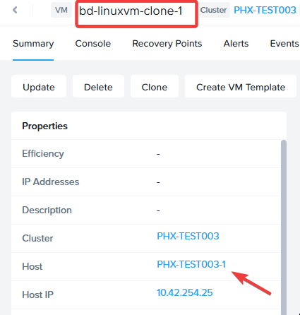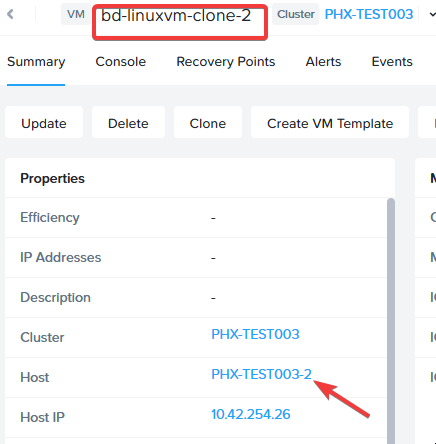
    
16.  ทำการ migrate VM หนึ่งตัวกัน คลิก **More** แล้ววางเมาส์เหนือ **Migrate** และคลิก **Within Cluster**
    
    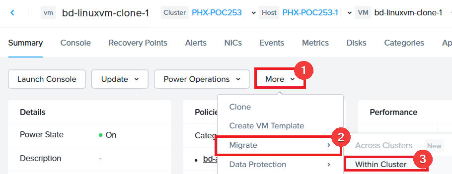
    
17.  คุณจะเห็นข้อความว่า VM สามารถ migrate ได้เฉพาะโฮสต์บางตัวเนื่องจากเป็นส่วนหนึ่งของ affinity policy ตอนนี้ เราจะคงค่าเริ่มต้นของการให้ AHV จัดการและคลิก **Migrate**
    
    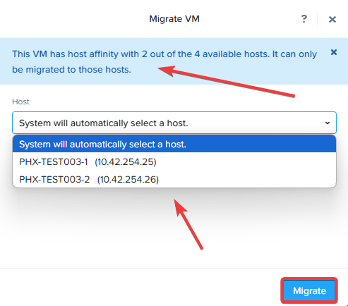
    
18.  คุณจะเห็นว่า VM ได้ย้ายไปยังโฮสต์อื่นที่คุณเลือกภายใน affinity policy แล้ว
    
    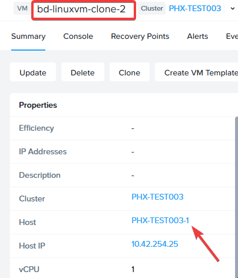
    

### High Availability & Dynamic Scheduling

High availability เปิดใช้งานโดย default สำหรับ AHV และจะรีสตาร์ท VM ตามความพยายามที่ดีที่สุดในกรณีที่โฮสต์ล้มเหลว การกำหนดค่าเพิ่มเติมสามารถตั้งค่า resource reservation เพื่อให้แน่ใจว่ามีความจุที่พร้อมใช้งานในระหว่างเหตุการณ์ HA

ด้วยบริการ Acropolis Dynamic Scheduler (ADS) AHV จะทำการตัดสินใจการวาง VM อย่างชาญฉลาด และยัง migrate VM ไปยังโฮสต์อื่นภายในคลัสเตอร์แบบไดนามิกเพื่อเพิ่มประสิทธิภาพ workload ADS ทำงานโดย default และไม่ต้องการการกำหนดค่าเพิ่มเติม

ข้อดีของ Nutanix AHV solution คือการตัดสินใจการวาง VM ไม่ได้อิงแค่การหลีกเลี่ยง CPU/memory congestion แต่ยังรวมถึงประสิทธิภาพ storage

ดูรายละเอียดเพิ่มเติมเกี่ยวกับ _Acropolis Dynamic Scheduler_ [ที่นี่](https://www.nutanixbible.com/4a-book-of-aos-architecture.html#dynamic-scheduler)

## Takeaways

- ในแล็บนี้ คุณได้เรียนรู้ว่า AHV และ Prism Central ให้ชุดเครื่องมือและการดำเนินการที่ครบครันซึ่งสามารถดำเนินการเพื่อจัดการ VM ในคลัสเตอร์ได้อย่างง่ายดายและใช้งานง่าย

---

[← Back: Deploying Workloads](ncp1-deployingworkloads.md) | [Home](ncp1-whatisncp.md) | [Next: Data Protection →](ncp1-dataprotection.md)
