# Network Configuration

## Overview

ในส่วนนี้ คุณจะได้เรียนรู้วิธีการตั้งค่าเครือข่าย โดยเครือข่ายที่คุณสร้างในขั้นตอนต่อไปนี้จะช่วยให้ VM มีการเชื่อมต่อด้วยการกำหนดเครือข่ายที่เหมาะสมให้กับ virtual network card (NIC) ของ VM แต่ละตัว

## AHV Networking Background

Nutanix's Acropolis Hypervisor (AHV) ใช้ Open vSwitch (OVS) สำหรับการเชื่อมต่อเครือข่าย VM ทั้งหมด OVS เป็นซอฟต์แวร์โอเพนซอร์สที่ออกแบบมาเพื่อทำงานในสภาพแวดล้อมการจำลองเสมือนแบบหลายเซิร์ฟเวอร์ แต่ละเซิร์ฟเวอร์ AHV สามารถมีอินสแตนซ์ OVS เป็นของตัวเอง และอินสแตนซ์ OVS ทั้งหมดจะรวมกันเป็น logical switch เดียว

แต่ละ node มักจะเชื่อมต่อกับ physical switch ไปยัง Virtual LAN (VLAN) หลายตัวเป็นเครือข่ายเสมือน

การกำหนดค่าเครือข่าย VM ทำผ่าน Prism (หรือ CLI/REST ตามต้องการ) ทำให้การจัดการเครือข่ายใน AHV ง่ายมาก

ด้วย AHV คุณยังสามารถตั้งค่าเซิร์ฟเวอร์ DHCP เพื่อกำหนด IP address ให้กับ VM บนเครือข่ายนั้นโดยอัตโนมัติโดยใช้บริการ IP address management (IPAM) IPAM สามารถทำให้การจัดการเครือข่ายง่ายขึ้น เนื่องจากคุณไม่จำเป็นต้องตั้งค่าเซิร์ฟเวอร์ DHCP แยกต่างหากสำหรับเครือข่าย

รายละเอียดเพิ่มเติมเกี่ยวกับ AHV networking สามารถดูได้ [ที่นี่](https://www.nutanixbible.com/5a-book-of-ahv-architecture.html#networking)

### Virtual Networks

-   คล้ายกับ VMware distributed port group
-   Virtual NIC แต่ละตัวทำงานบนเครือข่ายเสมือนหนึ่งตัวเท่านั้น
-   เครือข่ายเสมือนแต่ละตัวสามารถกำหนดเป็นกลุ่มของ vNIC
-   Physical switch port ต้องกำหนดค่าให้ trunk VLAN

มาดูเครือข่ายบนคลัสเตอร์กัน

1.  จากเมนูด้านข้าง เลือก **Network & Security** จากนั้นคลิก **Subnets**
    
    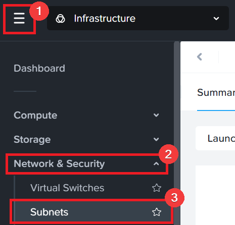
    
2.  หน้านี้แสดงรายการ virtual subnet ที่มีอยู่แล้วบนคลัสเตอร์ ด้วย Nutanix คุณสามารถสร้าง subnet ได้ 3 ประเภทที่แตกต่างกัน:
    

    -   VLAN Basic : นี่คือ subnet เริ่มต้นที่สร้างบนคลัสเตอร์ซึ่งจัดการโดย Acropolis leader ของคลัสเตอร์    
    -   VLAN : หาก network controller เปิดใช้งาน และ VLAN ไม่มีป้ายกำกับ Basic แสดงว่าเป็น VLAN ที่จัดการโดย Network Controller ตั้งแต่ AOS 6.7 ผู้ดูแลระบบสามารถสร้าง VLAN ที่จัดการโดย Network Controller จากส่วนกลาง และสามารถตั้งค่าให้เป็น VLAN เริ่มต้นหากต้องการผ่านการตั้งค่า    
    -   Overlay Network : นี่คือ subnet แบบ IP-based overlay สำหรับ [Virtual Private Cloud (VPC)](https://portal.nutanix.com/page/documents/details?targetId=Nutanix-Flow-Virtual-Networking-Guide-v5_0_0:ear-flow-nw-vpc-pc-c.html)
    
    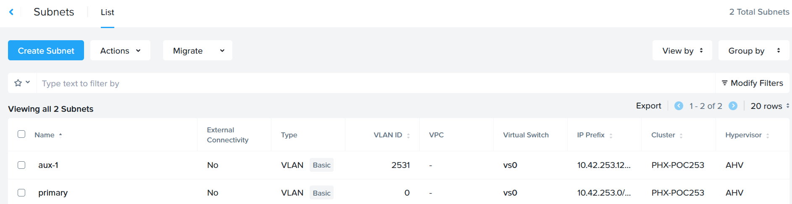
    

3.  คลิก **Primary** และดูการกำหนดค่าและการตั้งค่าของ subnet นี้
    
    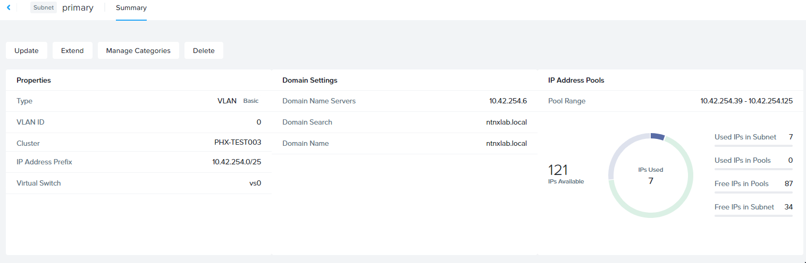
    

### Virtual NICs of VMs

-   vNIC แต่ละตัวจะอยู่บนเครือข่ายเสมือนหนึ่งตัวเท่านั้น
    
-   สำหรับเครือข่ายที่เปิดใช้งาน IPAM vNIC จะได้รับการกำหนด IP แบบ static ตลอดอายุการใช้งาน
    
-   ผู้ใช้สามารถกำหนดค่า pool เพื่อจัดสรร IP ได้ทั้งแบบอัตโนมัติหรือโดยการระบุ IP ด้วยตนเอง
    
    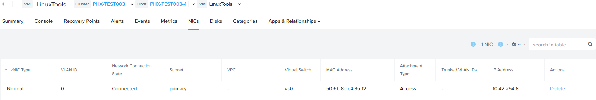
    

### IP Address Management (IPAM)

-   เซิร์ฟเวอร์ DHCP แบบ Integrated
-   AHV ทำการดักจับคำขอ DHCP จาก guest vm บนเครือข่าย IPAM จากนั้นทำการ assign ip ให้กับ guest vm
-   ผู้ดูแลระบบ virtualization จัดการช่วง IP address
-   รองรับตัวเลือก DHCP พร้อม UI สำหรับการกำหนดค่า DNS และ TFTP

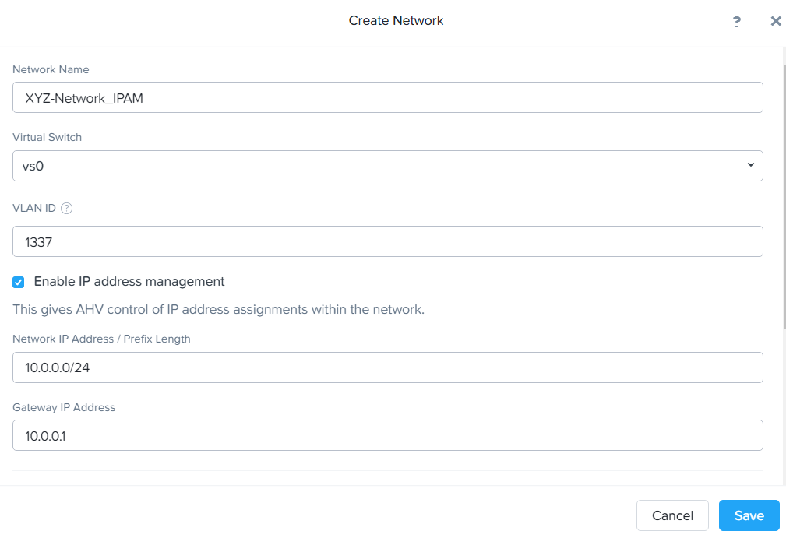

## Configure Network

ในแบบฝึกหัดต่อไปนี้ คุณจะสร้างเครือข่ายโดยใช้ VLAN ที่ไม่ถูกต้อง ซึ่งหมายความว่าไม่มีการส่งทราฟฟิก VM นอกโฮสต์แต่ละตัว วัตถุประสงค์เพื่อให้ง่ายต่อการสาธิต/การศึกษา

### Create Subnet without IPAM

มาสร้าง subnet ใหม่ใน Prism Central กัน เราจะสร้าง VLAN basic subnet โดยใช้ VLAN ใดก็ได้นอกจาก 0 และไม่ต้องเปิดใช้งาน IP address management

1.  จากเมนูด้านข้าง เลือก **Network & Security** จากนั้นคลิก **Subnets**

    

2.  คลิก **Create Subnet**

    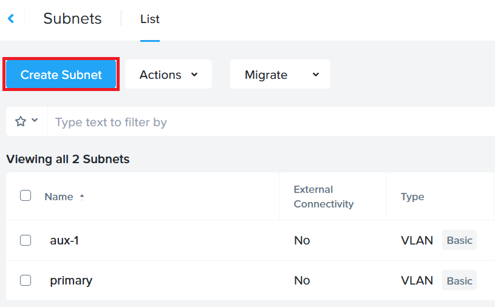

3.  ป้อนรายละเอียดต่อไปนี้และคลิก **Create**:

    -   **Subnet Name** - `Initials`\-net
    -   **Type** - VLAN (อีกตัวเลือกหนึ่งคือ overlay network ซึ่งสามารถสร้างสำหรับ VPC)
    -   **Virtual Switch** - vs0
    -   **VLAN ID** - ค่าใด (< 4096) นอกจาก VLAN ของเครือข่าย _Primary_ หรือ _Secondary_ ของคุณ เลือกตัวเลขระหว่าง 2000 ถึง 3000
    -   **IP Address Management** - เลือก `External IPAM`

    คุณสามารถคลิก Advanced Configuration dropdown เพื่อดูว่าเลือก VLAN Basic Networking ซึ่งหมายความว่า subnet นี้จะถูกจัดการโดย Acropolis leader และไม่ใช่ network controller นอกจากนี้หากเป็น overlay network subnet คุณสามารถสลับสวิตช์เพื่อเปิดใช้งาน external connectivity สำหรับ VPC

    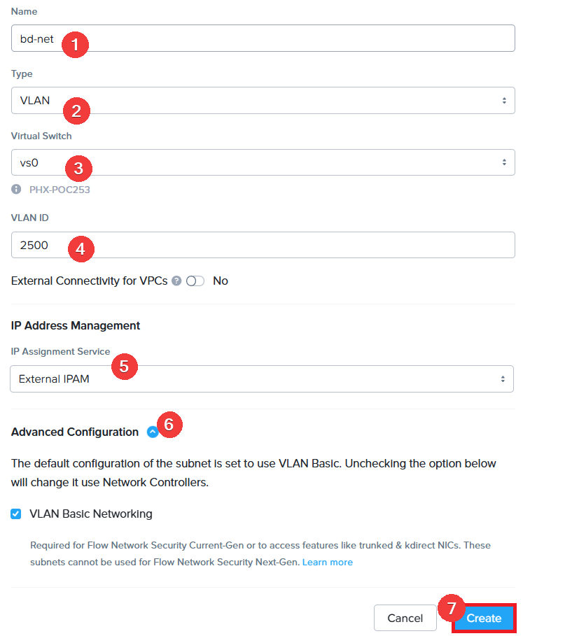

### Create Subnet with IPAM

มาสร้างเครือข่ายอีกตัวหนึ่ง แต่คราวนี้เราจะเปิดใช้งาน IPAM เพื่อตั้งค่า IP Address Management กับ AHV

1.  คลิก **Create Subnet**

    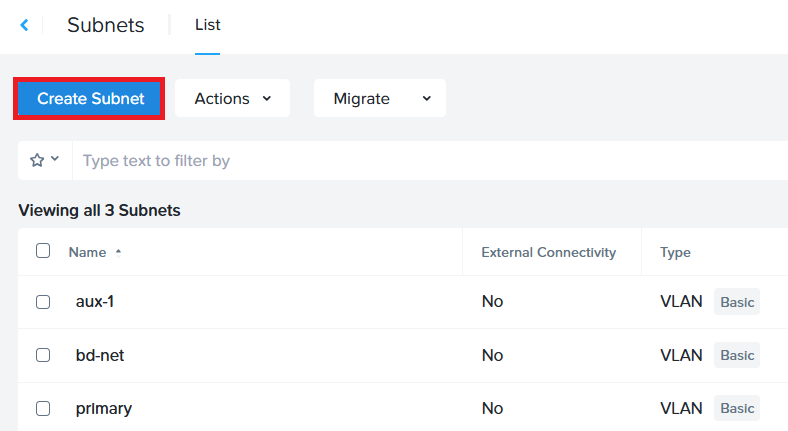

2.  ป้อนรายละเอียดต่อไปนี้และคลิก **Create**:

    -   **Subnet Name** - `Initials`\-net-IPAM
    
    -   **Type** - VLAN (อีกตัวเลือกหนึ่งคือ overlay network ซึ่งสามารถสร้างสำหรับ VPC)
    
    -   **Virtual Switch** - vs0
    
    -   **VLAN ID** - ค่าใด (< 4096) นอกจาก VLAN ของเครือข่าย _Primary_ หรือ _Secondary_ ของคุณ เลือกตัวเลขระหว่าง 2000 ถึง 3000
    
    -   **IP Assignment Service**: เลือก `Nutanix IPAM`
    
    -   **Network IP Address / Prefix** - `10.0.0.0/24`
    
    -   **Gateway IP Address** - `10.0.0.1`
    
    -   **IP Pools** - คลิก **Add IP Pool**

        -   **Start Address** - 10.0.0.10
        -   **End Address** - 10.0.0.50
        -   อย่าลืมคลิกเครื่องหมายถูกสีน้ำเงินเพื่อสร้าง IP pool

    -   เลื่อนหน้าและขยายตัวเลือก Domain Settings

        -   ที่นี่คุณสามารถป้อนข้อมูลสำหรับ DNS, Domain Search Information, Domain Name, TFTP Server name และ Boot File Information สำหรับ PXE boot เราจะปล่อยว่างไว้

    -   **Override DHCP Server** - ไม่เลือก หากคุณต้องการใช้เซิร์ฟเวอร์ DHCP ต้องระบุ IP address ของ DHCP เซิร์ฟเวอร์
    
    -   **Advanced Configuration** - ขยายและคราวนี้ **ยกเลิกการเลือก VLAN Basic Networking** เพื่อสร้าง subnet นี้ที่จะจัดการโดย Network Controller
    

    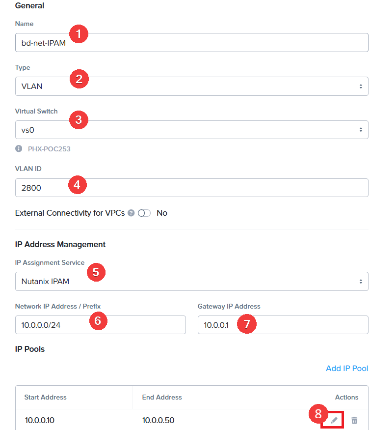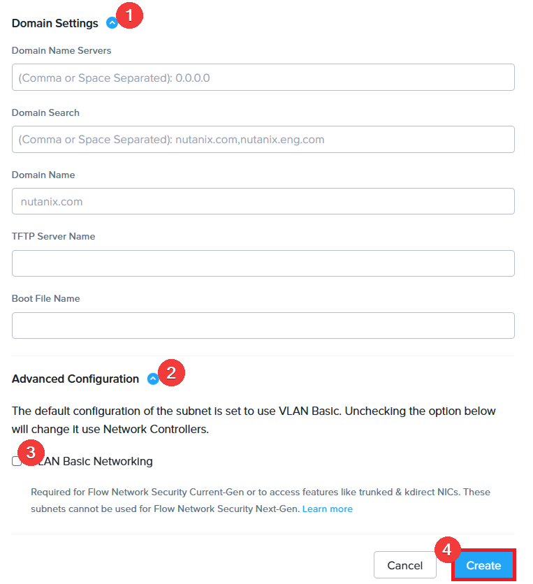

    !!! note
        สามารถสร้างช่วง pool หลายช่วงสำหรับเครือข่ายได้

    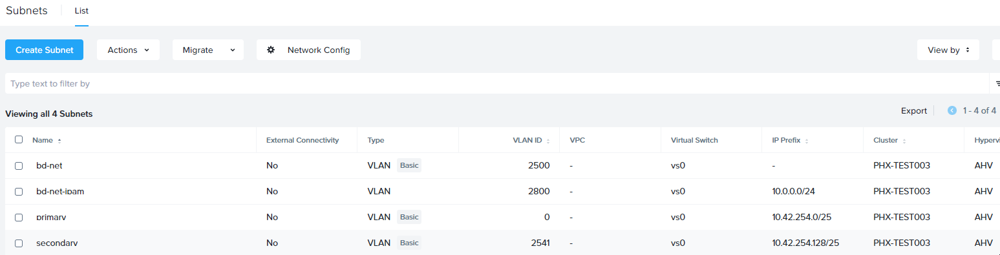

    เครือข่ายเสมือนที่กำหนดค่าแล้วจะพร้อมใช้งานทั่วทุกโหนดภายในคลัสเตอร์ VM ที่มี vNIC บนเครือข่ายนี้จะได้รับ DHCP address จากช่วงที่ระบุ การกำหนด IP นี้จะคงอยู่ตลอดอายุการใช้งาน VM ช่วยหลีกเลี่ยงความจำเป็นในการพึ่งพาการจอง DHCP หรือ IP แบบ static สำหรับ workload หลายตัว

## Takeaways

-   การตั้งค่าเครือข่ายในคลัสเตอร์เพื่อสร้างการเชื่อมต่อ VM เป็นเรื่องที่ทำได้ง่ายมาก
-   AHV มีความสามารถในการสร้าง subnet ประเภทต่างๆ รวมถึงความสามารถในการสร้าง overlay network เพื่อใช้ใน VPC สำหรับตั้งค่าเครือข่ายขั้นสูง
-   IPAM ตั้งค่าได้ง่ายมากภายในเครือข่าย และสามารถลดความซับซ้อนในการจัดการ IP ภายในคลัสเตอร์ได้อย่างมาก

---

[← Back: Storage Configuration](storageconfiguration.md) | [Home](index.md) | [Next: Deploying Workloads →](deployingworkloads.md)
