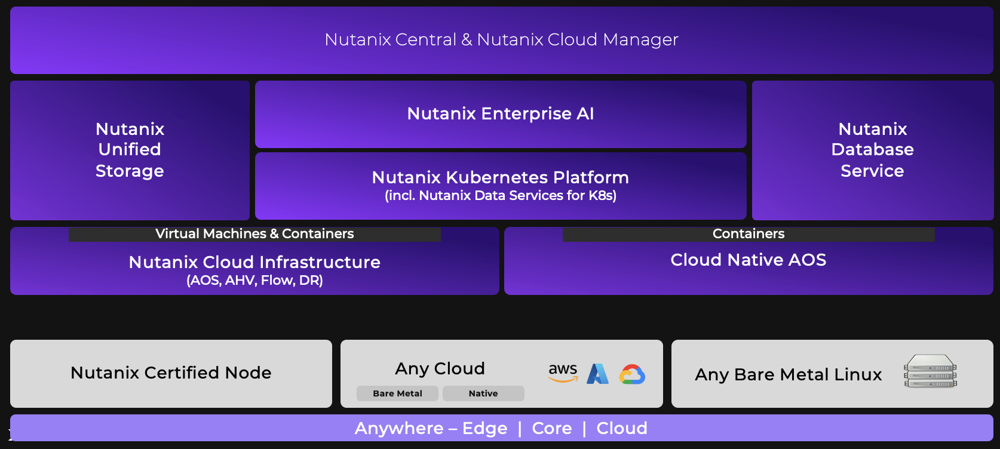

# Nutanix Cloud Platform (NCP)

**Nutanix Cloud Platform (NCP)** คือโซลูชันแบบ software-defined ที่ครบวงจร ออกแบบมาเพื่อสร้างและบริหารจัดการโครงสร้างพื้นฐานระบบ hybrid multicloud ที่มีความปลอดภัย ทนทาน และสามารถซ่อมแซมตัวเองได้ ช่วยให้องค์กรสามารถรันแอปพลิเคชันระดับ enterprise, workload แบบ cloud-native และงานด้าน AI/ML ได้อย่างไร้รอยต่อ ไม่ว่าจะเป็นระบบ datacenter ภายในองค์กร, public cloud (เช่น AWS และ Azure) หรือ edge environment

ด้วยการรวม compute, storage, virtualization และ networking เข้าไว้ในระบบเดียว NCP ช่วยขจัดปัญหา IT silo และทำให้เกิด cloud operating model ที่สอดคล้องเป็นหนึ่งเดียว

---

## Core Components

NCP ถูกสร้างขึ้นจากส่วนประกอบหลักสำคัญหลายส่วน ซึ่งแต่ละส่วนรับผิดชอบ layer ที่แตกต่างกันของโครงสร้างพื้นฐานและ data stack:

### Nutanix Cloud Infrastructure (NCI)
เป็น layer พื้นฐานแบบ hyperconverged infrastructure (HCI) ที่รวม compute, storage และ networking เข้าด้วยกัน มาพร้อมกับ hypervisor ระดับ enterprise ของ Nutanix เองที่ชื่อ **AHV** ที่มีความสามารถขั้นสูง เช่น:

- Data locality  
- Self-healing  
- Microsegmentation ผ่าน Flow Virtual Networking และ Flow Network Security  

### Nutanix Cloud Management (NCM)
เป็น management plane แบบรวมศูนย์ ที่ให้บริการ:

- Intelligent operations  
- Self-service orchestration  
- การควบคุมค่าใช้จ่าย (cost governance)  
- Security compliance ข้ามหลาย cloud environment  

### Nutanix Unified Storage (NUS)
โซลูชัน software-defined storage ที่รวม storage ทั้ง 3 ประเภทไว้ในแพลตฟอร์มเดียว ออกแบบมาเพื่อรองรับ scale และ ้high performance ประกอบด้วย:

- **Block storage** (Volumes)  
- **File storage** (Files)  
- **Object storage** (Objects)  

### Nutanix Database Service (NDB)
บริการแบบ **Database-as-a-Service (DBaaS)** ที่ช่วย automate การจัดการ life-cycle ของ database ทั้งการ provision และการ patch สำหรับ database engine ต่างๆ เช่น:

- PostgreSQL  
- MySQL  
- Microsoft SQL Server  
- Oracle RAC  
- MongoDB  

### Nutanix Cloud Clusters (NC2)
ขยาย NCI stack ไปยัง public cloud (AWS และ Azure) ได้แบบ native ทำให้สามารถย้าย workload และทำ disaster recovery ได้โดยไม่ต้อง refactor หรือ replatform แอปพลิเคชัน

---

## Advanced Integration: Kubernetes and AI

Kubernetes และ Enterprise AI เป็นเรื่องที่ท้าทายและเป็นหัวใจสำคัญของโครงสร้างพื้นฐานด้านเทคโนโลยีในปัจจุบัน ภายใต้ NCP ecosystem ประกอบด้วย:

### Nutanix Kubernetes Platform (NKP)
ทำให้การ deploy การบริหารจัดการ และการ automate Kubernetes cluster ข้าม hybrid cloud เป็นเรื่องง่าย

### Nutanix Data Services for Kubernetes (NDK)
ขยายความสามารถด้าน enterprise resiliency และ storage data services ของ NCP ไปยัง stateful containerized application

### Nutanix Enterprise AI / GPU Integration
NCP รองรับ **GPU pass-through** และ **vGPU** บน AHV ได้แบบ native เพื่อเร่งความเร็วของ workload ด้าน AI/ML และ large language model (LLM) ได้โดยตรงทั้งที่ core และที่ edge

---

## Conclusion

NCP มอบประสบการณ์ด้านโครงสร้างพื้นฐานและการบริหารจัดการที่สอดคล้องเป็นหนึ่งเดียว ไม่ว่าจะเป็น hardware หรือ cloud substrate แบบใดอยู่เบื้องหลัง ทำให้สิ่งต่อไปนี้ทำได้ง่ายขึ้น:

- การบังคับใช้ policy ด้านความปลอดภัย  
- การ optimize resource  
- การ scale แบบ dynamic  

---

[Home](ncp1-whatisncp.md) | [Next: Technology Overview →](ncp1-technologyoverview.md)