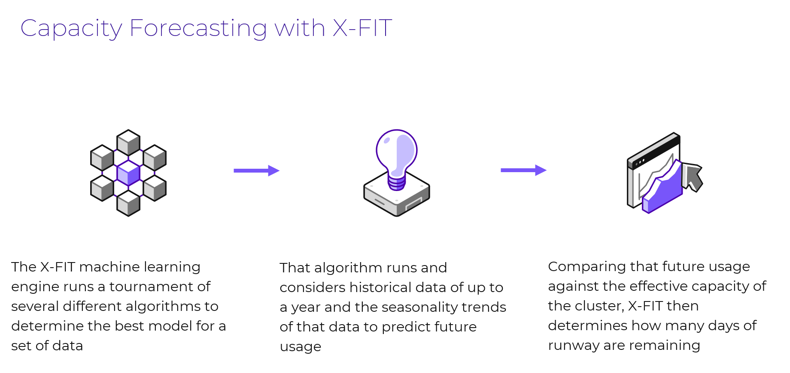

# Capacity Planning

## Overview

ในส่วนนี้ คุณจะได้เรียนรู้วิธีใช้ฟีเจอร์ Capacity Forecast and Planning เพื่อรับ hardware recommendations ในการขยาย capacity runway และวางแผนสำหรับ future workloads

Nutanix Cloud Manager มาพร้อมกับ machine learning แบบ built-in (เรียกว่า X-Fit และออกเสียงว่า cross fit) ซึ่งทำการวิเคราะห์และเรียนรู้อย่างต่อเนื่องว่า running workloads มีการใช้ compute และ storage capacity อย่างไร machine learning นี้ให้ actionable signals ที่ admin สามารถนำไปดำเนินการต่อได้ หนึ่งในสัญญาณที่ระบบให้คือตัวเลข “cluster runway” ซึ่งจะทำการพยากรณ์ (forecast) ว่า existing capacity จะสามารถตอบสนองความต้องการของธุรกิจได้ดีเพียงใด โดยอิงจาก predicted growth rates ที่คำนวณจาก past growth patterns

engine เดียวกันนี้ยังช่วยให้ admins สามารถวางแผนสำหรับ future expansion โดยอนุญาตให้ users สร้าง planning scenarios ตามความต้องการของพวกเขาได้ ในทั้งสองกรณี (เพื่อตอบสนอง existing runway needs หรือเพื่อวางแผนสำหรับ future workloads) Nutanix Cloud Manager มีเครื่องมือที่ใช้งานง่ายแต่ทรงพลัง ซึ่งจะให้ hardware recommendations เพื่อตอบสนอง business needs

## Interactive Demo

คลิกที่ลิงก์นี้

👀 [Guided walkthrough of capacity planning.](https://nutanix.storylane.io/share/scmtpldnvhqi) 👀

นี่คือ [link](https://nutanix.storylane.io/share/scmtpldnvhqi) ไปยัง guided walkthrough เพื่อสาธิตการทำงานของ feature นี้ เมื่อคุณทำ guided walk-through นี้เสร็จสิ้นแล้ว ให้กลับมาที่ lab manual
