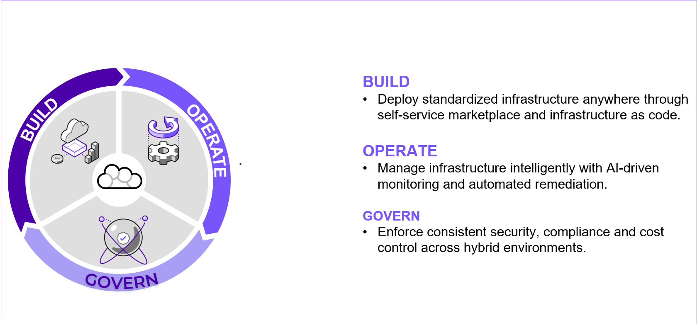

# Nutanix Cloud Operating Model

Nutanix Cloud Platform มีความสามารถในด้าน Infrastructure-as-a-Service (IaaS) และ Platform-as-a-Service (PaaS) ช่วยให้คุณสามารถ deploy และ manage ทุก workload ได้

Nutanix Cloud Manager ช่วยเร่งการทำงานของ Cloud Operating Model โดยเปิดโอกาสให้ลูกค้าสามารถ Build, Operate และ Govern สภาพแวดล้อม Hybrid Multicloud ของตนเองได้

# A Day in the Life of an IT Administrator

มาลองดูตัวอย่างสมมติเพื่อให้เข้าใจ cloud operating model กัน

IT Administrator บริหารจัดการ Nutanix Cloud Platform ที่รองรับ critical workloads รวมถึง inventory management app

Software Engineer ต้องการ infrastructure สำหรับ feature testing แต่ความล่าช้าในการ provisioning อาจส่งผลกระทบต่อ timeline ของโปรเจกต์ได้

เพื่อให้ทำงานได้ตามกำหนดการ Software Engineer จึง deploy VMs บน public cloud โดยมีการ over provisioning resources และข้ามขั้นตอนด้าน corporate security ประสบการณ์ด้านคลาวด์ที่จำกัดยังเพิ่มความเสี่ยงในการเปิดเผยทรัพย์สินทางปัญญา (intellectual property)

IT Administrator จึงเข้ามาจัดการ โดยให้คำแนะนำ engineer เกี่ยวกับ deployment ที่มีโครงสร้างและปลอดภัย โดยใช้ประโยชน์จากความสามารถของ Nutanix Cloud Manager สิ่งนี้ช่วยให้มั่นใจได้ว่าสามารถเข้าถึง resources ได้อย่างรวดเร็ว ในขณะที่ยังคงรักษา security และ compliance ไว้ได้

ต้องการเรียนรู้วิธีหลีกเลี่ยงข้อผิดพลาดทั่วไปเหล่านี้หรือไม่? มาสำรวจโซลูชันของ IT Admin ที่ใช้ Nutanix Cloud Manager กัน

---

[← Back: Nutanix Cloud Management](ncp2-nutanix-cloud-platform.md) | [Home](ncp2-nutanix-cloud-platform.md) | [Next: Setting Up the Environment →](ncp2-setting-up-environment.md)
