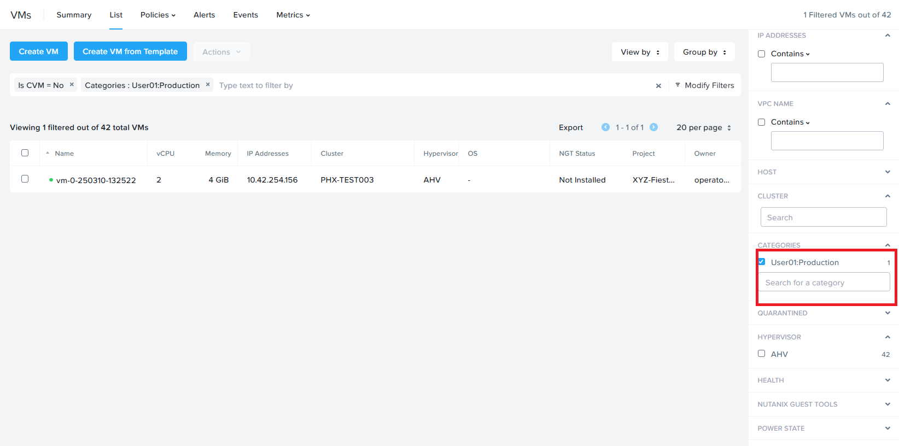
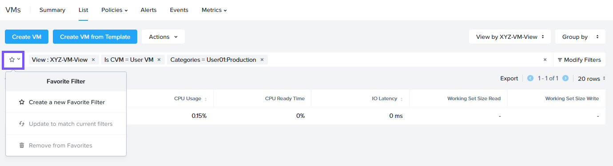
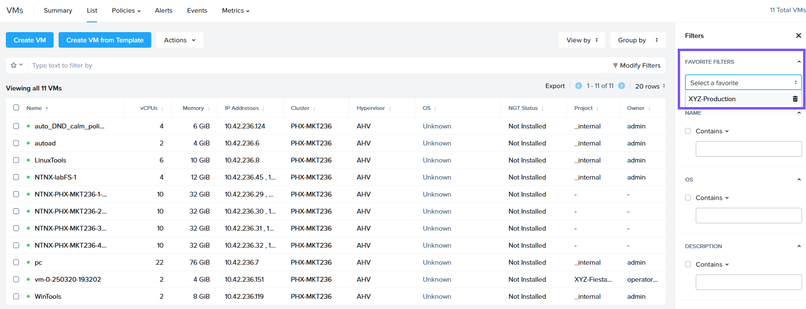
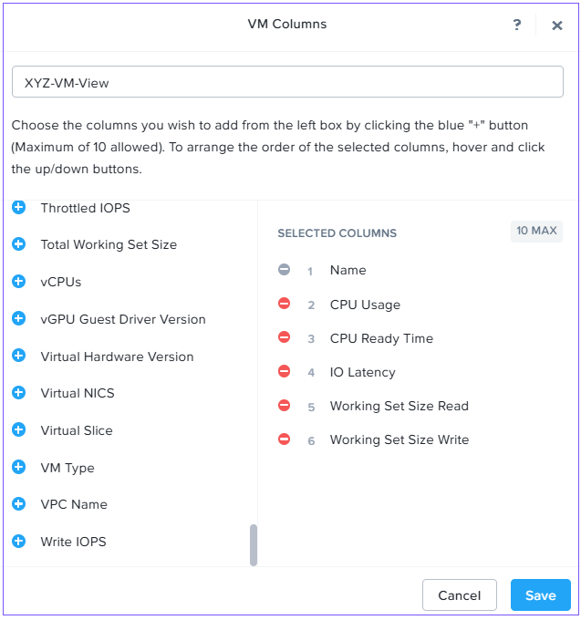

# Overview

Nutanix Prism Central เป็น single management point สำหรับ multicluster และ multisite Nutanix environments ใน multicluster environments คุณจำเป็นต้องเข้าถึง summary information ได้อย่างง่ายดาย ตัว entity explorer ใน explore view ใน Prism Central จะแสดง overview นี้

ฟีเจอร์ analysis ของ Prism Central สามารถ report ข้อมูลของ entities ต่างๆ ใน Nutanix cluster ได้ entity explorer จะเน้นไปที่ subset ของ entities ที่ให้การเข้าถึง configuration และ inventory data ของ VMs, Images, Clusters, Hosts, Alerts และอื่นๆ

ในส่วนนี้ มาทำความเข้าใจวิธีนำสิ่งนี้ไปประยุกต์ใช้กับ common workflows กัน

## Entity Browser, Search and Analysis

1.  Login เข้าสู่ Prism Central โดยใช้ account **adminuser`##`** และ PC password จากหน้า Connection Details
    
2.  ภายใน Prism Central ให้เลือก **Infrastructure** > **Compute** > **VMs**
    
3.  เลือก **Modify Filters** และสำรวจ options ที่มีให้ใช้งาน
    
4.  ระบุตัวอย่าง filters ต่อไปนี้ และตรวจสอบว่าได้ทำเครื่องหมายใน box ที่เกี่ยวข้องแล้ว:
    
    Categories - **User`##` : Production** โดยที่ `##` คือหมายเลขที่คุณได้รับมอบหมาย
    
    
    
5.  สังเกต filters อื่นๆ ที่เป็นประโยชน์ที่มีให้ใช้งาน เช่น VM efficiency, memory usage และ storage latency
    
6.  เลือก VMs ที่ถูก filtered ไว้ แล้วคลิกที่ favorite filter icon จากนั้นเลือก **Create a new Favorite Filter**
    
7.  สำหรับชื่อ filter ให้ตั้งชื่อว่า `Initials-Production` โดยที่ initials คือชื่อย่อของคุณ
    
    
    
8.  คลิก **Save**
    
9.  Clear ตัว filters ทั้งหมด จากนั้นเลือก filter ใหม่ของคุณเพื่อกลับไปยัง VMs ที่คุณระบุไว้ก่อนหน้านี้อย่างรวดเร็ว
    
    
    
10.  เลือก dropdown **View by** เพื่อเข้าถึง out-of-box views แบบต่างๆ
    
11.  มาเพิ่ม custom view กัน คลิก **View by** > **Add Custom**
    
12.  พิมพ์ **Initials-VM-View** โดยที่ initials คือชื่อย่อของคุณลงในฟิลด์ **Enter a name for your selections**
    
13.  เลือก CPU Usage, CPU Ready Time, IO Latency, Working Set Size Read และ Working Set Size Write
    
14.  คลิก **Save**
    

!!! note
    view นี้สามารถใช้เพื่อช่วยในการระบุ (spot) ปัญหา VM performance ได้
