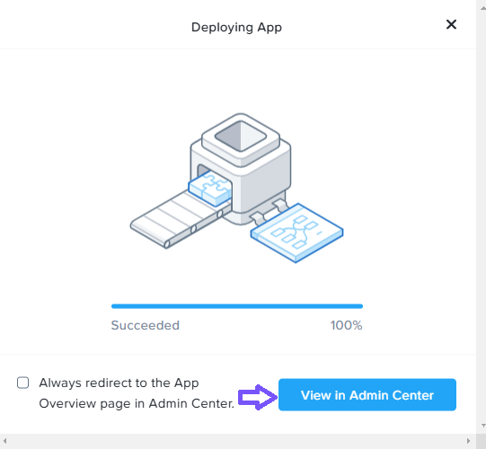
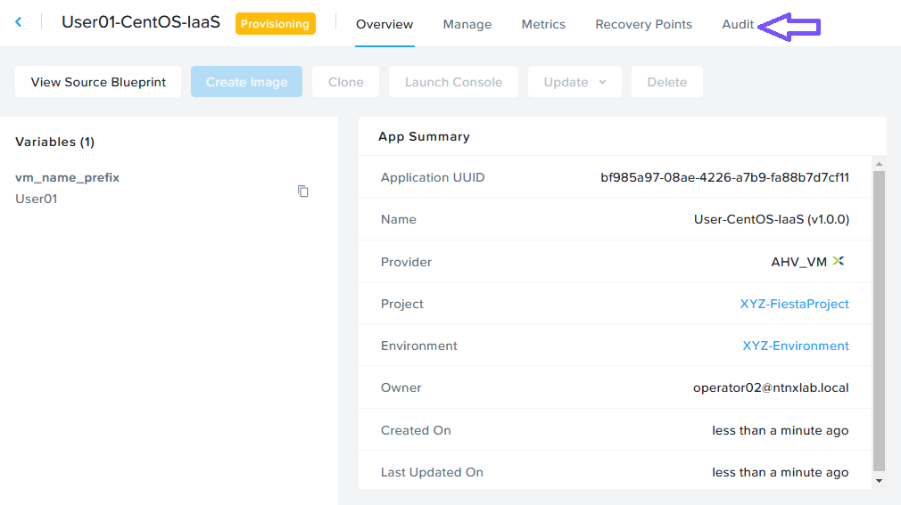
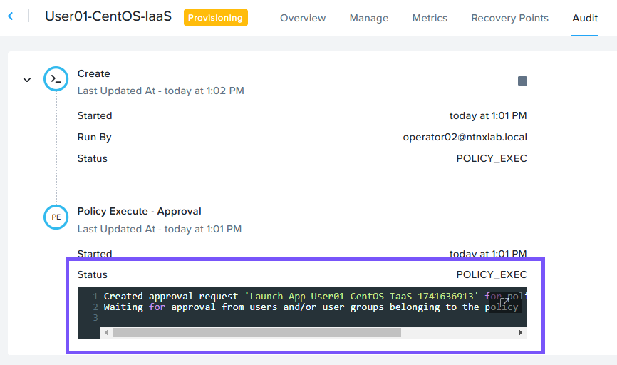
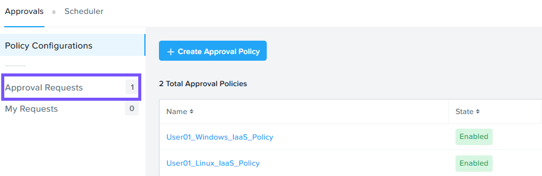
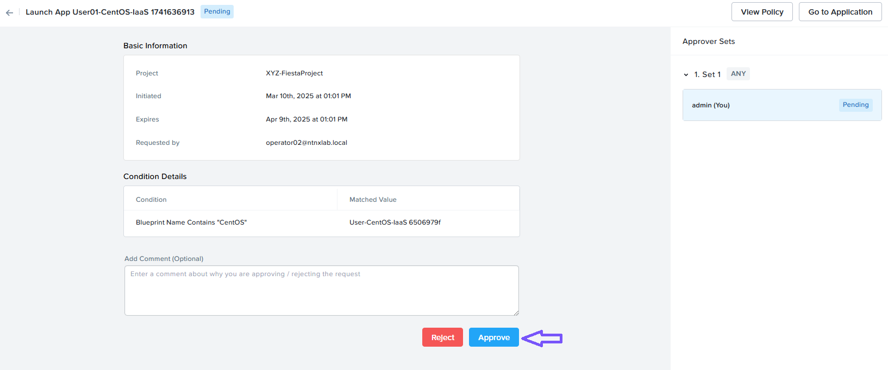
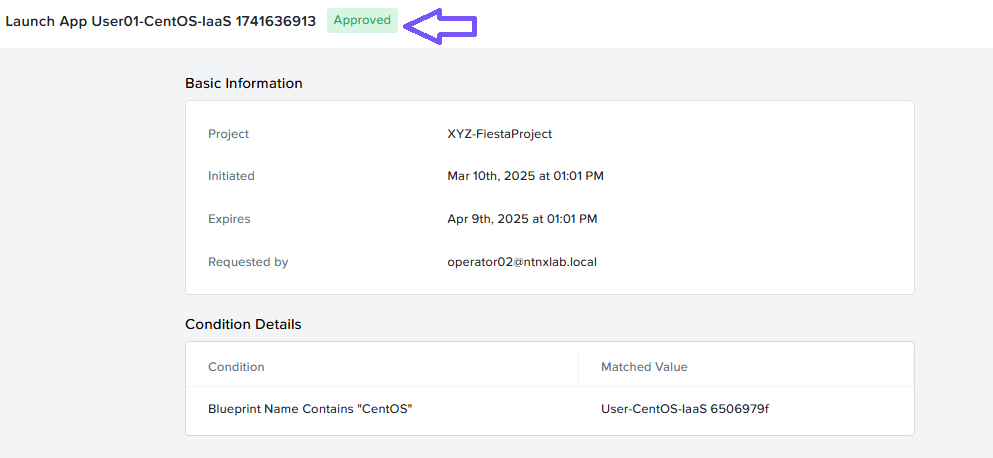
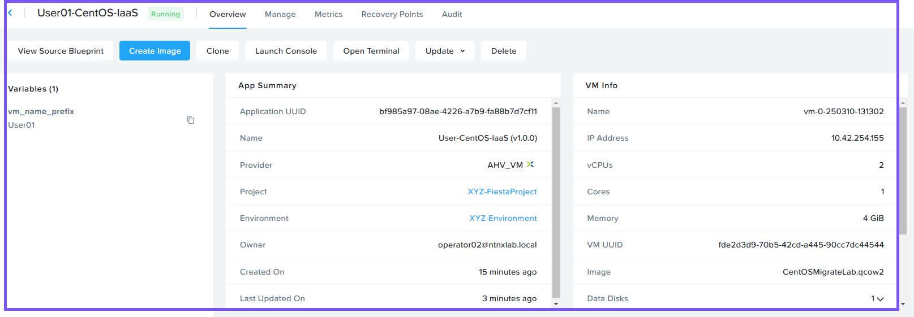

# Launch an App from Marketplace

เราได้ทำงานมามากแล้วเพื่อมาถึงจุดนี้ แต่ตอนนี้มาดูว่าทุกอย่างทำงานร่วมกันอย่างไร!

เรามี software engineer คนเดิมที่ตอนนี้ต้องการ provision ตัว Linux VM มาดูวิธีที่ developer ทำการ provision ตัว VM ด้วยการคลิกไม่กี่ครั้ง ในขณะที่ใช้ cloud operating model กัน

1.  Login เข้าสู่ Prism Central โดยใช้ **operator`##`@ntnxlab.local** และ PC password จากหน้า Connection Details
    
2.  ไปที่ส่วน App Switcher ที่มุมซ้ายบนของ Prism Central คลิก **Apps and Marketplace** ใน App Switcher
    
3.  คลิก **Marketplace**
    
4.  คลิก **Get** ที่อยู่ติดกับ **User`##`-CentOS-IaaS** Blueprint ของคุณ และคลิก **Deploy**
    
5.  ป้อนข้อมูลต่อไปนี้ และคลิก **Deploy**
    
-   Application Name - **User`##`-CentOS-IaaS**
-   vm_name_prefix - **User`##`**

6.  คลิก **View in Admin Center** เพื่อ monitor การ provisioning ของ blueprint

    

7.  คลิก **Audit**

    

8.  ขยาย (Expand) **Create** คลิก **Policy Execute - Approval** คุณควรเห็นข้อความ **Waiting for approval from users/groups belonging to the policy**

    

9.  administrator ต้องทำ approve ตัว request นี้เพื่อให้การ provisioning เสร็จสมบูรณ์

## Approve the Application Launch

1.  Login เข้าสู่ Prism Central โดยใช้ **adminuser`##`** และ PC password จากหน้า Connection Details โดยที่ `##` คือหมายเลขที่คุณได้รับมอบหมาย
    
2.  ไปที่ส่วน App Switcher ที่มุมซ้ายบนของ Prism Central คลิก **Self Service** ใน App Switcher
    
3.  คลิก **Policies**
    
4.  คลิก **Approval Requests**
    
    

5.  คลิกที่ Request **Launch App User`##`..**
    
6.  คลิก **Approve**

    

7.  คลิก Yes เมื่อได้รับ prompt ถามว่า **Are you sure you want to approve this request?**
    
8.  application ได้รับการ approved อย่างสำเร็จโดย **adminuser`##`**

    

9.  กลับไปที่ Prism Central และ login เป็น **operator`##`@ntnxlab.local** ด้วย PC password จากหน้า Connection Details
    
10.  ไปที่ส่วน App Switcher ที่มุมซ้ายบนของ Prism Central คลิก **Apps and Marketplace** ใน App Switcher
    
11.  คลิก **My Apps**
    
12.  คลิก **User`##`-CentOS-IaaS** app
    
13.  คุณควรสังเกตเห็นว่า App ได้รับการ provisioned และกำลัง running อย่างสำเร็จ
    
    

    !!! note
        ตรวจสอบ inbox ของคุณ 💻 📧 เพื่อดูว่าคุณได้รับ notifications เกี่ยวกับ VM creation event นี้หรือไม่

## Takeaways

software engineer ของเราสามารถ request ตัว VM ใหม่ได้อย่างรวดเร็วจาก template\
VM นั้นได้รับการ approved และ acknowledged โดยทีม IT administrator
มีการสร้าง record ของการ approval และรวมถึงอีเมลด้วย (were generated)!

---

[← Back: Setting Up an Approval Policy](ncp2-setting-up-approval-policy.md) | [Home](ncp2-nutanix-cloud-platform.md) | [Next: Cost Governance →](ncp2-cost-governance.md)