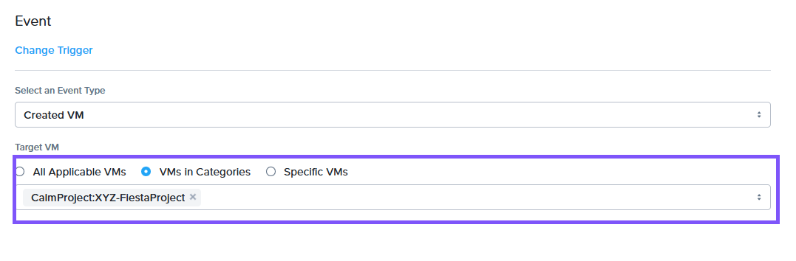
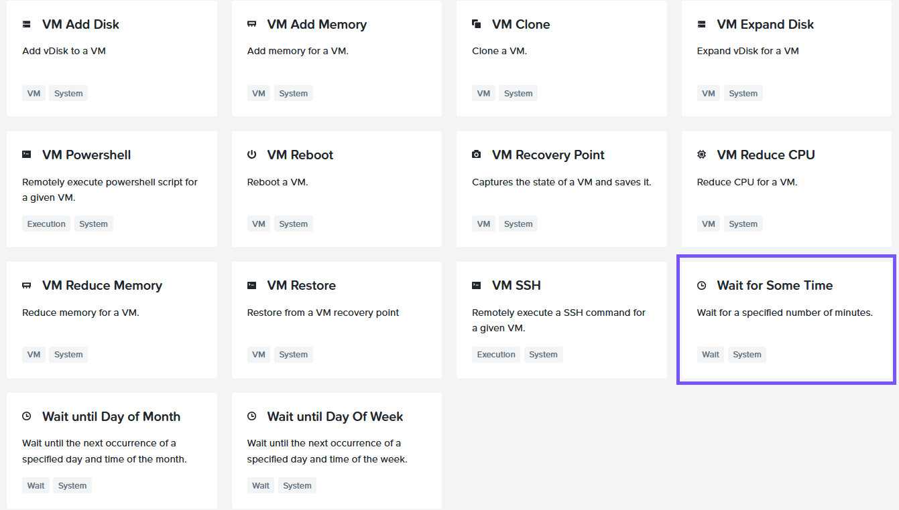
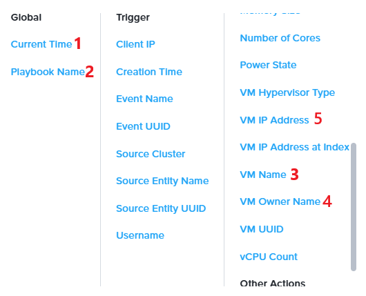

# Task Automation with Playbooks

## Overview

**X-Play** เป็นเครื่องมือ automation ที่ใช้งานง่าย ซึ่งออกแบบมาเพื่อเพิ่มประสิทธิภาพ (streamline) งาน administrative ประจำวัน และแก้ไขปัญหาที่เกิดขึ้นภายในระบบของคุณโดยอัตโนมัติ automation นี้ทำได้โดยการสร้าง Playbooks

**Playbook** ประกอบด้วย trigger และชุดของ actions ที่จะ execute เมื่อ trigger ถูกเปิดใช้งาน (activated)

trigger สามารถทำงานตาม alert ที่ระบุ หรือกลุ่มของ alerts, events เช่น การสร้างหรือลบ VM, การสั่งการแบบ manual (manual initiation) เพื่อรันชุดของ tasks ด้วยการคลิกเพียงครั้งเดียว, การทำ scheduled เพื่อรันในเวลาที่กำหนด (คล้ายกับ cron jobs), หรือถูก triggered ผ่าน webhook ผ่านการเรียกใช้ REST API จาก third-party tool

action gallery มี 45 native actions ที่สามารถนำมาเชื่อมต่อกันได้ (chained together) รวมถึง integrations กับเครื่องมือต่างๆ เช่น PagerDuty, ServiceNow, Slack, Microsoft Teams และอื่นๆ หากไม่มี native action ที่ต้องการ คุณสามารถใช้ REST APIs และ scripting actions เพื่อสร้าง custom workflows ได้

## Create a Playbook

IT Admin ต้องการรับ email notification เมื่อใดก็ตามที่มีการสร้าง VM ใน Project **Initials-FiestaProject** โดยที่ Initials คือชื่อย่อของคุณ มาดูกันว่า Playbooks สามารถทำ automate กระบวนการนี้ได้อย่างไร เราจะใช้ trigger ง่ายๆ จากนั้นใช้ branch condition เพื่อ filter รายการของ VMs

1.  Login เข้าสู่ Prism Central โดยใช้ **adminuser`##`** และ PC password จากหน้า Connection Details
    
2.  ไปที่ส่วน App Switcher ที่มุมซ้ายบนของ Prism Central คลิก **Intelligent Operations** ใน App Switcher
    
    
    
3.  เลือก **Playbooks** จาก Intelligent Operations Dashboard
    
4.  คลิก **Get Started**
    
5.  คลิก **Create Playbook**
    
    
    
6.  เราสามารถดูรายการ triggers ที่มีให้ใช้งาน รวมถึง Alerts, Events, Time-based, Manual และ Webhook triggers สำหรับตัวอย่างนี้ ให้เลือก event-based trigger เนื่องจากเรากำลังเน้นไปที่ VM creation event
    
    
    
7.  ค้นหา Created VM event ในฟิลด์ **Select an Event Type**
    
    
    
8.  ใน Target VM ให้เลือก **VMs in Categories** และเลือก **CalmProject:`Initials`-FiestaProject** โดยที่ Initials คือชื่อย่อของคุณ และ Project ควรเป็นอันที่คุณสร้างไว้ใน exercise ก่อนหน้านี้
    
    
    
9.  คลิก **Add Action**
    
10. เลือก **Wait for Some Time**
    
    
    
11. action นี้จะให้เวลา VM เข้าสู่สถานะที่เสถียร (stable state) ก่อนที่จะ executing ตัว action ถัดไป ให้รอกันสัก 20 นาที (Wait for 20 minutes)
    
12. เรากำลังจะเพิ่ม action ที่สอง คลิก **Add Action**
    
13. เลือก **Lookup VM Details** เนื่องจาก IT Admin ต้องการรับข้อมูลเกี่ยวกับ VM ที่เพิ่งสร้างใหม่
    
    
    
14. ในฟิลด์ **Target VM** ให้ปล่อยไว้เป็น **Event: Source Entity**
    
    
    
15. เรากำลังจะเพิ่ม action ที่สาม คลิก **Add Action**
    
16. เลือก Email Action
    
17. ป้อน Email Address ของคุณเองในฟิลด์ **Recipient** นี่ควรเป็นอีเมลที่คุณสามารถตรวจสอบได้ในอีกไม่กี่นาทีข้างหน้า
    
18. ป้อน "A virtual machine is created" ในฟิลด์ **Subject**
    
19. ในฟิลด์ Message ให้คลิก **Parameters** ตรวจสอบให้แน่ใจว่าได้เลือก parameters ด้านล่างนี้แล้ว:
    
    -   พิมพ์ **Playbook Run Time:** และเลือก Parameter **Playbook: Current Time**

    -   พิมพ์ **Playbook Name:** และเลือก Parameter **Playbook: Playbook Name**
        
    -   พิมพ์ **VM Name:** และเลือก Parameter **Lookup VM Details: VM Name**
        
    -   พิมพ์ **VM Owner:** และเลือก Parameter **Lookup VM Details: VM Owner Name**
        
    -   พิมพ์ **VM IP Address:** และเลือก Parameter **Lookup VM Details: VM IP Address**

    
    
20. คลิก **Save & Close**
    
21. ระบุชื่อที่ไม่ซ้ำกันสำหรับ Playbook ให้เรียกว่า **User`##` VM Created** โดยที่ `##` คือหมายเลขที่คุณได้รับมอบหมาย
    
22. มา enable ตัว Playbook กันโดยการสลับสถานะเป็น **Enabled**
    
    
    
23. คลิก Save
    
24. คุณจะเห็น playbook นี้ทำงานเมื่อคุณสร้าง VMs ใน Project
    

!!! note
    คุณจะได้รับ email notifications เมื่อ VMs ของคุณถูกสร้างขึ้น ตรวจสอบให้แน่ใจว่าได้ใช้อีเมลแอดเดรสที่คุณสามารถเช็คได้ในขณะที่คุณกำลังทำ lab