# Projects

## Overview

Projects ให้ logical namespace ในการจัดการ (organize, manage, share) และแยก (isolate) infrastructure resources ข้ามแผนกหรือ tenants ผ่าน role-based access control (RBAC) เพื่อให้มั่นใจถึง compliance และ security

โครงสร้างแบบ project ช่วยให้คุณกำหนด settings ต่างๆ เช่น permissions และ networks เพื่อใช้งานในขณะที่ทำการ deploying แอปพลิเคชัน

Projects ยังสามารถควบคุม default VM specifications และ deployment options ได้ เช่น:

-   vCPUs
-   vRAM
-   Storage
-   Base images
-   Cloud-Init หรือ sysprep specs
-   Quota และ snapshot policy definition
-   Credentials

## Create a Project

มาเริ่มสร้าง project สำหรับ user ของเราเพื่อสำรวจความสามารถเหล่านี้กัน

1.  Login เข้าสู่ Prism Central โดยใช้ `adminuser##` และ PC password จากหน้า Connection Details
    
2.  ไปที่ส่วน App Switcher ที่มุมซ้ายบนของ Prism Central คลิก **Admin Center** ใน App Switcher
    
    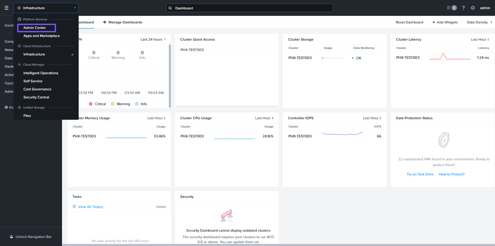
    
3.  คลิก **Projects** คลิก **Create Project**
    
    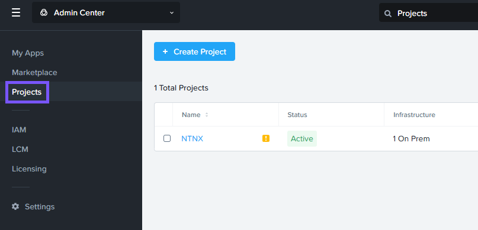
    
4.  ในช่อง Project Name ให้ป้อน XX-FiestaProject โดย "XX" คือชื่อย่อ (initials) ของคุณ จากนั้นคลิก **Create**
    
    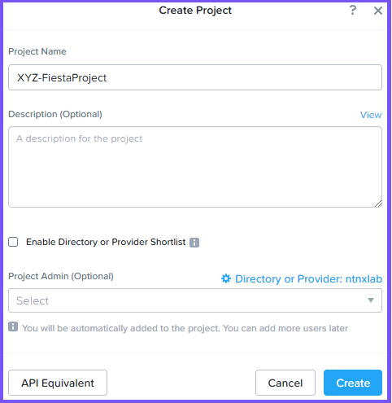
    
5.  คลิก **Add Infrastructure**
    
    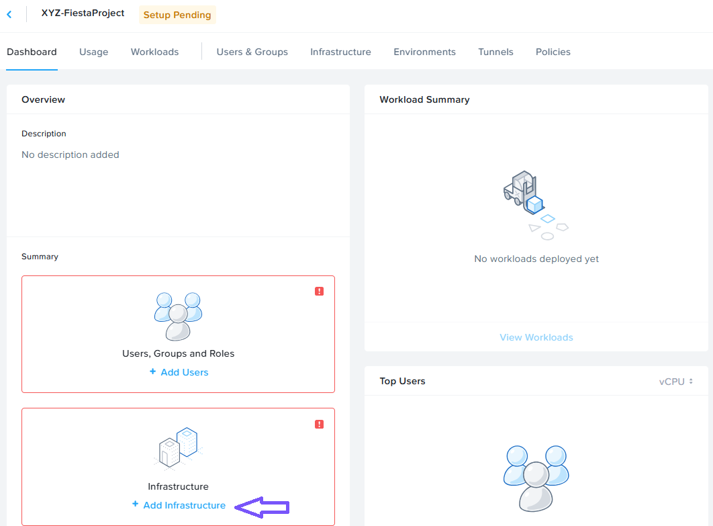
    
6.  ในหน้าจอถัดไป คลิก **Add Infrastructure** และเลือก **NTNX_LOCAL_AZ**
    
    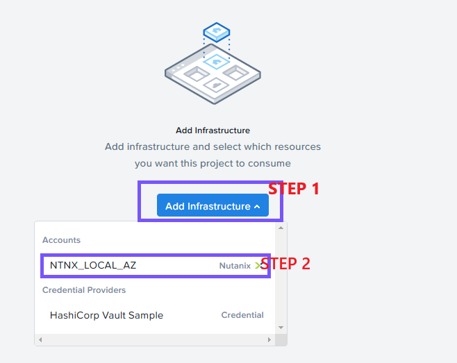
    
7.  คลิกปุ่ม **Configure Resources**
    
    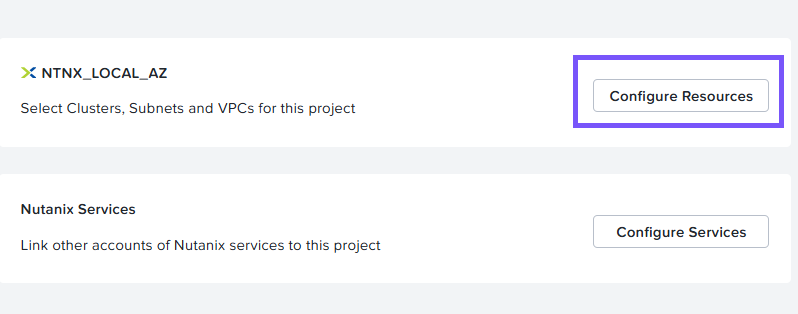
    
8.  เลือก cluster ของคุณจาก drop-down **Select clusters to be added** คลิก **+ Select VLANs** หลังจากเลือก cluster แล้ว
    
    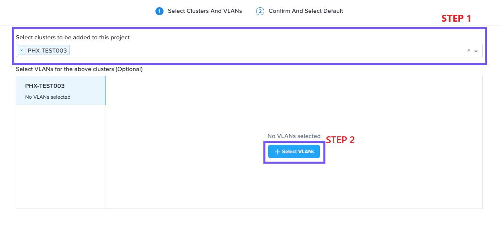
    
9.  ทำเครื่องหมายที่กล่อง **aux-1** คลิก **Confirm** และเลือก **Default**
    
    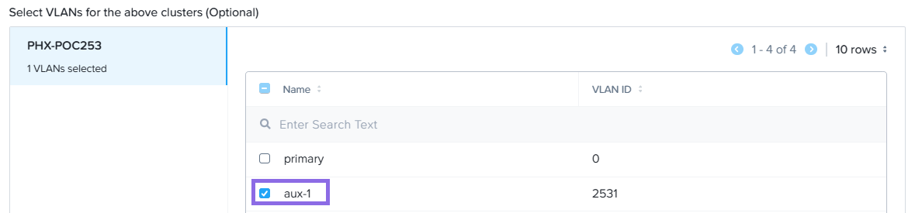
    
10. ตรวจสอบให้แน่ใจว่า secondary VLAN ถูกตั้งค่าเป็น default คลิก **Confirm**
    
    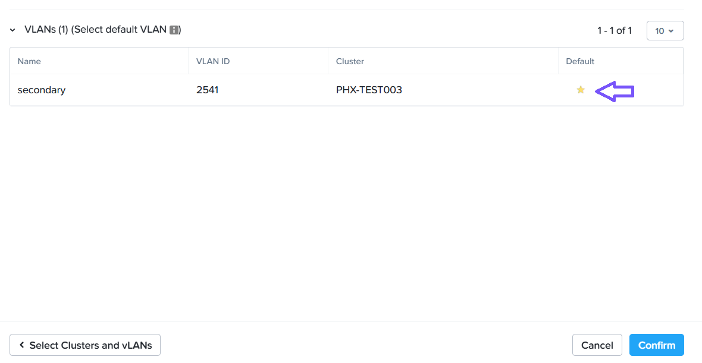
    
11. คลิก **Save** ที่มุมขวาบน
    
12. คลิก **Environments** จากเมนูด้านบน
    
13. คลิก **Create Environment**
    
    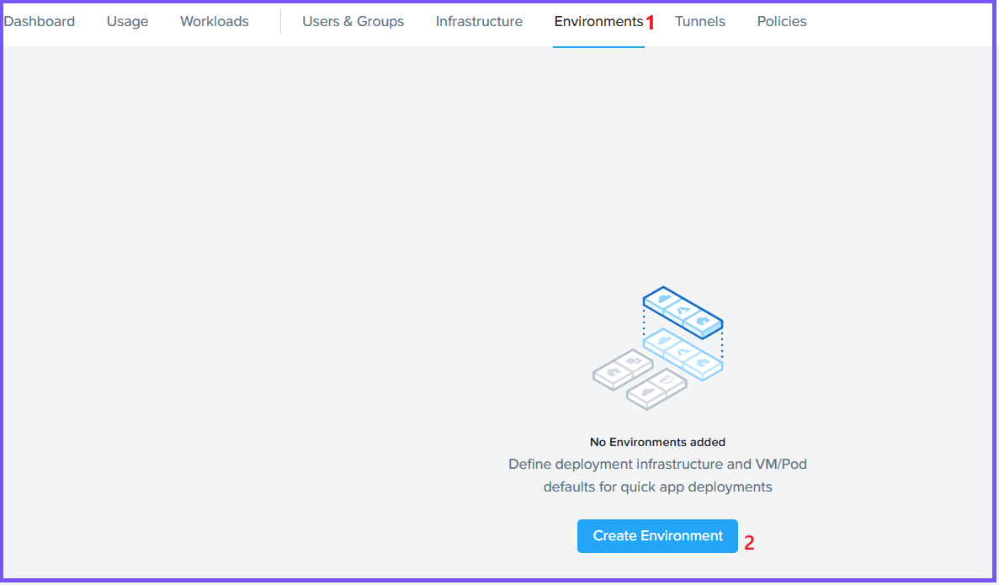
    
14. กรอกข้อมูลในช่องต่อไปนี้:
    
    -   ป้อน **Initials-Environment** โดยที่ Initials คือชื่อย่อของคุณ แล้วคลิก **Next**
    -   คลิกที่ drop-down Select Infrastructure และเลือก **NTNX_LOCAL_AZ**
    -   คลิกที่ใดก็ได้ในกล่อง **VM Configuration** เพื่อขยาย (expand) มัน
        
15. ป้อนข้อมูลต่อไปนี้สำหรับส่วน **Windows**
    
    -   ใน drop-down **Cluster** ให้เลือก cluster ของคุณ
    -   ในส่วน VM Configuration ให้ระบุสิ่งต่อไปนี้:
        -   vCPUs - 2
        -   Cores per vCPU - 1
        -   Memory (GiB) - 4
    -   เลื่อนลงไปที่ส่วน Disks และเลือก **Windows2022MigrateLab.qcow2** จาก drop-down Image
    -   เลื่อนลงไปที่ส่วน Categories และเลือก **User`##`:Production** category จาก drop-down โดย `##` คือหมายเลขที่คุณได้รับมอบหมาย และควรเป็น category ที่คุณสร้างไว้ในแบบฝึกหัด Categories ก่อนหน้านี้
    -   เลื่อนลงไปที่ส่วน Network Adapters (NICs) และเลือก aux-1 จาก drop-down NIC 1
    -   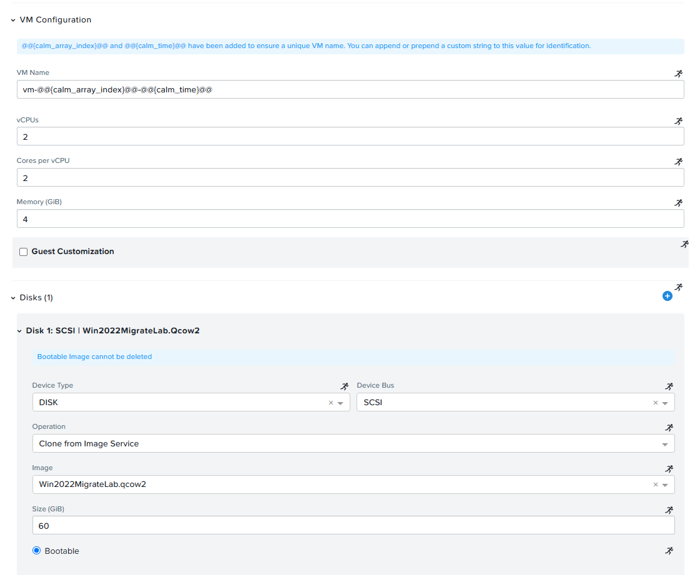

16. ป้อนข้อมูลต่อไปนี้ในส่วน **Linux**
    
    -   ใน drop-down **Cluster** ให้เลือก cluster ของคุณ
    -   ในส่วน VM Configuration ให้ระบุสิ่งต่อไปนี้:
    -   vCPUs - 2
    -   Cores per vCPU - 1
    -   Memory (GiB) - 4
    -   เลื่อนลงไปที่ส่วน Disks และเลือก **nutanix-rocky9.qcow2** จาก drop-down Image
    -   เลื่อนลงไปที่ส่วน Categories และเลือก **User`##`:Production** category จาก drop-down โดย `##` คือหมายเลขที่คุณได้รับมอบหมาย และควรเป็น category ที่คุณสร้างไว้ในแบบฝึกหัด Categories
    -   เลื่อนลงไปที่ส่วน NETWORK ADAPTERS (NICs) และเลือก **aux-1** จาก drop-down NIC 1
    
    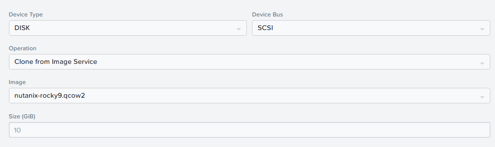
    
17. คลิก **Next**
    
18. คลิก **Add Credential** และระบุสิ่งต่อไปนี้:
    
    -   Credential Name - CENTOS
    -   Username - nutanix
    -   Secret Type - Password
    -   Password - nutanix/4u
    
    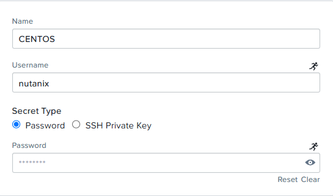
    
19. คลิก **Save Environment & Project**
    
20. คลิก **Users & Groups** จากเมนูด้านบน คลิก **Add/Edit Users & Groups**
    
21. คลิก **Add User** เพิ่ม user ด้านล่าง
    
    -   Name - Administrators (group)
    -   Role - Project Admin

22. คลิก **Add User** เพิ่ม user ด้านล่าง โดยแทนที่ `##` ด้วยหมายเลข user operator ของคุณที่สร้างไว้ก่อนหน้านี้
    
    -   Name - **operator`##`@ntnxlab.local** (person)
    -   Role - Developer
23. คลิก Save Users and Project
    
    !!! note
        เราได้ให้สิทธิ์ (granted) แก่ Operator`##` (user) ให้เข้าถึง Project เท่านั้น ไม่ใช่บัญชี Operator ทั้งหมด
    
24. ในเมนูด้านบน คลิกที่ **Policies** และเลือก **Snapshot** จากเมนูด้านซ้าย
    
25. คลิก **Create Snapshot Policy**
    
26. ป้อน **User`##`-SnapshotPolicy** ในช่อง Policy Name โดยที่ `##` คือหมายเลขที่คุณได้รับมอบหมาย
    
27. คลิก **Save Snapshot Policy**
    
28. คุณควรเห็น project ของคุณถูกทำเครื่องหมายเป็น **Active** หลังจากทำ configuration สำเร็จ
    
    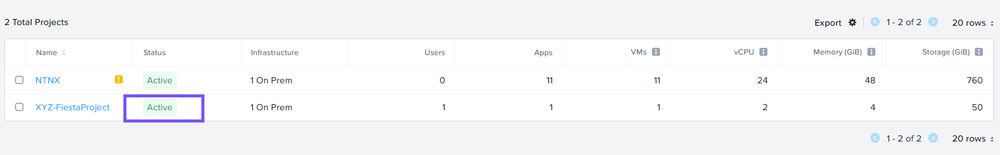

---

[← Back: Identity and Access Management](ncp2-identity-and-access-mgmt.md) | [Home](ncp2-nutanix-cloud-platform.md) | [Next: Build Your Cloud →](ncp2-build-your-cloud.md)