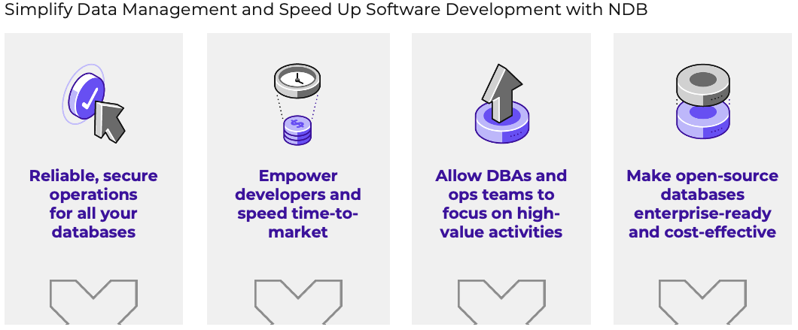
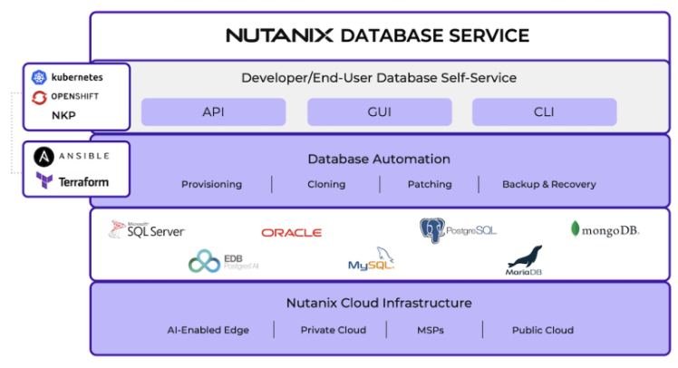
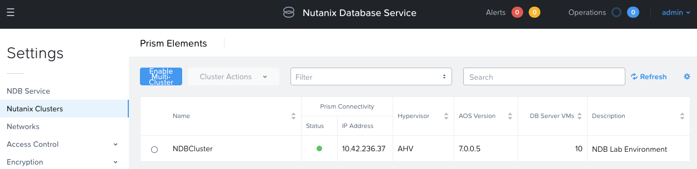
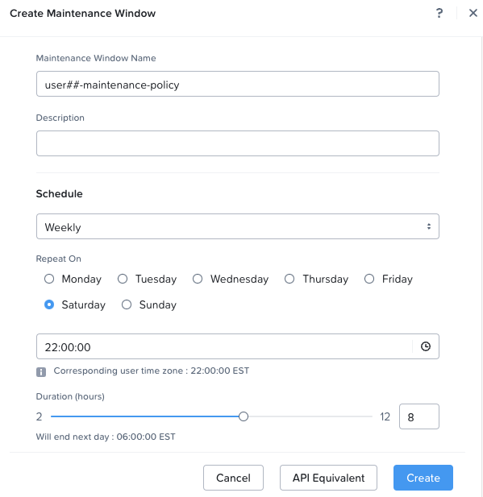

# Nutanix Database Service (NDB) Lab

# Getting Started

ยินดีต้อนรับสู่ _Nutanix Database Service (NDB) Hands-on lab_ hands-on lab นี้จะมอบประสบการณ์ตรงว่าทำไม Nutanix ถึงเป็น platform ในอุดมคติสำหรับ database workloads

ในอดีต การทำ virtualize databases ถือเป็นความท้าทายเนื่องจาก traditional virtualization stacks มีต้นทุนสูง และ SAN-based architecture อาจส่งผลกระทบเชิงลบต่อ performance ธุรกิจและแผนก IT ต้องต่อสู้เพื่อรักษาสมดุลระหว่างต้นทุน ความเรียบง่ายในการดำเนินการ (operational simplicity) และ performance ที่สม่ำเสมอและคาดเดาได้

Nutanix ขจัดความท้าทายเหล่านี้ไปมากมายและทำให้การทำ virtualize business-critical databases ง่ายขึ้นมาก Nutanix Cloud Platform มอบ features ทั้งหมดที่มักจะคาดหวังได้ใน enterprise SAN โดยไม่มีข้อจำกัดทางกายภาพและ bottlenecks ของ SAN แบบดั้งเดิม โดยเฉพาะอย่างยิ่ง databases จะได้รับประโยชน์จาก features ต่อไปนี้:

- Localized I/O และการใช้ flash สำหรับ index และ key database files เพื่อลด latency
- แนวทางแบบ highly distributed ที่สามารถรองรับทั้ง random และ sequential workloads
- ความสามารถในการเพิ่ม nodes ใหม่เพื่อ scale infrastructure โดยไม่มี system downtime หรือส่งผลกระทบต่อ performance
- Built-in data protection และ disaster recovery workflows ที่ช่วยให้ backup operations และ business continuity processes ง่ายขึ้น

นอกเหนือจากการแก้ปัญหา infrastructure ทั่วไปสำหรับการ hosting business-critical applications แล้ว NDB ยังมุ่งหวังที่จะจัดการกับ pain points หลักๆ มากมายที่เกี่ยวข้องกับการจัดการ databases ด้วย

จากงานวิจัยในปี 2025 ของบริษัทในอเมริกาเหนือจำนวนมากที่มีพนักงานมากกว่า 1,000 คน พบแนวโน้มข้อมูลต่อไปนี้:

- 85% ขององค์กรมี database instances มากกว่า 200 ตัวใน production environments ของตน
- 80% มีสำเนามากกว่า 10 copies ในแต่ละ database
- 55% ของ storage capacity ทั้งหมดถูกอุทิศให้กับการรองรับ copy data (เช่น สำเนาของ production data)
- 45% ของ database clones ต้องการการทำ daily refreshes สำหรับ analytics ของ dev/test
- Copy data จะทำให้องค์กร IT ต้องเสียค่าใช้จ่ายถึง 1 แสนล้านดอลลาร์สหรัฐในปี 2025

ตัวเลขเหล่านี้ที่ยังคงสถานะเดิมไว้ นำไปสู่การใช้งาน storage อย่างไม่มีประสิทธิภาพ และที่แย่ไปกว่านั้นคือสูญเสียเวลาของ administrator ทำความรู้จักกับ Nutanix Database Service (NDB)

Nutanix Database Service (NDB) ให้บริการ Database Lifecycle management ภายใน environment ของคุณ ด้วยการใช้ประโยชน์จาก Nutanix Cloud Platform เราสามารถใช้ประโยชน์จากพลังของ full stack ทั้ง storage, compute, และ software โดย NDB จะช่วยลดความซับซ้อนของ database operations และมี common APIs, CLI, และ consumer-grade GUI experience สำหรับ multiple database engines มันทำให้ database operations (เช่น cloning) มีประสิทธิภาพ ซึ่งจะช่วยลด TCO ของ database management ให้กับลูกค้าของเรา

## Explore NDB

NDB ถูกแจกจ่ายในรูปแบบ virtual appliance ที่สามารถติดตั้งได้ทั้งบน AHV หรือ ESXi สำหรับ Bootcamp นี้ shared NDB server ได้ถูก deploy บน AHV แล้ว

เมื่อถูกถามหา IP address, user name, หรือ password ให้ดูรายละเอียดการเชื่อมต่อที่ Instructor ของคุณให้ไว้

1. เปิด `HTTP://<NDB IP Address>/` ในเบราว์เซอร์ของคุณ

2. เข้าสู่ระบบโดยใช้ credentials ต่อไปนี้:

    - **Username** - `<NDB Username>`
    - **Password** - `<NDB Password>`
    
3. เลือก **> Settings** จากเมนู โปรดทราบว่า NDB ได้ถูก configured สำหรับ assigned cluster ของคุณเรียบร้อยแล้ว

    

4. เลือก **> Policies > SLAs** จากเมนู

    NDB มี built-in SLAs 5 ระดับ: Gold, Silver, Bronze, Brass, และ None โดย SLAs จะควบคุมว่า database server จะถูก backed up อย่างไร หรือจะไม่ถูก backup เลยในกรณีที่เป็น _None_ SLA ทั้งนี้ Backups สามารถ configured ให้เป็นแบบ Continuous Protection, Daily, Weekly, Monthly, และ Quarterly protection intervals ได้

5. เลือก **> Profiles** จากเมนู

    Profiles จะกำหนด resources และ configurations ทำให้การ provision environments ง่ายขึ้นและลด configuration sprawl อย่างสม่ำเสมอ ตัวอย่างเช่น _Compute Profile_ จะระบุขนาดของ database server รวมถึงรายละเอียดต่างๆ เช่น vCPUs, cores per vCPU, และ memory

## Create A Maintenance Window

maintenance window policy ช่วยให้คุณสามารถตั้งค่า schedule ที่ใช้เพื่อทำให้ maintenance tasks ที่เกิดขึ้นซ้ำๆ เป็นแบบ automate ได้ เช่น การ patching operating system และ database โดย NDB ช่วยให้คุณสร้าง maintenance window แล้ว associate ตัว maintenance window นั้นเข้ากับรายชื่อ database server VMs คุณสามารถสร้าง weekly หรือ monthly schedule สำหรับ maintenance window ได้ เรากำลังสร้าง maintenance window ตอนนี้เพื่อให้มันพร้อมใช้งานเมื่อเราทำ database provisioning lab

1. จากภายใน NDB เลือก **> Polices > Maintenance Window**

2. คลิก **Create**

3. กรอกข้อมูลในช่องต่อไปนี้ จากนั้นคลิก **Create**

    - **Maintence Window Name** : `user##-maintenance-policy`
    - **Repeat on**: `Saturday`
    - **Set time to** : `22:00:00`
    - **Duration (hours)**: `8`

    

    !!! note
        - Maintenance windows สามารถตั้งค่าให้รันแบบ weekly หรือ monthly ได้
        - Duration จะตั้งเวลาที่ window เปิดอยู่ เมื่อ duration time สิ้นสุดลง หากมี database VMs ใดๆ ที่ยังคงรัน patches อยู่ พวกมันจะดำเนินการจนเสร็จสิ้นกระบวนการ แต่จะไม่มีกระบวนการ patching ใหม่ๆ เริ่มต้นขึ้นอีกหลังจากที่ window ปิดลงแล้ว
        - Database VMs ที่รัน Oracle, MongoDB, และ PostgreSQL จะได้รับการรองรับใน maintenance windows สำหรับการทำ patching ทั้งบน Operating System และ Database; ส่วน MSSQL Database VMs สามารถใช้ maintenance windows สำหรับ database patching ได้

**เริ่มต้นด้วยการมาดูกันว่า NDB ทำให้ [Database Recovery](ndb-postgresql-dr.md นั้นรวดเร็วและมีประสิทธิภาพเพียงใด**

---

[Next: Database Recovery →](ndb-postgresql-dr.md)