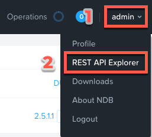
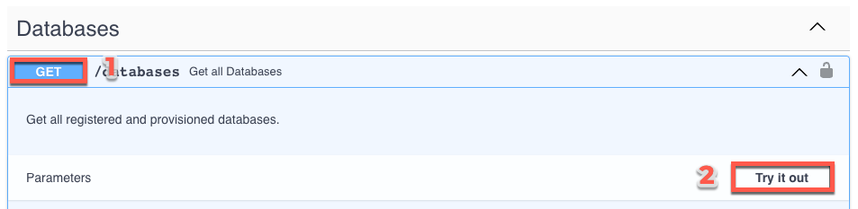
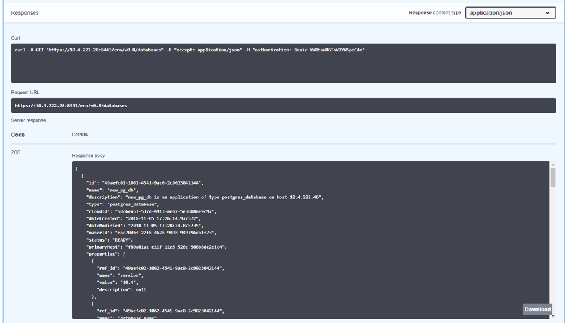

# NDB REST API Explorer

## Overview

ใน lab นี้ คุณจะได้สำรวจ NDB REST API Explorer

## Using the NDB REST API Explorer

NDB มี _API-first_ architecture ที่ได้รับการจัดทำเอกสารอย่างครบถ้วน (fully documented) เพื่อให้สามารถทำงานร่วมกัน (integration) กับ automation และ orchestration ของฟังก์ชันต่างๆ ผ่านเครื่องมือภายนอก (external tools) ได้ เช่นเดียวกับ Prism ทาง NDB ก็มี Rest API Explorer เพื่อให้ค้นพบ (discover) และทดสอบ API functions ได้อย่างรวดเร็ว

1.  จากแถบเมนู (menu bar) เลือก **Admin > REST API Explorer** จากมุมบนขวา
    
    
    
2.  ขยาย (Expand) categories ต่างๆ เพื่อดู operations ที่มีให้ใช้งาน รวมถึงการลงทะเบียน Nutanix clusters, การลงทะเบียนและการ provisioning databases, การทำ cloning, การ refreshing databases, การอัปเดต profiles และ SLAs, และการดึงข้อมูล operation และ alert
    
3.  สำหรับการทดสอบง่ายๆ ให้ขยาย **Databases > GET /databases**
    
    function นี้จะส่งคืน (return) JSON ที่มีรายละเอียดเกี่ยวกับ databases ที่ลงทะเบียน (registered) และ provisioned ทั้งหมด และไม่จำเป็นต้องระบุ parameters เพิ่มเติม
    
4.  คลิก **Try it out > Execute**
    
    
    
    คุณควรได้รับ JSON response body คล้ายกับภาพด้านล่าง
    
    
    
    API นี้สามารถสร้าง workflows ที่ทรงพลังโดยใช้เครื่องมืออย่าง Nutanix Calm, ServiceNow, Ansible, หรืออื่นๆ ตัวอย่างเช่น คุณสามารถ provision ตัว Calm blueprint ที่ประกอบด้วย web tier ของแอปพลิเคชัน และใช้ Calm eScript เพื่อเรียกใช้ (invoke) NDB ให้ทำ clone ตัว database ที่มีอยู่ และส่งคืน (return) ค่า IP ของ database ที่เพิ่ง provision ใหม่นั้นกลับไปยัง Calm

---

[← Back: Takeaways](ndb-postgresql-takeaways.md) | [Home](ndb-getting-started.md) | [Next: Glossary →](ndb-appendix-glassary.md)