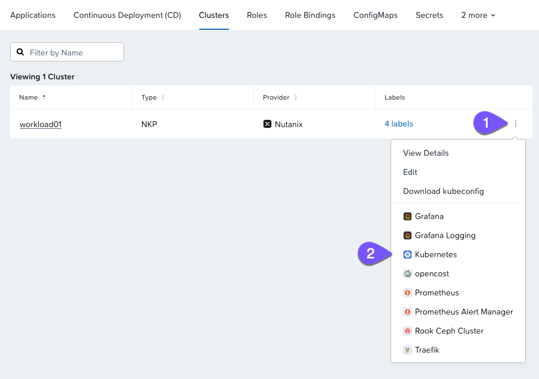
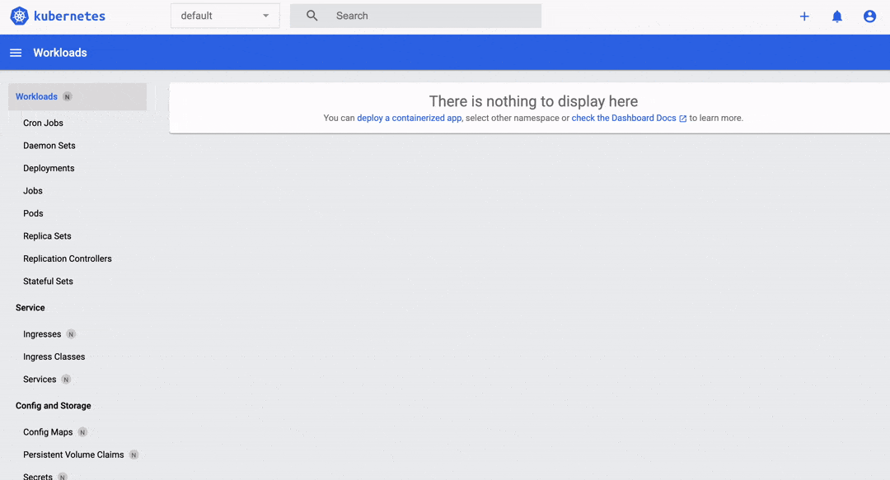
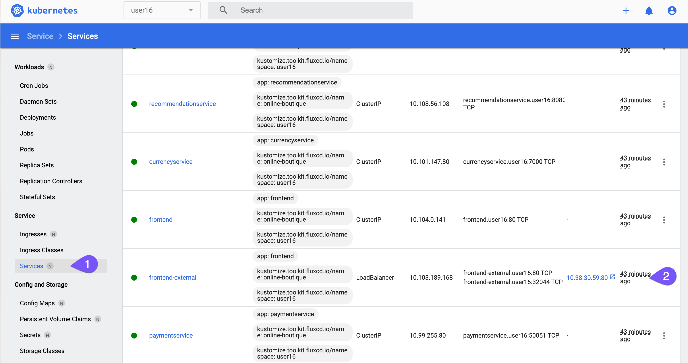
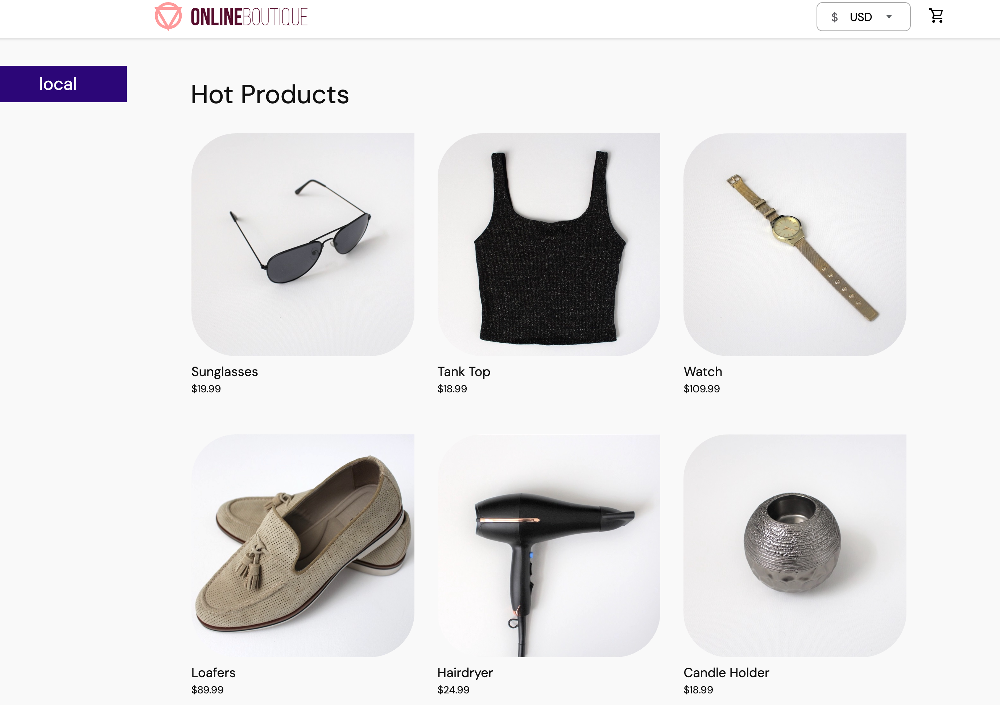

# Access the Application

เมื่อ application ได้รับการ deploy สำเร็จแล้วโดยใช้ GitOps ขั้นตอนต่อไปคือการเข้าถึงและโต้ตอบกับมัน

1.  นำทางไปยังแท็บ `Clusters` ภายใน Project ของคุณ
    
2.  บนคลัสเตอร์ **workload01** ให้คลิกที่จุดสามจุดทางขวาสุดแล้วเลือก `Kubernetes` นี่จะเป็นการเปิด Kubernetes dashboard ที่มาพร้อมกับคลัสเตอร์ของคุณ
    
    
    
3.  ใน Kubernetes dashboard ให้เปลี่ยน namespace จาก default เป็น namespace ของ Project ของคุณ (**user##**)
    
4.  ในส่วนของ `Workloads` ให้ตรวจสอบว่า pods ของ online boutique application กำลังทำงานอยู่ พร้อมกับ resources อื่นๆ จะมี deployments ถูกสร้างขึ้นทั้งหมด 12 ตัว โดย 11 ตัวสำหรับแต่ละ microservices และอีก 1 ตัวสำหรับ redis service ที่จะเก็บรายการใน shopping cart
    
    
    
5.  Application ถูกเปิดให้เข้าถึงโดยใช้ LoadBalancer IP address ที่ได้รับการจัดสรรโดย load balancer ที่มากับ NKP ซึ่งก็คือ MetalLB
    
    !!! note    
        สำหรับการทบทวนเกี่ยวกับ MetalLB กรุณาไปที่ [Chapter](nkp-fundamentals-expose-lb.md) นี้
    
6.  สุดท้าย คุณสามารถเข้าถึง boutique store ได้โดยตรงจาก Kubernetes dashboard เช่นกัน ให้นำทางไปยัง `Services` และคลิกที่ URL สำหรับ `frontend-external` service
    
    
    

---

คุณควรจะเห็น frontend ของ online boutique แสดงรายการผลิตภัณฑ์และฟีเจอร์อื่นๆ ตอนนี้โหลดของใส่ shopping cart ของคุณแล้วให้รางวัลตัวเอง (แบบเสมือนจริง) ได้เลย!

