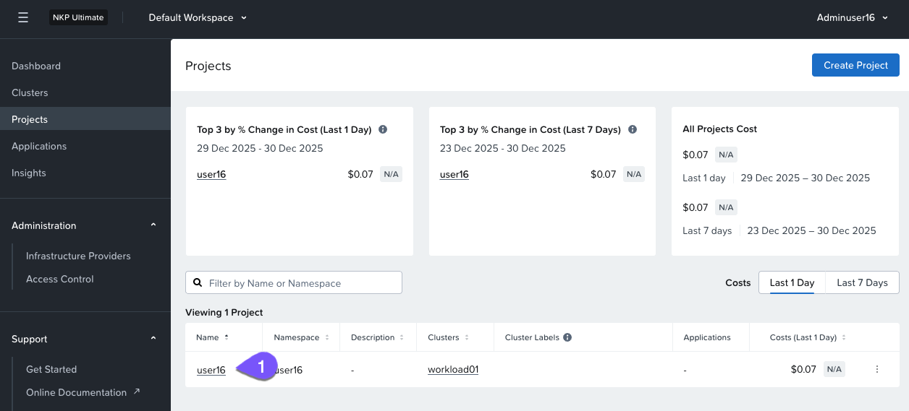
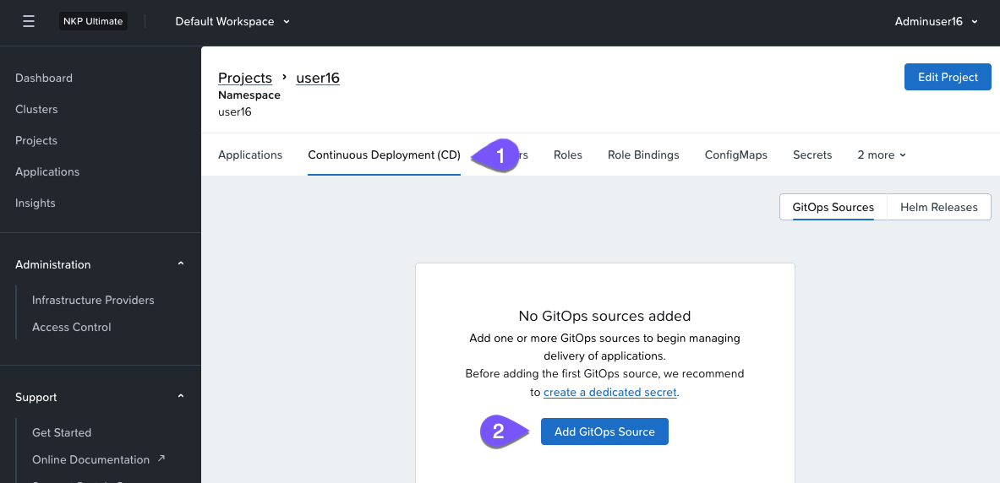
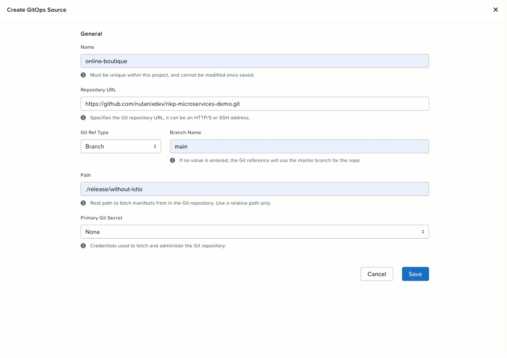
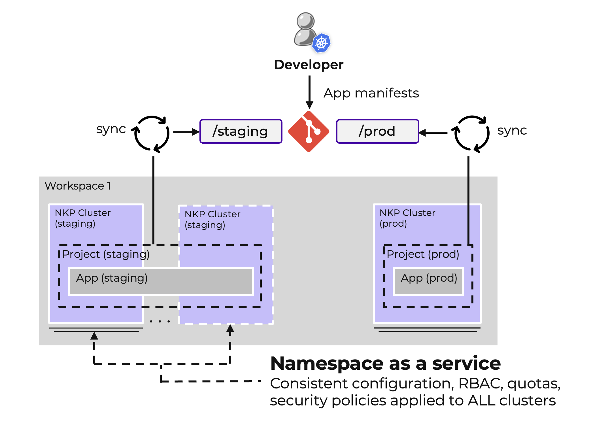

# Set up GitOps Deployment Lab

จนถึงตอนนี้ ขั้นตอนทั้งหมดที่คุณได้ดำเนินการนั้นเป็นการรันคำสั่งโดยใช้ _kubectl_ หรือคลิกบน UI การ deploy แบบ manual เหล่านี้ทำให้เกิดความท้าทายดังต่อไปนี้:

1.  **Inconsistencies**: การเปลี่ยนแปลงที่ทำโดยตรงกับคลัสเตอร์อาจคลาดเคลื่อนไปจากเอกสารประกอบหรือการกำหนดค่าที่ตั้งใจไว้
    
2.  **Lack of Automation**: การอัปเดตแบบ manual จำเป็นต้องทำซ้ำๆ ซึ่งเสี่ยงต่อความผิดพลาดของมนุษย์
    
3.  **Limited Traceability**: ไม่มีบันทึกในตัวว่าใครเปลี่ยนอะไรและทำไม
    

---

เมื่อใช้งาน GitOps manifest ของ application จะถูกเก็บไว้ใน Git repository เมื่อใช้เครื่องมือ Continuous Delivery หรือ Deployment (CD) manifest จะสามารถถูก deploy และ sync กับ Kubernetes cluster ได้โดยอัตโนมัติ

เราจะใช้เครื่องมือ GitOps ที่มากับ NKP ซึ่งก็คือ FluxCD เพื่อ sync repository กับ Kubernetes cluster สิ่งนี้ช่วยให้เราสามารถจัดการการอัปเดตโดยการเปลี่ยนแปลงที่ repository และปล่อยให้เครื่องมือ GitOps นำไปประยุกต์ใช้โดยอัตโนมัติ

!!! info
    รู้หรือไม่?

    **GitOps** จำเป็นต้องใช้ NKP Ultimate

#### Create a GitOps Source

1.  จากเมนูด้านซ้ายใน NKP console ให้เลือก Projects และเปิด project ที่ชื่อ `user##` ซึ่งตรงกับชื่อผู้ใช้ของคุณ (ในรูปด้านล่างแสดง **user16**)
    
    
    
    !!! note    
        สำหรับการทบทวนเกี่ยวกับ Projects กรุณาไปที่ [Chapter](nkp-fundamentals-multi-proj.md) นี้
    
2.  นำทางไปยังแท็บ **Continuous Deployment (CD)** และคลิก `Add GitOps Source`
    
    
    
3.  ในหน้าต่างการกำหนดค่า GitOps Source ให้ระบุรายละเอียดดังต่อไปนี้:
    
    -   **ID (name)**:
    
    ```
    online-boutique
    ```
    
    -   **Repository URL:**
    
    ```
    https://github.com/nutanixdev/nkp-microservices-demo.git
    ```
    
    -   **Git Ref Type:** `Branch`
        
    -   **Branch Name:**
        
    
    ```
    main
    ```
    
    -   **Path:**
    
    ```
    ./release/without-istio
    ```
    
    !!! info
        ตรวจสอบให้แน่ใจว่า path ตรงตามที่เห็นด้านบนนี้พอดี
    
4.  เมื่อกรอกรายละเอียดครบแล้ว ให้บันทึกการกำหนดค่า ซึ่งจะเป็นการตั้งค่า GitOps Source สำหรับ project ของคุณ
    
    
    

Application ที่คุณกำลังจะ deploy คือ online boutique app ซึ่งเป็น reference application ที่ทำงานบนพื้นฐานของ microservices ซึ่งออกแบบมาเพื่อแสดงให้เห็นถึงความซับซ้อนและแนวทางปฏิบัติที่ดีที่สุดในการจัดการและ deploy ระบบแบบ distributed แอปพลิเคชันนี้ประกอบด้วย microservices ที่แตกต่างกัน 11 ตัว ซึ่งแต่ละตัวเขียนด้วยภาษาโปรแกรมและเฟรมเวิร์กที่แตกต่างกัน

!!! info
    รู้หรือไม่?

    Platform Engineers สามารถเปิดใช้งาน self-service สำหรับนักพัฒนาและระบบอัตโนมัติ พร้อมทั้งมอบประสบการณ์ของนักพัฒนาที่สอดคล้องและยืดหยุ่นได้

    -   **Staging Workflow**: โค้ดที่ถูก push ไปยัง directory สำหรับ staging จะถูก sync โดย FluxCD ไปยัง staging clusters ที่เชื่อมโยงกับ staging Project
    -   **Production Workflow**: โค้ดที่ถูก push ไปยัง directory สำหรับ production จะถูก sync โดย FluxCD ไปยัง production clusters ที่เชื่อมโยงกับ production Project
    -   **Namespace as a Service**: การเพิ่ม cluster ใหม่ไปยัง Project จะเป็นการนำการกำหนดค่า application และ namespace ไปใช้กับ cluster นั้นโดยอัตโนมัติ

    

---

[← Back: Automation Overview](nkp-automation.md) | [Home](nkp-bootcamp.md) | [Next: Access the Application →](nkp-automation-gitops-access.md)