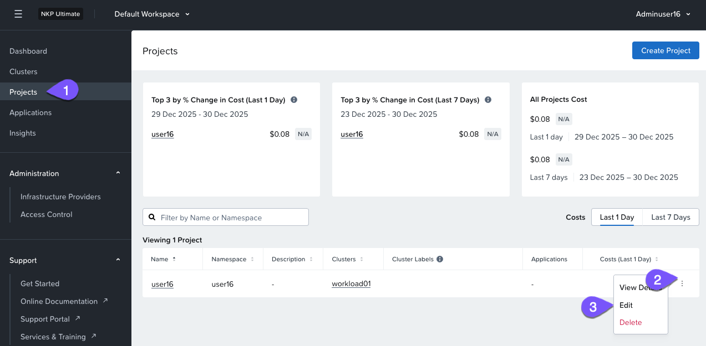
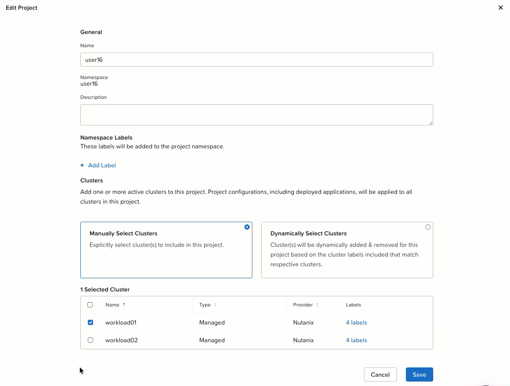
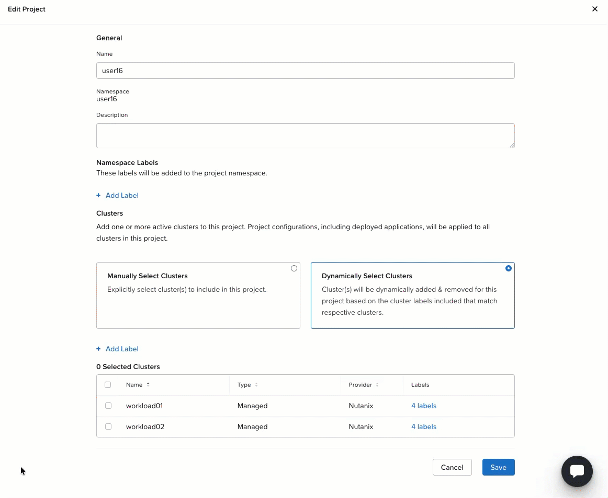
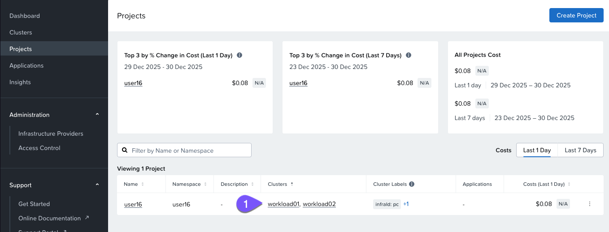
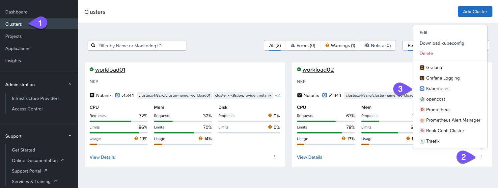
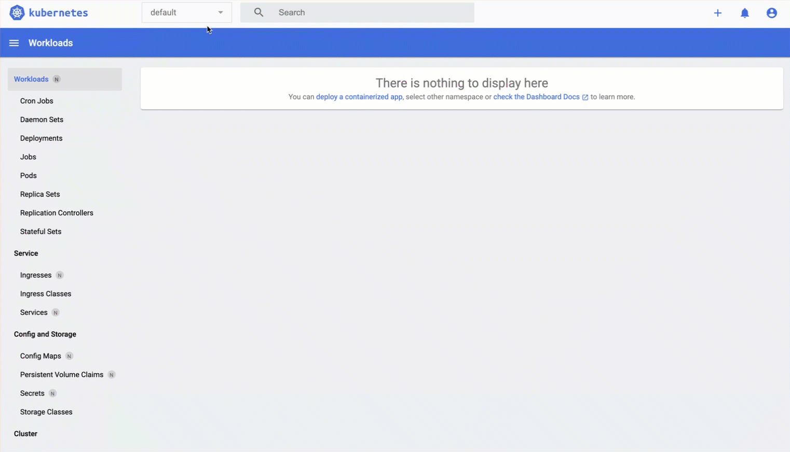

# Automate Multicluster App Deployment Lab

ก่อนหน้านี้ เราได้ใช้ GitOps เพื่อทำให้ application deployment บนคลัสเตอร์เดียวเป็นแบบอัตโนมัติ ในส่วนนี้ มาดูกันว่าจะ scale ระบบอัตโนมัตินี้ให้ครอบคลุมคลัสเตอร์ทั้งหมดได้อย่างไร!

1.  กลับไปที่ NKP console และคลิกที่แท็บ Projects ในบานหน้าต่างนำทางด้านซ้าย
    
2.  ดู project ที่ตรงกับ user ของคุณ คุณจะเห็นว่าคลัสเตอร์ `workload01` ถูกกำหนด (assign) ให้กับ project นี้ namespace และ project นี้ถูก federated ให้กับคลัสเตอร์เดียวนี้โดยเฉพาะ ตัวอย่างด้านล่างนี้สำหรับ **user16**
    
3.  Edit ตัว Project เพื่อแก้ไข project configuration
    
    
    
4.  สังเกตว่าปัจจุบันคลัสเตอร์ถูกกำหนดแบบ manual ผ่านการเลือกที่ชัดเจน ให้สลับวิธี assignment เป็น Dynamic ด้วย dynamic assignment นั้น NKP จะใช้ labels ที่กำหนดไว้ล่วงหน้าเพื่อกำหนดคลัสเตอร์ให้กับ project โดยอัตโนมัติ ตัวอย่างเช่น คุณสามารถ configure ตัว Project ให้รวมคลัสเตอร์ทั้งหมดที่มี label `region: us-west` และ `team: devops` เมื่อมีการสร้างคลัสเตอร์ใหม่ที่ตรงกับ labels เหล่านี้ — ไม่ว่าจะบน vSphere, AWS หรือ EKS — NKP จะเพิ่มคลัสเตอร์เหล่านั้นเข้าไปใน Project โดยอัตโนมัติ
    
    ในทำนองเดียวกัน หาก labels ถูกลบหรือเปลี่ยนแปลง คลัสเตอร์ที่เกี่ยวข้องจะถูกนำออก (exclude) แบบไดนามิก วิธีนี้ช่วยให้มั่นใจได้ว่า policies และ configurations จะถูกนำไปใช้โดยอัตโนมัติโดยไม่ต้องทำการอัปเดตแบบ manual
    
    
    
5.  ตรวจสอบให้แน่ใจว่าคุณได้เพิ่ม label ต่อไปนี้ในส่วนของ `Clusters`:
    
    -   Key:
        
        ```
        infraId
        ```
        
    -   Value:
        
        ```
        pc
        ```
        
    
    คุณจะสังเกตเห็นว่าคลัสเตอร์ `workload02` ถูกเลือกทันทีเนื่องจากมี label นี้อยู่แล้ว หากไม่เป็นเช่นนั้น ตรวจสอบให้แน่ใจว่าคุณพิมพ์ _infraId_ โดยใช้ตัวพิมพ์ใหญ่ `I`
    
    
    
6.  คลิก Save นำทางกลับไปยังหน้า Clusters ซึ่งตอนนี้คุณจะเห็นทั้ง `workload01` และ `workload02` ถูกกำหนด (assign) ให้กับ Project ของคุณ
    
    
    
7.  มา verify กันว่าแอปได้รับการ deploy ไปยังคลัสเตอร์ `workload02` ให้นำทางไปยังหน้า Clusters ใน NKP console เลือก Kubernetes Dashboard สำหรับคลัสเตอร์ `workload02`
    
    เข้าสู่ระบบ (Log in) โดยใช้ credentials ของคุณ เหมือนกับก่อนหน้านี้
    
    
    
8.  เมื่ออยู่ใน Kubernetes dashboard แล้ว ให้สลับไปยัง Project namespace ที่เหมาะสม (**user##**) ที่ application ถูก deploy ไว้ ทำการ verify ว่า application กำลังทำงานอยู่โดยสังเกตที่ pods ซึ่งควรแสดง creation timestamp จากเมื่อไม่กี่นาทีที่แล้ว
    
    
    

---

หากคลัสเตอร์ใหม่ (หรือ 50 คลัสเตอร์) ที่มี label **`infraId: pc`** ถูกเพิ่มเข้ามา ตัว boutique application จะ deploy ไปยังคลัสเตอร์เหล่านั้นโดยอัตโนมัติ ทำให้มั่นใจได้ถึงการ scaling ที่ราบรื่นโดยไม่ต้องแทรกแซงแบบ manual!
