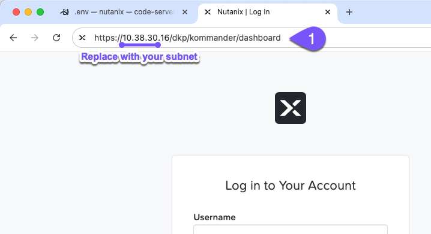
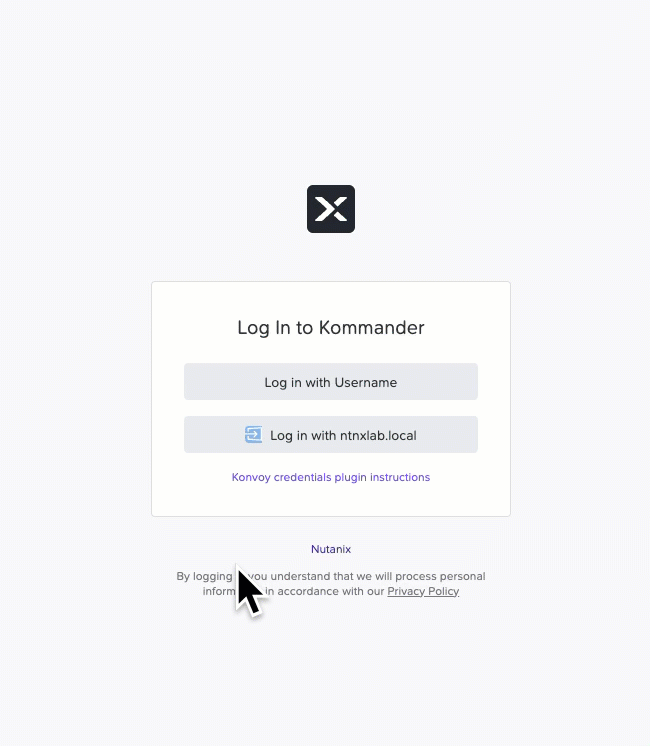
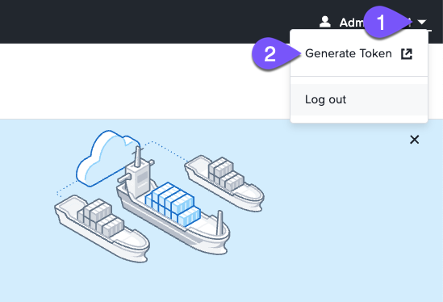
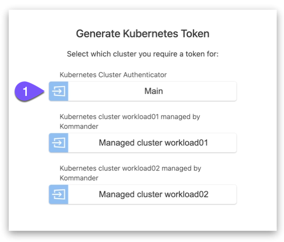
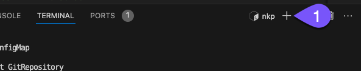
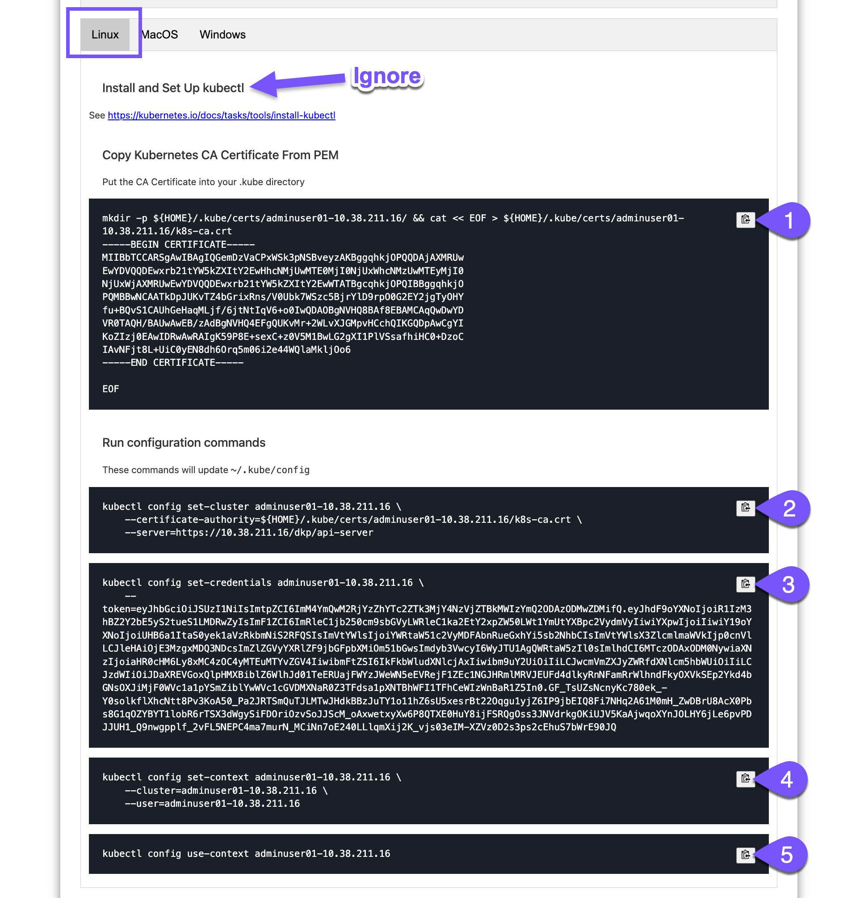

# Accessing the shared NKP environment

เริ่มต้นจาก lab นี้ คุณจะได้ใช้งาน multi-cluster setup ที่เตรียมไว้ซึ่งกล่าวถึงไปแล้วในช่วงต้นของ bootcamp ในการที่จะโต้ตอบกับ environment นี้ คุณต้องดึง access token ออกมาก่อน เพื่อนำไปใช้กับ CLIs ใน terminal ของคุณ

!!! warning
    โปรดอย่าดำเนินการใดๆ ที่เป็นการทำลาย

    คุณกำลังใช้งาน environment นี้ร่วมกับผู้อื่น

1.  เข้าถึง NKP management console ที่ใช้ร่วมกันในแท็บใหม่ หากคุณไม่แน่ใจเกี่ยวกับรายละเอียดการเชื่อมต่อ โปรดสอบถามผู้สอนของคุณ
    
    เช่น: _https://`#.#.#`.16/dkp/kommander/dashboard_
    
    กดยอมรับ self-signed certificate
    
    
    
2.  เลือก `log in with ntnxlab.local` และใช้ credentials ของคุณ
    
    คุณไม่ต้องระบุ domain ใน Username ของคุณ
    
    
    
3.  คลิกที่ user ของคุณที่ด้านขวาบน ตามด้วย **Generate Token**
    
    
    
4.  เลือก **Main** NKP cluster (management) เพราะนี่คือที่ที่คุณจะทำการ deploy ตัวอย่าง application
    
    
    
5.  Re-authenticate ด้วย adminuser`##` ของคุณ
    
6.  กลับไปที่ VS Code เปิด terminal ใหม่ โดยใช้ไอคอน `+` ถัดจากแถบ _TERMINAL_ ที่ด้านล่าง
    
    
    
7.  ทำตามขั้นตอนของ `Linux` โดยการวาง (paste) คำสั่งลงใน terminal ใหม่
    
    !!! info
        ให้ข้าม (ignore) ขั้นตอน install and set up kubectl มันได้ถูกติดตั้งไปแล้วในขั้นตอนของการสร้าง Admin VM
    
    
    
8.  เมื่อคุณทำขั้นตอนกับ **code blocks ทั้ง 5** เสร็จเรียบร้อยแล้ว ให้ยืนยัน (confirm) ว่าคุณสามารถโต้ตอบกับคลัสเตอร์ได้
    
    -   command
    
    ```
    kubectl get nodes
    ```

    -   output (ตัวอย่าง)

    ```
    NAME                         STATUS   ROLES           AGE    VERSION
    nkp-brfn6-68ppw              Ready    control-plane   12h   v1.34.1
    nkp-brfn6-rsfcq              Ready    control-plane   12h   v1.34.1
    nkp-brfn6-xkclb              Ready    control-plane   12h   v1.34.1
    nkp-md-0-rbns5-fvdf8-7qfjq   Ready    <none>          12h   v1.34.1
    nkp-md-0-rbns5-fvdf8-l22vp   Ready    <none>          12h   v1.34.1
    nkp-md-0-rbns5-fvdf8-qzbdn   Ready    <none>          12h   v1.34.1
    nkp-md-0-rbns5-fvdf8-vkkpn   Ready    <none>          12h   v1.34.1
    ```
    
    !!! warning    
        หากคำสั่งก่อนหน้านี้เกิดข้อผิดพลาด (error) หรือมีคำขอการตรวจสอบสิทธิ์ (authentication request) โปรดตรวจสอบให้แน่ใจว่าคุณได้ apply **code blocks ทั้งหมด 5 อัน** จากขั้นตอนก่อนหน้านี้
    

ตอนนี้คุณพร้อมที่จะใช้งานร่วมกับ NKP management cluster ที่ใช้ร่วมกันแล้ว