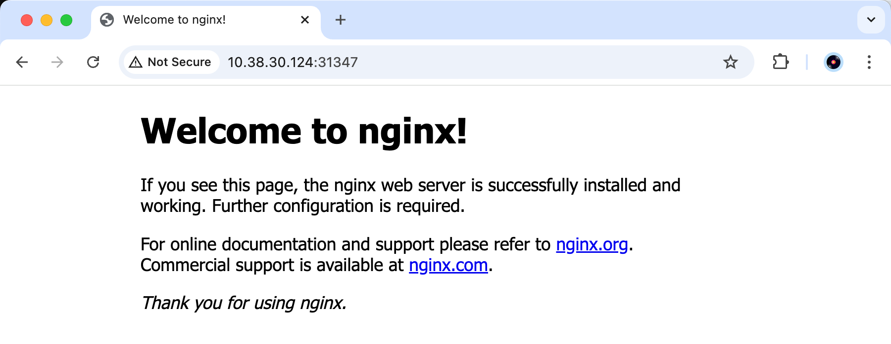
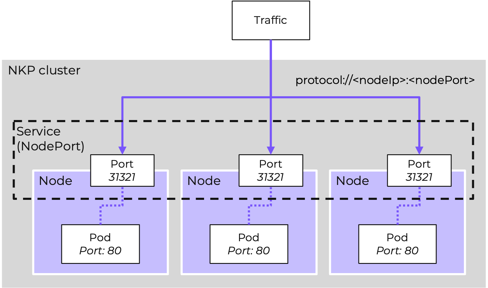

# Using a Service to Expose Your App

Service ใน Kubernetes คือ abstraction ที่กำหนด logical set ของ Pods และ policy สำหรับการ routing traffic ไปยัง applications ของคุณ

Services สามารถถูก expose ได้ในวิธีต่างๆ โดยการระบุ `type` ใน spec ของ Service โดย services ที่พบบ่อยที่สุดคือ:

-   _ClusterIP_ (default) - Expose ตัว Service บน internal IP ในคลัสเตอร์ Service จะสามารถเข้าถึงได้จากภายในคลัสเตอร์เท่านั้น
    
-   _NodePort_ - Expose ตัว Service บน port เดียวกันของแต่ละ Node ที่ถูกเลือกในคลัสเตอร์โดยใช้ NAT ตัว Service สามารถเข้าถึงได้จากภายนอกคลัสเตอร์โดยใช้ `<NodeIP>:<NodePort>` เป็น Superset ของ ClusterIP
    
-   _LoadBalancer_ - สร้าง external load balancer ใน cloud ปัจจุบัน (หากรองรับ) และกำหนด (assign) external IP แบบคงที่ให้กับ Service เป็น Superset ของ NodePort
    

#### Creating a NodePort Service

NodePort service เป็น service type ที่ถูกใช้มากที่สุดสำหรับผู้ใช้ที่เริ่มต้นกับ Kubernetes เมื่อพวกเขาไม่มี load balancing service

1.  เราจะใช้ expose command พร้อมกับ NodePort เป็น parameter เพื่อสร้าง service ใหม่ ตรวจสอบให้แน่ใจว่าคุณได้อัปเดต `##` เป็นหมายเลข user ของคุณ
    
    -   command

    ```
    kubectl expose deployment/user##-nkp-simple-app --type="NodePort" --port 80
    ```
    
    -   example

    ```
    kubectl expose deployment/user01-nkp-simple-app --type="NodePort" --port 80
    ```
    
    -   output

    ```
    service/user01-nkp-simple-app exposed
    ```
    
2.  รัน subcommand `get services`:
    
    -   command

    ```
    kubectl get services
    ```

    -   output (example)
    
    ```
    NAME                                                      TYPE        CLUSTER-IP       EXTERNAL-IP   PORT(S)          AGE
    cluster-autoscaler-0193785b-4589-7210-9427-7709ece7adfc   ClusterIP   10.108.171.72    <none>        8085/TCP         2d5h
    kubernetes                                                ClusterIP   10.96.0.1        <none>        443/TCP          2d5h
    user01-nkp-simple-app                                     NodePort    10.111.180.214   <none>        80:31347/TCP     46s
    ```
    
    ตอนนี้เรามี service ที่กำลังรันอยู่ชื่อ `user##-nkp-simple-app` ที่นี่เราจะเห็นว่า service ได้รับ cluster-IP ที่ไม่ซ้ำกัน, internal container port, และ external node port
    
3.  (Optional) เพื่อดูรายละเอียดเพิ่มเติมสำหรับ service นี้ คุณสามารถรัน subcommand `describe service`:
    
    -   command

    ```
    kubectl describe services/user##-nkp-simple-app
    ```
    
    -   example

    ```
    kubectl describe services/user01-nkp-simple-app
    ```
    
    -   output (example)

    ```
    Name:                     user01-nkp-simple-app
    Namespace:                default
    Labels:                   app=user01-nkp-simple-app
    Annotations:              <none>
    Selector:                 app=user01-nkp-simple-app
    Type:                     NodePort
    IP Family Policy:         SingleStack
    IP Families:              IPv4
    IP:                       10.96.29.176
    IPs:                      10.96.29.176
    Port:                     <unset>  80/TCP
    TargetPort:               80/TCP
    NodePort:                 <unset>  31347/TCP
    Endpoints:                192.168.5.51:80
    Session Affinity:         None
    External Traffic Policy:  Cluster
    Internal Traffic Policy:  Cluster
    Events:                   <none>
    ```
    
4.  มาสร้าง environment variable ที่ชื่อ _NODE\_PORT_ ซึ่งมีค่าของ Node port ที่ถูก assign กัน ตรวจสอบให้แน่ใจว่าคุณได้อัปเดต `##` ด้วยหมายเลข user ของคุณ:
    
    -   command
    
    ```
    export NODE_PORT="$(kubectl get services/user##-nkp-simple-app -o go-template='{{(index .spec.ports 0).nodePort}}')"
    echo "NODE_PORT=$NODE_PORT"
    ```

    -   example
    
    ```
    export NODE_PORT="$(kubectl get services/user01-nkp-simple-app -o go-template='{{(index .spec.ports 0).nodePort}}')"
    echo "NODE_PORT=$NODE_PORT"
    ```
    
    -   output (example)

    ```
    NODE_PORT=31347
    ```
    
5.  เพื่อทดสอบแอป ก่อนอื่นเราจำเป็นต้องรู้ IP addresses สำหรับ Nodes ของเรา ให้รันคำสั่งต่อไปนี้:
    
    -   command
    
    ```
    kubectl get nodes -o wide
    ```

    -   output (example)
    
    ```
    NAME                         STATUS   ROLES           AGE   VERSION   INTERNAL-IP     EXTERNAL-IP   OS-IMAGE             KERNEL-VERSION     CONTAINER-RUNTIME
    nkp-brfn6-68ppw              Ready    control-plane   12h   v1.34.1   10.38.30.81   <none>        Ubuntu 24.04.2 LTS   6.8.0-64-generic   containerd://1.7.29-d2iq.1
    nkp-brfn6-rsfcq              Ready    control-plane   12h   v1.34.1   10.38.30.80   <none>        Ubuntu 24.04.2 LTS   6.8.0-64-generic   containerd://1.7.29-d2iq.1
    nkp-brfn6-xkclb              Ready    control-plane   12h   v1.34.1   10.38.30.116   <none>        Ubuntu 24.04.2 LTS   6.8.0-64-generic   containerd://1.7.29-d2iq.1
    nkp-md-0-rbns5-fvdf8-7qfjq   Ready    <none>          12h   v1.34.1   10.38.30.124   <none>        Ubuntu 24.04.2 LTS   6.8.0-64-generic   containerd://1.7.29-d2iq.1
    nkp-md-0-rbns5-fvdf8-l22vp   Ready    <none>          12h   v1.34.1   10.38.30.97   <none>        Ubuntu 24.04.2 LTS   6.8.0-64-generic   containerd://1.7.29-d2iq.1
    nkp-md-0-rbns5-fvdf8-qzbdn   Ready    <none>          12h   v1.34.1   10.38.30.114   <none>        Ubuntu 24.04.2 LTS   6.8.0-64-generic   containerd://1.7.29-d2iq.1
    nkp-md-0-rbns5-fvdf8-vkkpn   Ready    <none>          12h   v1.34.1   10.38.30.79   <none>        Ubuntu 24.04.2 LTS   6.8.0-64-generic   containerd://1.7.29-d2iq.1
    ```
    
6.  เลือก _INTERNAL-IP_ addresses **ใดก็ได้** และรันคำสั่งต่อไปนี้ ตรวจสอบให้แน่ใจว่าคุณอัปเดต `<any_node_IP>` ด้วย node IP ที่คุณต้องการ:
    
    -   command
    
    ```
    echo http://<any_node_IP>:$NODE_PORT
    ```

    -   example
    
    ```
    echo http://10.38.30.124:$NODE_PORT
    ```
    
    -   output (example)

    ```
    http://10.38.30.124:31347
    ```
    
7.  เปิด URL ที่คุณได้รับจากคำสั่งก่อนหน้านี้ในเบราว์เซอร์ของคุณ คุณควรจะเห็นหน้า NGINX web server
    
    
    

**(Optional)** แผนภาพแสดงสิ่งที่คุณเพิ่งทำไป



---

[← Back: Using kubectl to Create a Deployment](nkp-fundamentals-deploy-create-dp.md) | [Home](nkp-bootcamp.md) | [Next: Expose App Overview →](nkp-fundamentals-expose.md)