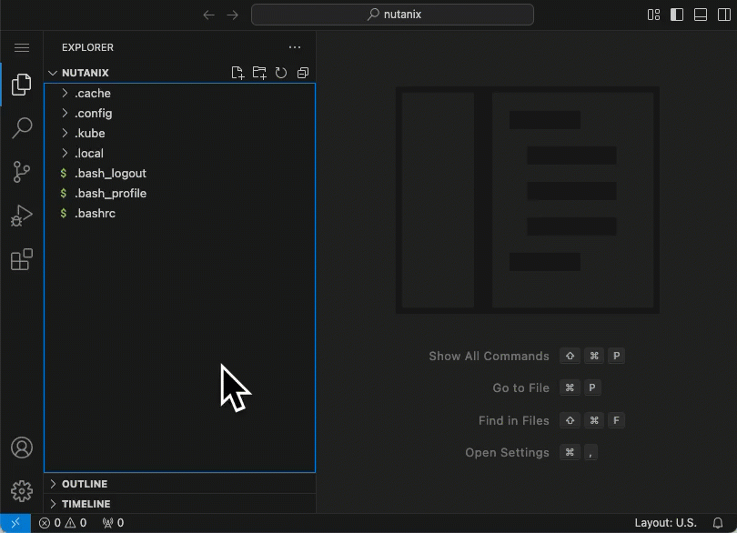
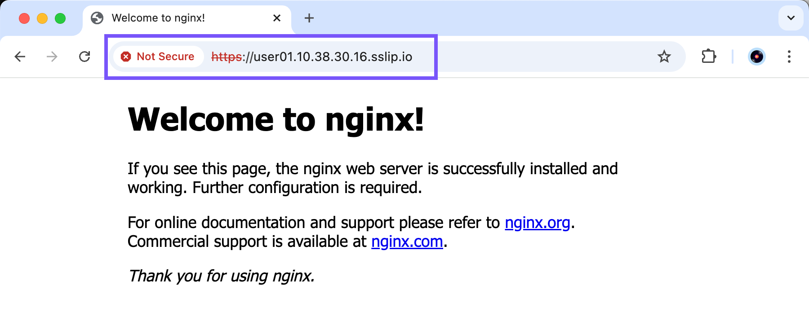
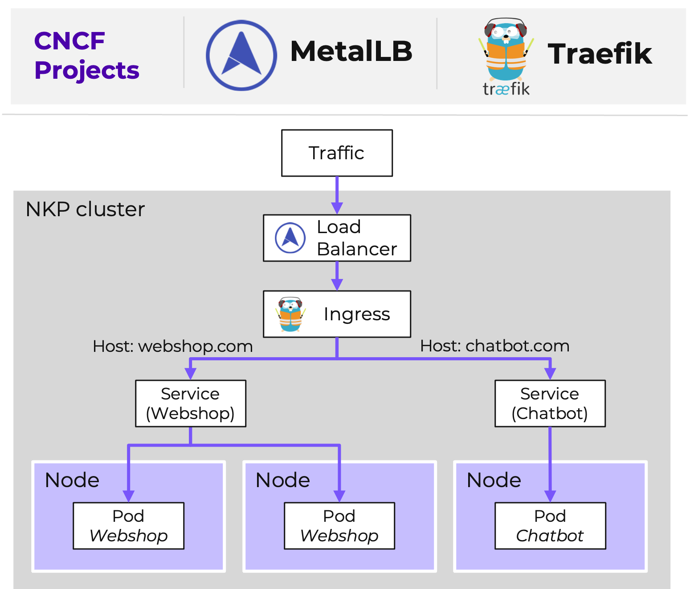

# Ingress

Kubernetes Ingress เป็น resource ที่ใช้จัดการการเข้าถึง services ภายในคลัสเตอร์จากภายนอกหรือภายใน โดยทั่วไปจะเป็น HTTP และ HTTPS traffic ประโยชน์บางประการของ integration นี้ได้แก่:

-   **Simplified Traffic Management**. รวมศูนย์ (Centralize) และลดความซับซ้อนของ routing configuration เมื่อเทียบกับการจัดการ services เดี่ยวๆ หลายๆ ตัวด้วย LoadBalancer หรือ NodePort types
    
-   **TLS Termination**. Ingress สามารถจัดการ SSL/TLS termination ได้
    
-   **Advanced Routing**. รองรับ routing แบบ host-based (เช่น `app.example.com`) และ path-based (เช่น `/api/`)
    

เช่นเดียวกับ load balancing service ทั่วไป Kubernetes นั้นจัดเตรียมไว้แค่ Kubernetes Ingress resource API แต่ไม่ได้มี Ingress controller มาให้

!!! info

    รู้หรือไม่?
    
    **Traefik** มีรวมอยู่ใน NKP ทุก tiers

**Traefik** เป็น **edge router** และ **reverse proxy** แบบ open-source และ cloud-native ที่ทันสมัย ซึ่งออกแบบมาเพื่อลดความซับซ้อนในการจัดการและ deploy ตัว microservices ใน NKP นั้น Traefik จะทำหน้าที่เป็น **Ingress Controller** จัดการ Ingress resources และ routing traffic ไปยัง backend services แบบไดนามิก

#### Looking at existing Ingress resources

1.  ก่อนที่จะสร้าง Ingress resource สำหรับ simple application ของเรา มาตรวจสอบ Ingress resources ทั้งหมดที่มีอยู่ในคลัสเตอร์กันก่อน
    
    -   command

    ```
    kubectl get ingresses --all-namespaces
    ```
    
    -   output (example)

    ```
    NAMESPACE             NAME                        CLASS               HOSTS   ADDRESS         PORTS   AGE
    git-operator-system   git-operator-git            kommander-traefik   * 10.38.30.16   80      42h
    kommander             dex                         <none>              * 10.38.30.16   80      42h
    kommander             dex-k8s-authenticator       <none>              * 10.38.30.16   80      42h
    kommander             kommander-kommander-ui      <none>              * 10.38.30.16   80      42h
    kommander             kube-oidc-proxy             <none>              * 10.38.30.16   80      42h
    kommander             traefik-dashboard           <none>              * 10.38.30.16   80      42h
    kommander             traefik-forward-auth-mgmt   <none>              * 10.38.30.16   80      42h
    ```
    
    จากคำสั่งก่อนหน้านี้ คุณสามารถระบุได้ว่า services ใดที่มี ingress resource และ load balancing IP ใดที่ถูก assign ให้กับ Traefik Ingress controller ในตัวอย่างนี้คือ `10.38.30.16`
    

#### Create Ingress resource for our simple app

1.  ใน VS Code ให้สร้างไฟล์ใหม่ชื่อ `simple-app-ingress.yaml`
    
    !!! note

        ตรวจสอบให้แน่ใจว่าเมื่อคุณคลิกไอคอนสร้างไฟล์ใหม่ คุณอยู่ใน directory _NUTANIX_ และไม่ได้อยู่ในโฟลเดอร์ใดๆ ย่อย
    
    
    
2.  วาง (paste) ข้อมูลต่อไปนี้และอัปเดตบรรทัดที่ `highlighted` ด้วย:
    
    -   **4, 15** - หมายเลข user ของคุณ ตัวอย่างเช่น: user`01`\-nkp-simple-app
    -   **8** - หมายเลข user ของคุณตามด้วย Ingress IP จากขั้นตอนก่อนหน้า ตัวอย่างเช่น: user`01`.`10.38.30`.16.sslip.io  

    -    manifest

    ```
    apiVersion: networking.k8s.io/v1
    kind: Ingress
    metadata:
      name: user##-nkp-simple-app
    spec:
      ingressClassName: kommander-traefik
      rules:
        - host: user##.<ingress_lb_ip>.sslip.io
          http:
            paths:
              - path: /
                pathType: Prefix
                backend:
                  service:
                    name: user##-nkp-simple-app
                    port:
                      number: 80
    ```

    -   example   
    
    ```
    apiVersion: networking.k8s.io/v1
    kind: Ingress
    metadata:
      name: user01-nkp-simple-app
    spec:
      ingressClassName: kommander-traefik
      rules:
        - host: user01.10.38.30.16.sslip.io
          http:
            paths:
              - path: /
                pathType: Prefix
                backend:
                  service:
                    name: user01-nkp-simple-app
                    port:
                      number: 80
    ```
    
3.  Apply ตัว manifest ด้วยคำสั่งต่อไปนี้:
    
    -   command

    ```
    kubectl apply -f simple-app-ingress.yaml
    ```
    
    -   output

    ```
    ingress.networking.k8s.io/user18-nkp-simple-app created
    ```
    
    !!! tip

        Ingress Controller ใน Kubernetes โดยทั่วไปจะเป็น **cluster-scoped** ซึ่งหมายความว่ามันจะคอยฟัง request ใดๆ ที่มาจาก namespace ใดๆ ที่ร้องขอ Ingress ซึ่งตรงกับ `ingressClassName`
    
    คุณสามารถ install Ingress Controllers ได้หลายตัว หากคุณกำลังมองหาการแทนที่ Traefik ขอแนะนำให้ปล่อย Traefik ไว้สำหรับ NKP platform services และใช้ deployment ของคุณสำหรับ applications ของคุณเอง
    
4.  เปิดแท็บใหม่ในเบราว์เซอร์ของคุณ เปิดแอปพลิเคชันของคุณโดยเชื่อมต่อไปยัง FQDN ที่คุณกำหนดไว้ในบรรทัดที่ 8 ของไฟล์ yaml ผ่าน https ตัวอย่างเช่น: https://user**01**.10.38.30.16.sslip.io
    
    !!! info

        กดยอมรับ self-signed certificate
    
    
    

**(Optional)** แผนภาพแสดงสิ่งที่คุณเพิ่งทำไป


