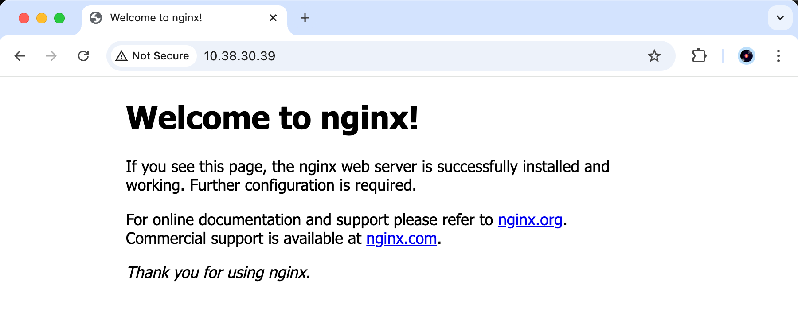
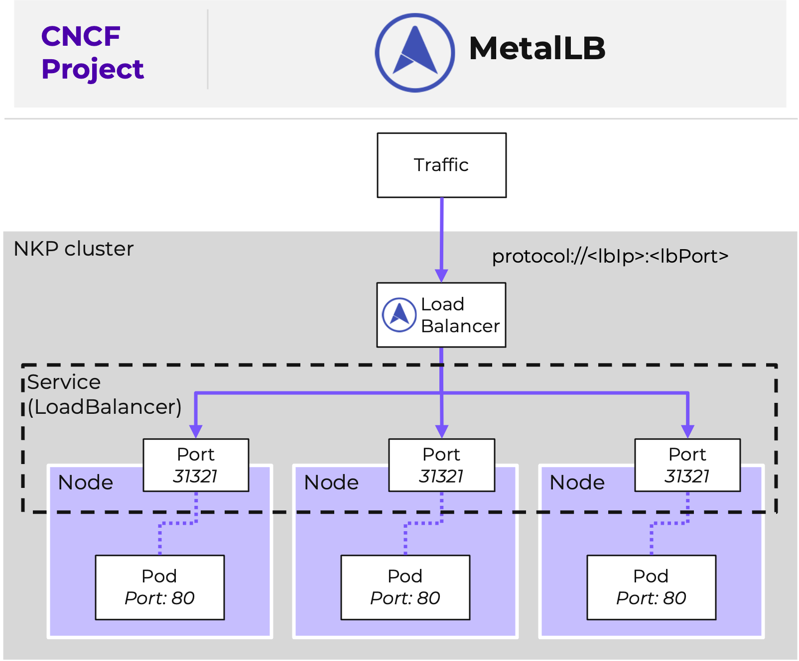

# Load Balancer

**MetalLB** คือ implementation ของ Kubernetes load-balancer (L4 ของ OSI model) สำหรับ self-hosted environments ประโยชน์บางประการของ integration นี้ได้แก่:

-   **Automatic External IP Allocation**. MetalLB จะ assign external IPs ให้กับ LoadBalancer Services โดยอัตโนมัติ ช่วยขจัดความจำเป็นในการ assign IP แบบ manual
    
-   **High Availability**. รองรับ multiple nodes สำหรับ load balancing
    
-   **Seamless Kubernetes Integration**. ไม่จำเป็นต้องทำการเปลี่ยนแปลงใดๆ กับ application manifests หรือ workflows
    
!!! note
    รู้หรือไม่?
    **MetalLB** มีรวมอยู่ใน NKP ทุก tiers

#### Looking at MetalLB configuration

1.  มาตรวจสอบกันว่า IP address pool ใดที่ถูก configure ไว้ นี่คือ IPs ที่ MetalLB สามารถนำมาใช้ assign แบบไดนามิกสำหรับ service requests ที่เป็น type _LoadBalancer_
    
    -   command
    
    ```
    kubectl --namespace metallb-system get ipaddresspool
    ```
    
    -   output (example)

    ```
    NAME      AUTO ASSIGN   AVOID BUGGY IPS   ADDRESSES
    metallb   true          false              ["10.38.30.16-10.38.30.16","10.38.30.39-10.38.30.58"]
    ```
    
    -   "range" แรกที่มี IP เดียวที่ลงท้ายด้วย _.16_ นั้นถูกเตรียมไว้ในระหว่างการสร้าง cluster และจะถูก assign ให้กับ Traefik Ingress controller
    -   range ที่สองถูก stage ไว้หลังจากสร้าง cluster เสร็จ มันจะสนับสนุนงานถัดไปของคุณในการ expose ตัว NGINX web server

#### Updating our Service to LoadBalancer

service ของ simple application ของเรานั้นเป็น type _NodePort_ เราต้องการที่จะ migrate สิ่งนี้ไปเป็น type `LoadBalancer` มีหลายวิธีในการทำเช่นนี้ แต่ option ที่ดีที่สุดคือการอัปเดต service ที่มีอยู่เพื่อหลีกเลี่ยง disruptions หรือการทำ configurations เพิ่มเติม

!!! note 
    คำอธิบายเกี่ยวกับ migration options แบบต่างๆ

    -   การสร้าง service ใหม่ที่เป็น type `LoadBalancer` เพิ่มเติมจากที่สร้างไว้ก่อนหน้านี้ ข้อเสียคือคุณจะใช้ dynamic port เพิ่มเติมใน nodes

    -   การลบแล้ว re-creating ตัว service ใหม่ แต่คราวนี้ให้ตั้งค่า type เป็น `LoadBalancer` ใน production นั้น approach นี้จะทำให้เกิด downtime

    -   การอัปเดต service ที่มีอยู่ให้เป็น type `LoadBalancer` ตัว dynamic port ที่ allocate ให้กับ `NodePort` จะยังคงเหมือนเดิม และจะมีการ assign IP จาก load balancing pool เพิ่มเติม วิธีนี้จะช่วยหลีกเลี่ยง disruptions ใน production และเป็นวิธีที่คุณกำลังจะดำเนินการ
    

1.  List รายการ service ที่มีอยู่ของคุณ ตรวจสอบให้แน่ใจว่าคุณได้อัปเดต `##` ด้วยหมายเลข user ของคุณ
    
    -   command

    ```
    kubectl get service user##-nkp-simple-app
    ```
    
    -   example

    ```
    kubectl get service user01-nkp-simple-app
    ```
    
    -   output (example)

    ```
    NAME                                                      TYPE        CLUSTER-IP      EXTERNAL-IP   PORT(S)        AGE
    user01-nkp-simple-app                                     NodePort    10.99.58.51     <none>        80:31347/TCP   112m
    ```
    
    ในตัวอย่าง service `user##-nkp-simple-app` กำลัง listening บน port `31347` ในทุกๆ nodes โดยที่ยังไม่มี `EXTERNAL-IP` ถูก assign
    
2.  ดำเนินการต่อและอัปเดต service ของเราโดยใช้ `PATCH` เพื่อเปลี่ยน type เป็น `LoadBalancer` ตรวจสอบให้แน่ใจว่าคุณได้อัปเดต `##` ด้วยหมายเลข user ของคุณ
    
    -   command

    ```
    kubectl patch service user##-nkp-simple-app         -p '{"spec": {"type": "LoadBalancer"}}'
    ```

    -   example
    
    ```
    kubectl patch service user01-nkp-simple-app         -p '{"spec": {"type": "LoadBalancer"}}'
    ```

    -   example (output)
    
    ```
    service/user01-nkp-simple-app patched
    ```
    
3.  มาดูกันว่า IP address ใดจาก pool ที่ถูก assign ไว้ในคอลัมน์ `EXTERNAL-IP` ตรวจสอบให้แน่ใจว่าคุณได้อัปเดต `##` ด้วยหมายเลข user ของคุณ
    
    -   command

    ```
    kubectl get service user##-nkp-simple-app
    ```

    -   example
    
    ```
    kubectl get service user01-nkp-simple-app
    ```

    -   output (example)
    
    ```
    NAME                    TYPE           CLUSTER-IP    EXTERNAL-IP     PORT(S)        AGE
    user01-nkp-simple-app   LoadBalancer   10.99.58.51   10.38.30.39   80:31347/TCP   161m
    ```
    
    !!! tip
        Load Balancer Controller ใน Kubernetes โดยทั่วไปจะเป็น **cluster-scoped** ซึ่งหมายความว่ามันจะคอยฟัง request ใดๆ ที่มาจาก namespace ใดๆ ที่ร้องขอ Service ที่เป็น type `LoadBalancer`
    
4.  ใช้ _curl_ บน terminal ของคุณหรือเว็บบราวเซอร์ เปิดหน้าเว็บโดยใช้ load balancer IP address และ backend container port `80` เดิม
    
    -   command

    ```
    curl http://<EXTERNAL-IP>:<CONTAINER_PORT>
    ```

    -   example
    
    ```
    curl http://10.38.30.39
    ```

    -   output (example)
    
    ```
    <!DOCTYPE html>
    <html>
    <head>
    <title>Welcome to nginx!</title>
    <style>
    html { color-scheme: light dark; }
    body { width: 35em; margin: 0 auto;
    font-family: Tahoma, Verdana, Arial, sans-serif; }
    </style>
    </head>
    <body>
    <h1>Welcome to nginx!</h1>
    <p>If you see this page, the nginx web server is successfully installed and
    working. Further configuration is required.</p>
    
    <p>For online documentation and support please refer to
    <a href="http://nginx.org/">nginx.org</a>.<br/>
    Commercial support is available at
    <a href="http://nginx.com/">nginx.com</a>.</p>
    
    <p><em>Thank you for using nginx.</em></p>
    </body>
    </html>
    ```
    
    
    

**(Optional)** แผนภาพแสดงสิ่งที่คุณเพิ่งทำไป



---

[← Back: Expose App Overview](nkp-fundamentals-expose.md) | [Home](nkp-bootcamp.md) | [Next: Ingress →](nkp-fundamentals-expose-ingress.md)