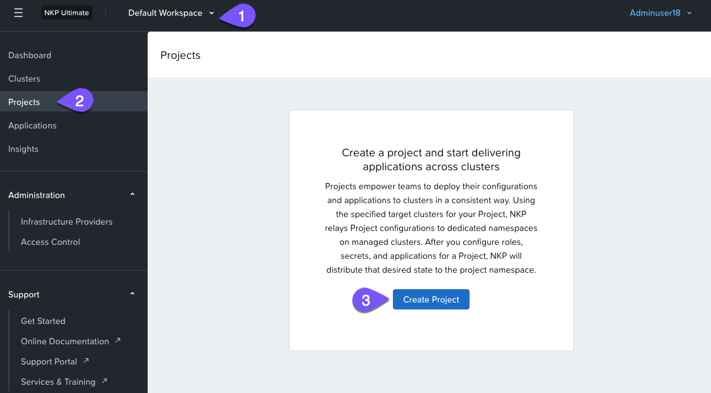
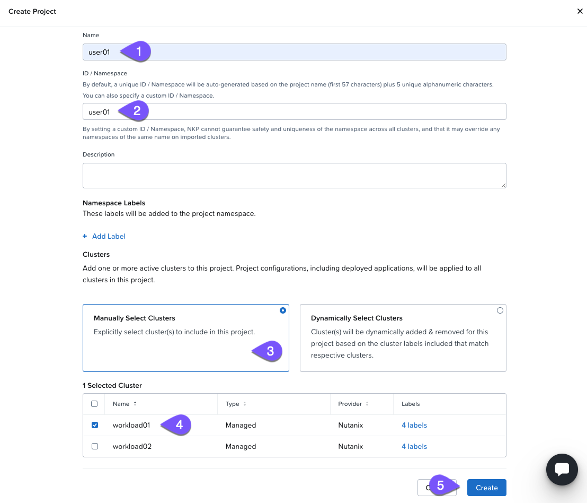
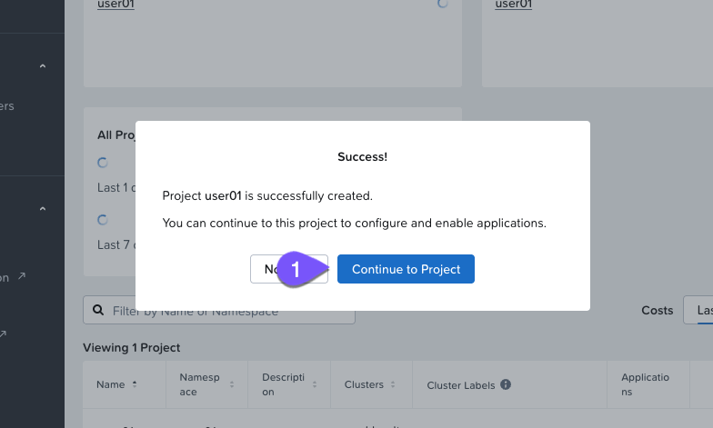

# NKP Projects

Projects สอดคล้องกับ "soft" multi-tenancy ซึ่งช่วยให้สามารถแชร์ Kubernetes clusters ระหว่างหลายๆ ทีมได้ โดยให้พวกเขาทำงานแบบ self-service

เมื่อสร้าง Project ขึ้นมา NKP จะสร้าง federated namespace ที่ถูก propagate ไปยัง Kubernetes clusters ที่เกี่ยวข้องกับ Project นี้ Federation ในบริบทนี้หมายถึง common configuration จะถูก push ออกจากจุดศูนย์กลาง (NKP) ไปยัง Kubernetes clusters ทั้งหมด หรือกลุ่มย่อย (subset group) ที่กำหนดไว้ล่วงหน้า ภายใต้การจัดการของ NKP

**Project Namespaces**

Project Namespace คือ concept เฉพาะของ NKP มันใช้แยก (isolate) configurations ข้าม clusters และถูกสร้างขึ้นบน clusters ทั้งหมดที่ตรงกับ project labels

ใน lab นี้ คุณจะได้สร้าง project ของคุณเองเพื่อใช้กับ labs ที่จะมาถึง

#### Creating a NKP Project

1.  บน _Default Workspace_ ให้เลือก _Projects_ ที่เมนู sidebar แล้วคลิก `+ Create Project`
    
    !!! note    
        หากมี projects ถูกสร้างไว้แล้ว ปุ่มสีน้ำเงิน `+ Create Project` จะอยู่ที่มุมขวาบนของหน้าจอ
    
    
    
2.  ใช้ settings ต่อไปนี้ ตรวจสอบให้แน่ใจว่าคุณได้อัปเดต `##` ด้วยหมายเลข user ของคุณ:
    
    -   Project Name: **user`##`**
        
    -   ID / Namespace: **user`##`** (เหมือนกับ _Project Name_)
        
    -   Clusters: **Manually Selected Clusters**
        
    -   Selected Cluster: **workload01** (เท่านั้น)
        
    
    
    
3.  คลิก **Continue to Project**
    
    

---

[← Back: NKP Workspaces](nkp-fundamentals-multi-ws.md) | [Home](nkp-bootcamp.md) | [Next: Persistent Storage Overview →](nkp-fundamentals-storage.md)