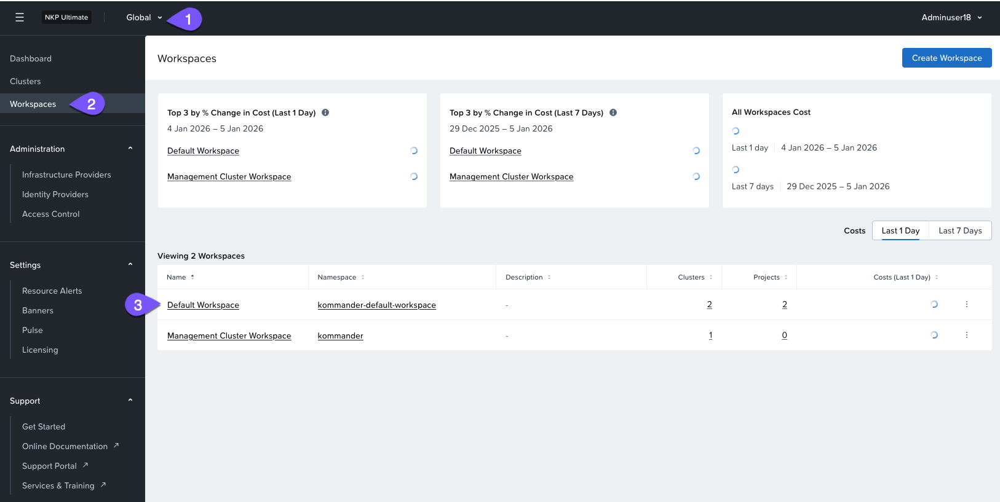
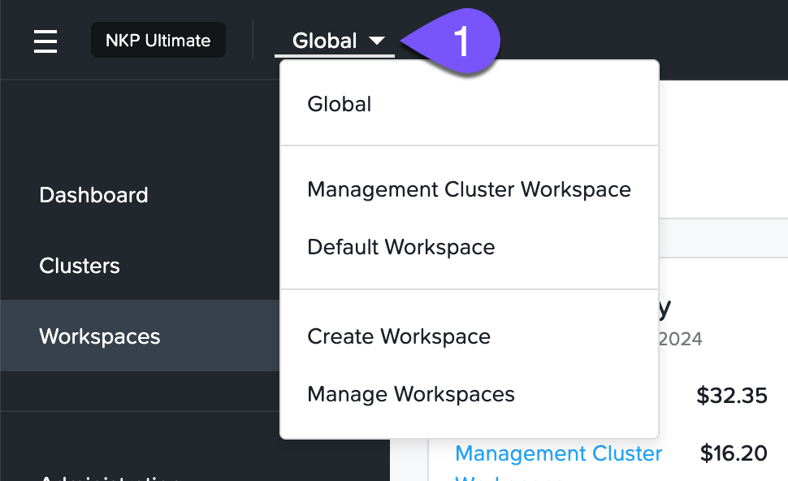
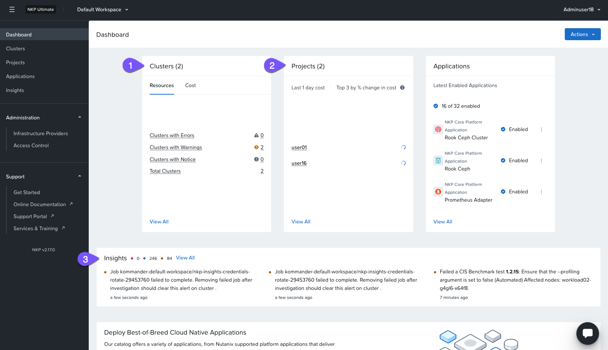

# NKP Workspaces

Workspaces สอดคล้องกับ "hard" multi-tenancy โดยการอนุญาตให้ teams หรือ tenants สามารถจัดการ clusters ของพวกเขาเองได้ Workspaces คือการจัดกลุ่มทางตรรกะ (logical grouping) ของ clusters ที่รักษา configuration ที่คล้ายคลึงกัน โดยมี configurations บางส่วนถูก federated ไปยัง clusters เหล่านั้นโดยอัตโนมัติ

#### Dedicated login URL for each tenant

NKP จัดเตรียม workspaces พร้อมด้วย dedicated login page ซึ่ง users ใน NKP UI สามารถกรอก SSO credentials เพื่อเข้าถึง workspace ของพวกเขา หรือสร้าง token เพื่อเข้าถึง kubectl API ของ cluster ผู้เช่า (tenants) รายอื่นๆ และ SSO configurations ของพวกเขาจะไม่สามารถมองเห็นได้

รูปแบบ URL คือ https://`<DOMAIN>`/token/landing/`<WORKSPACE_NAME>`

#### Default Workspace

เพื่อให้เริ่มใช้งานได้ทันที NKP จะ deploy ตัว default workspace ให้เมื่อมีการ apply ตัว NKP Ultimate license อย่างไรก็ตาม โปรดคำนึงไว้ด้วยว่าคุณจะไม่สามารถย้าย clusters จาก workspace หนึ่งไปยังอีก workspace หนึ่งได้หลังจากทำการสร้าง/พ่วง (creating/attaching) ไปแล้ว

ใน lab นี้คุณจะไม่ได้ทำการสร้าง workspaces แต่จะทำการตรวจสอบ default workspace และ managed clusters ที่ถูก stage ไว้สำหรับ labs ถัดไปของคุณแทน

1.  กลับไปที่ NKP management UI หากคุณปิดแท็บไปแล้ว คุณสามารถเปิดมันขึ้นมาใหม่ได้โดยใช้ https://#.#.#.**16**/dkp/kommander/dashboard (แทนที่ #.#.# ด้วย subnet ของคุณ - ซึ่งมีอยู่ในหน้า initial connection details)
    
2.  ไปที่ NKP **Global** scope เลือก workspaces ที่เมนู sidebar และดูข้อมูลที่มีให้บนหน้าเพจ
    
    
    
3.  คลิกที่ `Default Workspace` เพื่อเปลี่ยน scope
    
    !!! tip    
        คุณสามารถใช้ navigation bar ได้เช่นกัน
    
    
    
4.  ในหน้า workspace คุณสามารถระบุจำนวนของ clusters และ cost ของมัน, projects, หรือ aggregated analytics ของ workspace clusters ของคุณที่รายงานโดย NKP Insights ได้อย่างง่ายดาย
    
    
