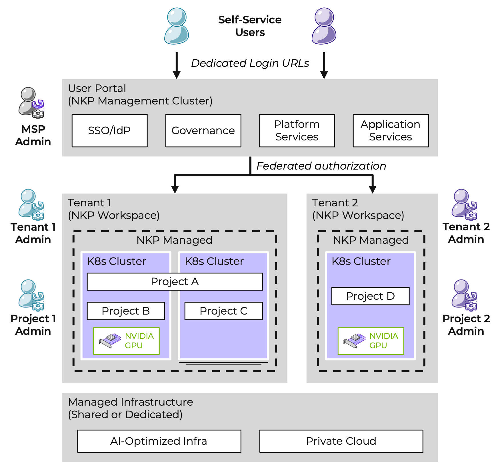

# Multi-tenancy Lab

มีหลายวิธีในการออกแบบและสร้าง multi-tenant solutions ด้วย Kubernetes แต่ละวิธีเหล่านี้มาพร้อมกับ tradeoffs ของตัวเองที่ส่งผลต่อ isolation level, implementation effort, operational complexity และ cost of service

โดยสรุปแล้ว เราสามารถจับคู่ multi-tenancy models เหล่านี้กับ 2 scenarios ได้ดังนี้:

-   **Multiple teams ("soft")**. รูปแบบทั่วไปของ multi-tenancy คือการ share ตัว cluster ระหว่างหลายๆ teams ภายในองค์กร ซึ่งแต่ละทีมอาจจะ operate ตัว workloads หนึ่งตัวหรือมากกว่านั้น โมเดลนี้จะอิงตาม Kubernetes Namespace resources ซึ่งสอดคล้องกับ NKP Projects
    
-   **Multiple customers ("hard")**. อีกรูปแบบหลักของ multi-tenancy มักจะเกี่ยวข้องกับ Managed Service Provider (MSP) ตัว workloads ของลูกค้าจะรันบน dedicated clusters สำหรับแต่ละ tenant (ลูกค้า) โมเดลนี้จะสอดคล้องกับ NKP Workspaces
    

## Multi-Tenancy in NKP

Multi-tenancy ใน NKP เป็น architecture model ที่ NKP Ultimate instance เพียงชุดเดียวให้บริการกับ divisions, customers หรือ tenants หลายๆ รายขององค์กร ใน NKP แต่ละ tenant system จะถูกแสดงแทนด้วย workspace แต่ละ workspace และ resources ของมันสามารถถูก isolated ออกจาก workspaces อื่นๆ ได้ (โดยใช้ Identity Providers แยกต่างหาก) แม้ว่าทั้งหมดจะอยู่ภายใต้ Ultimate license เดียวกันก็ตาม

#### Global or Workspace UI

UI ถูกออกแบบมาให้สามารถเข้าถึงได้สำหรับ roles ต่างๆ ในระดับต่างๆ กัน:

-   _Global_: ที่ระดับบนสุด platform engineers หรือ MSP admins จะเป็นผู้ manage ตัว clusters ทั้งหมดในทุกๆ workspaces
    
-   _Workspace_: platform engineers หรือ tenant admins จะเป็นผู้ manage ตัว clusters หลายๆ ตัวภายใน workspace
    
-   _Projects_: platform engineers หรือ tenant developers จะเป็นผู้ manage ตัว workloads configuration และ services ข้าม clusters หลายๆ ตัว
    

ใน lab นี้เราจะมาดูภาพรวมระดับสูง (high level) ของ NKP Workspaces และ NKP Projects กัน

!!! info

    รู้หรือไม่?

    **Multi-tenancy** จำเป็นต้องใช้ NKP Ultimate
