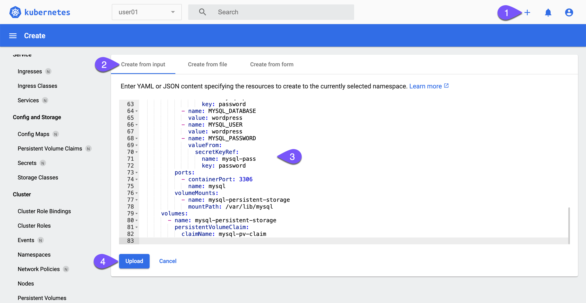
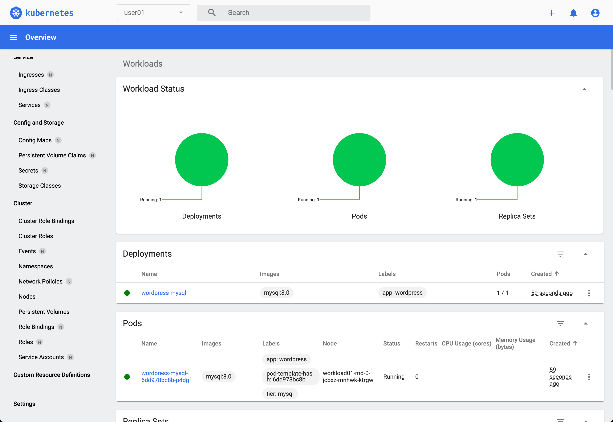
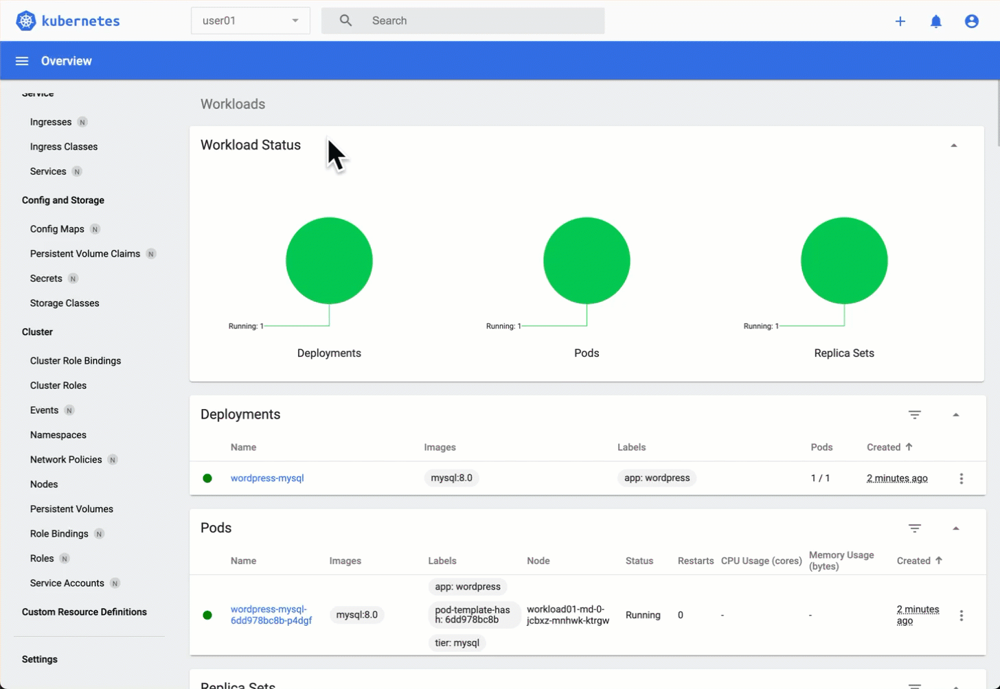
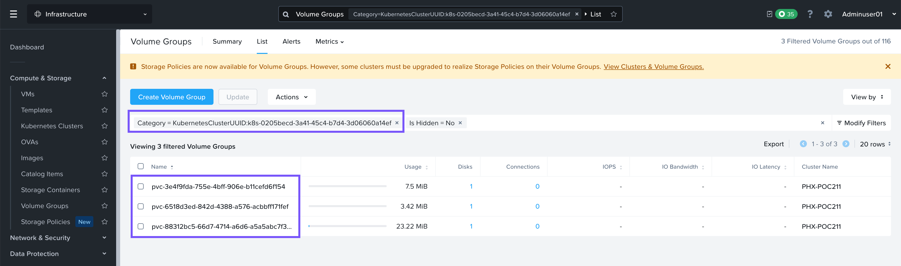

# Block storage with Nutanix Volumes

Block storage รองรับ ReadWriteOnce (RWO) และ ReadOnlyMany (ROX) ตัว persistent volume สามารถถูก mount แบบ read-write โดย node เดี่ยวได้

คุณจะได้ใช้ block storage จาก Nutanix Volumes สำหรับ MySQL database ของคุณ

#### Create a MySQL database in Kubernetes

!!! info
    Reminder

    เรากำลัง deploy ตัว WordPress application บนคลัสเตอร์ **workload01**

1.  บน Kubernetes dashboard ของคุณ ให้คลิกปุ่มบวก (plus button) ที่ด้านขวาบน วาง (paste) manifest ด้านล่าง แล้วคลิก _Upload_
    
    
    
    Apply ตัว manifest ตามค่านี้เลย
    
    ```
    apiVersion: v1
    kind: Secret
    metadata:
      name: mysql-pass
    type: Opaque
    stringData:
      password: nutanix/4u
    ---
    apiVersion: v1
    kind: Service
    metadata:
      name: wordpress-mysql
      labels:
        app: wordpress
    spec:
      ports:
        - port: 3306
      selector:
        app: wordpress
        tier: mysql
      clusterIP: None
    ---
    apiVersion: v1
    kind: PersistentVolumeClaim
    metadata:
      name: mysql-pv-claim
      labels:
        app: wordpress
    spec:
      accessModes:
        - ReadWriteOnce
      resources:
        requests:
          storage: 20Gi
    ---
    apiVersion: apps/v1
    kind: Deployment
    metadata:
      name: wordpress-mysql
      labels:
        app: wordpress
    spec:
      selector:
        matchLabels:
          app: wordpress
          tier: mysql
      strategy:
        type: Recreate
      template:
        metadata:
          labels:
            app: wordpress
            tier: mysql
        spec:
          containers:
            - image: mysql:8.0
              name: mysql
              env:
                - name: MYSQL_ROOT_PASSWORD
                  valueFrom:
                    secretKeyRef:
                      name: mysql-pass
                      key: password
                - name: MYSQL_DATABASE
                  value: wordpress
                - name: MYSQL_USER
                  value: wordpress
                - name: MYSQL_PASSWORD
                  valueFrom:
                    secretKeyRef:
                      name: mysql-pass
                      key: password
              ports:
                - containerPort: 3306
                  name: mysql
              volumeMounts:
                - name: mysql-persistent-storage
                  mountPath: /var/lib/mysql
          volumes:
            - name: mysql-persistent-storage
              persistentVolumeClaim:
                claimName: mysql-pv-claim
    ```
    
2.  รอสักครู่จนกว่า MySQL components ของคุณใน _Workload Status_ จะเป็นสีเขียว ในระหว่างนี้คุณสามารถอ่านคำอธิบายของ manifest ก่อนหน้านี้ได้
    
    **(Optional)** คำอธิบายเกี่ยวกับ MySQL manifest
    
    -   **1-7** สร้าง secret สำหรับ MySQL โดยมี password เป็น `nutanix/4u`
    -   **9-21** สร้าง headless service (_clusterIP: None_) เพื่อ expose ตัว MySQL บน port 3306 ภายใน Kubernetes cluster
    -   **23-34** สร้าง persistent volume ขนาด 20Gi เพื่อเก็บ database (ตัว _default_ StorageClass จะเป็นตัวรับ request นี้)
    -   **36-82** Deploy ตัว MySQL เวอร์ชัน 8.0 โดยใช้ persistent storage ที่สร้างขึ้นและส่งผ่าน password เป็น environment variable จาก secret
    
    
    
3.  คลิกที่ตัวเลือก _Persistent Volume Claims_ บนเมนู sidebar เพื่อดู persistent volume ที่ถูกสร้างขึ้นสำหรับ MySQL
    
    
    
    !!! tip
        
        ตัว block storage PVC คือ Volume Group ใน Nutanix
        
        
    

🎉 ขอแสดงความยินดีด้วย! คุณเพิ่งจะ deploy ตัว stateful application แรกของคุณ ซึ่งก็คือ MySQL database


---

[← Back: StorageClass with Nutanix CSI](nkp-fundamentals-storage-csi.md) | [Home](nkp-bootcamp.md) | [Next: File storage with Nutanix Files →](nkp-fundamentals-storage-file.md)