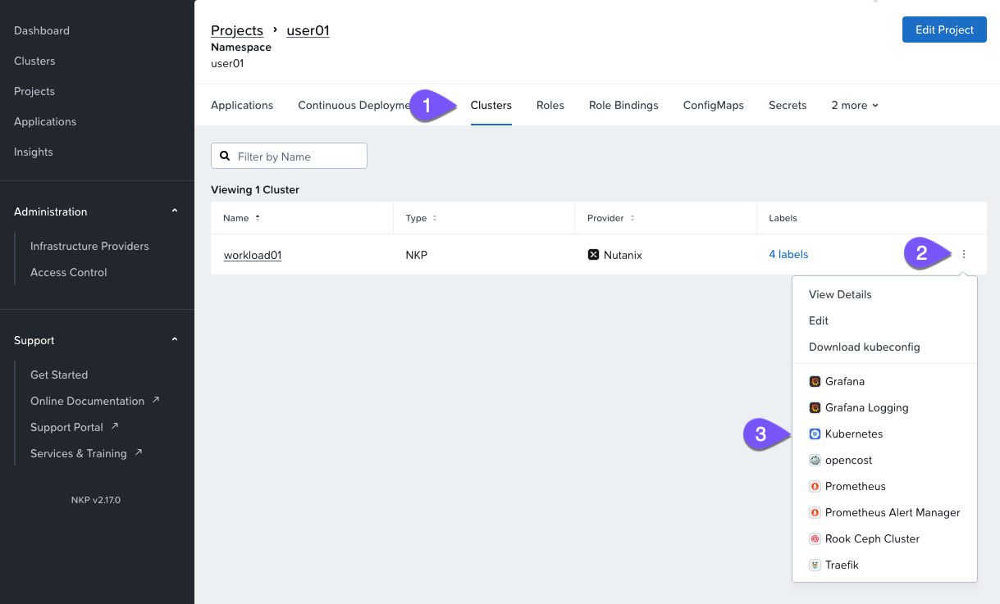
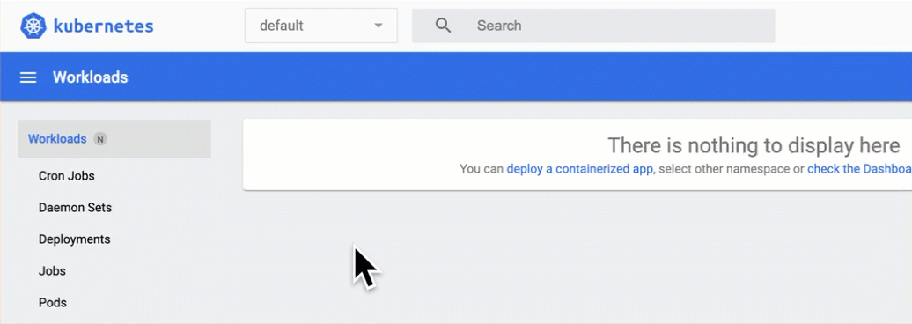
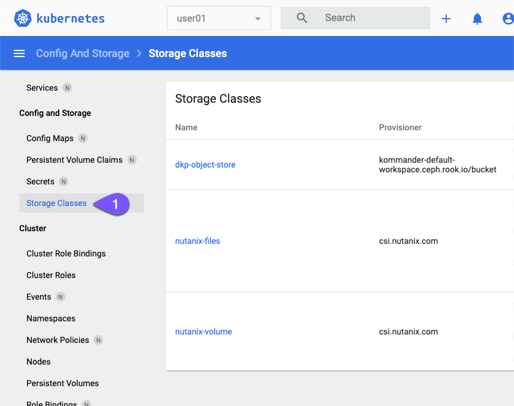
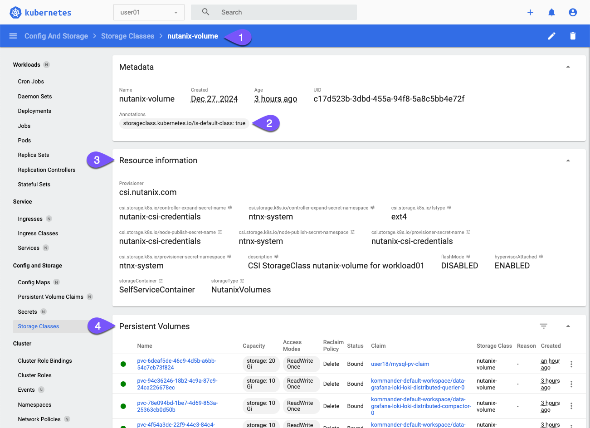

# StorageClass with Nutanix CSI

StorageClass เป็น resource แบบ **cluster-scoped** ที่มีวิธีในการ provision ตัว persistent storage (`PersistentVolumeClaim`) แบบไดนามิกสำหรับ applications ที่รันอยู่ในคลัสเตอร์ มันทำหน้าที่เป็น abstraction layer ระหว่าง Kubernetes และ storage infrastructure ที่อยู่เบื้องล่างโดยใช้ `CSI provisioner` ซึ่งช่วยให้ผู้ใช้สามารถกำหนดประเภทของ storage ที่แตกต่างกันด้วย properties ที่หลากหลาย เช่น performance, replication, หรือ backup policies

#### NKP default StorageClass configuration

มาตรวจสอบ StorageClass configuration สำหรับคลัสเตอร์ **workload01** กัน เนื่องจากเราจะใช้ project ของเราในการ deploy ตัว application

ในครั้งนี้สำหรับการโต้ตอบกับ Kubernetes cluster และ resources ของมัน เราจะใช้ Kubernetes Dashboard UI

!!! info

    รู้หรือไม่?

    **Kubernetes Dashboard** มีให้ใช้งานใน NKP Pro และ Ultimate licenses

1.  ไปที่ project ของคุณใน `Default Workspace`
    
    
    
2.  ในหน้า _Clusters_ บน project ของคุณ ให้คลิกที่จุดสามจุดทางด้านขวาของ _workload01_ แล้วเปิด `Kubernetes`
    
    
    
    !!! info
        กดยอมรับ self-signed certificate
    
    !!! info
        re-authenticate
        
        Dashboards นั้นเป็นแบบ cluster-scoped ดังนั้น authentication cookie ในเบราว์เซอร์ของคุณจึงยังไม่มีอยู่สำหรับ external IP address ของ _workload01_
    
3.  เปลี่ยน namespace เป็นของคุณคือ _user`##`_ คุณจะเห็นว่ายังไม่มี resources ใดๆ
    
    
    
4.  คลิก `Storage Classes` บนเมนู sidebar ภายใต้ **Config and Storage** เพื่อตรวจสอบ Storage Classes ที่มีให้ใช้งาน
    
    
    
    NKP cluster ใดๆ ที่ถูก deploy บน Nutanix จะได้รับ `nutanix-volume` StorageClass ซึ่งช่วยให้สามารถ deploy ตัว stateful applications ได้แบบ out-of-the-box
    
    !!! note   
        _nutanix-files_ StorageClass จะไม่ถูกสร้างขึ้นระหว่างการ cluster deployment
    
        ที่คุณเห็นอยู่นั้นเป็นเพราะมันถูก stage ไว้ล่วงหน้าสำหรับ lab ถัดไปของคุณแล้ว
    
5.  คลิกที่ `nutanix-volume` StorageClass และดูที่:
    
    -   **2** - annotation นี้จะกำหนดให้ storage class เป็น default ในกรณีที่ผู้ใช้ไม่ได้กำหนดค่า StorageClass ใน persistent volume request ของพวกเขา
        
    -   **3** - Settings เฉพาะสำหรับ Nutanix CSI driver สำหรับ Volumes
        
    -   **4** - Persistent volumes ที่ใช้ storage class นี้
        
    
    

---

[← Back: Persistent Storage Overview](nkp-fundamentals-storage.md) | [Home](nkp-bootcamp.md) | [Next: Block storage with Nutanix Volumes →](nkp-fundamentals-storage-block.md)