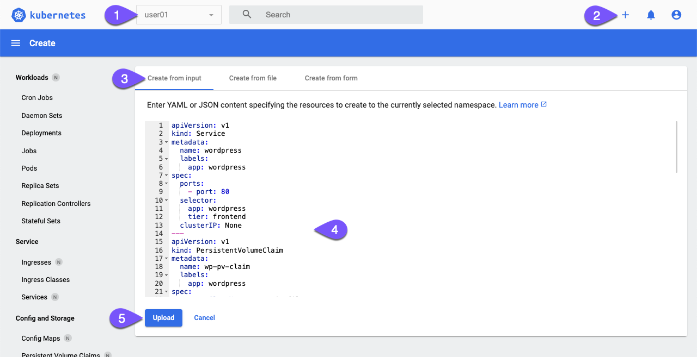
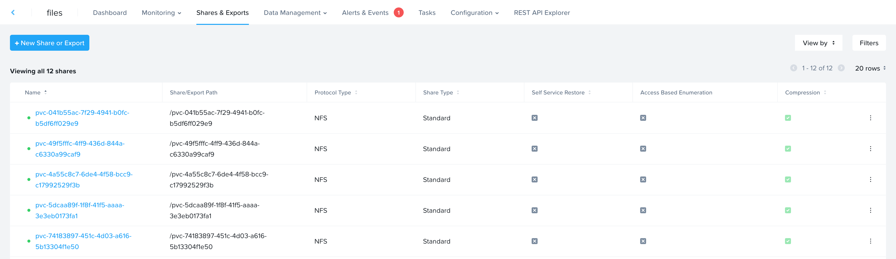
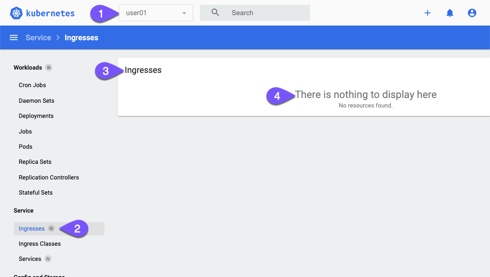
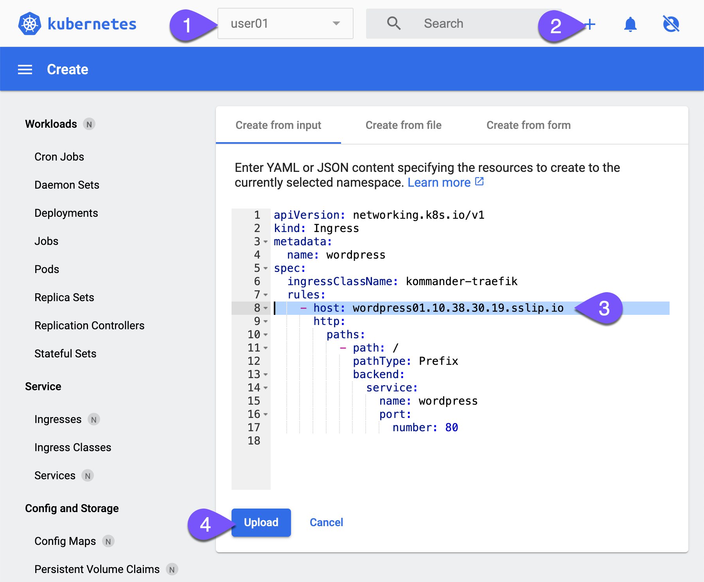
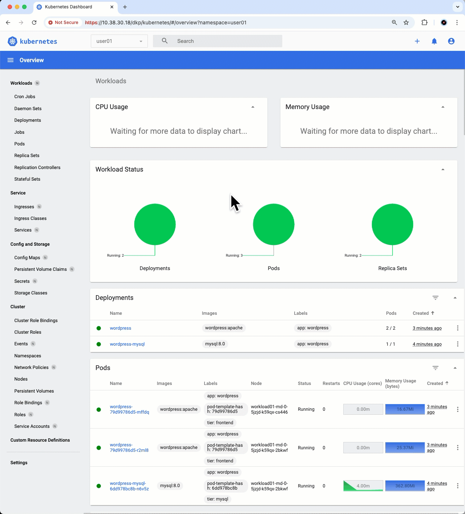

# File storage with Nutanix Files

Frontends เป็น scale-out tiers พวกมันจำเป็นต้องเข้าถึง data เดียวกัน WordPress ในฐานะ CMS จำเป็นต้องมีสถานที่สำหรับเก็บเอกสาร, รูปภาพ, plugins, และ static content อื่นๆ เราไม่ควรใช้ block-based PVC เพราะ pods อื่นๆ จะไม่สามารถเข้าถึง persistent volume นี้ได้

เราต้องการ shared storage นั่นก็คือ ReadWriteMany persistent volume! Nutanix Files คือคำตอบ 🚀

!!! note

    คลัสเตอร์มี storage class สำหรับ Nutanix Files อยู่แล้ว (ซึ่งครอบคลุมในส่วน [StorageClass with Nutanix CSI](nkp-fundamentals-storage-csi.md))

#### Create a Stateful WordPress frontend tier

1.  บน Kubernetes dashboard ของคุณ ตรวจสอบให้แน่ใจว่าคุณอยู่ใน namespace ของคุณ คลิกปุ่มบวก (plus button) ที่มุมขวาบน วาง (paste) manifest ด้านล่าง แล้วคลิก _Upload_
    
    
    
    Apply ตัว manifest ตามค่านี้เลย
    
    ```
    apiVersion: v1
    kind: Service
    metadata:
      name: wordpress
      labels:
        app: wordpress
    spec:
      ports:
        - port: 80
      selector:
        app: wordpress
        tier: frontend
      clusterIP: None
    ---
    apiVersion: v1
    kind: PersistentVolumeClaim
    metadata:
      name: wp-pv-claim
      labels:
        app: wordpress
    spec:
      storageClassName: nutanix-files
      accessModes:
        - ReadWriteMany
      resources:
        requests:
          storage: 20Gi
    ---
    apiVersion: apps/v1
    kind: Deployment
    metadata:
      name: wordpress
      labels:
        app: wordpress
    spec:
      replicas: 2
      selector:
        matchLabels:
          app: wordpress
          tier: frontend
      strategy:
        type: Recreate
      template:
        metadata:
          labels:
            app: wordpress
            tier: frontend
        spec:
          containers:
          - image: wordpress:apache
            name: wordpress
            env:
            - name: WORDPRESS_DB_HOST
              value: wordpress-mysql
            - name: WORDPRESS_DB_PASSWORD
              valueFrom:
                secretKeyRef:
                  name: mysql-pass
                  key: password
            - name: WORDPRESS_DB_USER
              value: wordpress
            ports:
            - containerPort: 80
              name: wordpress
            volumeMounts:
            - name: wordpress-persistent-storage
              mountPath: /var/www/html
          volumes:
          - name: wordpress-persistent-storage
            persistentVolumeClaim:
              claimName: wp-pv-claim
    ```
    
2.  รอสักครู่จนกว่า WordPress deployment ของคุณใน _Deployments_ จะเป็นสีเขียว ในระหว่างนี้คุณสามารถอ่านคำอธิบายของ manifest ก่อนหน้านี้ได้
    
    **(Optional)** คำอธิบายเกี่ยวกับ WordPress manifest
    
    -   **1-13** สร้าง headless service เพื่อ expose ตัว WordPress บน port 80 ภายใน Kubernetes cluster
    -   **15-27** สร้าง `ReadWriteMany` persistent volume ขนาด 20Gi เพื่อเก็บ WordPress static content
    -   **29-71** Deploy ตัว WordPress เวอร์ชัน 6.2.1 จำนวน 2 replicas (**36**) โดยใช้ persistent storage ที่สร้างขึ้น และส่งผ่าน MySQL address (**53-54**) และ password เป็น environment variable จาก secret (**55-59**)
    
    !!! tip    

        ตัว file storage PVC คือ NFS share ใน Nutanix Files
      
        
    

#### Accessing WordPress

WordPress application ยังไม่สามารถเข้าถึงได้จากภายนอก มาใช้ _Ingress_ resource เพื่อจุดประสงค์นี้กัน

1.  ที่เมนู sidebar ให้ไปที่ `Ingresses` ภายใต้หัวข้อ **Service** ตรวจสอบให้แน่ใจว่าคุณอยู่ใน namespace ของคุณ คุณต้องยังไม่มี ingress ใดๆ
    
    
    
2.  Apply ตัว manifest ต่อไปนี้ โดยอัปเดตบรรทัดที่ `highlighted` ที่ **8** เป็นหมายเลข user ของคุณต่อจาก wordpress และ ingress IP
    
    !!! tip  

        Ingress IP ของคุณลงท้ายด้วย **.19** ตัวอย่างเช่น: 10.38.30.**19**
      
        นี่คือ ingress service บนคลัสเตอร์ **workload01**
    
    
    
    -   manifest
    
    ```
    apiVersion: networking.k8s.io/v1
    kind: Ingress
    metadata:
      name: wordpress
    spec:
      ingressClassName: kommander-traefik
      rules:
        - host: wordpress##.<ingress_lb_ip>.sslip.io
          http:
            paths:
              - path: /
                pathType: Prefix
                backend:
                  service:
                    name: wordpress
                    port:
                      number: 80
    ```
    -   example

    ```
    apiVersion: networking.k8s.io/v1
    kind: Ingress
    metadata:
      name: wordpress
    spec:
      ingressClassName: kommander-traefik
      rules:
        - host: wordpress01.10.38.30.19.sslip.io
          http:
            paths:
              - path: /
                pathType: Prefix
                backend:
                  service:
                    name: wordpress
                    port:
                      number: 80
    ```
3.  เลื่อนลงไปที่ส่วนของ Ingresses แล้วเปิด URL ในคอลัมน์ _Hosts_
    
    !!! info

        กดยอมรับ self-signed certificate
    
    !!! info
    
        อย่าทำการติดตั้ง (installation) WordPress จนเสร็จสมบูรณ์
    
    
    

🎉 ขอแสดงความยินดีด้วย! คุณเพิ่งจะได้ WordPress application แบบเต็มรูปแบบพร้อม persistent storage ที่แตกต่างกัน 2 แบบ และ external access ที่มี ingress พร้อมใช้งาน


---

[← Back: Block storage with Nutanix Volumes](nkp-fundamentals-storage-block.md) | [Home](nkp-bootcamp.md) | [Next: Takeaways →](nkp-fundamentals-takeaways.md)