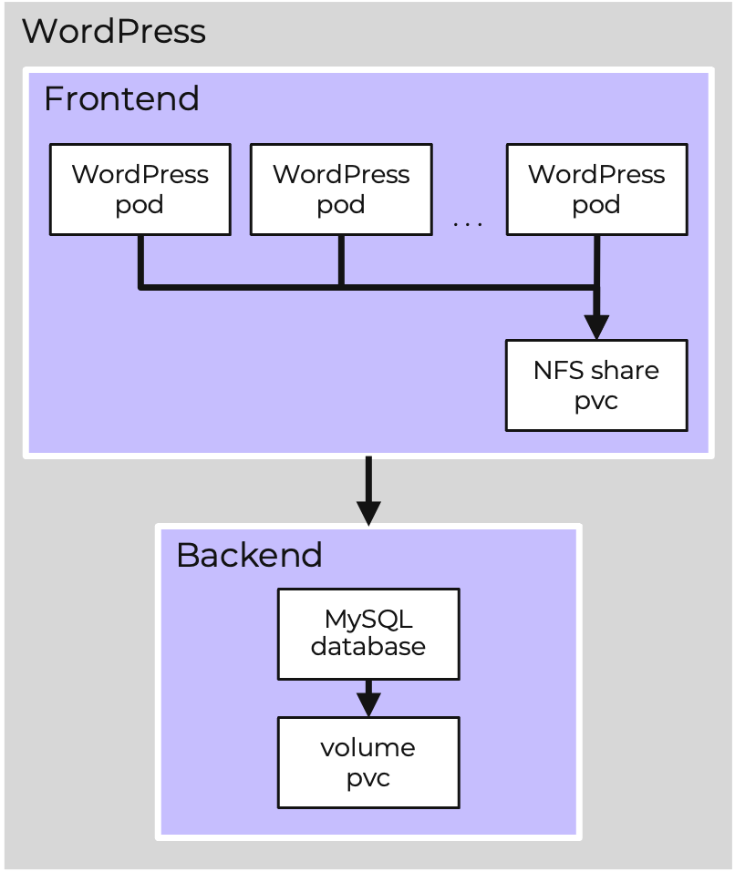

# Persistent storage Lab

เมื่อสร้าง NKP cluster บน Nutanix ตัว Nutanix Container Storage Interface (CSI) Driver สำหรับ Kubernetes จะถูก deploy โดยค่าเริ่มต้น

ด้วย Nutanix CSI คุณสามารถ:

-   จัดเตรียม persistent storage ให้กับ containers ของคุณ
    
-   ใช้ประโยชน์จาก PVC resources เพื่อ consume ตัว Nutanix storage แบบไดนามิก
    
-   ด้วย Files storage classes ตัว applications บนหลายๆ pods จะสามารถเข้าถึง (access) ตัว storage เดียวกันได้ และยังได้รับประโยชน์จาก multi-pod read and write access (ReadWriteMany)
    

เพื่อฝึกฝนเกี่ยวกับ stateful workloads ใน lab นี้เราจะทำการ deploy ตัว WordPress CMS ที่เป็นที่รู้จักและถูกนำไปใช้อย่างกว้างขวาง โดยมี 2 องค์ประกอบ (components) คือ frontend (UI) ที่ทำงานบนพื้นฐานของ PHP และ backend (database) ที่ทำงานบนพื้นฐานของ MySQL

-   สำหรับ MySQL คุณจะได้ใช้ block storage ร่วมกับ Nutanix Volumes
    
-   สำหรับ WordPress คุณจะได้ใช้ file storage ร่วมกับ Nutanix Files
    

