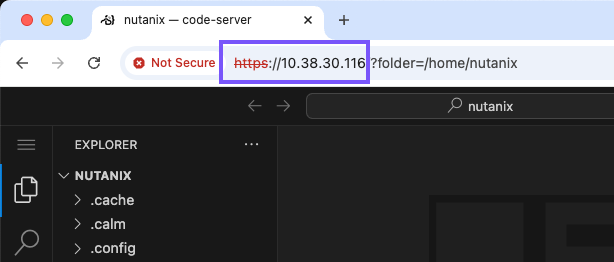
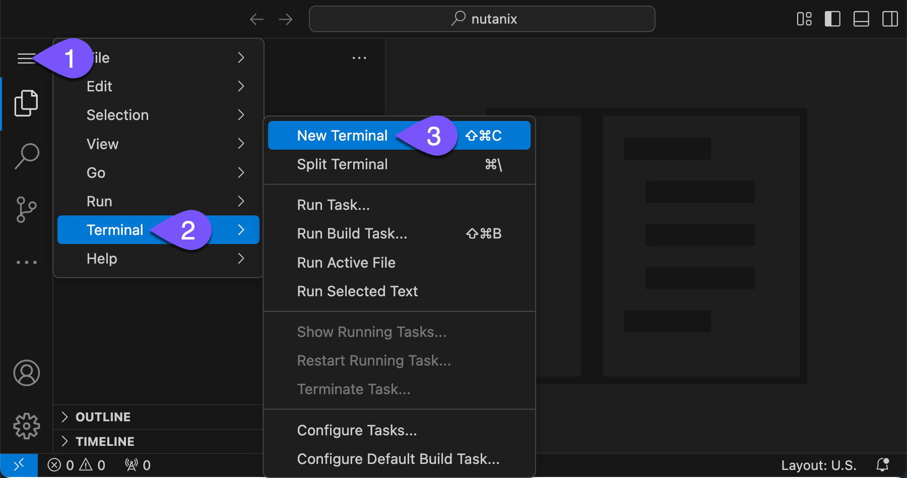

# Connect to Web IDE

ในส่วนหนึ่งของกระบวนการ Admin VM bootstrap คุณได้ทำการ install ตัว web IDE ซึ่งทำงานบนพื้นฐานของ VS Code เพื่อโต้ตอบกับ NKP CLI และ manifests อาจใช้เวลาสองสามนาทีสำหรับ cloud-init script ในการดาวน์โหลดและ install ตัว web IDE

1.  เปิด Admin VM address ของคุณโดยใช้ `HTTPS` เพื่อเข้าถึง VS Code ตัวอย่างเช่น: https://10.38.30.116
    
    !!! info
        กดยอมรับ self-signed certificate
    
    
    
2.  ขั้นตอนต่อไปคือการเปิด terminal คลิกที่ไอคอนเมนูตามด้วย _Terminal_ และ _New Terminal_
    
    

---

[← Back: VM Creation](nkp-intro-deploy-vm-creation.md) | [Home](nkp-bootcamp.md) | [Next: Deploy NKP Overview →](nkp-intro-deploy-nkp.md)