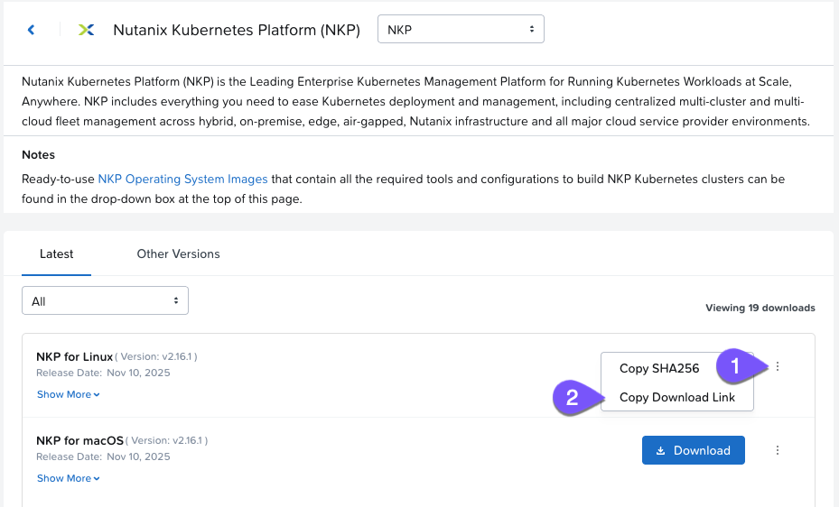

# Install NKP CLI

1.  ใน VS Code terminal ของคุณ ให้ตรวจสอบว่า Docker กำลังทำงานอยู่หรือไม่
    
    -   command
    
    ```
    docker ps
    ```
    -   output

    ```
    CONTAINER ID   IMAGE     COMMAND   CREATED   STATUS    PORTS     NAMES
    ```
    
2.  รัน command ต่อไปนี้ ซึ่งเป็น script wrapper สำหรับการติดตั้ง CLI (URL จะมีให้ในขั้นตอนถัดไป)
    
    -   command
    
    ```
    curl -fsSL [https://raw.githubusercontent.com/nutanixdev/nkp-quickstart/main/get-nkp-cli](https://raw.githubusercontent.com/nutanixdev/nkp-quickstart/main/get-nkp-cli) | bash
    ```
    
    -   output

    ```
    Enter 'NKP for Linux' download link:
    ```
    
    !!! note    
        script นี้ไม่ได้รับการสนับสนุนอย่างเป็นทางการ เป็นเพียงการรวบรวมขั้นตอนที่อธิบายไว้ใน [official documentation](https://portal.nutanix.com/page/documents/details?targetId=Nutanix-Kubernetes-Platform-v2_16:top-download-nkp-t.html) สำหรับการติดตั้ง NKP CLI
    
3.  เมื่อได้รับการแจ้งเตือน ให้ใส่ URL ต่อไปนี้
    
    ```
    [http://10.42.194.11/workshop_staging/tradeshows/software/nutanix/kubernetes/nkp/nkp_v2.17.0_linux_amd64.tar.gz](/http://10.42.194.11/workshop_staging/tradeshows/software/nutanix/kubernetes/nkp/nkp_v2.17.0_linux_amd64.tar.gz)
    ```
    
    (Optional) จะหา NKP CLI ได้จากที่ไหนเมื่อไม่ได้อยู่ใน bootcamp
    
    คุณสามารถหา link สำหรับ download NKP CLI ได้ที่ [Nutanix portal](https://portal.nutanix.com/page/downloads?product=nkp)
    
    
    
4.  ตรวจสอบว่า NKP CLI ได้รับการติดตั้งเรียบร้อยแล้ว
    
    -   command
    
    ```
    nkp version    
    ```

    -   output

    ```
    catalog: v0.8.1
    diagnose: v0.12.0
    imagebuilder: v2.17.0
    kommander: v2.17.0
    konvoy: v2.17.0
    konvoybundlepusher: v2.17.0
    mindthegap: v1.24.0
    nkp: v2.17.0
    ```

---

[← Back: Deploy NKP Overview](nkp-intro-deploy-nkp.md) | [Home](nkp-bootcamp.md) | [Next: Create NKP Cluster →](nkp-intro-deploy-nkp-cluster.md)