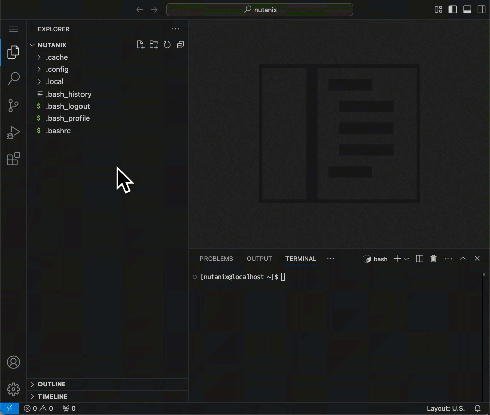
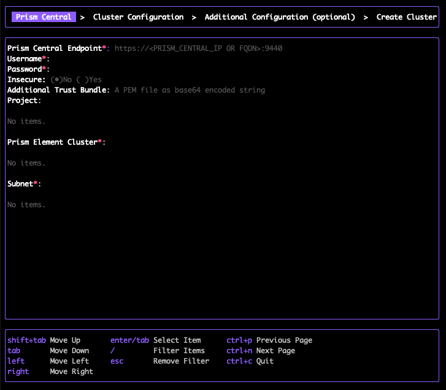

# Argument-based CLI Installation

1.  สร้างไฟล์ `.env` บน VS Code
    
    
    
2.  วาง code block ด้านล่างนี้และแก้ไข **เฉพาะ** ค่าที่ทำการ `highlighted` ไว้ โดยคุณสามารถดูค่าต่างๆ ได้จากหน้า lab ของคุณ
        
    -   env

    ```
    # NKP version to install
    # Do not change it
    export NKP_VERSION=2.17.0
    
    # NKP cluster name.
    # When using NKP Pro/Ultimate, this name is used to generate the license key
    export CLUSTER_NAME=user##-nkp
    
    # Prism Central username
    export NUTANIX_USER='adminuser##@ntnxlab.local'
    
    # Prism Central Password
    # Keep the password enclosed between single quotes - Ex: 'password'
    export NUTANIX_PASSWORD=''
    
    # Prism Central IP address - Ex: 10.38.30.7
    export NUTANIX_ENDPOINT=#.#.#.7
    
    # Prism Central port (default: 9440)
    # Do not change it
    export NUTANIX_PORT=9440
    
    # Kubernetes VIP. Must be in the same subnet as the VMs
    # Check the table to find your IP
    export CONTROL_PLANE_ENDPOINT_IP=#.#.#.#
    
    # Load balancer IP range. Format: <first_ip>-<last_ip>
    # Check the table to find your IP
    export LB_IP_RANGE=#.#.#.#-#.#.#.#
    
    # NKP Rocky image name
    # Do not change it
    export NUTANIX_MACHINE_TEMPLATE_IMAGE_NAME=nkp-rocky-9.6-release-cis-1.34.1-20251219225533.qcow2
    
    # Prism Element cluster name - Ex: PHX-POC207
    export NUTANIX_PRISM_ELEMENT_CLUSTER_NAME=
    
    # NKP cluster subnet
    # Do not change it
    export NUTANIX_SUBNET_NAME=secondary
    
    # Prism storage container
    # Do not change it
    export NUTANIX_STORAGE_CONTAINER_NAME=SelfServiceContainer
    
    # Required on Nutanix HPOC
    # Do not change it
    export REGISTRY_MIRROR_URL=[registry.nutanixdemo.com/bootcamps](https://registry.nutanixdemo.com/bootcamps)
    ```
    -   example

    ```
    export NKP_VERSION=2.17.0
    export CLUSTER_NAME=user01-nkp
    export NUTANIX_USER='adminuser01@ntnxlab.local'
    export NUTANIX_PASSWORD='password'
    export NUTANIX_ENDPOINT=10.38.30.7
    export NUTANIX_PORT=9440
    export LB_IP_RANGE=10.38.30.135-10.38.30.135
    export CONTROL_PLANE_ENDPOINT_IP=10.38.30.134
    export NUTANIX_MACHINE_TEMPLATE_IMAGE_NAME=nkp-rocky-9.6-release-cis-1.34.1-20251219225533.qcow2
    export NUTANIX_PRISM_ELEMENT_CLUSTER_NAME=PHX-POC000
    export NUTANIX_SUBNET_NAME=secondary
    export NUTANIX_STORAGE_CONTAINER_NAME=SelfServiceContainer
    export REGISTRY_MIRROR_URL=[registry.nutanixdemo.com/bootcamps](https://registry.nutanixdemo.com/bootcamps)
    ```
    
3.  Load ค่า environment variables ด้วย command ต่อไปนี้
    
    -   command
    
    ```
    source ~/.env
    ```
    
4.  ดำเนินการสร้าง management cluster แรกของคุณ
    
    -   command

    ```
    nkp create cluster nutanix -c $CLUSTER_NAME \
        --bootstrap-cluster-image $REGISTRY_MIRROR_URL/mesosphere/konvoy-bootstrap:v$NKP_VERSION \
        --endpoint https://$NUTANIX_ENDPOINT:$NUTANIX_PORT \
        --insecure \
        --control-plane-endpoint-ip $CONTROL_PLANE_ENDPOINT_IP \
        --kubernetes-service-load-balancer-ip-range $LB_IP_RANGE \
        --control-plane-vm-image $NUTANIX_MACHINE_TEMPLATE_IMAGE_NAME \
        --control-plane-prism-element-cluster $NUTANIX_PRISM_ELEMENT_CLUSTER_NAME \
        --control-plane-subnets $NUTANIX_SUBNET_NAME \
        --worker-vm-image $NUTANIX_MACHINE_TEMPLATE_IMAGE_NAME \
        --worker-prism-element-cluster $NUTANIX_PRISM_ELEMENT_CLUSTER_NAME \
        --worker-subnets $NUTANIX_SUBNET_NAME \
        --csi-storage-container $NUTANIX_STORAGE_CONTAINER_NAME \
        --registry-mirror-url https://$REGISTRY_MIRROR_URL \
        --skip-preflight-checks=Registry \
        --control-plane-replicas 1 \
        --control-plane-memory 6 \
        --worker-replicas 2 \
        --worker-vcpus 4 \
        --worker-memory 6 \
        --self-managed
    ```
    
    -   output

    ```
    ✓ Creating a bootstrap cluster
    ⠈⡱ Initializing new CAPI components
    [...]
    ```
    
    !!! note    
        -   การสร้าง NKP cluster อาจใช้เวลาสูงสุด 30 นาที
            
        -   cluster ที่คุณกำลัง deploy นี้ใช้ resource ขั้นต่ำที่สุดเพื่อสาธิตขั้นตอนเท่านั้น ห้ามนำไปใช้ในระบบ production คุณสามารถดู arguments ได้ในบรรทัดที่ **15** ถึง **19**
        
    
    **ไม่ต้องรอให้การสร้าง cluster เสร็จสมบูรณ์** คุณจะไม่ต้องใช้มันใน lab ถัดไป เนื่องจากเราจะใช้การตั้งค่าแบบ shared multi-cluster แทน
    

**(Optional)** Explanation NKP cluster creation process

NKP ใช้ open-source project ที่เรียกว่า Cluster API (CAPI) ซึ่งเป็น Kubernetes subproject ที่เน้นการให้บริการ declarative APIs และเครื่องมือเพื่อช่วยให้การ provisioning, upgrading, และ operating Kubernetes clusters หลายๆ แห่งทำได้ง่ายขึ้น พูดง่ายๆ คือ CAPI ทำหน้าที่ deploy และจัดการ Kubernetes clusters จากตัว Kubernetes เอง

เมื่อคุณรัน command `nkp create cluster` ระบบจะทำการ deploy bootstrap Kubernetes cluster ขนาดเล็กใน Admin VM ของคุณ โดยใช้ `kubeadm` และ Docker Engine ที่คุณติดตั้งไว้ตอนสร้าง Admin VM

จากนั้น CAPI components (infrastructure providers) จะถูกติดตั้งลงใน Kubernetes cluster และด้วยข้อมูลที่คุณระบุผ่าน environment variables ตัว infrastructure provider สำหรับ Nutanix จะถูกนำมาใช้เพื่อสร้าง virtual machines ใน Nutanix cluster และสร้าง Kubernetes cluster (self-managed / management cluster) ขึ้นมา

เมื่อ cluster นั้นพร้อมใช้งาน CAPI components จะถูกย้าย (migrated) จาก bootstrap cluster ไปยัง NKP cluster แรกนี้ และกลายเป็น NKP management cluster (ซึ่งสามารถรัน workload ได้ด้วยเมื่อเป็นแบบ self-managed - single cluster) ในขั้นตอนนี้ bootstrap cluster จะถูกลบออกไป

หลังจาก migrate CAPI controllers เรียบร้อยแล้ว ขั้นตอนการติดตั้ง NKP platform applications จะเริ่มต้นขึ้น คุณสามารถสังเกตเห็นได้ใน terminal เมื่อพบข้อความ `Starting kommander installation`

หลังจากผ่านไปไม่กี่นาที คุณจะเห็นข้อความแจ้งว่าสร้าง cluster สำเร็จ พร้อมกับ command สำหรับเข้าใช้งาน NKP cluster dashboard

**(Optional)** Did you know NKP includes a prompt-based installation method?



เราไม่ได้ใช้วิธีที่เรียบง่ายนี้เนื่องจากในสภาพแวดล้อมที่ใช้งานหนักอย่าง Nutanix HPOC ซึ่งมีการส่งคำขอไปยัง Docker Hub นับร้อยครั้งต่อนาที คุณจำเป็นต้องใช้ internal container registry mirror เพื่อแก้ปัญหา Docker Hub rate limits ในการ pull container images ซึ่งการระบุ registry mirror นั้นสามารถทำได้ผ่านวิธี argument-based installation เท่านั้น

---

[← Back: Create NKP Cluster](nkp-intro-deploy-nkp-cluster.md) | [Home](nkp-bootcamp.md) | [Next: Takeaways →](nkp-intro-takeaways.md)