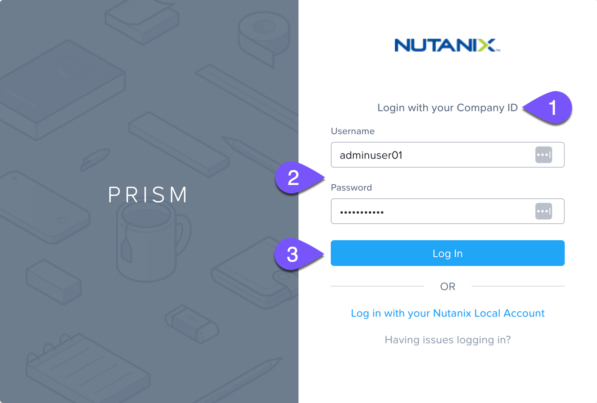
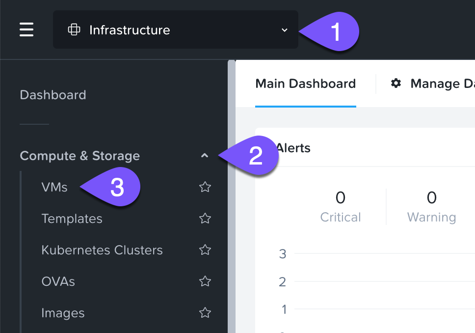
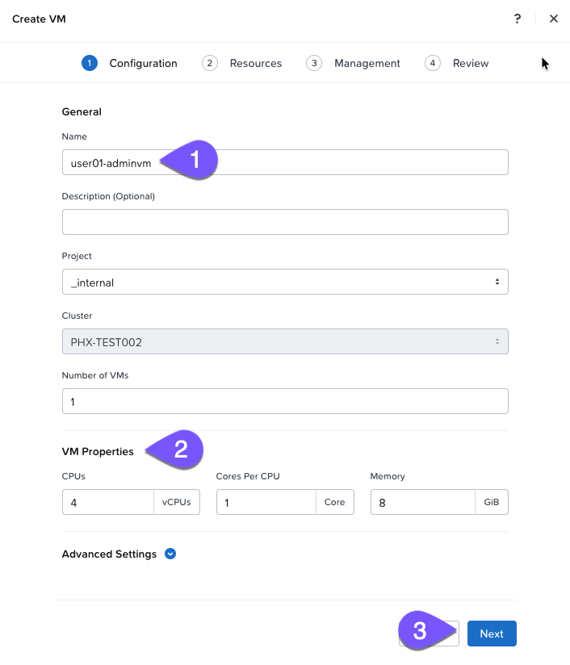
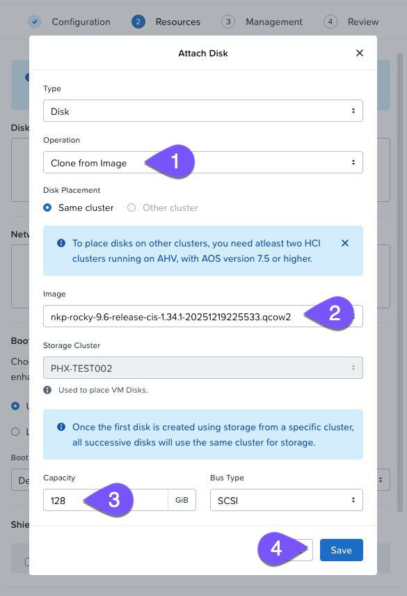
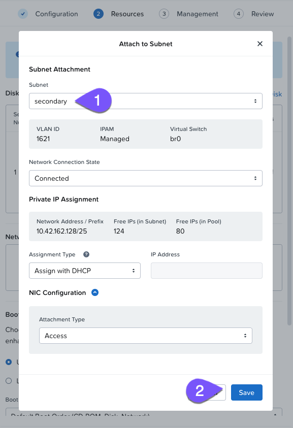
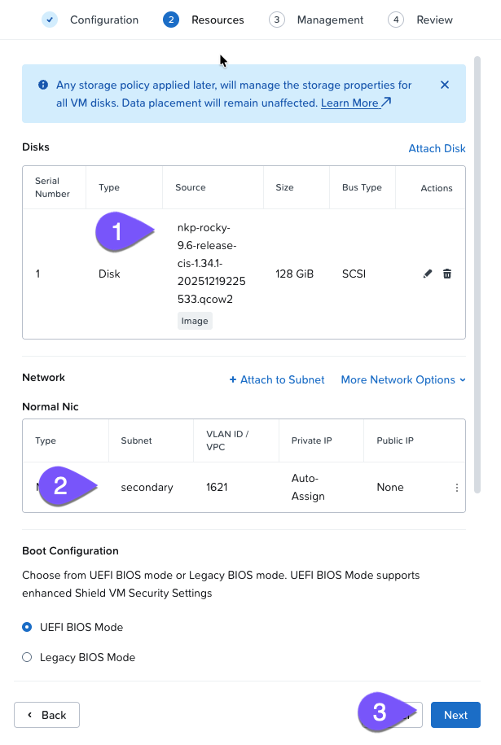

# VM Creation

1.  เข้าถึง Prism Central โดยใช้ _Company ID_ และผู้ใช้แล็บของคุณ _adminuser`##`_ แทนที่ `##` ด้วยหมายเลขผู้ใช้ของคุณ
    
    
    
2.  ไปที่หน้า VMs
    
    
    
3.  คลิก **Create VM** ใช้การกำหนดค่าต่อไปนี้ และคลิก **Next**
    
    !!! info
        ต้องป้อนข้อมูล
        
        แทนที่ `##` ด้วยหมายเลขผู้ใช้ของคุณ
    
    -    name
    
    ```
    user##-adminvm
    ```
    
    -   example

    ```
    user01-adminvm
    ```
    
    -   CPU: **4** | Cores: **1** | Memory: **8**
    
    
    
4.  คลิก **Attach Disk** เลือกอิมเมจ NKP Rocky และตั้งค่า _Capacity_ คลิก **Save** เมื่อเสร็จสิ้น
    
    -   Operation: **Clone from Image**
        
    -   Image: **nkp-rocky-9.6-release-cis-1.34.1-20251219225533.qcow2**
        
    -   Capacity: **128**
        
    
    
    
5.  คลิก **Attach to Subnet** และเลือก subnet ที่เปิดใช้งาน IPAM คลิก **Save** เมื่อเสร็จสิ้น
    
    !!! info
        Subnet: secondary
    
    
    
6.  ยืนยันการตั้งค่าและคลิก **Next**
    
    
    
7.  ใช้ฟีเจอร์ Guest Customization เพื่อ inject สคริปต์ cloud-init สำหรับการติดตั้ง dependency แบบอัตโนมัติสำหรับ NKP CLI และ bootstrapping cluster อัปเดตค่า `fqdn` ด้วยชื่อผู้ใช้ของคุณก่อนดำเนินการต่อ คลิก **Next** เมื่อเสร็จสิ้น
    
    -   Script Type: Cloud-init (Linux)
        
        !!! info
            ต้องป้อนข้อมูล
            
            แทนที่ `##` ด้วยหมายเลขผู้ใช้ของคุณ
        
        -   config

        ```
        #cloud-config
        fqdn: user## # <-- อัปเดตด้วยหมายเลขผู้ใช้ของคุณ
        ssh_pwauth: true
        users:
          - name: nutanix
            primary_group: nutanix
            groups: [wheel, docker]
            shell: /bin/bash
            sudo: ALL=(ALL) NOPASSWD:ALL
            lock_passwd: false
        chpasswd:
          expire: false
          users:
          - name: nutanix
            password: nutanix/4u
            type: text
        runcmd:
        - '[ ! -f "/etc/yum.repos.d/nutanix_rocky9.repo" ] || mv -f /etc/yum.repos.d/nutanix_rocky9.repo /etc/yum.repos.d/nutanix_rocky9.repo.disabled'
        - dnf config-manager --add-repo [https://download.docker.com/linux/rhel/docker-ce.repo](https://download.docker.com/linux/rhel/docker-ce.repo)
        - dnf -y install git docker-ce docker-ce-cli containerd.io
        - systemctl --now enable docker
        - usermod -aG docker nutanix
        - 'curl -Lo /usr/local/bin/kubectl [https://storage.googleapis.com/kubernetes-release/release/$](https://storage.googleapis.com/kubernetes-release/release/$)(curl -s [https://storage.googleapis.com/kubernetes-release/release/stable.txt](https://storage.googleapis.com/kubernetes-release/release/stable.txt))/bin/linux/amd64/kubectl'
        - chmod +x /usr/local/bin/kubectl
        - 'curl [https://raw.githubusercontent.com/helm/helm/main/scripts/get-helm-3](https://raw.githubusercontent.com/helm/helm/main/scripts/get-helm-3) | bash'
        - 'su - nutanix -c "curl -fsSL [http://10.42.194.11/workshop_staging/tradeshows/experimental/nkp-bootcamp/install-tools.sh](http://10.42.194.11/workshop_staging/tradeshows/experimental/nkp-bootcamp/install-tools.sh) | bash"'
        - eject
        ```
        
        -   example  
        
        ```
        #cloud-config
        fqdn: user01 # <-- อัปเดตด้วยหมายเลขผู้ใช้ของคุณ
        ssh_pwauth: true
        users:
          - name: nutanix
            primary_group: nutanix
            groups: [wheel, docker]
            shell: /bin/bash
            sudo: ALL=(ALL) NOPASSWD:ALL
            lock_passwd: false
        chpasswd:
          expire: false
          users:
          - name: nutanix
            password: nutanix/4u
            type: text
        runcmd:
        - '[ ! -f "/etc/yum.repos.d/nutanix_rocky9.repo" ] || mv -f /etc/yum.repos.d/nutanix_rocky9.repo /etc/yum.repos.d/nutanix_rocky9.repo.disabled'
        - dnf config-manager --add-repo [https://download.docker.com/linux/rhel/docker-ce.repo](https://download.docker.com/linux/rhel/docker-ce.repo)
        - dnf -y install git docker-ce docker-ce-cli containerd.io
        - systemctl --now enable docker
        - usermod -aG docker nutanix
        - 'curl -Lo /usr/local/bin/kubectl [https://storage.googleapis.com/kubernetes-release/release/$](https://storage.googleapis.com/kubernetes-release/release/$)(curl -s [https://storage.googleapis.com/kubernetes-release/release/stable.txt](https://storage.googleapis.com/kubernetes-release/release/stable.txt))/bin/linux/amd64/kubectl'
        - chmod +x /usr/local/bin/kubectl
        - 'curl [https://raw.githubusercontent.com/helm/helm/main/scripts/get-helm-3](https://raw.githubusercontent.com/helm/helm/main/scripts/get-helm-3) | bash'
        - 'su - nutanix -c "curl -fsSL [http://10.42.194.11/workshop_staging/tradeshows/experimental/nkp-bootcamp/install-tools.sh](http://10.42.194.11/workshop_staging/tradeshows/experimental/nkp-bootcamp/install-tools.sh) | bash"'
        - eject
        ```
        
        คำอธิบาย Cloud-config
        
        -   **2** อัปเดตค่าด้วยผู้ใช้ของคุณ ตัวอย่าง: user**01**
        -   **3-16** สร้างผู้ใช้ใหม่ `nutanix` และเปิดใช้งานการรองรับรหัสผ่าน เป็นเรื่องปกติที่ cloud images จะไม่มีรหัสผ่านมาให้ตั้งแต่ต้น
        -   **15** รหัสผ่านเริ่มต้นที่ตั้งไว้คือ `nutanix/4u` ในระดับ production คุณควรใช้ SSH public key และไม่ใช้การตรวจสอบสิทธิ์ด้วยรหัสผ่าน
        -   **19-22** เพิ่ม repository สำหรับแพ็กเกจ Docker, ติดตั้ง Docker Engine และ CLI ของมัน, และติดตั้ง containerd
        -   **23-24** ติดตั้ง kubectl CLI และตั้งให้เป็น executable
        -   **25** ติดตั้ง Helm CLI
        -   **26** จำเป็นสำหรับ bootcamp เท่านั้น สิ่งนี้จะติดตั้ง VS Code เวอร์ชันเว็บ
        
        
        
8.  ตรวจสอบการกำหนดค่าและคลิก **Create VM**
    
9.  **Power On** VM ของคุณ