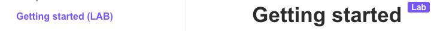
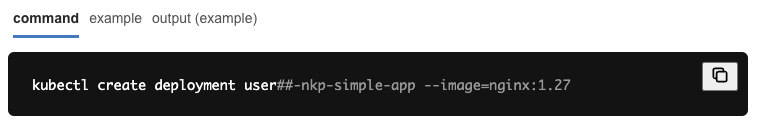
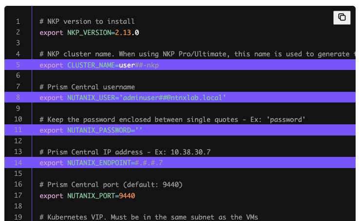

# Navigating the labs

เพื่อประสบการณ์ที่ดีขึ้น สิ่งสำคัญคือต้องทำความคุ้นเคยกับโครงสร้างของ bootcamp

#### Structure

เนื้อหาของ bootcamp นี้ประกอบด้วย:

1.  แบบฝึกหัด lab แต่ละรายการ
2.  เนื้อหาสนับสนุนที่อธิบาย concepts ที่เกี่ยวข้องกับ labs

แบบฝึกหัด lab ถูกออกแบบมาให้ทำตามลำดับที่กำหนดให้ ยกเว้นแต่จะระบุว่าเป็น _Optional_ ซึ่งมันจะพึ่งพากันและกันและไม่สามารถทำแยกกันได้ คุณสามารถระบุ lab ที่ต้องทำได้โดยดูที่แท็ก (LAB) ใน sidebar นอกจากนี้ยังเป็นส่วนหนึ่งของชื่อหน้าด้วย

เพื่อประสบการณ์ที่ดีขึ้น ให้เปิดคู่มือ lab ภายใน VDI terminal หาก VDI หรือ VS Code ของคุณแจ้งเตือนเกี่ยวกับ clipboard ให้คลิก Allow

#### Terminal commands

bootcamp นี้เน้นหนักไปที่ commands, manifests, และ configuration files เพื่อลดข้อผิดพลาดในการพิมพ์ คุณต้องใช้ตัวเลือก copy ที่รวมอยู่ใน code block

![Code block](data:image/png;base64,iVBORw0KGgoAAAANSUhEUgAAAbQAAABZCAYAAABWmdGuAAAAAXNSR0IArs4c6QAAAERlWElmTU0AKgAAAAgAAYdpAAQAAAABAAAAGgAAAAAAA6ABAAMAAAABAAEAAKACAAQAAAABAAABtKADAAQAAAABAAAAWQAAAABpwyP2AAAOdUlEQVR4Ae2deYxURR7Hf4OOB6IuHquDRvFORuMIxoMVL0BAd10c1KjRaIyuRBzPf7wjajxY0IiOhKjEM5JolgHBRCWjiQooLBMxOkbl8mAnKALe0VFcvrVbndfNdPd7fb5+/amk5x1V9av6fap5X35VNW8a/tiSjAQBCEAAAhCocQL9arz/dB8CEIAABCDgCCBofBEgAAEIQCARBBC0RAwjTkAAAhCAAILGdwACEIAABBJBAEFLxDDiBAQgAAEIIGh8ByAAAQhAIBEEELREDCNOQAACEIAAgsZ3AAIQgAAEEkEAQUvEMOIEBCAAAQhsWyiC9vZ26+josO7ubuvt7S3UDPUgAAEIQAACaQQaGxutubnZWltbra2tLS0v10VD1FdfrVmzxi677DJbvnx5LrvkQQACEIAABIom0NLSYjNnzrTBgwfntRVZ0EaOHImY5cVKAQhAAAIQKBUBiVpnZ2dec5HW0DTNSGSWlykFIAABCECghASkO9KffCmSoGnNjAQBCEAAAhCoNIEw+hNpyrGpqYkNIJUeRdqDAAQgAAHTRpGenp6cJCJFaOxmzMmSTAhAAAIQKBOBMPoTSdDK1E/MQgACEIAABIomgKAVjRADEIAABCAQBwIIWhxGgT5AAAIQgEDRBAp+U0jRLWMAAhCAAASqQmDgwIE2duxY69+/f1Xa943+9NNP9sorr9jGjRv9raKOCFpR+KgMAQhAoHACfxs625atmmI9mxYXbqSAmhIzvVZq6NChBdQuXZWuri5nbNasWSUxypRjSTBiBAIQgEB0Ak1/GmYSNX10XqmkyKzaYiZf1YdSRokIWqW+QbQDAQhAIEBgy3t0U1de2P465F8VFbZUBxJygqAlZCBxAwIQqB0CQTEL9nrQwL+4aA1hC1IJf84aWnhWlIQABCBQEQIStkEDZ9t/Ni6yrtVTK77Glunk22+/bfpkS8OHDzd9qp0QtGqPAO1DAAJ1SSBblBaEEQdh047IfGny5MlO0ObNm5evaFnzEbSy4sU4BCAAgXQCYYQsvYZtidaqE7Hdf//9ris33nhjzghMgpYrgsv0p1zXrKGViyx2IQABCJSYQLXW2PyUoj9munXCCSe4W14AM/MrdU2EVinStAMBCECgRASqGbEtXLgwazSmSE0fRXQ33XRTibwNbwZBC8+KkhCAAARiRaDSwiaxUpJg5Uoqly2ay1Wv2DwErViC1IcABBJF4B8jcv/NrTg6Wwlh82tk+aIvlZOg6VjpnY+socXx20mfIACBqhAoZMNGVTqapdFqrbFl6U7FbyNoFUdOgxCAQBwJ1LqYBZnWq7AhaMFvAecQgAAEEkSg3oQNQUvQlxdXIACB4ggkKUoLksgUNvkZxle/BubXxYI243jOppA4jkqgTzvttJP9+OOPgTucQgACpSYQ5uFe6jarZc+Lmfe5oaEha1ckaNoE4nc3Zi0Yk4yai9CmTp1qn3/+eUzwlbcb8+fPtzVr1tjuu+9e3oawDgEIJJqA3gk5b1mrze8a794L6UUtjNP6fTL9Ac58W/XD2Cp3mZqL0PRw33HHHcvNJRb29Zdc9R41/VVXEgQgAIGoBNZuWGj/XvnP1MuNFY3p46OzKPYkbIrUcv1itez57f1RbJeqbM0JWqkcrwU77e3tpg8JAhCAQBQCErKlKya7t/V7EYtSP1tZTUFKsMKIFm8K2ULx8ccft9WrV9uCBQvsjjvusAMPPNA6Ojrs1ltv7ZPxzjvvbE8//bT169fPLrzwQve6FUVxd955pz344IN29NFH27Jly+zSSy+1X3/9tU8b/ub2229vL730kr388sv28MMP+9vuKGHp7e2166+/3l2fccYZNnHiRDvkkEPs448/dva/+eYbl7f//vs7PzSg+gKcf/75tttuu9kzzzxj9957rytzww03uP7usssuLpx///337fLLL3d5snvWWWe5c0Vn/tzd+P8P+Thjxgw74ogjXAQ3d+5cu+uuu1zuiSeeaLfffruzf80117j66tuVV15pH330UdAM5xCAQIII9CVkfo0sKGz+XlTX9Tb9fIKmZ54+1Uixi9BGjx5tP//8s1133XVOQL777jubMGGCffrpp/bUU0+lMZJILF682ImFHtzaPKH6e++9t51++uluavKXX36xMWPG2LPPPmvnnXdeWv3MC5Xdd999nSg++uij9vvvv7sihx9+uBOlxx57zF2feeaZ9uSTT9oPP/zgxGzYsGG2aNEiO+yww1y+RFh/Wlw2JHifffaZ66N/gafE8JZbbrGvv/7a9V8CKBs+aSPIDjvsYIMHD+5zelX57733nsuTmMpf+X/kkUfaOeecYy0tLa59ffkOPvhg1758kFirPyQIQCA7gRkL/uym5AqZlstute+ciWPW950R8W5QyFTVC1bw6M99fvA6SnPVFKx8/YzlppA99tjD3nnnHdtnn33cw1lfrNNOOy3Nlz333NOWLFnihOKKK66wWbNmpfL1wFdkI6E44IADXGSmqCVMmjZtmm233XZ21VVXpYrfc889tnnzZtNRafr06c7mQQcd5MRS4qaIacSIEak6OpF4KDJUlBhcBzv77LNdOYnQxRdfbCeffLJJcHyaMmWKnXTSSfbGG2/4W2lHzWNrHVERoERS/fjwww/tlFNOSbOj+6NGjXLta4NJmL9rlNYQFxCoEwJ9Pdx1r9SfUuOUkM1Z8nebu3Rc2vRiX/32bWfm+ftJOMZS0DZt2mStra2Or6YJf/vtN5NI+aQBWbp0qe26665OEDQlGUwqrwe5Ii4J0YoVK5xIBctkO3/iiSdcPU37KSkKlGhIXBQBKoKTmKgNTYu+/vrrduqpp7qyQ4YMcUf/47nnnjP/B++uvvpqNw2oPE2rSqQlwoowL7roIl8l1PG4445z9RV1+jR79mx3qmjUJ03TKpJT+vLLL90xyNHd4AcEIJAikPmwL/d1quGIJ1GETD4oeV8yz11mQn7EUtC++OKL1HSfOOvhrzWyYNJ6lgZIU3OZSdOUPT09qdv77befmx5M3chxIgF84YUXTFGihErreGpHU4RKsqWkbazr1q1zHwmmxO2DDz5wef7HW2+95U+dsHV1dblrRZ/HH3+8vfnmmy66euihh6y7u9u0Hhgm9e/f303HSrB9WrVqlTtVpOhTZ2enP3XlddHY2Ji6xwkEILA1Af/gL8dRzzFvd+uW898pVsjyt1DbJWK3hhYGpwROU3KactS61vr16y0oHkEb2jQxYMAA82ISzMt2rg0lipomTZrkpg0/+eQTW7lypSsuMVL7a9eutQsuuCCbibz3ZW/8+PEu2nvkkUfcxo22tja777778tbV7+HttddedtRRR6UiMNlS0gaYQYMG5bVBAQhAIJ2AhEb/tpV0HqcUZo0ss99x86ESPNPDnkq0WKI2FIFpA4im/l588UW328+bVtTmdxdqyk9R17XXXuuz8x415ampQK1raT1NAueTbOn3MI499li3q1ARm6YnNSU5btw4Xyzncc6cOfbAAw84+4q2vvrqK1devvSVtH4YXEO8++67XbHnn3/etMHktttuc5tgtElFtkkQgEBhBHz0VE4xiGKbiCzaONZMhCYhyUzagn7uuee6bf2vvfaa+TUsiYR/sGtaUJsvom5X17Z3Tdlt2LDBXn311bSmFQ0pT0Kmj/5X56cf0wpmudBanKK7Sy65JFVCU4baDBJM8llffr/hRdOgStpRqe3/N998s/tVAN379ttvXcTXFyfl+5Qv35fjCIF6JxBFeKKw0vMin+1yR2TapKZZK+3GrmZSH4Ib5ortS8MWuP+LsUNY8g/UEEWrVuTdd991Gzm0/qWH/Pfff1+2vmiDhb4QmobUml7U1NTUZM3Nze5XEgp5ndc222xjxxxzjNv+76dEo/aB8hCAQGUJ+EeujhNGrUtrvNxC5hvTjuexY8ea/vNfzSQx0xuRtCchTNLyUq6USEHTYB166KG5/CYPAhCAQFUI9CVolRKyqjhcwkbzCVrNTDmGZSKHt902cW6FdZ9yEIBADRHQS4P9K6rUbT8Vme0YLFNDblasq4mL0CpGjoYgAAEIFEhAUZr/yISP2hCy3EDrLkLLjYNcCEAAAvEg4MVLYqZzf63eZTuPR8/j2wvm5uI7NvQMAhBIOIGgcMnV4HXwPOEYSuYeglYylBiCAAQgEI6AxCpzmtHXRMg8iehHBC06M2pAAAIQKJoAwlU0wq0M1OybQrbyhBsQgAAEIFDXBBC0uh5+nIcABCCQHAIIWnLGEk8gAAEI1DUBBK2uhx/nIQABCCSHAIKWnLHEEwhAAAJ1TQBBq+vhx3kIQAACySGAoCVnLPEEAhCAQF0TQNDqevhxHgIQgEByCCBoyRlLPIEABCBQ1wQQtLoefpyHAAQgkBwCCFpyxhJPIAABCNQ1AQStrocf5yEAAQgkh0AkQWtsbEyO53gCAQhAAAI1QyCM/kQStObm5ppxno5CAAIQgEByCITRn0iC1tramhw6eAIBCEAAAjVDIIz+NGz5I3N/RPFo5MiRtnz58ihVKAsBCEAAAhAomEBLS4t1dnbmrR8pQpO1mTNnmoyTIAABCEAAAuUmIL2R7oRJkSM0b7S9vd06Ojqsu7vbent7/W2OEIAABCAAgaIIaAOI1sw0zdjW1hbaVsGCFroFCkIAAhCAAAQqQCDylGMF+kQTEIAABCAAgcgEELTIyKgAAQhAAAJxJICgxXFU6BMEIAABCEQmgKBFRkYFCEAAAhCIIwEELY6jQp8gAAEIQCAyAQQtMjIqQAACEIBAHAkgaHEcFfoEAQhAAAKRCSBokZFRAQIQgAAE4kgAQYvjqNAnCEAAAhCITABBi4yMChCAAAQgEEcCCFocR4U+QQACEIBAZAIIWmRkVIAABCAAgTgSQNDiOCr0CQIQgAAEIhNA0CIjowIEIAABCMSRwH8Bg86tQ2IHDQsAAAAASUVORK5CYII=)

บาง code blocks อาจมีตัวเลือกที่แตกต่างกัน เช่น command, example, output (example), หรือ output สิ่งสำคัญคือต้องเข้าใจวิธีใช้งานพวกมัน

-   **Command**: นี่คือ command ที่คุณต้องรันใน VS Code terminal ของคุณ บางอันจำเป็นต้องให้คุณปรับแต่ง (customize) มัน
-   **Example**: หากคุณเห็นตัวเลือกนี้ เป็นการบ่งบอกว่า command ของคุณต้องการการปรับแต่งก่อนที่จะรันมัน ตัวอย่างจะแสดงให้เห็นว่ามันควรมีหน้าตาเป็นอย่างไร
-   **Output (example)**: output ของ command ของคุณจะมีลักษณะคล้ายกับตัวอย่าง
-   **Output**: output ของ command ของคุณจะเป็นแบบนี้เป๊ะๆ

หากคุณพบ code blocks ที่มีการเน้นบรรทัดสีม่วง คุณต้องดำเนินการในบรรทัดนั้นและปรับแต่งมันสำหรับผู้ใช้ของคุณ

#### Notes

คุณจะพบ notes สามประเภทตลอดทั้ง bootcamp:

-   Informative (สีม่วง): ให้ tips และข้อมูลเพิ่มเติม
-   Warning (สีเหลือง): คุณควรระมัดระวังเป็นพิเศษในงานที่ระบุ
-   Danger (สีแดง): การกระทำที่สร้างความเสียหายหากคุณทำผิดพลาด

#### Moving through the content

-   เราขอแนะนำให้คุณใช้ลิงก์ previous และ next ที่มีอยู่ท้ายแต่ละหน้าเพื่อย้ายไปยังส่วนก่อนหน้าหรือส่วนถัดไป
-   หากคุณคลิกลิงก์ที่พาคุณไปยังหน้าอื่นใน bootcamp ให้กลับไปที่หน้าก่อนหน้าโดยใช้ตัวเลือก back ของเบราว์เซอร์
-   sidebar จะระบุตำแหน่งว่าคุณอยู่ในขั้นตอนใดของ bootcamp

