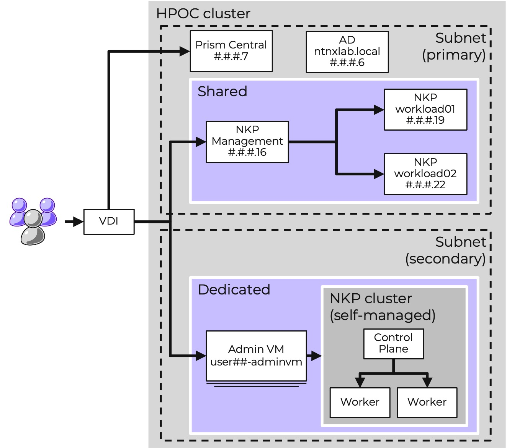

# Setup

1.  VDI สำหรับเข้าถึงสภาพแวดล้อม
    
2.  HPOC cluster แบบ 4-node ที่ใช้งานร่วมกันสำหรับผู้ใช้สูงสุด 20 คน
    
3.  การยืนยันตัวตนของผู้ใช้ (Users authentication):
    
    -   Prism Central และ staged NKP setup: adminuser## (โดเมน ntnxlab.local)
    -   Admin VM: nutanix | nutanix/4u

4.  `Dedicated` compute resources สำหรับผู้ใช้ทุกคนเพื่อทำ [Deploy NKP optional lab](/nkp-intro-deploy-nkp/index.html) โดยผู้ใช้แต่ละคนจะต้อง deploy:
    
    -   _Admin VM_
    -   NKP self-managed cluster

5.  `Shared` NKP Ultimate multi-cluster setup ประกอบด้วย workload clusters ที่กำหนดค่าไว้ล่วงหน้าสองชุด ได้แก่ workload01 และ workload02 ซึ่งช่วยให้ผู้ใช้ทุกคนสามารถดำเนินการทำ labs ในส่วนของ [Deploy an app lab](/nkp-fundamentals-deploy-create-dp/index.html) ต่อไปได้โดยไม่ต้องรอการ deploy cluster ของแต่ละคน
    
โปรดจำไว้ว่า รายละเอียดทั้งหมด เช่น credentials, environment IPs และข้อมูลอื่นๆ สามารถเข้าถึงได้ในหน้า bootcamp ของคุณ

!!! note
    ที่งานกิจกรรมของ Nutanix จะมีการจัดสรร IPs บางส่วน (STATIC ในตารางด้านล่าง) ไว้ล่วงหน้าสำหรับผู้ใช้ทุกคนเพื่อทำ labs

#### For Getting started (LAB)

|Component.     |IP           |Subnet.   |IP Allocation|Example.     |
|---------------|-------------|----------|-------------|-------------|
|Prism Central. |#.#.#.**7**. |primary.  |STATIC.      |10.38.30.7   |
|Admin VM.      |\-           |secondary |DHCP/IPAM    |\-           |
|NKP VMs.       |\-           |secondary |DHCP/IPAM    |\-           |

!!! info
    "range" ของ MetalLB ของคุณคือ IP เดียว เนื่องจากคุณจะไม่ใช้ cluster นี้ จึงไม่จำเป็นต้องมี IPs เพิ่มเติม คุณยังคงต้องป้อนค่าในรูปแบบ `#.#.#.<start>-#.#.#.<end>` แม้ว่าจะเป็น IP เดียวก็ตาม คุณยังสามารถค้นหาข้อมูลนี้ได้ในหน้ารายละเอียดการเชื่อมต่อเริ่มต้น (initial connection details)

จดบันทึกการจัดสรรของผู้ใช้ของคุณจากรายการ

|User.          |CONTROL\_PLANE\_ENDPOINT\_IP   |LB\_IP\_RANGE                  |
|---------------|-------------------------------|-------------------------------|
|adminuser01    |#.#.#.**134** |#.#.#.**135**\-#.#.#.**135** |
|adminuser02    |#.#.#.**136** |#.#.#.**137**\-#.#.#.**137** |
|adminuser03    |#.#.#.**138** |#.#.#.**139**\-#.#.#.**139** |
|adminuser04    |#.#.#.**140** |#.#.#.**141**\-#.#.#.**141** |
|adminuser05    |#.#.#.**142** |#.#.#.**143**\-#.#.#.**143** |
|adminuser06    |#.#.#.**144** |#.#.#.**145**\-#.#.#.**145** |       
|adminuser07    |#.#.#.**146** |#.#.#.**147**\-#.#.#.**147** |
|adminuser08    |#.#.#.**148** |#.#.#.**149**\-#.#.#.**149** |
|adminuser09    |#.#.#.**150** |#.#.#.**151**\-#.#.#.**151** |
|adminuser10    |#.#.#.**152** |#.#.#.**153**\-#.#.#.**153** |
|adminuser11    |#.#.#.**154** |#.#.#.**155**\-#.#.#.**155** |
|adminuser12    |#.#.#.**156** |#.#.#.**157**\-#.#.#.**157** |
|adminuser13    |#.#.#.**158** |#.#.#.**159**\-#.#.#.**159** |
|adminuser14    |#.#.#.**160** |#.#.#.**161**\-#.#.#.**161** |
|adminuser15    |#.#.#.**162** |#.#.#.**163**\-#.#.#.**163** |
|adminuser16    |#.#.#.**164** |#.#.#.**165**\-#.#.#.**165** |
|adminuser17    |#.#.#.**166** |#.#.#.**167**\-#.#.#.**167** |
|adminuser18    |#.#.#.**168** |#.#.#.**169**\-#.#.#.**169** |
|adminuser19    |#.#.#.**170** |#.#.#.**171**\-#.#.#.**171** |
|adminuser20    |#.#.#.**172** |#.#.#.**173**\-#.#.#.**173** |

#### For the rest of labs

เริ่มตั้งแต่ [Deploy an app (LAB)](nkp-fundamentals-deploy-create-dp/index.html) ให้ใช้ส่วนนี้

|Component                  |IP             |Example                                        |
|---------------------------|---------------|-----------------------------------------------|
|NKP Management UI          |#.#.#.**16** |https://10.38.30.16/dkp/kommander/dashboard    |
|NKP Workload 01 Ingress    |#.#.#.**19** |10.38.30.19                                    |
|NKP Workload 02 Ingress    |#.#.#.**22** |10.38.30.22                                    |
