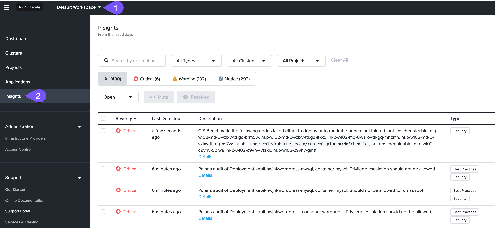
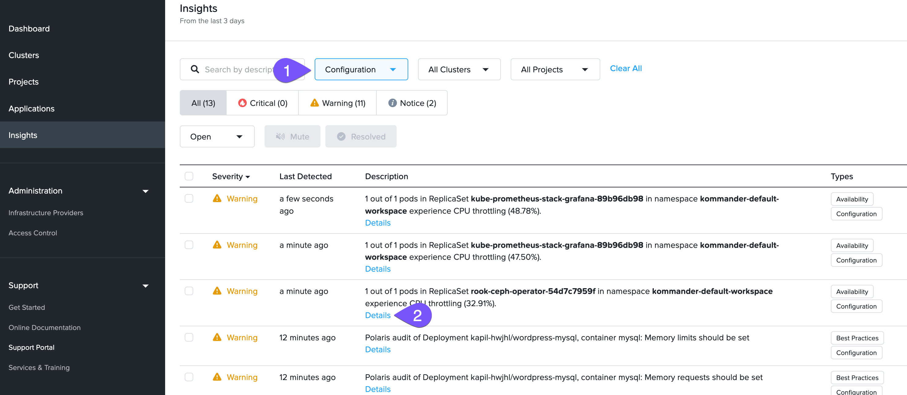
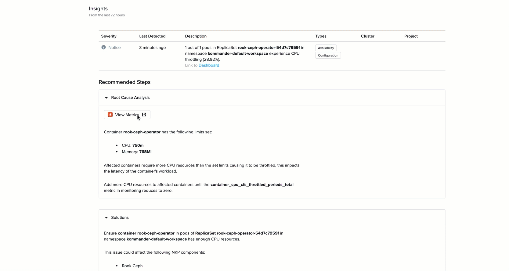

# NKP Insights Lab

NKP Insights คือ unified platform ที่ออกแบบมาเพื่อตรวจจับและป้องกัน cluster anomalies ทั่วทั้ง hybrid cloud environments โดยใช้ Insights engine เพื่อรวบรวม critical events และ metrics ซึ่งจากนั้นจะถูกประมวลผลโดย NKP Management Cluster

NKP Insight alert ประกอบด้วย:

-   คำอธิบาย anomaly
-   Root cause analysis
-   Solution
-   Best practices เพื่อหลีกเลี่ยงปัญหาที่คล้ายกันในอนาคต

!!! info
    รู้หรือไม่?

    **NKP Insights** มีให้บริการเฉพาะกับ NKP Ultimate เท่านั้น

#### Analyse an NKP Insight Alert

1.  เริ่มต้นด้วยการเปิด Insights dashboard สำหรับ _Default_ workspace และสำรวจ anomalies ประเภทต่างๆ
    
    
    
2.  กรองโดยใช้ _Configuration_ issues และเลือก configuration anomaly ที่เกี่ยวข้องกับ _CPU throttling_ หรือหากคุณพบสิ่งที่น่าสนใจ ให้เลือกหนึ่งใน alerts เพื่อดูรายละเอียดเพิ่มเติม
    
    
    
3.  ตรวจสอบ root cause analysis, solution, และ best practices สำหรับ alert เฉพาะนี้ หากคุณเลือก CPU throttling anomaly คุณยังสามารถตรวจสอบ Prometheus monitoring dashboard และ Kubernetes-specific dashboard ที่เกี่ยวข้องกับ alert นี้เพื่อความเข้าใจที่ลึกซึ้งยิ่งขึ้น
    
    !!! note
        
        เรากำลังใช้ Prometheus เป็นตัวอย่างของวิธีการที่ NKP Insights ทำงานร่วมกับ tools ต่างๆ ที่รวมอยู่ใน NKP จะไม่มีงาน (task) เพิ่มเติมสำหรับคุณเมื่อคุณเปิด Prometheus หรือ NKP dashboard อื่นๆ
        
    
    

โดยสรุป NKP Insights เป็น tool ที่จำเป็นสำหรับการเพิ่ม security และ efficiency ของ Kubernetes environments ช่วยให้องค์กรสามารถจัดการกับปัญหาก่อนที่จะบานปลาย มั่นใจได้ถึง compliance กับ best practices และปรับปรุง operational performance ด้วยการใช้ประโยชน์จาก Insights ทีม platform สามารถลด downtime และบรรลุ cost savings ในขณะที่มุ่งเน้นไปที่การส่งมอบ value ให้กับผู้ใช้

---

[← Back: Visualizing platform metrics](nkp-observ-metrics.md) | [Home](nkp-bootcamp.md) | [Next: Cost visibility →](nkp-observ-cost.md)