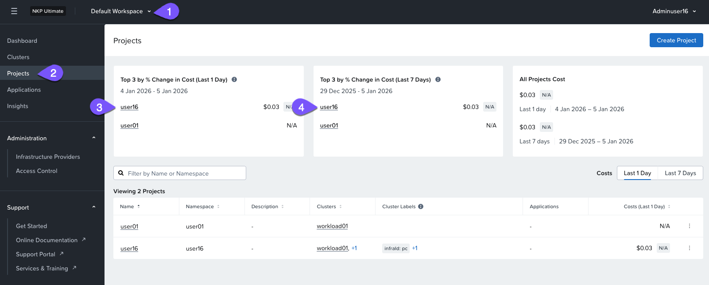
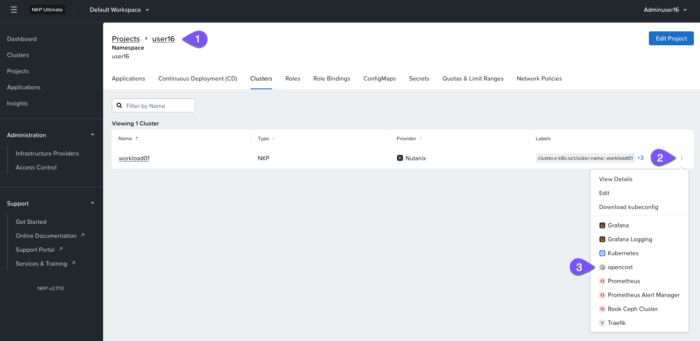
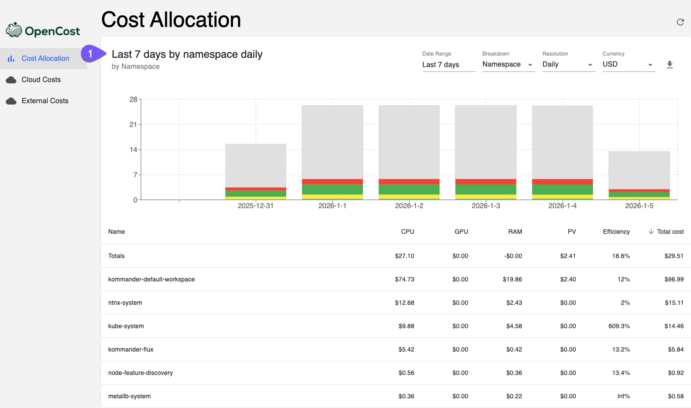
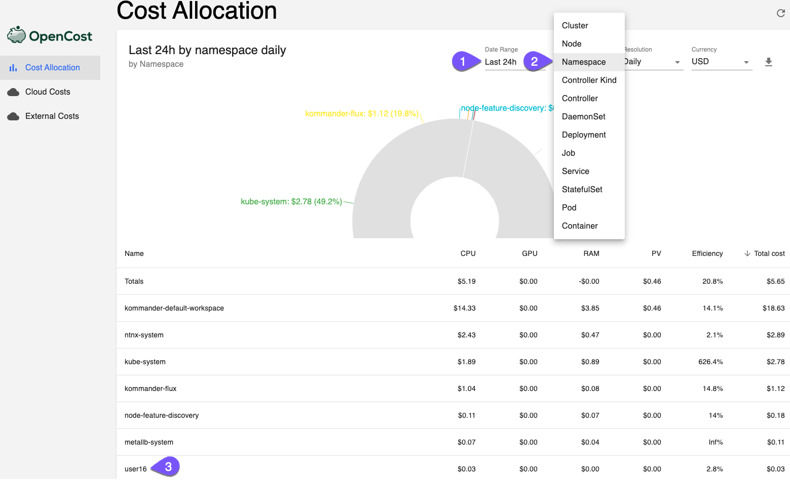

# Cost visibility Lab

OpenCost ซึ่งมี open-source core ได้รับการออกแบบมาสำหรับการ monitoring และ optimizing costs ภายใน Kubernetes environments OpenCost ให้ real-time visibility ของค่าใช้จ่าย cluster ช่วยให้ทีมสามารถจัดการและลดการใช้จ่ายด้าน cloud infrastructure ได้อย่างมีประสิทธิภาพ

ในฐานะส่วนหนึ่งของ bootcamp นี้ เราจะ:

-   Monitor costs ทั่วทั้ง individual clusters และ projects แบบไม่จำกัด
-   แยกแยะค่าใช้จ่ายตาม Kubernetes components ต่างๆ รวมถึง deployments, services, namespaces, และ labels
-   ให้ real-time cost performance metrics
-   เสนอ customized cost-saving recommendations

!!! info
    รู้หรือไม่?

    **NKP OpenCost** มีให้ใช้งานเฉพาะกับ NKP Ultimate license เท่านั้น

#### Analyse cost of your Kubernetes clusters, projects and applications

1.  ค้นพบว่ามีค่าใช้จ่ายเท่าใดสำหรับ project ของคุณในช่วงวันที่ผ่านมาและ 7 วันล่าสุด
    
    
    
2.  เปิด project ของคุณและเข้าถึง OpenCost dashboard เพื่อดู detailed cost analyses และ reports
    
    
    
3.  ดูที่หน้า OpenCost overview ที่ด้านบนของหน้า คุณสามารถดู summary ที่ดีสำหรับ 7 วันล่าสุด
    
    
    
4.  เจาะลึกยิ่งขึ้นด้วยการปรับ time intervals และ filtering ค่าใช้จ่ายที่เกิดขึ้นในระดับ node, namespace หรือแม้กระทั่ง container
    
    
    

โดยสรุปแล้ว NKP พร้อมด้วย OpenCost มี integrated cost visualization สำหรับ Kubernetes environments โดยให้ detailed insights เกี่ยวกับ spending patterns ใน applications, teams, และ namespaces โซลูชันนี้ช่วยให้สามารถทำ real-time cost monitoring รองรับความสามารถในการทำ showback และ chargeback และช่วยอำนวยความสะดวกในการทำ efficient resource allocation ซึ่งช่วยให้องค์กรสามารถ optimize การใช้จ่ายด้าน Kubernetes infrastructure และเพิ่ม return on investment (ROI) ให้สูงสุด

---

[← Back: Platform analytics](nkp-observ-analytics.md) | [Home](nkp-bootcamp.md) | [Next: Takeaways →](nkp-observ-takeaways.md)