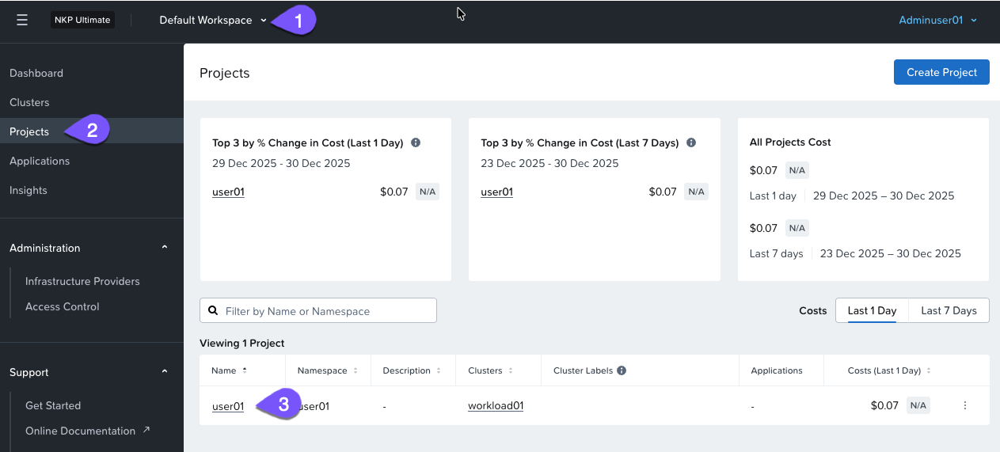
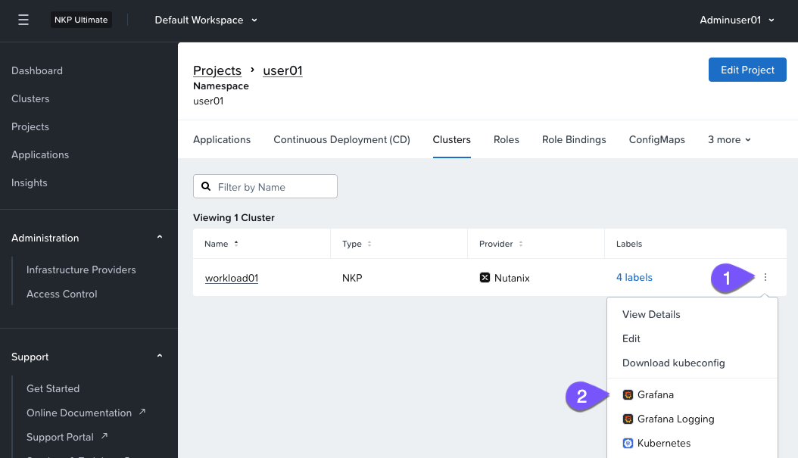
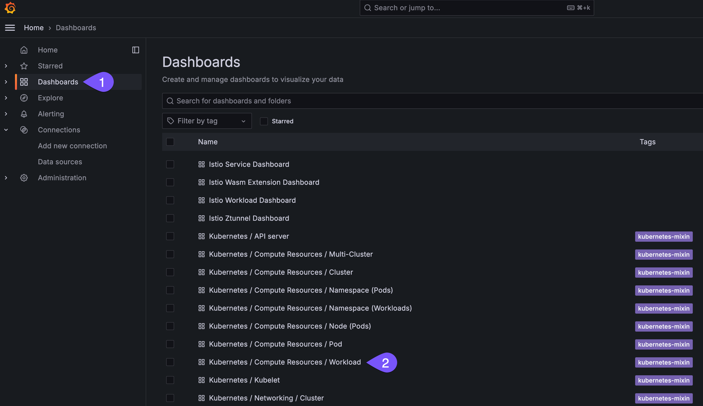
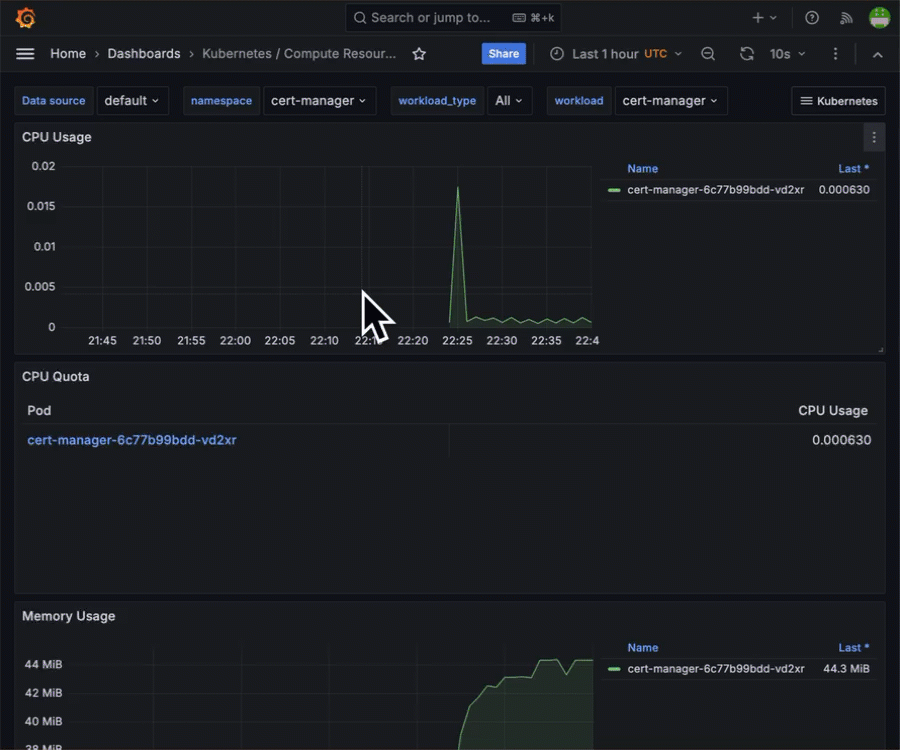
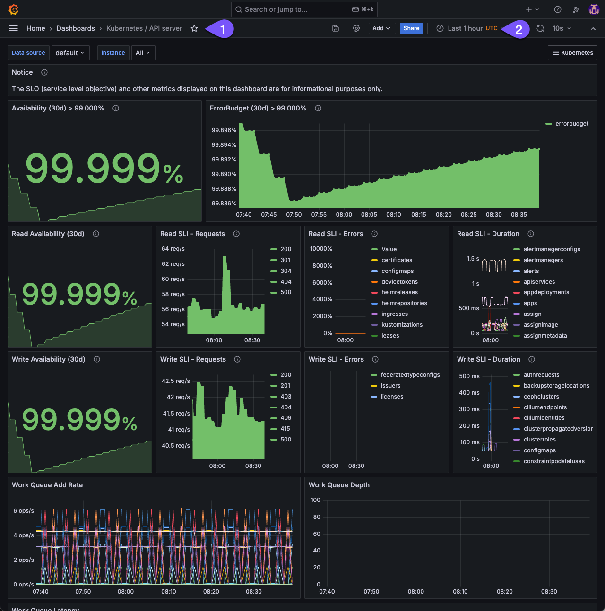

# Metrics visualization Lab

NKP นำเสนอ centralized observability สำหรับ Kubernetes environments ด้วย Grafana dashboards แบบ built-in ถึง 27 รูปแบบ และรองรับ custom dashboards ทำให้สามารถทำ comprehensive monitoring และ management ทั่วทั้ง multi-cloud และ hybrid setups ได้

!!! info
    รู้หรือไม่?

    **Grafana** รวมอยู่ใน NKP Pro และ Ultimate licensing เท่านั้น

ในแบบฝึกหัดนี้ คุณจะได้สำรวจ Grafana dashboards เพื่อตรวจสอบ WordPress application ที่คุณได้ deploy ไปก่อนหน้านี้

1.  นำทาง (Navigate) ไปยัง project ของคุณที่มีการ deploy WordPress application
    
    
    
2.  เปิด Grafana dashboard สำหรับ cluster ที่ได้รับมอบหมายใน project ของคุณเพื่อตรวจสอบ monitoring metrics
    
    
    
3.  default dashboard บนหน้าแรกจะแสดง resource utilization สำหรับ NKP cluster ของคุณ จากตรงนั้น ให้นำทางไปยัง built-in workload dashboard เพื่อตรวจสอบ compute resources
    
    
    
4.  วิเคราะห์ application-specific metrics โดยใช้ filters ภายในช่อง namespace ด้วย project ของคุณ สิ่งนี้จะช่วยให้คุณสามารถสังเกต performance ของ WordPress application และ MySQL database โดยการเลือก workload ที่เกี่ยวข้อง
    
    
    

โดยสรุปแล้ว Grafana ใน NKP ให้ความยืดหยุ่นผ่าน custom และ community-driven dashboards, เพิ่มประสิทธิภาพการ troubleshooting ด้วย multi-source data integration, และมี centralized access control สำหรับ secure metrics governance แนวทางที่ครอบคลุมนี้ช่วยให้เกิด efficient monitoring และ management สำหรับ Kubernetes environments

!!! tip

    มี built-in Grafana dashboards เพื่อทำหน้าที่ monitor K8s components นอกเหนือจาก user deployed workloads แดชบอร์ดต่อไปนี้เป็นตัวอย่างสำหรับการตรวจสอบ availability ของ Kubernetes API server คุณยังสามารถเปลี่ยน time interval ได้อย่างง่ายดาย

    

---

[← Back: Observability Overview](nkp-observ.md) | [Home](nkp-bootcamp.md) | [Next: Platform analytics →](nkp-observ-analytics.md)