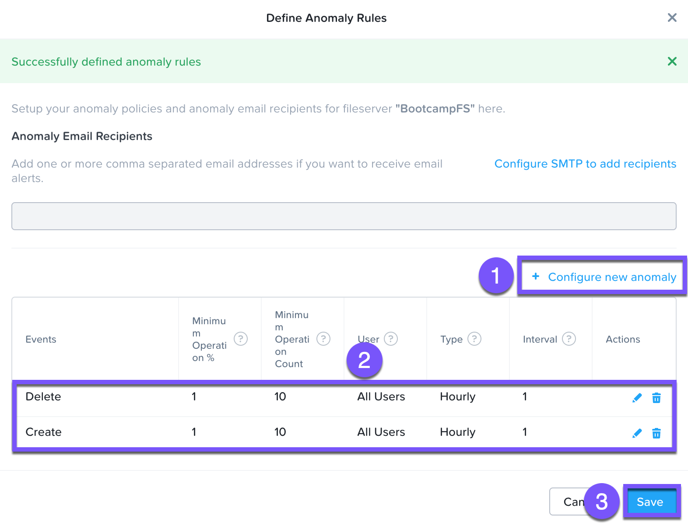
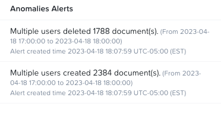
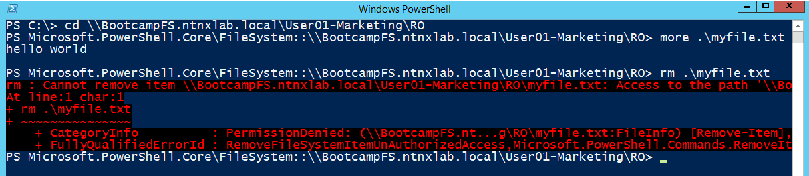
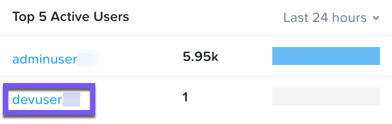
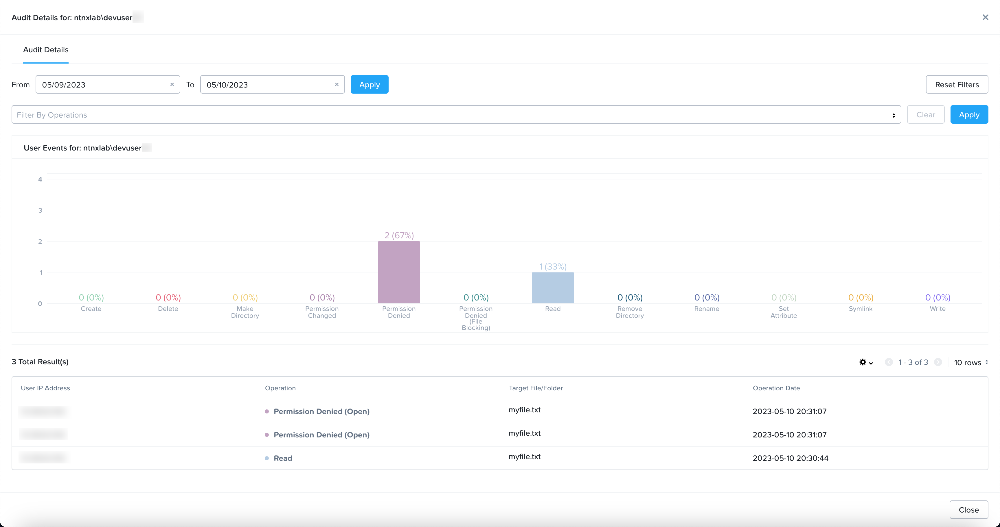

# Anomaly Rules

## Define Anomaly Rules

1.  ในเมนู ให้เลือก **Define Anomaly Rules**
    
2.  คลิก + **\> Define Anomaly Rules** กรอกข้อมูลในฟิลด์ต่อไปนี้และคลิก /
    
    -   **Events:** Delete
    -   **Minimum Operation %:** `1`
    -   **Minimum Operation Count:** `10`
    -   **User:** All Users
    -   **Type:** Hourly
    -   **Interval:** `1`

3.  คลิก + **\> Configure new anomaly** กรอกข้อมูลในฟิลด์ต่อไปนี้และคลิก / **\> Save**
    
    -   **Events**: Create
    -   **Minimum Operation %**: `1`
    -   **Minimum Operation Count**: `10`
    -   **User**: All Users
    -   **Type**: Hourly
    -   **Interval**: `1`
    
    
    

## Load Sample Data

1.  กลับไปที่ **`User##`\-WinTools** Remote Desktop session ของคุณ
    
2.  ภายใน folder _`User##`\-Marketing_ ให้คลิกที่ **Sample Data** คลิกขวาที่ **Sample Data** แล้วเลือก **Copy** คลิกขวาบนพื้นที่ว่างด้านล่าง files/folder และเลือก **Paste** ตอนนี้คุณจะมี folder เพิ่มขึ้นมาอีกหนึ่งอันชื่อว่า **Sample Data - Copy**
    
3.  คลิกขวาที่ folder **Sample Data** และเลือก **Delete**
    
    ตามค่าเริ่มต้น Anomaly engine จะทำงานทุกๆ 30 นาที แม้ว่าการตั้งค่านี้สามารถกำหนดค่า (configurable) ได้จาก File Analytics VM แต่การปรับเปลี่ยนตัวแปร (variable) นี้นอกเหนือจากขอบเขตของ lab นี้ ดังนั้นอาจใช้เวลาถึง 30 นาทีส่วน _Anomalies Alerts_ จึงจะอัปเดตกิจกรรม "anomalous" ที่คุณเพิ่งดำเนินการ หากคุณไม่ต้องการรอ เราได้เตรียมตัวอย่างสิ่งที่คุณจะเห็นเอาไว้ให้
    
    
    

## Cause Error Condition

1.  กลับไปที่ **`User##`\-WinTools** Remote Desktop session ของคุณ
    
2.  ภายใน folder _`User##`\-Marketing_ ให้สร้าง directory ใหม่ชื่อ `RO` (Read Only)
    
3.  ภายใน directory **RO** ให้สร้าง text file ใหม่ที่มีข้อความ `hello world` บันทึก file เป็น **myfile.txt**
    
4.  ไปที่ _Properties_ ของ folder _RO_ เลือก tab **Security** และคลิก **Advanced**
    
5.  คลิก **Disable inheritance** และเลือก **Convert inherited permissions into explicit permissiong on this object.**
    
6.  คลิก **Add** คลิก **Select a principal** ในส่วน _Enter the object name to select_ ให้พิมพ์ `everyone` แล้วคลิก **OK** สิทธิ์เริ่มต้น (default rights) ก็เพียงพอสำหรับการใช้งานของเราแล้ว คลิก **OK > OK > OK**
    
7.  คลิกขวาที่ icon **Powershell** ใน taskbar กดปุ่ม **Shift** ค้างไว้แล้วคลิกขวาที่ list item **Windows Powershell** แล้วเลือก **Run as a different user**
    
8.  ป้อนข้อมูลต่อไปนี้:
    
    -   **User name**: `devuser##`
    -   **Password**: `nutanix/4u`
    
9.  ดำเนินการ (Execute) command `cd \\BootcampFS.ntnxlab.local\User##-Marketing\RO` เพื่อ change directory ไปยัง directory **RO** ภายใน share **`User##`\-Marketing**
    
10.  ดำเนินการ (Execute) command `more myfile.txt` เนื่องจาก command นี้พยายามอ่านและแสดงเนื้อหาของ file มันจะสำเร็จเนื่องจากเรามี permission _Read_ บน folder นี้
    
11.  ดำเนินการ (Execute) command `rm myfile.txt` เนื่องจาก command นี้พยายามลบ file มันจะล้มเหลวเนื่องจาก user คนนี้ไม่มี permission _Delete_ บน folder นี้
    
    
    
12.  ปิด _Powershell_ และกลับไปที่ tab _Files Analytics_ ของคุณ
    
13.  หลังจากนั้นไม่นาน กิจกรรมของคุณจะแสดงขึ้นในส่วน _Top 5 Active Users_ คลิกที่ **`devuser##`** ส่วนของ _Audit Details_ สำหรับ _`devuser##`_ จะเปิดขึ้น สังเกตกิจกรรมของคุณภายในส่วน _Total Result(s)_
    
    
    
    
    
14.  เมื่อคุณทำเสร็จแล้ว ให้คลิก x ที่มุมขวาบน
