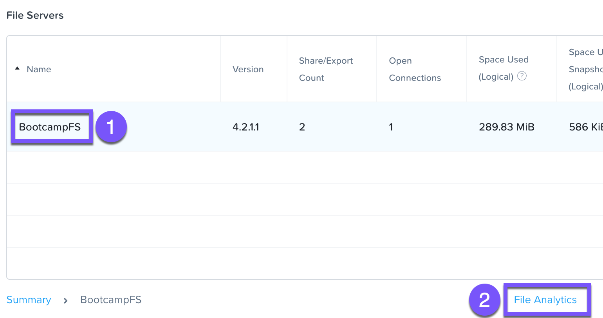
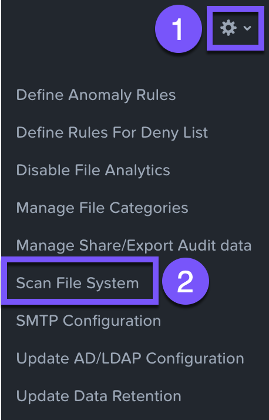
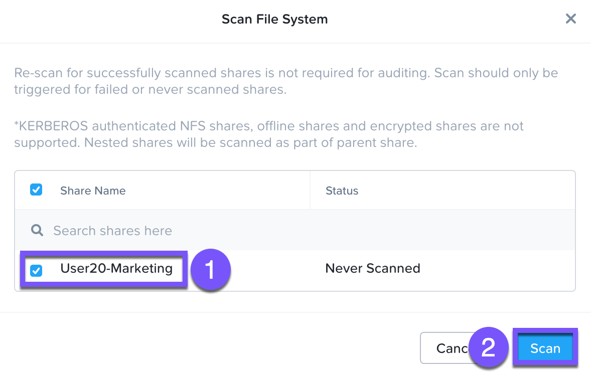
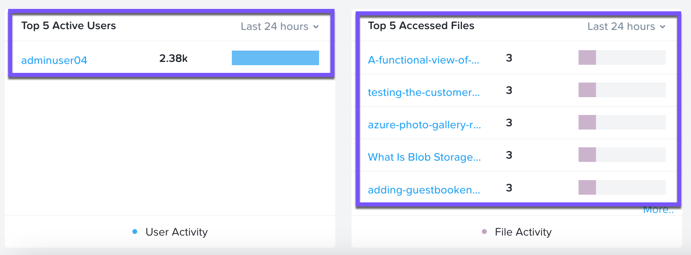
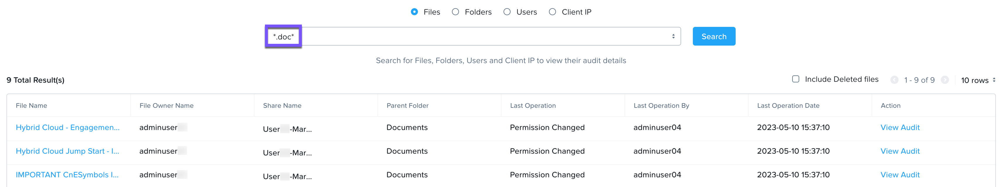

# File System Scan

1.  กลับไปที่ **Prism Element** browser tab ของคุณ
    
2.  ภายใน drop-down menu ให้เลือก **File Server**
    
3.  คลิกที่ **BootcampFS** แล้วจากนั้นคลิก **File Analytics**
    
    
    
4.  ล็อกอินโดยใช้ Prism Element credentials ของคุณ
    
5.  คลิก **\> Scan File System**
    
    
    
6.  เลือกช่อง **`User##`\-Marketing** และคลิก **Scan** เพื่อทำการสแกนเริ่มต้นของ shares ที่มีอยู่ ซึ่งจะใช้เวลา <1 นาที คลิกเมื่อสถานะการสแกนเป็น **Completed** ตอนนี้คุณจะเห็น dashboard panels ทำการอัปเดต
    
    
    
7.  กลับไปที่ **`User##`\-WinTools** Remote Desktop session ของคุณ
    
8.  เปิด Word files หนึ่งไฟล์ภายใน **`User##`\-Marketing > Sample Data > Documents**
    
    !!! note
        หากคุณได้รับแจ้งให้ทำ wizard สำหรับ OpenOffice ให้เสร็จสิ้น ให้คลิก **Next > Finish**
    
9.  กลับไปที่ Files Analytics browser tab รีเฟรช (Refresh) หน้า _Dashboard_ ตอนนี้ panel **Top 5 Active Users** และ **Top 5 Accessed Files** ได้รับการอัปเดตเพื่อรายงานกิจกรรมของคุณแล้ว
    
    
    
10.  ภายใน **Top 5 Active Users** ให้คลิกที่ username (เช่น adminuser20) ซึ่งจะนำคุณไปยัง audit trail ของ user
    
11.  คุณยังสามารถคลิกที่เมนู **\> Audit Trails** และค้นหากิจกรรมได้อีกด้วย สามารถใช้ Wildcards ภายในการค้นหาได้ (เช่น **`*.doc*`**)
    
    
    
12.  คลิก X เมื่อคุณดู (viewing) เสร็จแล้ว
    

## Takeaways

File Analytics ช่วยให้คุณเข้าใจได้ดียิ่งขึ้นว่าองค์กรของคุณใช้ประโยชน์จากข้อมูล (data) อย่างไร เพื่อช่วยให้คุณปฏิบัติตามข้อกำหนดในด้านการตรวจสอบข้อมูล (data auditing), การจำกัดการเข้าถึงข้อมูล (data access minimization), และ compliance ของคุณ
