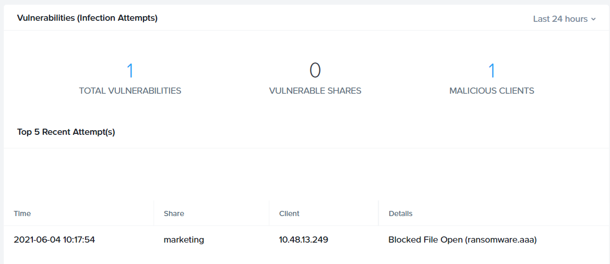

# Ransomware

ในแบบฝึกหัดนี้ คุณจะทำการเปิดใช้งาน File Analytics ransomware protection และจำลองให้เกิดเหตุการณ์ ransomware

1.  นำทางไปยัง **\> Ransomware**
    
2.  คลิก **Enable Ransomware Protection > Enable**
    
3.  กลับไปที่ **`User##`\-WinTools** Remote Desktop session ของคุณ
    
4.  เปิดหน้าต่าง PowerShell โดยคลิกที่ icon **PowerShell** บน taskbar
    
5.  ดำเนินการ (Execute) command `new-item \\BootcampFS.ntnxlab.local\user##-marketing\ransomware.aaa -ItemType file` คุณจะได้รับข้อความแสดงข้อผิดพลาด (error message) ว่า access denied
    
6.  ภายใน **File Analytics** ให้ตรวจสอบ (review) ตาราง **Vulnerabilities** เพื่อดู operation ที่ถูกบล็อก (blocked) โปรดทราบว่าคุณอาจต้องทำการรีเฟรชหน้า **Ransomware**
    
    
    
    !!! note
        คุณยังสามารถดูเหตุการณ์ _permission denied_ ใน **Audit Trails** ได้อีกด้วย

Nutanix Data Lens ให้ advanced analytics และ ransomware protection ที่เหนือกว่าและล้ำหน้ากว่า File Analytics รวมถึงมี ransomware signatures มากกว่า 5,000 รายการ และการตรวจจับ (detecting) ตัวแปรที่ไม่รู้จัก (unknown variants) โดยอิงจากรูปแบบการเข้าถึง (access patterns)

---

[← Back: Anomaly Rules](nus-analytics-anomaly.md) | [Home](nus-getting-start.md) | [Next: Bucket, Users, And Access Control →](nus-objects-buckets.md)