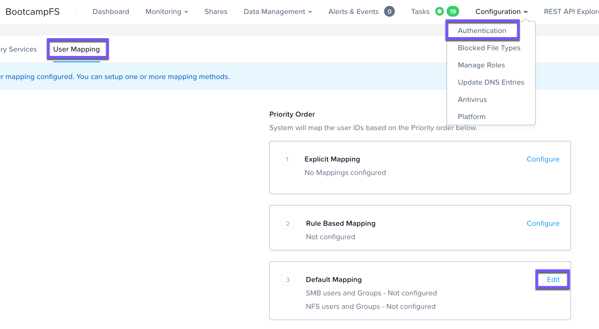
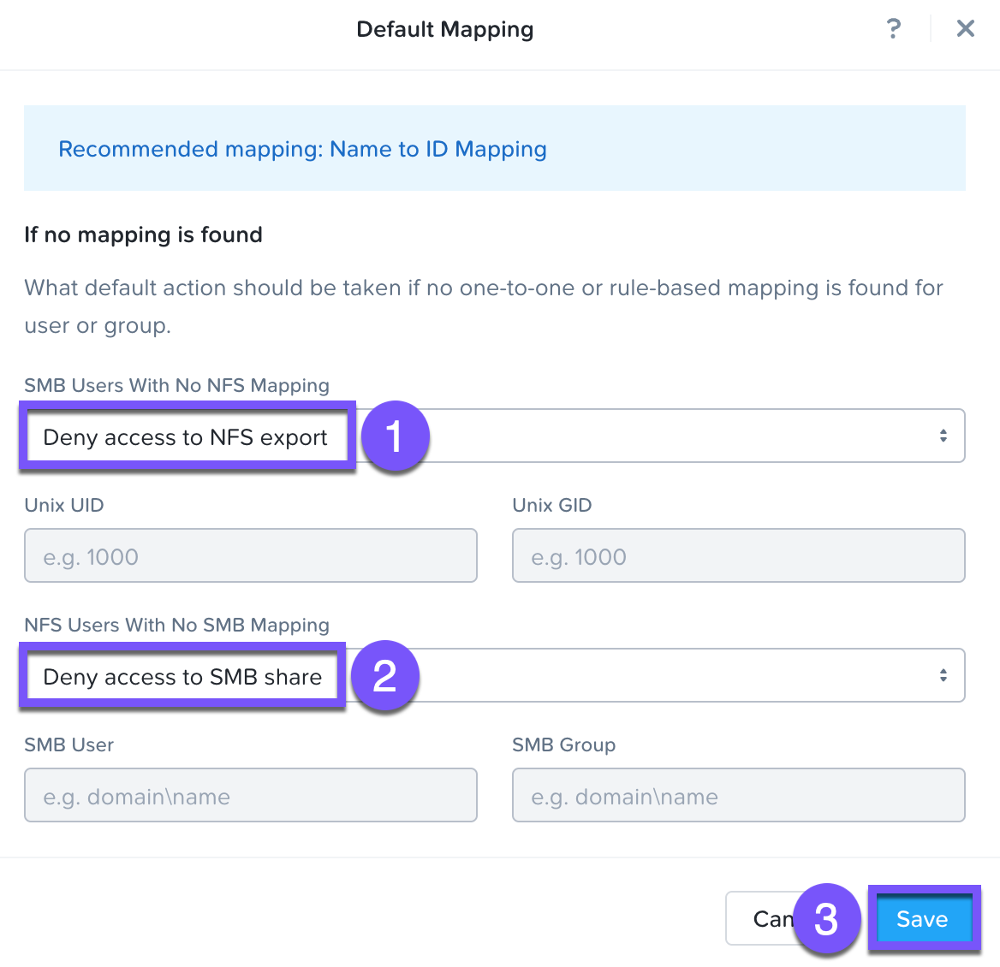
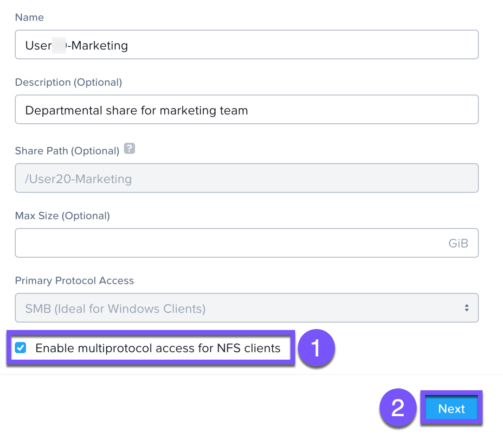
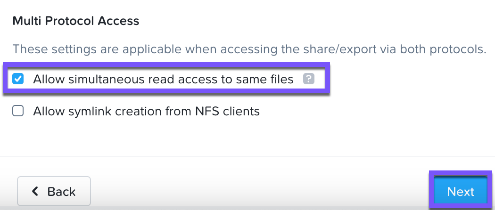
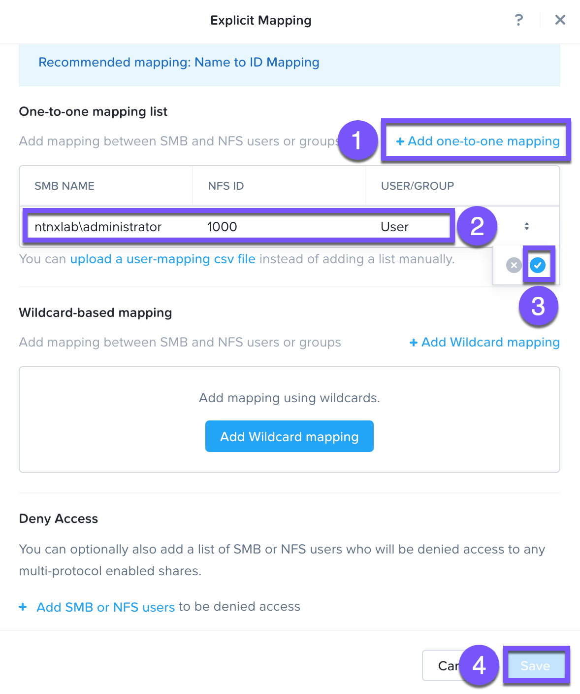
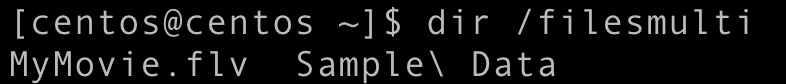

# Multi-Protocol

Nutanix Files share มีแนวคิดเกี่ยวกับ native และ non-native protocol สิทธิ์การเข้าถึง (permissions) ทั้งหมดจะถูกนำไปใช้ผ่าน native protocol คำขอเข้าถึงใดๆ ที่ใช้ non-native protocol จำเป็นต้องมีการทำ user หรือ group mapping ไปยัง permission ที่ถูกกำหนดไว้จากฝั่ง native มีหลายวิธีในการกำหนด user และ group mappings ได้แก่ rule-based, explicit, และ default ตอนนี้คุณจะต้องกำหนดค่า default mapping เป็นอันดับแรก

1.  ไปที่ **Configuration > Authentication**
    
2.  เลือกแท็บ **User Mapping**
    
3.  ในส่วนของ _Default Mapping_ ให้คลิกที่ **Edit**
    
    
    
4.  เลือก **Deny access to NFS export** และ **Deny access to SMB share** เป็นค่าเริ่มต้นสำหรับกรณีที่ไม่พบ mapping แล้วคลิก **Save**
    
    
    
5.  คลิกที่ **Shares > `User##`\-Marketing**
    
6.  คลิก **Update**
    
7.  ทำเครื่องหมายที่ **Enable multiprotocol access for NFS** แล้วคลิก **Next**
    
    
    
8.  ในส่วนของ _Multi Protocol Access_ ให้ทำเครื่องหมายที่ **Allow simultaneous read access to the same files** แล้วคลิก **Next**
    
    
    
9.  คลิก **Update**
    
    การกำหนดค่า multiprotocol สำหรับ `User##`\-Marketing share ของคุณเสร็จสมบูรณ์แล้ว ตอนนี้เราจะมาลองเข้าถึง share เพื่อทดสอบการกำหนดค่า multiprotocol กัน
    
10.  กลับไปที่ `User##`\-LinuxTools VM Putty session ของคุณ
    
11.  รันคำสั่งต่อไปนี้ (อย่าลืมเปลี่ยน `User##` เป็นของคุณเอง)
    
    ```
    sudo mkdir /filesmulti
    sudo mount.nfs4 BootcampFS.ntnxlab.local:/`User##`-Marketing /filesmulti
    dir /filesmulti
    ```
    
    ตอนนี้คุณจะต้องเพิ่ม explicit mapping เพื่ออนุญาตการเข้าถึงให้กับ non-native NFS protocol user เราต้องดึง user ID (UID) มาเพื่อสร้าง explicit mapping เนื่องจาก default mapping ถูกตั้งค่าเป็นการปฏิเสธการเข้าถึง ดังนั้นการเกิดข้อผิดพลาด **Permission denied** จึงเป็นสิ่งที่คาดไว้อยู่แล้ว
    
12.  รันคำสั่ง `id` และจดบันทึก UID ไว้
    
13.  กลับไปที่แท็บเบราว์เซอร์ **Nutanix Files** ของคุณ แล้วคลิกที่มุมซ้ายบน
    
14.  คลิกที่ **Configuration > Authentication** และเลือกแท็บ **User Mapping**
    
15.  ในส่วนของ _Explicit Mapping_ ให้คลิกที่ **Configure**
    
16.  คลิกที่ **Add one-to-one mapping**
    
17.  กรอกข้อมูลในช่องต่อไปนี้ คลิก และคลิก **Save**
    
    -   **SMB Name** - `ntnxlab\administrator`
    -   **NFS ID** - UID จากขั้นตอนที่ 12 (เช่น 1000)
    -   **User/Group** - User
    
    
    
18.  กลับไปที่ `User##`\-LinuxTools VM Putty session ของคุณ รันคำสั่ง `dir /filesmulti` ซึ่งคราวนี้จะสามารถทำงานได้สำเร็จ
    
    
    

คุณได้ทำการกำหนดค่า multiprotocol access สำหรับ `User##`\-Marketing share ของคุณสำเร็จแล้ว


---

[← Back: File Blocking](nus-files-block.md) | [Home](nus-getting-start.md) | [Next: File System Scan →](nus-analytics-filesystem-scan.md)