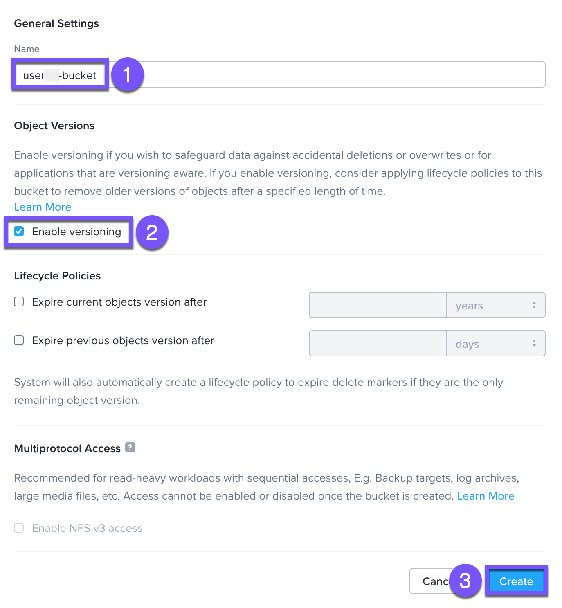
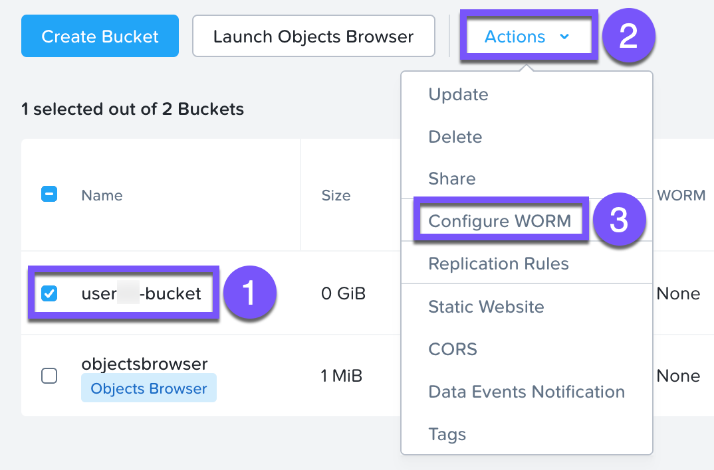
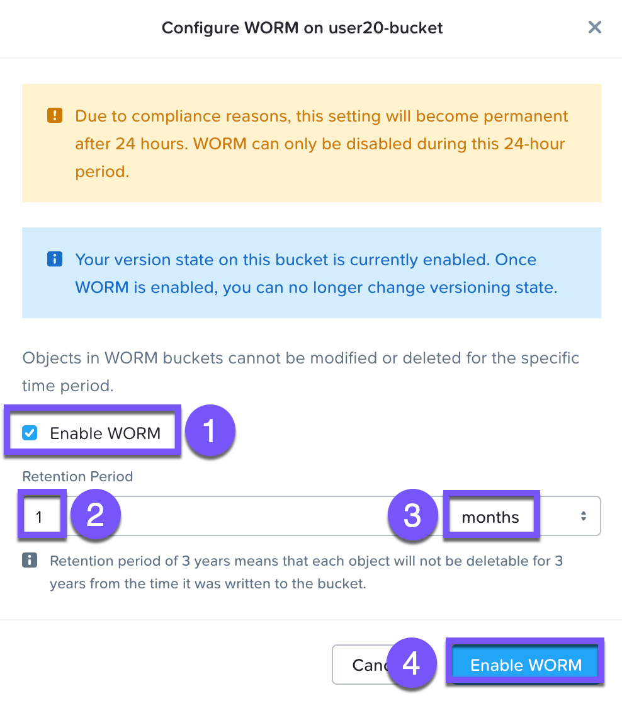
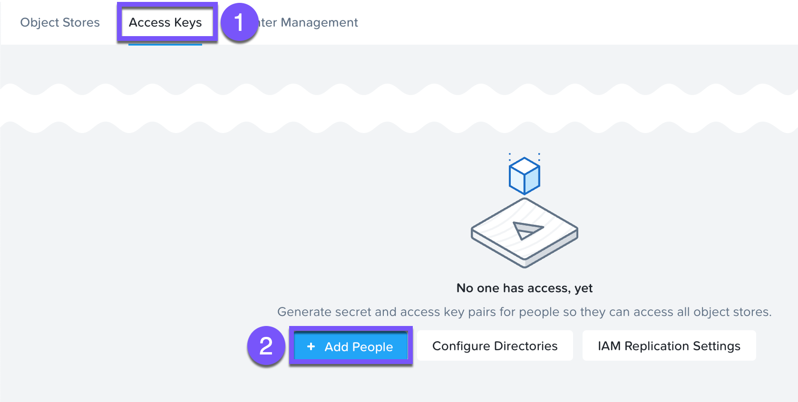
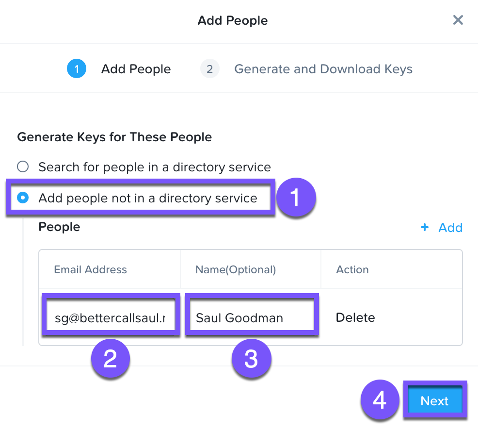
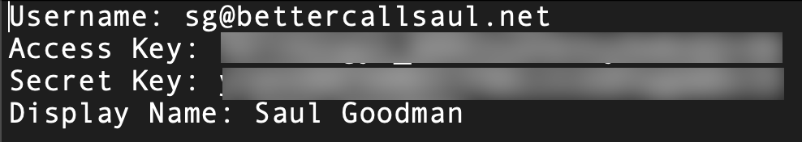
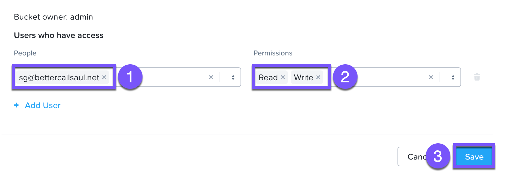

# Buckets, Users, And Access Control

## Create Bucket In Prism

bucket จะอยู่ภายใน object store ซึ่งสามารถนำ policies มาประยุกต์ใช้ได้ เช่น versioning และ WORM โดยค่าเริ่มต้น bucket ที่สร้างขึ้นใหม่จะเป็น private resource สำหรับผู้สร้าง โดยค่าเริ่มต้น ผู้สร้าง bucket จะมีสิทธิ์ (permissions) แบบ read/write สิทธิ์การเข้าถึง (Access permission) ยังสามารถมอบให้กับผู้ใช้อื่นได้ด้วย

1.  ใน _Prism Central_ ไปที่ **> Services > Objects**
    
2.  คลิกที่ **ntnx-objects** Objects Store หน้าต่างการจัดการ Objects Store จะเปิดขึ้นในแท็บเบราว์เซอร์ใหม่
    
3.  คลิก **Create Bucket** กรอกข้อมูลในช่องต่อไปนี้ แล้วคลิก **Create**
    
    -   **Name** - `user##`\-bucket (ตัวพิมพ์เล็ก)
    -   **Enable Versioning** - ทำเครื่องหมายเลือก (Checked)
    
    
    
    ชื่อของ bucket ต้องเป็นตัวพิมพ์เล็กและประกอบด้วยตัวอักษร, ตัวเลข, จุด (periods), และยัติภังค์ (hyphens) เท่านั้น
    
    นอกจากนี้ ชื่อ bucket ทั้งหมดจะต้องไม่ซ้ำกัน (unique) ภายใน Object Store นั้นๆ
    
    หากเปิดใช้งาน versioning คุณจะสามารถอัปโหลดเวอร์ชันใหม่ของ object เดิมเพื่อทำการเปลี่ยนแปลงที่จำเป็นได้โดยที่ original data ไม่สูญหาย Lifecycle policies กำหนดระยะเวลาในการเก็บรักษา data ไว้ในระบบ
    
    เมื่อสร้าง bucket เสร็จแล้ว จะสามารถกำหนดค่า (configured) ด้วย WORM (Write Once, Read Many) ได้ WORM ช่วยป้องกันการแก้ไข, การเขียนทับ (overwriting), การเปลี่ยนชื่อ, และการลบ data ซึ่งเป็นสิ่งสำคัญมากในอุตสาหกรรมที่มีการควบคุมอย่างเข้มงวด (การเงิน, การดูแลสุขภาพ, หน่วยงานรัฐ ฯลฯ) ซึ่งมีการรวบรวมและจัดเก็บ sensitive data ตัวอย่างเช่น e-mails, ข้อมูลบัญชี, voice mails และอื่นๆ
    
    !!! note    
        หากเปิดใช้งาน WORM บน bucket มันจะแทนที่ (supersede) lifecycle policy ใดๆ
    
4.  ทำเครื่องหมายที่ช่องถัดจาก **`user##`\-bucket** ในเมนู drop-down ของ _Actions_ ให้เลือก **Configure WORM**
    
    
    
5.  ทำเครื่องหมายที่ช่องถัดจาก **Enable WORM**
    
6.  ในช่อง _Retention Period_ ให้ป้อน **1** เลือก **months** จากเมนู drop-down ที่อยู่ติดกัน คลิก **Enable WORM**
    
    !!! note
        คุณสามารถกำหนด data retention period ของ WORM สำหรับแต่ละ bucket แยกกันได้
    
    
    

## Objects User Management

ในแบบฝึกหัดนี้ คุณจะได้สร้าง (generate) access keys และ secret keys เพื่อเข้าถึง object store ที่ใช้ตลอดทั้งแล็บ

1.  กลับไปที่แท็บเบราว์เซอร์ _Prism Central_ ของคุณ
    
2.  คลิกที่ **Access Keys** จากเมนูด้านบน และคลิก **Add People**
    
    
    
3.  เลือก **Add people not in a directory service** ป้อน e-mail address และชื่อของคุณ คลิก **Next > Generate Keys**
    
    
    
4.  คลิก **Download Keys** เพื่อดาวน์โหลดไฟล์ .txt ซึ่งประกอบด้วย **Access Key** และ **Secret Key** คลิก **Close**
    
5.  เปิดไฟล์โดยคลิกที่ชื่อไฟล์ตรงมุมซ้ายล่างของ Chrome
    
    
    

## Adding Users To Buckets Share

1.  กลับไปที่แท็บเบราว์เซอร์ Objects Store ของคุณ
    
2.  คลิก **`user##`\-bucket** และเลือก **User Access** จากเมนูด้านซ้าย
    
3.  คลิก **Edit User Access** เพื่อแชร์ bucket ของคุณ คุณสามารถกำหนดค่า read access (GET), write access (PUT) หรือทั้งสองอย่างสำหรับผู้ใช้แต่ละราย (per-user) ได้
    
4.  เพิ่ม e-mail address ของคุณ เลือก e-mail นั้น และในเมนู drop-down ของ _Permissions_ ให้เลือก permissions ทั้ง **Read** และ **Write** คลิก **Save**
    
    
    
5.  คลิก < **Back** ที่มุมซ้ายบน

---

[← Back: Ransomware](nus-analytics-ransomware.md) | [Home](nus-getting-start.md) | [Next: Versioning and Access Control →](nus-objects-version.md)