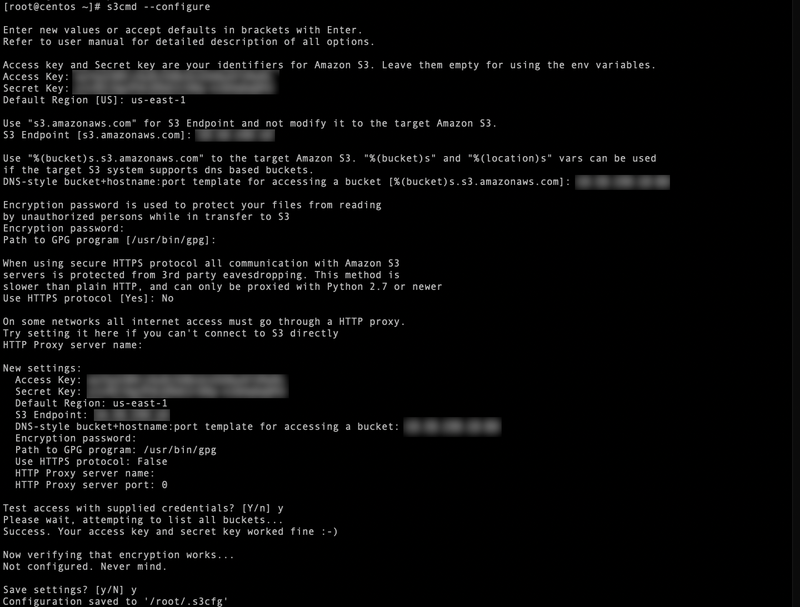

# CLI And Scripting

## Accessing Objects From The CLI

แม้ว่าเครื่องมืออย่าง Objects Browser จะช่วยให้มองเห็นภาพว่า data ถูกเข้าถึงภายใน object store อย่างไร แต่โดยหลักแล้ว Objects เป็นบริการ object store ที่ออกแบบมาเพื่อให้เข้าถึงและใช้งานโดยใช้ S3 (Simple Storage Service) APIs

Amazon's S3 เป็นบริการ public cloud storage ที่ใหญ่ที่สุด และส่งผลให้ S3 API ของพวกเขากลายเป็นมาตรฐานโดยพฤตินัย (de-facto standard) สำหรับ object storage API เนื่องจากนักพัฒนาและ ISV นำไปใช้งาน Objects มีอินเทอร์เฟซที่รองรับ S3 compliant เพื่อให้สามารถ portability ได้สูงสุด รวมถึงรองรับแอปพลิเคชัน "cloud native" ที่มีอยู่เดิม

คุณจะได้ใช้ประโยชน์จาก `s3cmd` ในแบบฝึกหัดนี้เพื่อเข้าถึง buckets ของคุณโดยใช้ CLI

คุณจะต้องใช้ **Access Key** และ **Secret Key** สำหรับ user ที่สร้างไว้ก่อนหน้านี้ในแล็บนี้

### Setting Up s3cmd (CLI)

ส่วนนี้ของแล็บจะทำโดยใช้ Linux Tools VM

1.  SSH เข้าไปที่ **`User##`\-LinuxTools** โดยใช้ credentials ต่อไปนี้
    
    -   **Username** - `root`
    -   **Password** - `nutanix/4u`
2.  ป้อน `s3cmd --configure` และกรอกข้อมูลต่อไปนี้เพื่อกำหนดค่า (configure) การเข้าถึง Object Store
    
    !!! note    
        กด **Enter** สำหรับสิ่งใดก็ตามที่ไม่ได้ระบุไว้ด้านล่างเพื่อส่งค่า default
    
    -   **Access Key** - _Access Key_
        
    -   **Secret Key** - _Secret Key_
        
    -   **Default Region \[US\]** - us-east-1
        
    -   **S3 Endpoint \[s3.amazonaws.com\]** - `OBJECT-STORE-IP`
        
    -   **DNS-style bucket+hostname:port template for accessing a bucket \[%(bucket)s.s3.amazonaws.com\]** - `OBJECT-STORE-IP:80`
        
    -   **Use https protocol \[Yes\]** - `No`
        
    -   **Test access with supplied credentials?** - `Y`
        
    -   **Save settings? \[y/N\]** - `Y`
        
        
        
3.  รันคำสั่ง `nano .s3cfg` เพื่อแก้ไขไฟล์ เลื่อนลงมาและแก้ไขรายการ **signature\_v2** จาก `False` เป็น `True`
    
4.  บันทึกไฟล์โดยกด \[CTRL\]\[X\] พิมพ์ `Y` และกด **Enter** เพื่อบันทึกไฟล์ และกด **Enter** อีกครั้งเพื่อบันทึกไฟล์โดยใช้ชื่อที่มีอยู่เดิม
    

### [#](#create-a-bucket-and-add-objects-to-it-using-s3cmd-cli) Create A Bucket And Add Objects To It Using s3cmd (CLI)

1.  ตอนนี้มาใช้ s3cmd เพื่อสร้าง bucket ใหม่ชื่อ **`user##`\-cli-bucket**
    
2.  จาก command line ของ Linux เดิม รันคำสั่ง `s3cmd mb s3://user##-cli-bucket` (เช่น s3cmd mb s3://user01-cli-bucket) ผลลัพธ์ (output) ที่คาดหวังคือ:
    
    ```
    Bucket 's3://user##-cli-bucket/' created
    ```

3.  รันคำสั่ง `s3cmd ls` เพื่อแสดงรายการ buckets ของคุณ
    
4.  รันคำสั่ง `s3cmd ls | grep user##` (เช่น s3cmd ls | grep user01) เพื่อดูเฉพาะ buckets ของคุณ
    
    ตอนนี้เรามี bucket ใหม่แล้ว มาอัปโหลด data กันเถอะ
    
5.  รันคำสั่งต่อไปนี้ คุณสามารถรันคำสั่งเหล่านี้พร้อมกันหรือทีละคำสั่งก็ได้ ข้อความหลังเครื่องหมาย `#` อธิบายว่าคำสั่งทำอะไรและจะไม่ถูกรัน
    
    ```
    curl http://10.42.194.11/hol/unified-storage/SampleData_Small.zip -O -J -L #ดาวน์โหลด sample data
    mkdir sample-pictures #สร้างโฟลเดอร์ใหม่
    unzip -j SampleData_Small.zip *.png -d sample-pictures #แตกไฟล์เฉพาะไฟล์รูปภาพ
    ```
    
6.  รันคำสั่ง `ls sample-pictures` เพื่อแสดงรายการรูปภาพ (images) ภายในโฟลเดอร์ sample-pictures
    
7.  รันคำสั่งต่อไปนี้เพื่ออัปโหลดไฟล์ภาพ **login.png** ไปยัง bucket ของคุณ
    
    ```
    cd sample-pictures #เปลี่ยน directory ไปที่ sample-pictures
    s3cmd put --acl-public --guess-mime-type login.png s3://user##-cli-bucket/login.png #อัปโหลดไฟล์ login.png ไปยัง user##-cli-bucket ของคุณ
    ```
    
    ผลลัพธ์ (output) ที่คาดหวังคือ:
    
    ```
    2023-04-17 19:19     71697   s3://user##-cli-bucket/login.png
                           DIR   s3://user##-test-bucket/Pictures/
    2023-04-17 18:00       374   s3://user##-test-bucket/version.rtf
    ```
    
8.  รันคำสั่ง `s3cmd ls` เพื่อแสดงรายการ objects ทั้งหมดในทุก buckets หรือ `s3cmd ls | grep user##` เพื่อแสดงเฉพาะ objects ภายใน buckets ของคุณ
    

## Creating And Using Buckets From Scripts

ในแบบฝึกหัดนี้ คุณจะได้ใช้ **Boto 3** ซึ่งเป็น AWS SDK สำหรับ Python เพื่อจัดการ (manipulate) buckets ของคุณโดยใช้ Python scripts

### Listing And Creating Buckets With Python

ในแบบฝึกหัดนี้ คุณจะได้แก้ไข sample script ให้ตรงกับ environment ของคุณ เพื่อแสดงรายการ buckets ทั้งหมดที่มีให้กับ user นั้น จากนั้นคุณจะแก้ไข script เพื่อสร้าง bucket ใหม่โดยใช้ S3 connection ที่มีอยู่

1.  รันคำสั่ง `nano list-buckets.py` และวาง script ด้านล่างนี้ ก่อนบันทึก script คุณต้องแก้ไขค่า Objects IP address, access\_key\_id และ secret\_access\_key\_id
    
    ```
    #!/usr/bin/python
    
    import boto3
    import warnings
    warnings.filterwarnings("ignore")
    
    endpoint_ip="OBJECT-STORE-IP" #Replace this value
    access_key_id="ACCESS-KEY" #Replace this value
    secret_access_key="SECRET-KEY" #Replace this value
    endpoint_url= "https://"+ endpoint_ip +":443"
    
    session = boto3.session.Session()
    s3client = session.client(service_name="s3", aws_access_key_id=access_key_id, aws_secret_access_key=secret_access_key, endpoint_url=endpoint_url, verify=False)
    
    # list the buckets
    response = s3client.list_buckets()
    
    for b in response['Buckets']:
      print (b['Name'])
    ```
    
2.  บันทึกไฟล์โดยกด \[CTRL\]\[X\] พิมพ์ `Y` และกด **Enter** เพื่อบันทึกไฟล์ และกด **Enter** อีกครั้งเพื่อบันทึกไฟล์โดยใช้ชื่อที่มีอยู่เดิม
    
3.  รันคำสั่ง `python list-buckets.py` เพื่อรัน script ตรวจสอบ (verify) ว่า output แสดงรายการ buckets ใดๆ ที่คุณสร้างโดยใช้ user account แรกของคุณ
    

### Uploading Multiple Files To Buckets With Python

1.  รันคำสั่งต่อไปนี้เพื่อสร้างไฟล์ขนาด 1KB จำนวน 100 ไฟล์เพื่อใช้เป็น sample data สำหรับการอัปโหลด:
    
    ```
    cd ..;mkdir sample-files
    for i in {1..100}; do dd if=/dev/urandom of=sample-files/file$i bs=1024 count=1; done
    ```
    
    แม้ว่า sample files จะประกอบด้วย random data แต่ในความเป็นจริงแล้วไฟล์เหล่านี้อาจเป็น log files ที่ต้องถูกนำมาวนรอบ (rolled over) และทำ archive โดยอัตโนมัติ, วิดีโอเฝ้าระวัง (surveillance video), และบันทึกพนักงาน (employee records)
    
2.  รันคำสั่ง `nano list-buckets.py` และวางข้อความด้านล่างเพื่อสร้าง script ใหม่
    
    ```
    #!/usr/bin/python
    
    import boto3
    import glob
    import re
    import warnings
    warnings.filterwarnings("ignore")
    
    # user-defined variables
    endpoint_ip= "OBJECT-STORE-IP" #Replace this value
    access_key_id="ACCESS-KEY" #Replace this value
    secret_access_key="SECRET-KEY" #Replace this value
    bucket="BUCKET-NAME-TO-UPLOAD-TO" #Replace this value
    name_of_dir="sample-files"
    
    # system variables
    endpoint_url= "https://"+endpoint_ip+":443"
    filepath = glob.glob("%s/*" % name_of_dir)
    
    # connect to object store
    session = boto3.session.Session()
    s3client = session.client(service_name="s3", aws_access_key_id=access_key_id, aws_secret_access_key=secret_access_key, endpoint_url=endpoint_url, verify=False)
    
    # go through all the files in the directory and upload
    for current in filepath:
        full_file_path=current
        m=re.search('sample-files/(.*)', current)
        if m:
          object_name=m.group(1)
        print("Path to File:",full_file_path)
        print("Object name:",object_name)
        response = s3client.put_object(Bucket=bucket, Body=full_file_path, Key=object_name)
    ```
    
3.  บันทึกไฟล์โดยกด \[CTRL\]\[X\] พิมพ์ `Y` และกด **Enter** เพื่อบันทึกไฟล์ และกด **Enter** อีกครั้งเพื่อบันทึกไฟล์โดยใช้ชื่อที่มีอยู่เดิม
    
    เมธอด (method) [put\_object](https://boto3.amazonaws.com/v1/documentation/api/latest/reference/services/s3.html?highlight=put_object#S3.Bucket.put_object) ถูกใช้สำหรับการอัปโหลดไฟล์ นอกจากนี้ เมธอดนี้ยังสามารถเลือกใช้ (optionally) เพื่อกำหนด metadata, content type, permissions, expiration และข้อมูลที่สำคัญอื่นๆ ที่เกี่ยวข้องกับ object ได้
    
    Core S3 APIs จะมีความคล้ายคลึงกับ RESTful APIs สำหรับ web services อื่นๆ โดยมีการเรียก (calls) แบบ PUT เพื่ออนุญาตให้เพิ่ม objects และ settings/metadata ที่เกี่ยวข้อง, แบบ GET เพื่ออ่าน objects หรือข้อมูลเกี่ยวกับ objects, และแบบ DELETE เพื่อลบ objects
    
4.  รันคำสั่ง `python upload-files.py` เพื่อรัน script
    
5.  รันคำสั่ง `s3cmd ls s3://user##-cli-bucket/` เพื่อตรวจสอบว่า sample files พร้อมใช้งาน ส่วนหนึ่งของ output จะแสดงในตัวอย่างด้านล่าง
    
    ```
    ('Path to File:', 'sample-files/file88')
    ('Object name:', 'file88')
    ('Path to File:', 'sample-files/file89')
    ('Object name:', 'file89')
    ('Path to File:', 'sample-files/file90')
    ('Object name:', 'file90')
    ('Path to File:', 'sample-files/file91')
    ('Object name:', 'file91')
    ```
    

ในทำนองเดียวกัน S3 SDKs ก็มีให้ใช้งานสำหรับภาษาต่างๆ รวมถึง Java, JavaScript, Ruby, Go, C++ และอื่นๆ ซึ่งทำให้การใช้ประโยชน์จาก Nutanix Buckets ด้วยภาษาที่คุณเลือกเป็นเรื่องที่ง่ายมาก

# Takeaways

-   Nutanix Objects นำเสนอโซลูชัน object storage ที่เข้ากันได้กับ S3 (S3-compatible) ที่ง่ายและรองรับการขยายตัว (scalable) ซึ่งได้รับการปรับให้เหมาะสม (optimized) สำหรับ use cases อย่าง backup และ archive รวมถึง workloads แบบ cloud-native และ big data analytics (data lake)
-   Nutanix Objects สามารถถูกนำไปติดตั้งใช้งาน (deployed) บน AHV หรือ ESXi ได้
-   Nutanix Objects จะถูกนำไปติดตั้งใช้งาน (deployed) และบริหารจัดการ (managed) จาก Prism Central
