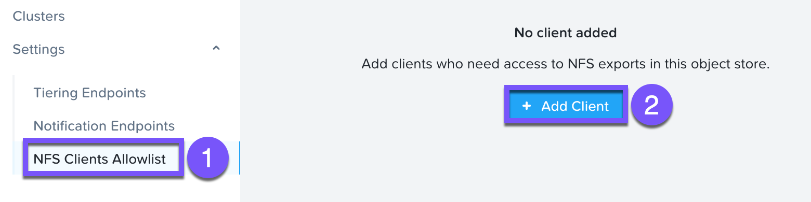
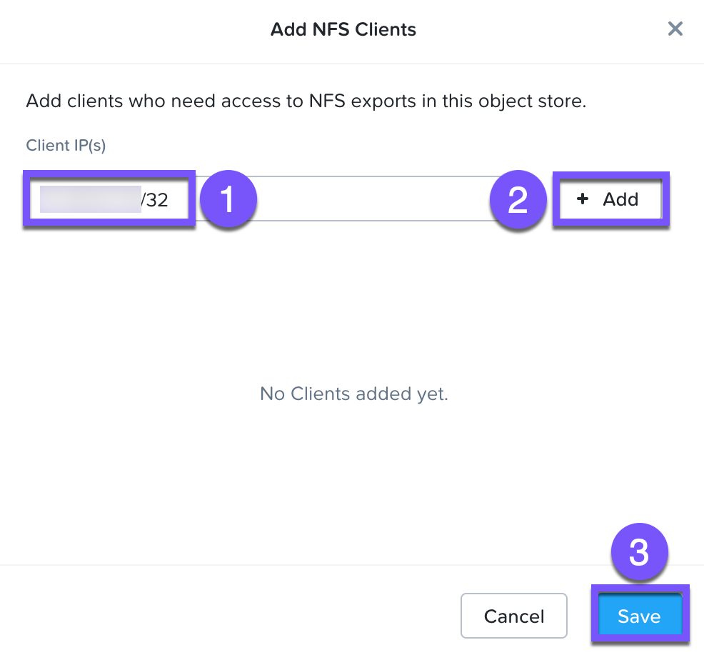
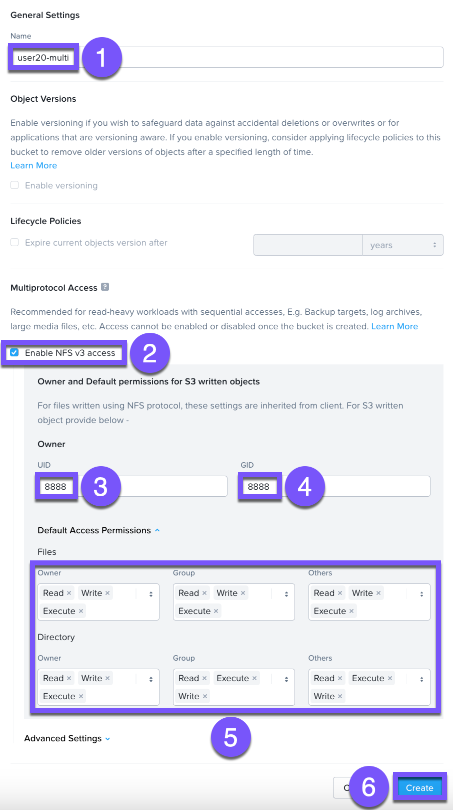
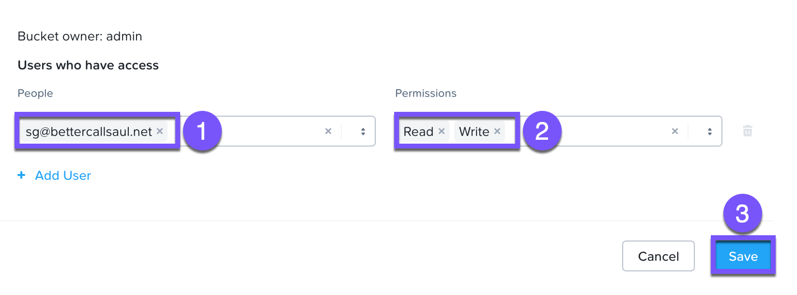
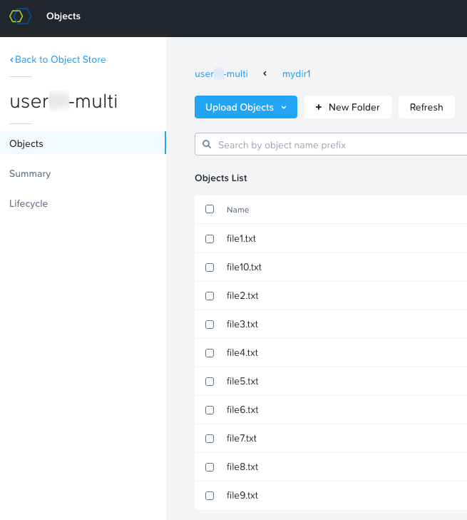

# Multiprotocol

ส่วนนี้จะแสดงวิธีการสร้าง multiprotocol (NFS 3.0, S3) bucket และการกำหนดค่า Network File System (NFS) client เพื่อเข้าถึงและดำเนินการ (perform) folder และ file operations Use cases ที่สำคัญสำหรับฟีเจอร์นี้ ได้แก่:

-   รวบรวม (Consolidate) old backups (ที่เขียนลงใน NFS export) และ new backups (ที่เขียนลงใน S3 bucket) เข้าด้วยกัน
-   อำนวยความสะดวกในการทำ in-place analytics ของ data ที่ถูกเขียนผ่าน protocol ที่ analytics application ไม่รองรับ ตัวอย่างเช่น log data ที่ถูกเขียนลง NFS โดย legacy app สามารถเข้าถึงได้ทันทีโดย big data analytics engine ที่ต้องการการเข้าถึงผ่าน S3 API

## Configure NFS Allow Client

ในส่วนนี้ เราจะอนุญาตให้ **`User##`\-LinuxTools** VM สามารถเข้าถึง buckets ได้โดยใช้ NFS3 protocol

1.  กลับไปที่แท็บการจัดการ **Objects Store**
    
2.  คลิกที่ **NFS Clients Allowlist** จากเมนูด้านซ้าย
    
3.  คลิกที่ **Add Client**
    
    
    
4.  ป้อน IP address ของ `User##`**\-LinuxTools** ของคุณตามด้วย `/32` เพื่อระบุการเข้าถึงเฉพาะ client นี้เท่านั้น (เช่น 10.38.62.76/32)
    
    
    
5.  คลิกที่ **Add > Save**
    

## Create A Bucket

bucket คือ sub-repository ภายใน object store ซึ่งสามารถนำ policies มาประยุกต์ใช้ได้ เช่น versioning หรือ write once read many (WORM) โดยค่าเริ่มต้น bucket ที่สร้างขึ้นใหม่จะเป็น private resource สำหรับผู้สร้าง โดยค่าเริ่มต้น ผู้สร้าง bucket จะมีสิทธิ์ (permissions) แบบ read/write และสามารถมอบสิทธิ์ (grant permissions) ให้กับผู้ใช้อื่นได้

1.  คลิกที่ **Buckets** จากเมนูด้านซ้าย
    
2.  คลิก **Create Bucket** กรอกข้อมูลในช่องต่อไปนี้
    
    -   **Name** - **`user##`\-multi**
    -   **Enable NFS v3 access** - checked
    -   **Owner UID** - `8888`
    -   **Owner GID** - `8888`
    
    คลิกที่เมนู drop-down ของ **Default Access Permissions** และเลือกรายการต่อไปนี้
    
    -   **Files**
        -   **Owner** - read, write, execute
        -   **Group** - read, write, execute
        -   **Others** - read, write, execute
    -   **Directory**
        -   **Owner** - read, write, execute
        -   **Group** - read, write, execute
        -   **Others** - read, write, execute
    
    คลิก **Create**
    
    
    

## Adding Users To Buckets Share

ในส่วนนี้ เราจะเพิ่ม user ลงใน `user##`\-multi bucket เพื่อให้เราสามารถเข้าถึง bucket เพื่ออัปโหลด/สร้าง files และ folders ได้

1.  เลือก `user##`\-multi และในเมนู drop-down ของ _Actions_ ให้เลือก **Share**
    
2.  ป้อน e-mail address ของคุณ เลือก permissions แบบ _Read_ และ _Write_ และคลิก **Save**
    
    
    

## Accessing Bucket On NFS Client

ส่วนนี้จะทำการ mount `user##`\-multi bucket ให้เป็น NFSv3 share บน **`User##`\-LinuxTools** VM เพื่อสร้าง files และ folders

1.  กลับไปที่ SSH session ของ **`User##`\-LinuxTools** ของคุณ
    
2.  รันคำสั่ง `yum install -y nfs-utils` เพื่อเปิดใช้งาน NFS utilities
    
3.  รันคำสั่ง `mkdir -p /mnt/buckets` เพื่อสร้าง directory บน LinuxTools VM ของเรา
    
4.  รันคำสั่ง `nano /etc/fstab` เพิ่มบรรทัดนี้ไปที่ส่วนท้ายของไฟล์
    
    ```
    <OBJECT-STORE-IP>:/user##-multi /mnt/buckets nfs rw  0 0
    ```
    
5.  กด **CTRL + X** กด **y** ตามด้วย **Enter** เพื่อบันทึกไฟล์
    
6.  รันคำสั่ง `mount -a` เพื่อ mount **`user##`\-multi** bucket ไปยังโฟลเดอร์ **/mnt/buckets** ภายใน local ให้เป็น NFS share
    
7.  รันคำสั่งต่อไปนี้เพื่อสร้าง directory และ generate ไฟล์
    
    ```
    cd /mnt/buckets && mkdir mydir1 && cd mydir1
    for i in {1..10}; do echo "writing file$i .."; touch file$i.txt; echo "this is file$i" > file$i.txt; done
    ```
    
8.  กลับไปที่แท็บ Objects Browser
    
9.  คลิก **`user##`\-multi** สังเกตว่ามีโฟลเดอร์ **mydir1** ปรากฏอยู่
    
10.  คลิกที่ **mydir1** สังเกตว่ามีไฟล์ปรากฏอยู่
    
    
    
11.  คลิก **New Folder** โดยตั้งชื่อว่า `mysubdir1`
    
12.  คลิกที่ **Create**
    
13.  กลับไปที่ SSH session ของคุณ รันคำสั่ง `ll` สังเกตว่ามี **mysubdir1** ของคุณปรากฏอยู่
    

คุณได้ทำแล็บนี้เสร็จสมบูรณ์และทดสอบ multi-protocol access ไปยัง bucket แล้ว

## Takeaways

-   NFS access นั้นง่ายต่อการตั้งค่าและมีประโยชน์อย่างมากในสถานการณ์เฉพาะ (specific scenarios)
-   ควรเปิดใช้งาน NFS access เฉพาะในสถานการณ์ที่ NFS client จะไม่ทำการอัปเดตไฟล์ที่เขียนไปแล้วในภายหลัง หรือกล่าวอีกนัยหนึ่ง มันเหมาะสำหรับ use cases ที่ file data มีสถานะเป็น "write-cold" ในทันที
-   การเปิดใช้งาน NFS (NFS enablement) ไม่สามารถทำงานร่วมกันได้ (incompatible) กับ bucket features อื่นๆ เช่น WORM และ lifecycle policies


---

[← Back: Tiering](nus-objects-tiering.md) | [Home](nus-getting-start.md) | [Next: Peer Global File Service →](nus-bonus.md)