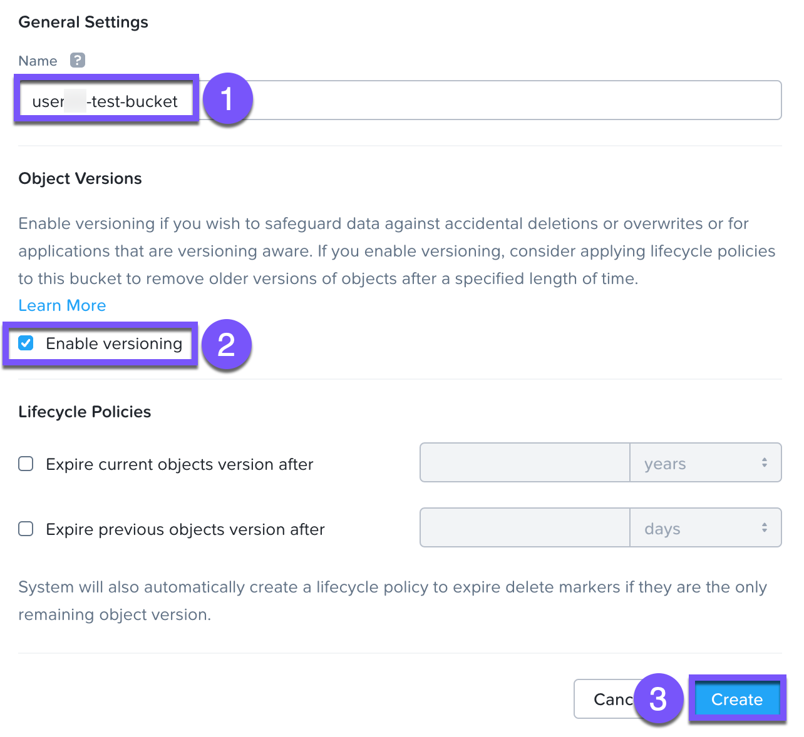
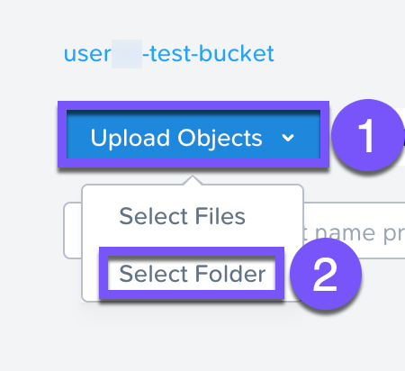

# Versioning And Access Controls

## Accessing And Creating Buckets With Objects Browser

ในแบบฝึกหัดนี้ คุณจะได้ใช้ Objects Browser เพื่อสร้างและใช้งาน buckets ใน object store โดยใช้ access key ที่คุณสร้างขึ้น (generated)

### Download the Sample Images

1.  คัดลอกลิงก์นี้ `http://10.42.194.11/hol/unified-storage/SampleData_Small.zip` และวางลงในแท็บเบราว์เซอร์ Chrome ใหม่ การทำเช่นนี้จะดาวน์โหลด sample files ลงใน Win-Tools VM ของคุณ
    
2.  เปิด Windows File Explorer ภายในโฟลเดอร์ _Downloads_ ให้คลิกขวาที่ **SampleData\_Small.zip** และเลือก **Extract All**
    
3.  คลิก **Browse** เลือกโฟลเดอร์ **Downloads** ของคุณ และคลิก **Extract**
    

### Use Object Browser To Create A Bucket

1.  กลับไปที่แท็บเบราว์เซอร์ Objects Store ของคุณ คลิกที่ **Launch Objects Browser** หน้าต่าง Objects Browser จะเปิดขึ้นในแท็บใหม่
    
2.  ป้อนข้อมูล **Access Key** และ **Secret Key** แล้วคลิก **Login**
    
3.  คลิก **Create Bucket**
    
4.  ป้อนชื่อต่อไปนี้สำหรับ bucket ของคุณ และคลิก **Create**
    
    -   **Bucket Name** - `user##`\-test-bucket
    -   **Enable versioning** - checked
    
    
    
    การสร้าง bucket ด้วยวิธีนี้จะช่วยให้ผู้ใช้ที่มีสิทธิ์สามารถทำ self-service ได้ ซึ่งไม่มีความแตกต่างจาก bucket ที่ถูกสร้างผ่าน Prism Buckets UI
    
5.  คลิก **`user##`\-test-bucket**
    
6.  เลือก **Select Folder** จากเมนู drop-down ของ _Upload Objects_
    
    
    
7.  นำทางไปยัง directory Downloads ของคุณ และภายในโฟลเดอร์ _Sample Data_ ให้เลือกโฟลเดอร์ **Pictures** เมื่อการอัปโหลดเสร็จสมบูรณ์ ให้คลิก **Close**
    

## Object Versioning

Object versioning อนุญาตให้อัปโหลด new versions ของ object เดิมเพื่อทำการเปลี่ยนแปลงที่จำเป็นโดยไม่สูญเสีย original data ไป Versioning สามารถนำมาใช้เพื่อรักษา (preserve), ดึงข้อมูล (retrieve) และกู้คืน (restore) ทุกๆ version ของแต่ละ object ที่จัดเก็บอยู่ภายใน bucket ซึ่งช่วยให้สามารถกู้คืน (recovery) ได้อย่างง่ายดายจากการกระทำของผู้ใช้ที่ไม่ได้ตั้งใจ (unintended user actions) และ application failures

1.  ภายใน Remote Desktop session ของคุณ ให้เปิดโปรแกรม Notepad
    
2.  พิมพ์ `version 1.0` บันทึกไฟล์โดยตั้งชื่อว่า **version.txt** ไว้ภายในโฟลเดอร์ _Downloads_ ของคุณ
    
3.  กลับไปที่แท็บ Objects Browser อัปโหลดไฟล์ดังกล่าว เมื่อการอัปโหลดเสร็จสมบูรณ์ ให้คลิก **Close**
    
4.  กลับไปที่ Notepad แทนที่ข้อความด้วย `version 2.0` และบันทึกไฟล์โดยใช้ชื่อไฟล์และตำแหน่ง (location) เดิม
    
5.  ภายในแท็บ Objects Browser ของคุณ ให้อัปโหลดไฟล์ที่ถูกแก้ไขไป
    
6.  เลือกไฟล์ **version.txt** ของคุณ ในเมนู drop-down ของ _Actions_ ให้เลือก **Versions**
    
7.  สังเกตว่าไฟล์ทั้งสองเวอร์ชันจะถูกเก็บรักษา (preserved) ไว้ พร้อมกับแท็ก _Latest_ เพื่อระบุว่าเป็น latest version
    
8.  คลิก **Close** และ < **Back to Object Store**
